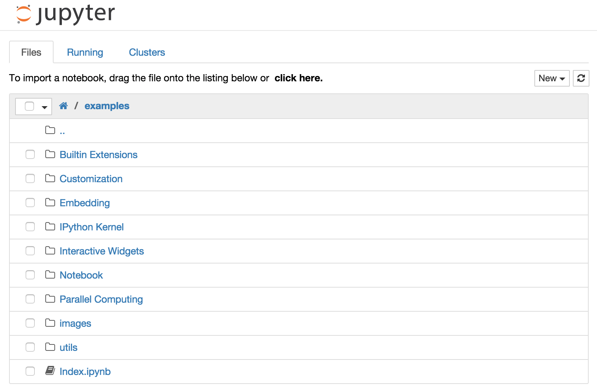
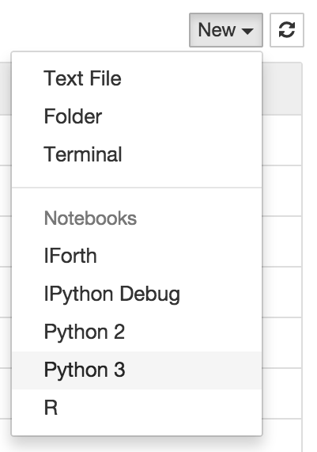
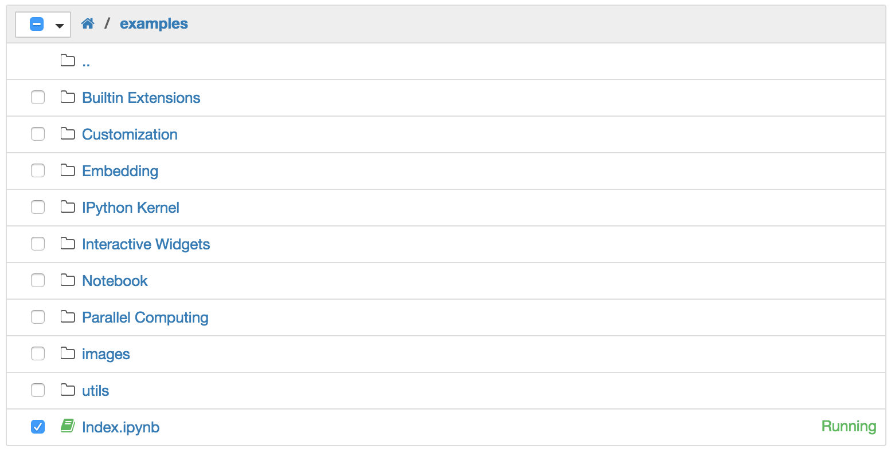
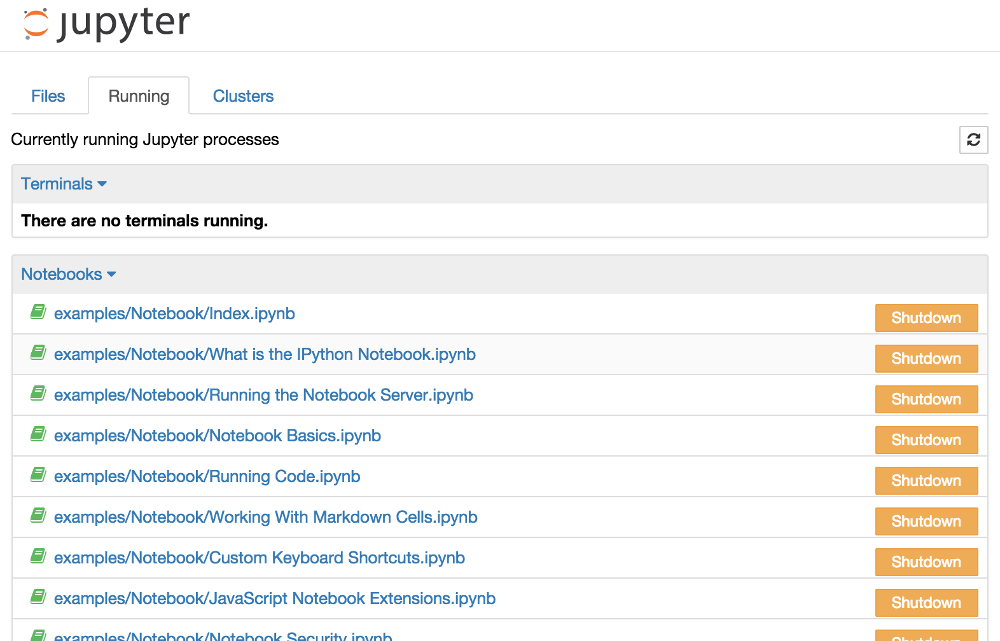

# Notebook Basics


## The Notebook dashboard


When you first start the notebook server, your browser will open to the notebook dashboard. The dashboard serves as a home page for the notebook. Its main purpose is to display the notebooks and files in the current directory. For example, here is a screenshot of the dashboard page for the `examples` directory in the Jupyter repository:




The top of the notebook list displays clickable breadcrumbs of the current directory. By clicking on these breadcrumbs or on sub-directories in the notebook list, you can navigate your file system.

To create a new notebook, click on the "New" button at the top of the list and select a kernel from the dropdown (as seen below).  Which kernels are listed depend on what's installed on the server.  Some of the kernels in the screenshot below may not exist as an option to you.




Notebooks and files can be uploaded to the current directory by dragging a notebook file onto the notebook list or by the "click here" text above the list.

The notebook list shows green "Running" text and a green notebook icon next to running notebooks (as seen below). Notebooks remain running until you explicitly shut them down; closing the notebook's page is not sufficient.





To shutdown, delete, duplicate, or rename a notebook check the checkbox next to it and an array of controls will appear at the top of the notebook list (as seen below).  You can also use the same operations on directories and files when applicable.


To see all of your running notebooks along with their directories, click on the "Running" tab:



This view provides a convenient way to track notebooks that you start as you navigate the file system in a long running notebook server.


## Overview of the Notebook UI


If you create a new notebook or open an existing one, you will be taken to the notebook user interface (UI). This UI allows you to run code and author notebook documents interactively. The notebook UI has the following main areas:

* Menu
* Toolbar
* Notebook area and cells

The notebook has an interactive tour of these elements that can be started in the "Help:User Interface Tour" menu item.


<div markdown="1" class="cell code_cell">
<div class="input_area" markdown="1">
```python
    

```
</div>

</div>


## Modal editor


Starting with IPython 2.0, the Jupyter Notebook has a modal user interface. This means that the keyboard does different things depending on which mode the Notebook is in. There are two modes: edit mode and command mode.


### Edit mode


Edit mode is indicated by a green cell border and a prompt showing in the editor area:


When a cell is in edit mode, you can type into the cell, like a normal text editor.


<div class="alert alert-success">
Enter edit mode by pressing `Enter` or using the mouse to click on a cell's editor area.
</div>


### Command mode


Command mode is indicated by a grey cell border with a blue left margin:


When you are in command mode, you are able to edit the notebook as a whole, but not type into individual cells. Most importantly, in command mode, the keyboard is mapped to a set of shortcuts that let you perform notebook and cell actions efficiently. For example, if you are in command mode and you press `c`, you will copy the current cell - no modifier is needed.


<div class="alert alert-error">
Don't try to type into a cell in command mode; unexpected things will happen!
</div>


<div class="alert alert-success">
Enter command mode by pressing `Esc` or using the mouse to click *outside* a cell's editor area.
</div>


## Mouse navigation


All navigation and actions in the Notebook are available using the mouse through the menubar and toolbar, which are both above the main Notebook area:


The first idea of mouse based navigation is that **cells can be selected by clicking on them.** The currently selected cell gets a grey or green border depending on whether the notebook is in edit or command mode. If you click inside a cell's editor area, you will enter edit mode. If you click on the prompt or output area of a cell you will enter command mode.

If you are running this notebook in a live session (not on http://nbviewer.jupyter.org) try selecting different cells and going between edit and command mode. Try typing into a cell.


The second idea of mouse based navigation is that **cell actions usually apply to the currently selected cell**. Thus if you want to run the code in a cell, you would select it and click the <button class='btn btn-default btn-xs'><i class="fa fa-step-forward icon-step-forward"></i></button> button in the toolbar or the "Cell:Run" menu item. Similarly, to copy a cell you would select it and click the <button class='btn btn-default btn-xs'><i class="fa fa-copy icon-copy"></i></button> button in the toolbar or the "Edit:Copy" menu item. With this simple pattern, you should be able to do most everything you need with the mouse.

Markdown cells have one other state that can be modified with the mouse. These cells can either be rendered or unrendered. When they are rendered, you will see a nice formatted representation of the cell's contents. When they are unrendered, you will see the raw text source of the cell. To render the selected cell with the mouse, click the <button class='btn btn-default btn-xs'><i class="fa fa-step-forward icon-step-forward"></i></button> button in the toolbar or the "Cell:Run" menu item. To unrender the selected cell, double click on the cell.


## Keyboard Navigation


The modal user interface of the Jupyter Notebook has been optimized for efficient keyboard usage. This is made possible by having two different sets of keyboard shortcuts: one set that is active in edit mode and another in command mode.

The most important keyboard shortcuts are `Enter`, which enters edit mode, and `Esc`, which enters command mode.

In edit mode, most of the keyboard is dedicated to typing into the cell's editor. Thus, in edit mode there are relatively few shortcuts.  In command mode, the entire keyboard is available for shortcuts, so there are many more.  The `Help`->`Keyboard Shortcuts` dialog lists the available shortcuts.


We recommend learning the command mode shortcuts in the following rough order:

1. Basic navigation: `enter`, `shift-enter`, `up/k`, `down/j`
2. Saving the notebook: `s`
2. Change Cell types: `y`, `m`, `1-6`, `t`
3. Cell creation: `a`, `b`
4. Cell editing: `x`, `c`, `v`, `d`, `z`
5. Kernel operations: `i`, `0` (press twice)

