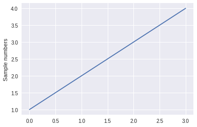

[](http://rpi.analyticsdojo.com)
<center><h1>Introduction to Python - Overview and Packages</h1></center>
<center><h3><a href = 'http://rpi.analyticsdojo.com'>rpi.analyticsdojo.com</a></h3></center>


## Overview
- Language Features  
- Python and Jupyter
- Jupyter and Markdown
- Python 2 vs Python 3
- Python and Packages


## Python Features
- Python has many of the same features of most programming languages.
- Python is object oriented. 
- Python has buit in data types and functions that are included directly.
- Python has an extensive ecosystem of packages (including ones for data science) available to extend the language to include new data types and functions.


## Python is Interpreted
- Python is an interpreted language, in contrast to Java and C which are compiled languages.
- This means we can type statements into the interpreter and they are executed immediately. This works well for data analytics because we can build things step by step.


## Python and Jupyter
- Python commands can be executed in a Jupyter Notebook just by play at the end of a cell.
- Blocks of cells or even the entire notebook can be executed by clicking on the *Cell* above.
- The Kernal is responsible for interpreting the code, and the current kernal is listed on the top right of the notebook. 
- While Jupyter started as a Python project, there are now a variety of Kernals for different programming languages including R, Scala, and SAS. 
- Read more about Jupyter in the documentation [here](http://jupyter.readthedocs.io/en/latest/).
- If a variable isn't assigned it will be provided as output. 


<div markdown="1" class="cell code_cell">
<div class="input_area" markdown="1">
```python
#Sum provided as output. 
5+5 

```
</div>

<div class="output_wrapper" markdown="1">
<div class="output_subarea" markdown="1">


{:.output_data_text}
```
10
```


</div>
</div>
</div>


<div markdown="1" class="cell code_cell">
<div class="input_area" markdown="1">
```python
#No output is provided when assigning a variable.
g=5+5

```
</div>

</div>


<div markdown="1" class="cell code_cell">
<div class="input_area" markdown="1">
```python
#Just listing a variable will cause it to be provided as output.
g

```
</div>

<div class="output_wrapper" markdown="1">
<div class="output_subarea" markdown="1">


{:.output_data_text}
```
10
```


</div>
</div>
</div>


## Jupyter and Markdown
- Jupyter notebooks are a great way of documenting your analytics projects. 
- Select *Cell->Cell Type->Markdown* to create a *Markdown* Cell.  
- Check out this [Markdown Cheatsheet](https://github.com/adam-p/markdown-here/wiki/Markdown-Cheatsheet).
- Within code cells, you can comment by starting lines with `#`.


<div markdown="1" class="cell code_cell">
<div class="input_area" markdown="1">
```python
#This is a Python Comment and won't generate output. 
5+5 

```
</div>

</div>


## Python 2 vs Python 3
- Python went through some *breaking changes* when moving from Python 2 to Python 3, and it still causes difficulty in the community. 
- While we were stuck in Python 2 for a long time, Python 3 is increasingly.
- We will be basing our learning on Python 3.X.
- You can easily select the Python 2 kernal if you have to use it for a particular project. 
- You can view differences between Python 2 and Python 3 [here](http://sebastianraschka.com/Articles/2014_python_2_3_key_diff.html).


<div markdown="1" class="cell code_cell">
<div class="input_area" markdown="1">
```python
# This Works with Python 2 but not Python 3 kernal. Change the Kernal to confirm.
print 'Hello, World!'

```
</div>

</div>


<div markdown="1" class="cell code_cell">
<div class="input_area" markdown="1">
```python
# This Works with Python 2 and Python 3 kernal. 
print ('Hello, World!')

```
</div>

</div>


## Python and Packages
- There are a tremendous number of packages available which extend the core capabilities of the Python language.
- Packages are critical for data science, as data typically structured via external package. 
- The PyPI - the Python Package Index [https://pypi.python.org](https://pypi.python.org) provides search listing of all packages.
- It is possible that packages could be avaialble for Python 2 but not Python 3 (or vice versa).
- `pip` is an  the package management system used to install and manage Python packages.
- Anaconda (`conda`) is the package management system with enterprise packages available.


## Python and Installing Packages
- When using Conda, the command `conda install`
- pip is the package management system used to install and manage Python packages.
- pip must be run on the terminal. 
- Two options for accessing shell of Docker container 
- (1) From a notebook:

`!conda install -y matplotlib`

`!pip install  matplotlib`
- (2) Select *New->Terminal* from main Jupyter screeen.

    


<div markdown="1" class="cell code_cell">
<div class="input_area" markdown="1">
```python
#Conda will work if running locally, but not on colab. 
#!conda install -y matplotlib

```
</div>

</div>


<div markdown="1" class="cell code_cell">
<div class="input_area" markdown="1">
```python
#This will install the package matplotlib (or really check that it is installed because it is by default.)
!pip install  matplotlib

```
</div>

<div class="output_wrapper" markdown="1">
<div class="output_subarea" markdown="1">
{:.output_stream}
```
Requirement already satisfied: matplotlib in /usr/local/lib/python3.6/dist-packages (2.1.2)
Requirement already satisfied: pyparsing!=2.0.4,!=2.1.2,!=2.1.6,>=2.0.1 in /usr/local/lib/python3.6/dist-packages (from matplotlib) (2.3.0)
Requirement already satisfied: python-dateutil>=2.1 in /usr/local/lib/python3.6/dist-packages (from matplotlib) (2.5.3)
Requirement already satisfied: pytz in /usr/local/lib/python3.6/dist-packages (from matplotlib) (2018.9)
Requirement already satisfied: six>=1.10 in /usr/local/lib/python3.6/dist-packages (from matplotlib) (1.11.0)
Requirement already satisfied: numpy>=1.7.1 in /usr/local/lib/python3.6/dist-packages (from matplotlib) (1.14.6)
Requirement already satisfied: cycler>=0.10 in /usr/local/lib/python3.6/dist-packages (from matplotlib) (0.10.0)
```
</div>
</div>
</div>


## Python and Using Packages
- Python packages must be imported before using. 
- Python packages are organized as modules, and you can import the entire package or just the submodule that you need.
- Packages only have to be imported once in a notebook (not in every cell). 
- Multipled ways of importing all or specific modules (that impact how you call methods)
- (1) Import all of the package `import matplotlib`
- (2) Import a module `import matplotlib.pyplot` or `from matplotlib import pyplot`
- (3) Import all of some of package with abbreviation  `import matplotlib.pyplot as plt`


<div markdown="1" class="cell code_cell">
<div class="input_area" markdown="1">
```python
#This is required to show plots. It just has to be run once.
%matplotlib inline

```
</div>

</div>


<div markdown="1" class="cell code_cell">
<div class="input_area" markdown="1">
```python
#This will import the pyplot module of the matplotlab package. 
import matplotlib.pyplot as pyplot
#Observe how we are calling the plot method within the pyplot module. 
pyplot.plot([1,2,3,4])
pyplot.ylabel('Sample numbers')
pyplot.show()

```
</div>

<div class="output_wrapper" markdown="1">
<div class="output_subarea" markdown="1">

{:.output_png}


</div>
</div>
</div>


<div markdown="1" class="cell code_cell">
<div class="input_area" markdown="1">
```python
#This will import just the pyplot module as plt
import matplotlib.pyplot as plt
#Observe how we are calling the plot method within the pyplot module. 
plt.plot([1,2,3,4])
pyplot.ylabel('Sample numbers')
plt.show()

```
</div>

<div class="output_wrapper" markdown="1">
<div class="output_subarea" markdown="1">

{:.output_png}


</div>
</div>
</div>

