[](http://rpi.analyticsdojo.com)
<center><h1>Introduction to Seaborn - Python</h1></center>
<center><h3><a href = 'http://rpi.analyticsdojo.com'>rpi.analyticsdojo.com</a></h3></center>


### Overview
- Look at distributions
- Seaborn is an alternate data visualization package. 
- This has been adopted from the Seaborn Documentation.Read more at https://stanford.edu/~mwaskom/software/seaborn/api.html


<div markdown="1" class="cell code_cell">
<div class="input_area" markdown="1">
```python
#This uses the same mechanisms. 
%matplotlib inline

```
</div>

</div>


<div markdown="1" class="cell code_cell">
<div class="input_area" markdown="1">
```python
import numpy as np
import pandas as pd
from scipy import stats, integrate
import matplotlib.pyplot as plt
import seaborn as sns
sns.set(color_codes=True)

```
</div>

</div>


## Distribution Plots
- Histogram with KDE
- Histogram with Rugplot


<div markdown="1" class="cell code_cell">
<div class="input_area" markdown="1">
```python
import seaborn as sns, numpy as np
sns.set(); np.random.seed(0)
x = np.random.randn(100)
x

```
</div>

<div class="output_wrapper" markdown="1">
<div class="output_subarea" markdown="1">


{:.output_data_text}
```
array([ 1.76405235,  0.40015721,  0.97873798,  2.2408932 ,  1.86755799,
       -0.97727788,  0.95008842, -0.15135721, -0.10321885,  0.4105985 ,
        0.14404357,  1.45427351,  0.76103773,  0.12167502,  0.44386323,
        0.33367433,  1.49407907, -0.20515826,  0.3130677 , -0.85409574,
       -2.55298982,  0.6536186 ,  0.8644362 , -0.74216502,  2.26975462,
       -1.45436567,  0.04575852, -0.18718385,  1.53277921,  1.46935877,
        0.15494743,  0.37816252, -0.88778575, -1.98079647, -0.34791215,
        0.15634897,  1.23029068,  1.20237985, -0.38732682, -0.30230275,
       -1.04855297, -1.42001794, -1.70627019,  1.9507754 , -0.50965218,
       -0.4380743 , -1.25279536,  0.77749036, -1.61389785, -0.21274028,
       -0.89546656,  0.3869025 , -0.51080514, -1.18063218, -0.02818223,
        0.42833187,  0.06651722,  0.3024719 , -0.63432209, -0.36274117,
       -0.67246045, -0.35955316, -0.81314628, -1.7262826 ,  0.17742614,
       -0.40178094, -1.63019835,  0.46278226, -0.90729836,  0.0519454 ,
        0.72909056,  0.12898291,  1.13940068, -1.23482582,  0.40234164,
       -0.68481009, -0.87079715, -0.57884966, -0.31155253,  0.05616534,
       -1.16514984,  0.90082649,  0.46566244, -1.53624369,  1.48825219,
        1.89588918,  1.17877957, -0.17992484, -1.07075262,  1.05445173,
       -0.40317695,  1.22244507,  0.20827498,  0.97663904,  0.3563664 ,
        0.70657317,  0.01050002,  1.78587049,  0.12691209,  0.40198936])
```


</div>
</div>
</div>


### Distribution Plot (distplot)
- Any compbination of hist, rug, kde
- Note it also has in it a KDE plot included
- Can manually set the number of bins
- See documentation [here](https://seaborn.pydata.org/generated/seaborn.distplot.html#seaborn.distplot) 


<div markdown="1" class="cell code_cell">
<div class="input_area" markdown="1">
```python
#Histogram
# https://seaborn.pydata.org/generated/seaborn.distplot.html#seaborn.distplot
ax = sns.distplot(x)


```
</div>

<div class="output_wrapper" markdown="1">
<div class="output_subarea" markdown="1">

{:.output_png}
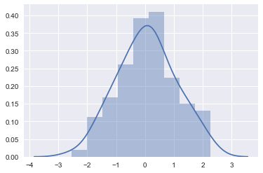

</div>
</div>
</div>


<div markdown="1" class="cell code_cell">
<div class="input_area" markdown="1">
```python
#Adjust number of bins for more fine grained view
ax = sns.distplot(x, bins = 20)

```
</div>

<div class="output_wrapper" markdown="1">
<div class="output_subarea" markdown="1">

{:.output_png}
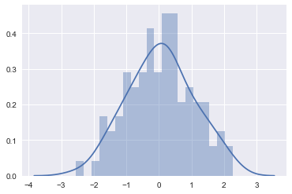

</div>
</div>
</div>


<div markdown="1" class="cell code_cell">
<div class="input_area" markdown="1">
```python
#Include rug and kde (no histogram)
sns.distplot(x, hist=False, rug=True);

```
</div>

<div class="output_wrapper" markdown="1">
<div class="output_subarea" markdown="1">

{:.output_png}
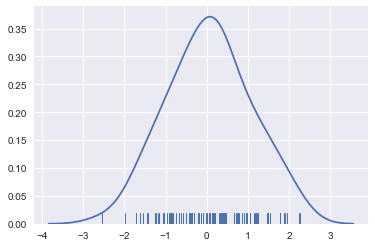

</div>
</div>
</div>


<div markdown="1" class="cell code_cell">
<div class="input_area" markdown="1">
```python
#Kernel Density
#https://seaborn.pydata.org/generated/seaborn.rugplot.html#seaborn.rugplot
ax = sns.distplot(x, bins=10, kde=True, rug=True)

```
</div>

<div class="output_wrapper" markdown="1">
<div class="output_subarea" markdown="1">

{:.output_png}
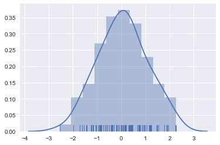

</div>
</div>
</div>


### Box Plots
- Break data into quartiles. 
- Can show distribution/ranges of different categories.


<a title="Jhguch at en.wikipedia [CC BY-SA 2.5 (https://creativecommons.org/licenses/by-sa/2.5)], from Wikimedia Commons" href="https://commons.wikimedia.org/wiki/File%3ABoxplot_vs_PDF.svg"></a>

Jhguch at en.wikipedia [CC BY-SA 2.5 (https://creativecommons.org/licenses/by-sa/2.5)], from Wikimedia Commons


<div markdown="1" class="cell code_cell">
<div class="input_area" markdown="1">
```python
sns.set_style("whitegrid")
#This is data on tips (a real dataset) and our familiar iris dataset
tips = sns.load_dataset("tips")
iris = sns.load_dataset("iris")
titanic = sns.load_dataset("titanic")
#Tips is a pandas dataframe
tips.head()

```
</div>

<div class="output_wrapper" markdown="1">
<div class="output_subarea" markdown="1">


<div markdown="0" class="output output_html">
<div>
<style>
    .dataframe thead tr:only-child th {
        text-align: right;
    }

    .dataframe thead th {
        text-align: left;
    }

    .dataframe tbody tr th {
        vertical-align: top;
    }
</style>
<table border="1" class="dataframe">
  <thead>
    <tr style="text-align: right;">
      <th></th>
      <th>total_bill</th>
      <th>tip</th>
      <th>sex</th>
      <th>smoker</th>
      <th>day</th>
      <th>time</th>
      <th>size</th>
    </tr>
  </thead>
  <tbody>
    <tr>
      <th>0</th>
      <td>16.99</td>
      <td>1.01</td>
      <td>Female</td>
      <td>No</td>
      <td>Sun</td>
      <td>Dinner</td>
      <td>2</td>
    </tr>
    <tr>
      <th>1</th>
      <td>10.34</td>
      <td>1.66</td>
      <td>Male</td>
      <td>No</td>
      <td>Sun</td>
      <td>Dinner</td>
      <td>3</td>
    </tr>
    <tr>
      <th>2</th>
      <td>21.01</td>
      <td>3.50</td>
      <td>Male</td>
      <td>No</td>
      <td>Sun</td>
      <td>Dinner</td>
      <td>3</td>
    </tr>
    <tr>
      <th>3</th>
      <td>23.68</td>
      <td>3.31</td>
      <td>Male</td>
      <td>No</td>
      <td>Sun</td>
      <td>Dinner</td>
      <td>2</td>
    </tr>
    <tr>
      <th>4</th>
      <td>24.59</td>
      <td>3.61</td>
      <td>Female</td>
      <td>No</td>
      <td>Sun</td>
      <td>Dinner</td>
      <td>4</td>
    </tr>
  </tbody>
</table>
</div>
</div>


</div>
</div>
</div>


<div markdown="1" class="cell code_cell">
<div class="input_area" markdown="1">
```python
ax = sns.boxplot(x=tips["total_bill"])

```
</div>

<div class="output_wrapper" markdown="1">
<div class="output_subarea" markdown="1">

{:.output_png}
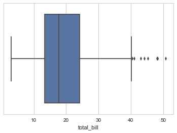

</div>
</div>
</div>


<div markdown="1" class="cell code_cell">
<div class="input_area" markdown="1">
```python
# Notice we can see the few ouliers on right side
ax = sns.distplot(tips["total_bill"],  kde=True, rug=True)

```
</div>

<div class="output_wrapper" markdown="1">
<div class="output_subarea" markdown="1">

{:.output_png}
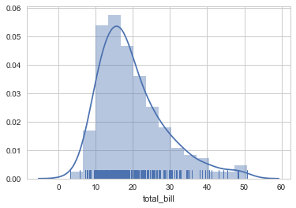

</div>
</div>
</div>


# Relationship Plots
- Pairplots to show all 
- Regplot for 2 continuous variables
- Scatterplot for two continuous variables
- Swarmplot or BoxPlot for continuous and categorical


<div markdown="1" class="cell code_cell">
<div class="input_area" markdown="1">
```python
#Notice how this works for continuous, not great for categorical
h = sns.pairplot(tips, hue="time")

```
</div>

<div class="output_wrapper" markdown="1">
<div class="output_subarea" markdown="1">

{:.output_png}
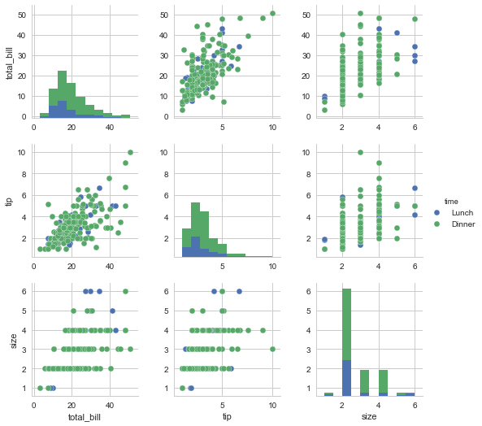

</div>
</div>
</div>


<div markdown="1" class="cell code_cell">
<div class="input_area" markdown="1">
```python
g = sns.pairplot(iris, hue="species")

```
</div>

<div class="output_wrapper" markdown="1">
<div class="output_subarea" markdown="1">

{:.output_png}
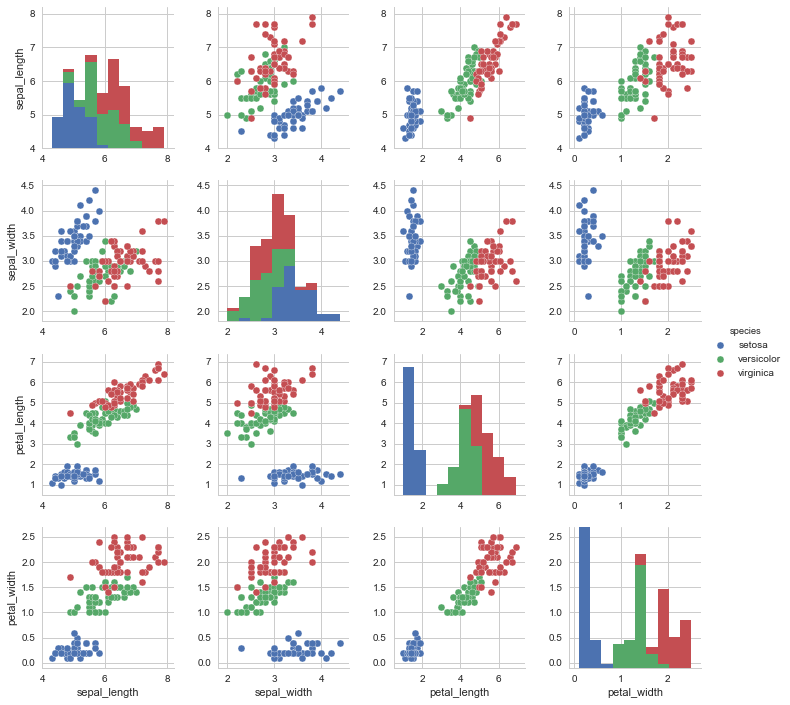

</div>
</div>
</div>


<div markdown="1" class="cell code_cell">
<div class="input_area" markdown="1">
```python
# Show relationship between 2 continuous variables with regression line. 
sns.regplot(x="total_bill", y="tip", data=tips);

```
</div>

<div class="output_wrapper" markdown="1">
<div class="output_subarea" markdown="1">

{:.output_png}
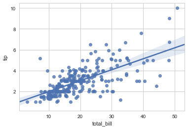

</div>
</div>
</div>


<div markdown="1" class="cell code_cell">
<div class="input_area" markdown="1">
```python
# Break down 
sns.boxplot(x="day", y="total_bill", hue="time", data=tips);

```
</div>

<div class="output_wrapper" markdown="1">
<div class="output_subarea" markdown="1">

{:.output_png}
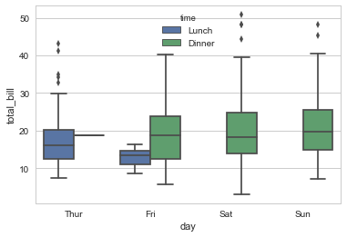

</div>
</div>
</div>


<div markdown="1" class="cell code_cell">
<div class="input_area" markdown="1">
```python
#Uses an algorithm to prevent overlap
sns.swarmplot(x="day", y="total_bill", hue= "time",data=tips);

```
</div>

<div class="output_wrapper" markdown="1">
<div class="output_subarea" markdown="1">

{:.output_png}


</div>
</div>
</div>


<div markdown="1" class="cell code_cell">
<div class="input_area" markdown="1">
```python
#Uses an algorithm to prevent overlap
sns.violinplot(x="day", y="total_bill", hue= "time",data=tips);

```
</div>

<div class="output_wrapper" markdown="1">
<div class="output_subarea" markdown="1">

{:.output_png}
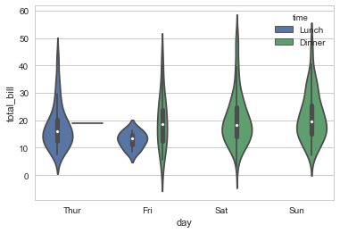

</div>
</div>
</div>


<div markdown="1" class="cell code_cell">
<div class="input_area" markdown="1">
```python
#Stacking Graphs Is Easy
sns.violinplot(x="day", y="total_bill", data=tips, inner=None)
sns.swarmplot(x="day", y="total_bill", data=tips, color="w", alpha=.5);

```
</div>

<div class="output_wrapper" markdown="1">
<div class="output_subarea" markdown="1">

{:.output_png}
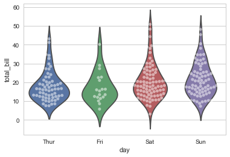

</div>
</div>
</div>


# Visualizing Summary Data
- Barplots will show the 


<div markdown="1" class="cell code_cell">
<div class="input_area" markdown="1">
```python
#This 
sns.barplot(x="sex", y="tip", data=tips);
tips

```
</div>

<div class="output_wrapper" markdown="1">
<div class="output_subarea" markdown="1">


<div markdown="0" class="output output_html">
<div>
<style>
    .dataframe thead tr:only-child th {
        text-align: right;
    }

    .dataframe thead th {
        text-align: left;
    }

    .dataframe tbody tr th {
        vertical-align: top;
    }
</style>
<table border="1" class="dataframe">
  <thead>
    <tr style="text-align: right;">
      <th></th>
      <th>total_bill</th>
      <th>tip</th>
      <th>sex</th>
      <th>smoker</th>
      <th>day</th>
      <th>time</th>
      <th>size</th>
    </tr>
  </thead>
  <tbody>
    <tr>
      <th>0</th>
      <td>16.99</td>
      <td>1.01</td>
      <td>Female</td>
      <td>No</td>
      <td>Sun</td>
      <td>Dinner</td>
      <td>2</td>
    </tr>
    <tr>
      <th>1</th>
      <td>10.34</td>
      <td>1.66</td>
      <td>Male</td>
      <td>No</td>
      <td>Sun</td>
      <td>Dinner</td>
      <td>3</td>
    </tr>
    <tr>
      <th>2</th>
      <td>21.01</td>
      <td>3.50</td>
      <td>Male</td>
      <td>No</td>
      <td>Sun</td>
      <td>Dinner</td>
      <td>3</td>
    </tr>
    <tr>
      <th>3</th>
      <td>23.68</td>
      <td>3.31</td>
      <td>Male</td>
      <td>No</td>
      <td>Sun</td>
      <td>Dinner</td>
      <td>2</td>
    </tr>
    <tr>
      <th>4</th>
      <td>24.59</td>
      <td>3.61</td>
      <td>Female</td>
      <td>No</td>
      <td>Sun</td>
      <td>Dinner</td>
      <td>4</td>
    </tr>
    <tr>
      <th>5</th>
      <td>25.29</td>
      <td>4.71</td>
      <td>Male</td>
      <td>No</td>
      <td>Sun</td>
      <td>Dinner</td>
      <td>4</td>
    </tr>
    <tr>
      <th>6</th>
      <td>8.77</td>
      <td>2.00</td>
      <td>Male</td>
      <td>No</td>
      <td>Sun</td>
      <td>Dinner</td>
      <td>2</td>
    </tr>
    <tr>
      <th>7</th>
      <td>26.88</td>
      <td>3.12</td>
      <td>Male</td>
      <td>No</td>
      <td>Sun</td>
      <td>Dinner</td>
      <td>4</td>
    </tr>
    <tr>
      <th>8</th>
      <td>15.04</td>
      <td>1.96</td>
      <td>Male</td>
      <td>No</td>
      <td>Sun</td>
      <td>Dinner</td>
      <td>2</td>
    </tr>
    <tr>
      <th>9</th>
      <td>14.78</td>
      <td>3.23</td>
      <td>Male</td>
      <td>No</td>
      <td>Sun</td>
      <td>Dinner</td>
      <td>2</td>
    </tr>
    <tr>
      <th>10</th>
      <td>10.27</td>
      <td>1.71</td>
      <td>Male</td>
      <td>No</td>
      <td>Sun</td>
      <td>Dinner</td>
      <td>2</td>
    </tr>
    <tr>
      <th>11</th>
      <td>35.26</td>
      <td>5.00</td>
      <td>Female</td>
      <td>No</td>
      <td>Sun</td>
      <td>Dinner</td>
      <td>4</td>
    </tr>
    <tr>
      <th>12</th>
      <td>15.42</td>
      <td>1.57</td>
      <td>Male</td>
      <td>No</td>
      <td>Sun</td>
      <td>Dinner</td>
      <td>2</td>
    </tr>
    <tr>
      <th>13</th>
      <td>18.43</td>
      <td>3.00</td>
      <td>Male</td>
      <td>No</td>
      <td>Sun</td>
      <td>Dinner</td>
      <td>4</td>
    </tr>
    <tr>
      <th>14</th>
      <td>14.83</td>
      <td>3.02</td>
      <td>Female</td>
      <td>No</td>
      <td>Sun</td>
      <td>Dinner</td>
      <td>2</td>
    </tr>
    <tr>
      <th>15</th>
      <td>21.58</td>
      <td>3.92</td>
      <td>Male</td>
      <td>No</td>
      <td>Sun</td>
      <td>Dinner</td>
      <td>2</td>
    </tr>
    <tr>
      <th>16</th>
      <td>10.33</td>
      <td>1.67</td>
      <td>Female</td>
      <td>No</td>
      <td>Sun</td>
      <td>Dinner</td>
      <td>3</td>
    </tr>
    <tr>
      <th>17</th>
      <td>16.29</td>
      <td>3.71</td>
      <td>Male</td>
      <td>No</td>
      <td>Sun</td>
      <td>Dinner</td>
      <td>3</td>
    </tr>
    <tr>
      <th>18</th>
      <td>16.97</td>
      <td>3.50</td>
      <td>Female</td>
      <td>No</td>
      <td>Sun</td>
      <td>Dinner</td>
      <td>3</td>
    </tr>
    <tr>
      <th>19</th>
      <td>20.65</td>
      <td>3.35</td>
      <td>Male</td>
      <td>No</td>
      <td>Sat</td>
      <td>Dinner</td>
      <td>3</td>
    </tr>
    <tr>
      <th>20</th>
      <td>17.92</td>
      <td>4.08</td>
      <td>Male</td>
      <td>No</td>
      <td>Sat</td>
      <td>Dinner</td>
      <td>2</td>
    </tr>
    <tr>
      <th>21</th>
      <td>20.29</td>
      <td>2.75</td>
      <td>Female</td>
      <td>No</td>
      <td>Sat</td>
      <td>Dinner</td>
      <td>2</td>
    </tr>
    <tr>
      <th>22</th>
      <td>15.77</td>
      <td>2.23</td>
      <td>Female</td>
      <td>No</td>
      <td>Sat</td>
      <td>Dinner</td>
      <td>2</td>
    </tr>
    <tr>
      <th>23</th>
      <td>39.42</td>
      <td>7.58</td>
      <td>Male</td>
      <td>No</td>
      <td>Sat</td>
      <td>Dinner</td>
      <td>4</td>
    </tr>
    <tr>
      <th>24</th>
      <td>19.82</td>
      <td>3.18</td>
      <td>Male</td>
      <td>No</td>
      <td>Sat</td>
      <td>Dinner</td>
      <td>2</td>
    </tr>
    <tr>
      <th>25</th>
      <td>17.81</td>
      <td>2.34</td>
      <td>Male</td>
      <td>No</td>
      <td>Sat</td>
      <td>Dinner</td>
      <td>4</td>
    </tr>
    <tr>
      <th>26</th>
      <td>13.37</td>
      <td>2.00</td>
      <td>Male</td>
      <td>No</td>
      <td>Sat</td>
      <td>Dinner</td>
      <td>2</td>
    </tr>
    <tr>
      <th>27</th>
      <td>12.69</td>
      <td>2.00</td>
      <td>Male</td>
      <td>No</td>
      <td>Sat</td>
      <td>Dinner</td>
      <td>2</td>
    </tr>
    <tr>
      <th>28</th>
      <td>21.70</td>
      <td>4.30</td>
      <td>Male</td>
      <td>No</td>
      <td>Sat</td>
      <td>Dinner</td>
      <td>2</td>
    </tr>
    <tr>
      <th>29</th>
      <td>19.65</td>
      <td>3.00</td>
      <td>Female</td>
      <td>No</td>
      <td>Sat</td>
      <td>Dinner</td>
      <td>2</td>
    </tr>
    <tr>
      <th>...</th>
      <td>...</td>
      <td>...</td>
      <td>...</td>
      <td>...</td>
      <td>...</td>
      <td>...</td>
      <td>...</td>
    </tr>
    <tr>
      <th>214</th>
      <td>28.17</td>
      <td>6.50</td>
      <td>Female</td>
      <td>Yes</td>
      <td>Sat</td>
      <td>Dinner</td>
      <td>3</td>
    </tr>
    <tr>
      <th>215</th>
      <td>12.90</td>
      <td>1.10</td>
      <td>Female</td>
      <td>Yes</td>
      <td>Sat</td>
      <td>Dinner</td>
      <td>2</td>
    </tr>
    <tr>
      <th>216</th>
      <td>28.15</td>
      <td>3.00</td>
      <td>Male</td>
      <td>Yes</td>
      <td>Sat</td>
      <td>Dinner</td>
      <td>5</td>
    </tr>
    <tr>
      <th>217</th>
      <td>11.59</td>
      <td>1.50</td>
      <td>Male</td>
      <td>Yes</td>
      <td>Sat</td>
      <td>Dinner</td>
      <td>2</td>
    </tr>
    <tr>
      <th>218</th>
      <td>7.74</td>
      <td>1.44</td>
      <td>Male</td>
      <td>Yes</td>
      <td>Sat</td>
      <td>Dinner</td>
      <td>2</td>
    </tr>
    <tr>
      <th>219</th>
      <td>30.14</td>
      <td>3.09</td>
      <td>Female</td>
      <td>Yes</td>
      <td>Sat</td>
      <td>Dinner</td>
      <td>4</td>
    </tr>
    <tr>
      <th>220</th>
      <td>12.16</td>
      <td>2.20</td>
      <td>Male</td>
      <td>Yes</td>
      <td>Fri</td>
      <td>Lunch</td>
      <td>2</td>
    </tr>
    <tr>
      <th>221</th>
      <td>13.42</td>
      <td>3.48</td>
      <td>Female</td>
      <td>Yes</td>
      <td>Fri</td>
      <td>Lunch</td>
      <td>2</td>
    </tr>
    <tr>
      <th>222</th>
      <td>8.58</td>
      <td>1.92</td>
      <td>Male</td>
      <td>Yes</td>
      <td>Fri</td>
      <td>Lunch</td>
      <td>1</td>
    </tr>
    <tr>
      <th>223</th>
      <td>15.98</td>
      <td>3.00</td>
      <td>Female</td>
      <td>No</td>
      <td>Fri</td>
      <td>Lunch</td>
      <td>3</td>
    </tr>
    <tr>
      <th>224</th>
      <td>13.42</td>
      <td>1.58</td>
      <td>Male</td>
      <td>Yes</td>
      <td>Fri</td>
      <td>Lunch</td>
      <td>2</td>
    </tr>
    <tr>
      <th>225</th>
      <td>16.27</td>
      <td>2.50</td>
      <td>Female</td>
      <td>Yes</td>
      <td>Fri</td>
      <td>Lunch</td>
      <td>2</td>
    </tr>
    <tr>
      <th>226</th>
      <td>10.09</td>
      <td>2.00</td>
      <td>Female</td>
      <td>Yes</td>
      <td>Fri</td>
      <td>Lunch</td>
      <td>2</td>
    </tr>
    <tr>
      <th>227</th>
      <td>20.45</td>
      <td>3.00</td>
      <td>Male</td>
      <td>No</td>
      <td>Sat</td>
      <td>Dinner</td>
      <td>4</td>
    </tr>
    <tr>
      <th>228</th>
      <td>13.28</td>
      <td>2.72</td>
      <td>Male</td>
      <td>No</td>
      <td>Sat</td>
      <td>Dinner</td>
      <td>2</td>
    </tr>
    <tr>
      <th>229</th>
      <td>22.12</td>
      <td>2.88</td>
      <td>Female</td>
      <td>Yes</td>
      <td>Sat</td>
      <td>Dinner</td>
      <td>2</td>
    </tr>
    <tr>
      <th>230</th>
      <td>24.01</td>
      <td>2.00</td>
      <td>Male</td>
      <td>Yes</td>
      <td>Sat</td>
      <td>Dinner</td>
      <td>4</td>
    </tr>
    <tr>
      <th>231</th>
      <td>15.69</td>
      <td>3.00</td>
      <td>Male</td>
      <td>Yes</td>
      <td>Sat</td>
      <td>Dinner</td>
      <td>3</td>
    </tr>
    <tr>
      <th>232</th>
      <td>11.61</td>
      <td>3.39</td>
      <td>Male</td>
      <td>No</td>
      <td>Sat</td>
      <td>Dinner</td>
      <td>2</td>
    </tr>
    <tr>
      <th>233</th>
      <td>10.77</td>
      <td>1.47</td>
      <td>Male</td>
      <td>No</td>
      <td>Sat</td>
      <td>Dinner</td>
      <td>2</td>
    </tr>
    <tr>
      <th>234</th>
      <td>15.53</td>
      <td>3.00</td>
      <td>Male</td>
      <td>Yes</td>
      <td>Sat</td>
      <td>Dinner</td>
      <td>2</td>
    </tr>
    <tr>
      <th>235</th>
      <td>10.07</td>
      <td>1.25</td>
      <td>Male</td>
      <td>No</td>
      <td>Sat</td>
      <td>Dinner</td>
      <td>2</td>
    </tr>
    <tr>
      <th>236</th>
      <td>12.60</td>
      <td>1.00</td>
      <td>Male</td>
      <td>Yes</td>
      <td>Sat</td>
      <td>Dinner</td>
      <td>2</td>
    </tr>
    <tr>
      <th>237</th>
      <td>32.83</td>
      <td>1.17</td>
      <td>Male</td>
      <td>Yes</td>
      <td>Sat</td>
      <td>Dinner</td>
      <td>2</td>
    </tr>
    <tr>
      <th>238</th>
      <td>35.83</td>
      <td>4.67</td>
      <td>Female</td>
      <td>No</td>
      <td>Sat</td>
      <td>Dinner</td>
      <td>3</td>
    </tr>
    <tr>
      <th>239</th>
      <td>29.03</td>
      <td>5.92</td>
      <td>Male</td>
      <td>No</td>
      <td>Sat</td>
      <td>Dinner</td>
      <td>3</td>
    </tr>
    <tr>
      <th>240</th>
      <td>27.18</td>
      <td>2.00</td>
      <td>Female</td>
      <td>Yes</td>
      <td>Sat</td>
      <td>Dinner</td>
      <td>2</td>
    </tr>
    <tr>
      <th>241</th>
      <td>22.67</td>
      <td>2.00</td>
      <td>Male</td>
      <td>Yes</td>
      <td>Sat</td>
      <td>Dinner</td>
      <td>2</td>
    </tr>
    <tr>
      <th>242</th>
      <td>17.82</td>
      <td>1.75</td>
      <td>Male</td>
      <td>No</td>
      <td>Sat</td>
      <td>Dinner</td>
      <td>2</td>
    </tr>
    <tr>
      <th>243</th>
      <td>18.78</td>
      <td>3.00</td>
      <td>Female</td>
      <td>No</td>
      <td>Thur</td>
      <td>Dinner</td>
      <td>2</td>
    </tr>
  </tbody>
</table>
<p>244 rows × 7 columns</p>
</div>
</div>


</div>
</div>
<div class="output_wrapper" markdown="1">
<div class="output_subarea" markdown="1">

{:.output_png}
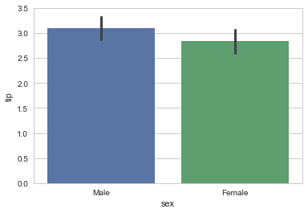

</div>
</div>
</div>


<div markdown="1" class="cell code_cell">
<div class="input_area" markdown="1">
```python
tips

```
</div>

<div class="output_wrapper" markdown="1">
<div class="output_subarea" markdown="1">


<div markdown="0" class="output output_html">
<div>
<style>
    .dataframe thead tr:only-child th {
        text-align: right;
    }

    .dataframe thead th {
        text-align: left;
    }

    .dataframe tbody tr th {
        vertical-align: top;
    }
</style>
<table border="1" class="dataframe">
  <thead>
    <tr style="text-align: right;">
      <th></th>
      <th>total_bill</th>
      <th>tip</th>
      <th>sex</th>
      <th>smoker</th>
      <th>day</th>
      <th>time</th>
      <th>size</th>
    </tr>
  </thead>
  <tbody>
    <tr>
      <th>0</th>
      <td>16.99</td>
      <td>1.01</td>
      <td>Female</td>
      <td>No</td>
      <td>Sun</td>
      <td>Dinner</td>
      <td>2</td>
    </tr>
    <tr>
      <th>1</th>
      <td>10.34</td>
      <td>1.66</td>
      <td>Male</td>
      <td>No</td>
      <td>Sun</td>
      <td>Dinner</td>
      <td>3</td>
    </tr>
    <tr>
      <th>2</th>
      <td>21.01</td>
      <td>3.50</td>
      <td>Male</td>
      <td>No</td>
      <td>Sun</td>
      <td>Dinner</td>
      <td>3</td>
    </tr>
    <tr>
      <th>3</th>
      <td>23.68</td>
      <td>3.31</td>
      <td>Male</td>
      <td>No</td>
      <td>Sun</td>
      <td>Dinner</td>
      <td>2</td>
    </tr>
    <tr>
      <th>4</th>
      <td>24.59</td>
      <td>3.61</td>
      <td>Female</td>
      <td>No</td>
      <td>Sun</td>
      <td>Dinner</td>
      <td>4</td>
    </tr>
    <tr>
      <th>5</th>
      <td>25.29</td>
      <td>4.71</td>
      <td>Male</td>
      <td>No</td>
      <td>Sun</td>
      <td>Dinner</td>
      <td>4</td>
    </tr>
    <tr>
      <th>6</th>
      <td>8.77</td>
      <td>2.00</td>
      <td>Male</td>
      <td>No</td>
      <td>Sun</td>
      <td>Dinner</td>
      <td>2</td>
    </tr>
    <tr>
      <th>7</th>
      <td>26.88</td>
      <td>3.12</td>
      <td>Male</td>
      <td>No</td>
      <td>Sun</td>
      <td>Dinner</td>
      <td>4</td>
    </tr>
    <tr>
      <th>8</th>
      <td>15.04</td>
      <td>1.96</td>
      <td>Male</td>
      <td>No</td>
      <td>Sun</td>
      <td>Dinner</td>
      <td>2</td>
    </tr>
    <tr>
      <th>9</th>
      <td>14.78</td>
      <td>3.23</td>
      <td>Male</td>
      <td>No</td>
      <td>Sun</td>
      <td>Dinner</td>
      <td>2</td>
    </tr>
    <tr>
      <th>10</th>
      <td>10.27</td>
      <td>1.71</td>
      <td>Male</td>
      <td>No</td>
      <td>Sun</td>
      <td>Dinner</td>
      <td>2</td>
    </tr>
    <tr>
      <th>11</th>
      <td>35.26</td>
      <td>5.00</td>
      <td>Female</td>
      <td>No</td>
      <td>Sun</td>
      <td>Dinner</td>
      <td>4</td>
    </tr>
    <tr>
      <th>12</th>
      <td>15.42</td>
      <td>1.57</td>
      <td>Male</td>
      <td>No</td>
      <td>Sun</td>
      <td>Dinner</td>
      <td>2</td>
    </tr>
    <tr>
      <th>13</th>
      <td>18.43</td>
      <td>3.00</td>
      <td>Male</td>
      <td>No</td>
      <td>Sun</td>
      <td>Dinner</td>
      <td>4</td>
    </tr>
    <tr>
      <th>14</th>
      <td>14.83</td>
      <td>3.02</td>
      <td>Female</td>
      <td>No</td>
      <td>Sun</td>
      <td>Dinner</td>
      <td>2</td>
    </tr>
    <tr>
      <th>15</th>
      <td>21.58</td>
      <td>3.92</td>
      <td>Male</td>
      <td>No</td>
      <td>Sun</td>
      <td>Dinner</td>
      <td>2</td>
    </tr>
    <tr>
      <th>16</th>
      <td>10.33</td>
      <td>1.67</td>
      <td>Female</td>
      <td>No</td>
      <td>Sun</td>
      <td>Dinner</td>
      <td>3</td>
    </tr>
    <tr>
      <th>17</th>
      <td>16.29</td>
      <td>3.71</td>
      <td>Male</td>
      <td>No</td>
      <td>Sun</td>
      <td>Dinner</td>
      <td>3</td>
    </tr>
    <tr>
      <th>18</th>
      <td>16.97</td>
      <td>3.50</td>
      <td>Female</td>
      <td>No</td>
      <td>Sun</td>
      <td>Dinner</td>
      <td>3</td>
    </tr>
    <tr>
      <th>19</th>
      <td>20.65</td>
      <td>3.35</td>
      <td>Male</td>
      <td>No</td>
      <td>Sat</td>
      <td>Dinner</td>
      <td>3</td>
    </tr>
    <tr>
      <th>20</th>
      <td>17.92</td>
      <td>4.08</td>
      <td>Male</td>
      <td>No</td>
      <td>Sat</td>
      <td>Dinner</td>
      <td>2</td>
    </tr>
    <tr>
      <th>21</th>
      <td>20.29</td>
      <td>2.75</td>
      <td>Female</td>
      <td>No</td>
      <td>Sat</td>
      <td>Dinner</td>
      <td>2</td>
    </tr>
    <tr>
      <th>22</th>
      <td>15.77</td>
      <td>2.23</td>
      <td>Female</td>
      <td>No</td>
      <td>Sat</td>
      <td>Dinner</td>
      <td>2</td>
    </tr>
    <tr>
      <th>23</th>
      <td>39.42</td>
      <td>7.58</td>
      <td>Male</td>
      <td>No</td>
      <td>Sat</td>
      <td>Dinner</td>
      <td>4</td>
    </tr>
    <tr>
      <th>24</th>
      <td>19.82</td>
      <td>3.18</td>
      <td>Male</td>
      <td>No</td>
      <td>Sat</td>
      <td>Dinner</td>
      <td>2</td>
    </tr>
    <tr>
      <th>25</th>
      <td>17.81</td>
      <td>2.34</td>
      <td>Male</td>
      <td>No</td>
      <td>Sat</td>
      <td>Dinner</td>
      <td>4</td>
    </tr>
    <tr>
      <th>26</th>
      <td>13.37</td>
      <td>2.00</td>
      <td>Male</td>
      <td>No</td>
      <td>Sat</td>
      <td>Dinner</td>
      <td>2</td>
    </tr>
    <tr>
      <th>27</th>
      <td>12.69</td>
      <td>2.00</td>
      <td>Male</td>
      <td>No</td>
      <td>Sat</td>
      <td>Dinner</td>
      <td>2</td>
    </tr>
    <tr>
      <th>28</th>
      <td>21.70</td>
      <td>4.30</td>
      <td>Male</td>
      <td>No</td>
      <td>Sat</td>
      <td>Dinner</td>
      <td>2</td>
    </tr>
    <tr>
      <th>29</th>
      <td>19.65</td>
      <td>3.00</td>
      <td>Female</td>
      <td>No</td>
      <td>Sat</td>
      <td>Dinner</td>
      <td>2</td>
    </tr>
    <tr>
      <th>...</th>
      <td>...</td>
      <td>...</td>
      <td>...</td>
      <td>...</td>
      <td>...</td>
      <td>...</td>
      <td>...</td>
    </tr>
    <tr>
      <th>214</th>
      <td>28.17</td>
      <td>6.50</td>
      <td>Female</td>
      <td>Yes</td>
      <td>Sat</td>
      <td>Dinner</td>
      <td>3</td>
    </tr>
    <tr>
      <th>215</th>
      <td>12.90</td>
      <td>1.10</td>
      <td>Female</td>
      <td>Yes</td>
      <td>Sat</td>
      <td>Dinner</td>
      <td>2</td>
    </tr>
    <tr>
      <th>216</th>
      <td>28.15</td>
      <td>3.00</td>
      <td>Male</td>
      <td>Yes</td>
      <td>Sat</td>
      <td>Dinner</td>
      <td>5</td>
    </tr>
    <tr>
      <th>217</th>
      <td>11.59</td>
      <td>1.50</td>
      <td>Male</td>
      <td>Yes</td>
      <td>Sat</td>
      <td>Dinner</td>
      <td>2</td>
    </tr>
    <tr>
      <th>218</th>
      <td>7.74</td>
      <td>1.44</td>
      <td>Male</td>
      <td>Yes</td>
      <td>Sat</td>
      <td>Dinner</td>
      <td>2</td>
    </tr>
    <tr>
      <th>219</th>
      <td>30.14</td>
      <td>3.09</td>
      <td>Female</td>
      <td>Yes</td>
      <td>Sat</td>
      <td>Dinner</td>
      <td>4</td>
    </tr>
    <tr>
      <th>220</th>
      <td>12.16</td>
      <td>2.20</td>
      <td>Male</td>
      <td>Yes</td>
      <td>Fri</td>
      <td>Lunch</td>
      <td>2</td>
    </tr>
    <tr>
      <th>221</th>
      <td>13.42</td>
      <td>3.48</td>
      <td>Female</td>
      <td>Yes</td>
      <td>Fri</td>
      <td>Lunch</td>
      <td>2</td>
    </tr>
    <tr>
      <th>222</th>
      <td>8.58</td>
      <td>1.92</td>
      <td>Male</td>
      <td>Yes</td>
      <td>Fri</td>
      <td>Lunch</td>
      <td>1</td>
    </tr>
    <tr>
      <th>223</th>
      <td>15.98</td>
      <td>3.00</td>
      <td>Female</td>
      <td>No</td>
      <td>Fri</td>
      <td>Lunch</td>
      <td>3</td>
    </tr>
    <tr>
      <th>224</th>
      <td>13.42</td>
      <td>1.58</td>
      <td>Male</td>
      <td>Yes</td>
      <td>Fri</td>
      <td>Lunch</td>
      <td>2</td>
    </tr>
    <tr>
      <th>225</th>
      <td>16.27</td>
      <td>2.50</td>
      <td>Female</td>
      <td>Yes</td>
      <td>Fri</td>
      <td>Lunch</td>
      <td>2</td>
    </tr>
    <tr>
      <th>226</th>
      <td>10.09</td>
      <td>2.00</td>
      <td>Female</td>
      <td>Yes</td>
      <td>Fri</td>
      <td>Lunch</td>
      <td>2</td>
    </tr>
    <tr>
      <th>227</th>
      <td>20.45</td>
      <td>3.00</td>
      <td>Male</td>
      <td>No</td>
      <td>Sat</td>
      <td>Dinner</td>
      <td>4</td>
    </tr>
    <tr>
      <th>228</th>
      <td>13.28</td>
      <td>2.72</td>
      <td>Male</td>
      <td>No</td>
      <td>Sat</td>
      <td>Dinner</td>
      <td>2</td>
    </tr>
    <tr>
      <th>229</th>
      <td>22.12</td>
      <td>2.88</td>
      <td>Female</td>
      <td>Yes</td>
      <td>Sat</td>
      <td>Dinner</td>
      <td>2</td>
    </tr>
    <tr>
      <th>230</th>
      <td>24.01</td>
      <td>2.00</td>
      <td>Male</td>
      <td>Yes</td>
      <td>Sat</td>
      <td>Dinner</td>
      <td>4</td>
    </tr>
    <tr>
      <th>231</th>
      <td>15.69</td>
      <td>3.00</td>
      <td>Male</td>
      <td>Yes</td>
      <td>Sat</td>
      <td>Dinner</td>
      <td>3</td>
    </tr>
    <tr>
      <th>232</th>
      <td>11.61</td>
      <td>3.39</td>
      <td>Male</td>
      <td>No</td>
      <td>Sat</td>
      <td>Dinner</td>
      <td>2</td>
    </tr>
    <tr>
      <th>233</th>
      <td>10.77</td>
      <td>1.47</td>
      <td>Male</td>
      <td>No</td>
      <td>Sat</td>
      <td>Dinner</td>
      <td>2</td>
    </tr>
    <tr>
      <th>234</th>
      <td>15.53</td>
      <td>3.00</td>
      <td>Male</td>
      <td>Yes</td>
      <td>Sat</td>
      <td>Dinner</td>
      <td>2</td>
    </tr>
    <tr>
      <th>235</th>
      <td>10.07</td>
      <td>1.25</td>
      <td>Male</td>
      <td>No</td>
      <td>Sat</td>
      <td>Dinner</td>
      <td>2</td>
    </tr>
    <tr>
      <th>236</th>
      <td>12.60</td>
      <td>1.00</td>
      <td>Male</td>
      <td>Yes</td>
      <td>Sat</td>
      <td>Dinner</td>
      <td>2</td>
    </tr>
    <tr>
      <th>237</th>
      <td>32.83</td>
      <td>1.17</td>
      <td>Male</td>
      <td>Yes</td>
      <td>Sat</td>
      <td>Dinner</td>
      <td>2</td>
    </tr>
    <tr>
      <th>238</th>
      <td>35.83</td>
      <td>4.67</td>
      <td>Female</td>
      <td>No</td>
      <td>Sat</td>
      <td>Dinner</td>
      <td>3</td>
    </tr>
    <tr>
      <th>239</th>
      <td>29.03</td>
      <td>5.92</td>
      <td>Male</td>
      <td>No</td>
      <td>Sat</td>
      <td>Dinner</td>
      <td>3</td>
    </tr>
    <tr>
      <th>240</th>
      <td>27.18</td>
      <td>2.00</td>
      <td>Female</td>
      <td>Yes</td>
      <td>Sat</td>
      <td>Dinner</td>
      <td>2</td>
    </tr>
    <tr>
      <th>241</th>
      <td>22.67</td>
      <td>2.00</td>
      <td>Male</td>
      <td>Yes</td>
      <td>Sat</td>
      <td>Dinner</td>
      <td>2</td>
    </tr>
    <tr>
      <th>242</th>
      <td>17.82</td>
      <td>1.75</td>
      <td>Male</td>
      <td>No</td>
      <td>Sat</td>
      <td>Dinner</td>
      <td>2</td>
    </tr>
    <tr>
      <th>243</th>
      <td>18.78</td>
      <td>3.00</td>
      <td>Female</td>
      <td>No</td>
      <td>Thur</td>
      <td>Dinner</td>
      <td>2</td>
    </tr>
  </tbody>
</table>
<p>244 rows × 7 columns</p>
</div>
</div>


</div>
</div>
</div>


<div markdown="1" class="cell code_cell">
<div class="input_area" markdown="1">
```python
#Notice the selection of palette and how we can swap the axis.
sns.barplot(x="tip", y="day", data=tips,  palette="Greens_d");


```
</div>

<div class="output_wrapper" markdown="1">
<div class="output_subarea" markdown="1">

{:.output_png}
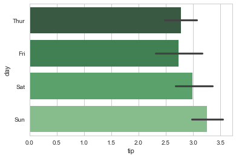

</div>
</div>
</div>


<div markdown="1" class="cell code_cell">
<div class="input_area" markdown="1">
```python
#Notice the selection of palette and how we can swap the axis.
sns.barplot(x="total_bill", y="day", data=tips,  palette="Reds_d");


```
</div>

<div class="output_wrapper" markdown="1">
<div class="output_subarea" markdown="1">

{:.output_png}
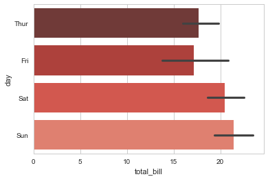

</div>
</div>
</div>


<div markdown="1" class="cell code_cell">
<div class="input_area" markdown="1">
```python
#Saturday is the bigger night
sns.countplot(x="day", data=tips);

```
</div>

<div class="output_wrapper" markdown="1">
<div class="output_subarea" markdown="1">

{:.output_png}
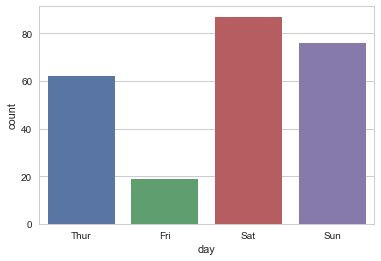

</div>
</div>
</div>

