---
redirect_from:
  - "/notebooks/06-viz-api-scraper/alt-visualization-python-matplotlib"
interact_link: content/notebooks/06-viz-api-scraper/ALT-visualization-python-matplotlib.ipynb
kernel_name: python3
has_widgets: false
title: 'Matplotlib'
prev_page:
  url: /notebooks/06-viz-api-scraper/05-features-dummies.html
  title: 'Feature Dummies'
next_page:
  url: /notebooks/08-intro-modeling/01-neural-networks.html
  title: 'The Simplest Neural Network with Numpy'
comment: "***PROGRAMMATICALLY GENERATED, DO NOT EDIT. SEE ORIGINAL FILES IN /content***"
---


[](http://rpi.analyticsdojo.com)
<center><h1>Introduction to MatplotLab - Python</h1></center>
<center><h3><a href = 'http://rpi.analyticsdojo.com'>rpi.analyticsdojo.com</a></h3></center>


This has been adopted from the [IPython notebook](http://ipython.org/notebook.html) available at [http://github.com/jrjohansson/scientific-python-lectures](http://github.com/jrjohansson/scientific-python-lectures).


### Introduction
Matplotlib is a 2D and 3D graphics library for generating scientific figures. 

- Easy to get started
- Support for $\LaTeX$ formatted labels and texts
- Great control of every element in a figure, including figure size and DPI. 
- High-quality output in many formats, including PNG, PDF, SVG, EPS, and PGF.
- GUI for interactively exploring figures *and* support for headless generation of figure files (useful for batch jobs).
- More information at the Matplotlib web page: http://matplotlib.org/


### Using `matplotlib` with Jupyter
- `%matplotlib inline` ensures that visuals will be provided in a notebook rather than opening a new image.
- Import matplotlab.  It is a common package and has already been installed. 
- Import the matplotlib.pyplot module under the name plt.


<div markdown="1" class="cell code_cell">
<div class="input_area" markdown="1">
```python
# This is not strictly for a Python rather. 
%matplotlib inline

```
</div>

</div>


<div markdown="1" class="cell code_cell">
<div class="input_area" markdown="1">
```python
import matplotlib
import matplotlib.pyplot as plt

```
</div>

</div>


### `matplotlib` Library
- Objects that one can apply functions and actions on, and no object or program states should be global.
- Created figure instance in the `fig` variable.
- And from it we create a new axis instance `axes` using the `add_axes` method in the `Figure` class instance `fig`.


<div markdown="1" class="cell code_cell">
<div class="input_area" markdown="1">
```python
#This generates the x and y variables we will be plotting. 
import numpy as np
x = np.linspace(0, 5, 10)
y = x ** 2

```
</div>

</div>


<div markdown="1" class="cell code_cell">
<div class="input_area" markdown="1">
```python
#This initiates the Figure. 
fig = plt.figure()

#This creates the size of the figure  [left, bottom, width, height (range 0 to 1)]
axes = fig.add_axes([0, 0, .75, .75]) 

#This creates a x, y, and the color of the graph
axes.plot(x, y, 'blue')
axes.set_xlabel('X Axis')
axes.set_ylabel('Y Azis')
axes.set_title('Title');

```
</div>

<div class="output_wrapper" markdown="1">
<div class="output_subarea" markdown="1">

{:.output_png}
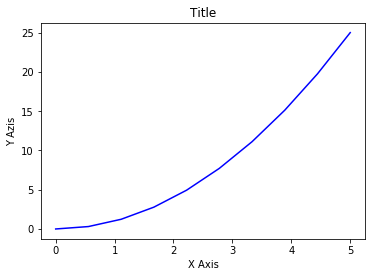

</div>
</div>
</div>


<div markdown="1" class="cell code_cell">
<div class="input_area" markdown="1">
```python
fig = plt.figure()

#This creates the size of the figure  [left, bottom, width, height (range 0 to 1)]
axes1 = fig.add_axes([0, 0, 1, 1]) # main axes
axes1.plot(x, y, 'red')
axes1.set_xlabel('x')
axes1.set_ylabel('y')
axes1.set_title('title')

#This creates the size of the figure  [left, bottom, width, height (range 0 to 1)]
axes2 = fig.add_axes([0.1, 0.3, 0.3, 0.3]) # inset axes
axes2.plot(y, x, 'green')
axes2.set_xlabel('y')
axes2.set_ylabel('x')
axes2.set_title('insert title');

```
</div>

<div class="output_wrapper" markdown="1">
<div class="output_subarea" markdown="1">

{:.output_png}
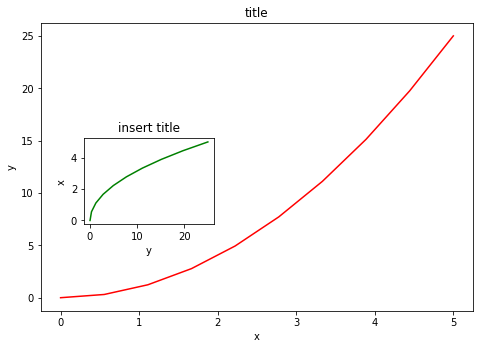

</div>
</div>
</div>


### Subplots
- If we don't care about being explicit about where our plot axes are placed in the figure canvas, then we can use one of the many axis layout managers in matplotlib. 
- Subplots can be used to list multiple related plots.


<div markdown="1" class="cell code_cell">
<div class="input_area" markdown="1">
```python
fig, axes = plt.subplots(nrows=1, ncols=2)

for ax in axes:
    ax.plot(x, y, 'r')
    ax.set_xlabel('x')
    ax.set_ylabel('y')
    ax.set_title('title')

```
</div>

<div class="output_wrapper" markdown="1">
<div class="output_subarea" markdown="1">

{:.output_png}
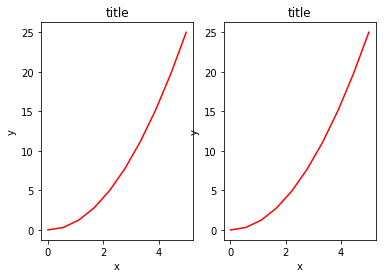

</div>
</div>
</div>


### Figure size, Aspect Ratio and DPI
- Matplotlib allows the aspect ratio, DPI and figure size to be specified when the `Figure` object is created using the `figsize` and `dpi` keyword arguments. 
- `figsize` is a tuple of the width and height of the figure in inches, and `dpi` is the dots-per-inch (pixel per inch). 
- To create an 800x400 pixel, 100 dots-per-inch figure, we can do: 


<div markdown="1" class="cell code_cell">
<div class="input_area" markdown="1">
```python
fig = plt.figure(figsize=(8,4), dpi=100)

```
</div>

<div class="output_wrapper" markdown="1">
<div class="output_subarea" markdown="1">
{:.output_data_text}
```
<matplotlib.figure.Figure at 0x10ad10320>
```

</div>
</div>
</div>


The same arguments can also be passed to layout managers, such as the `subplots` function:


<div markdown="1" class="cell code_cell">
<div class="input_area" markdown="1">
```python
fig, axes = plt.subplots(figsize=(12,3))

axes.plot(x, y, 'r')
axes.set_xlabel('x')
axes.set_ylabel('y')
axes.set_title('title');

```
</div>

<div class="output_wrapper" markdown="1">
<div class="output_subarea" markdown="1">

{:.output_png}
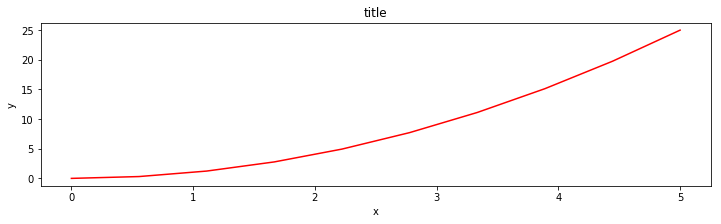

</div>
</div>
</div>


### Saving Figures
- To save a figure to a file we can use the `savefig` method in the `Figure` class.
- Here we can also optionally specify the DPI and choose between different output formats.


<div markdown="1" class="cell code_cell">
<div class="input_area" markdown="1">
```python
fig.savefig("filename.png")

```
</div>

</div>


<div markdown="1" class="cell code_cell">
<div class="input_area" markdown="1">
```python
fig.savefig("filename.png", dpi=200)

```
</div>

</div>


### Legends

- Legends for curves in a figure can be added with the `legend`. 
- The legend function takes an optional keyword argument loc that can be used to specify where in the figure the legend is to be drawn
- Use the label="label text" keyword argument when plots or other objects are added to the figure.
- See http://matplotlib.org/users/legend_guide.html#legend-location for more details. 
- The following adjust the location:

```
ax.legend(loc=0) # let matplotlib decide the optimal location
ax.legend(loc=1) # upper right corner
ax.legend(loc=2) # upper left corner
ax.legend(loc=3) # lower left corner
ax.legend(loc=4) # lower right corner```


<div markdown="1" class="cell code_cell">
<div class="input_area" markdown="1">
```python
fig, ax = plt.subplots()

ax.plot(x, x**2, label="y = x**2")
ax.plot(x, x**3, label="y = x**3")
ax.legend(loc=2); # upper left corner
ax.set_xlabel('x')
ax.set_ylabel('y')
ax.set_title('title');


```
</div>

<div class="output_wrapper" markdown="1">
<div class="output_subarea" markdown="1">

{:.output_png}
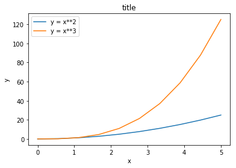

</div>
</div>
</div>


### Formatting Text: LaTeX, Fontsize, Font Family
- Matplotlib has great support for LaTeX. All we need to do is to use dollar signs encapsulate LaTeX in any text (legend, title, label, etc.). For example, "$y=x^3$".
- We can also change the global font size and font family, which applies to all text elements in a figure (tick labels, axis labels and titles, legends, etc.).


<div markdown="1" class="cell code_cell">
<div class="input_area" markdown="1">
```python
# Update the matplotlib configuration parameters:
matplotlib.rcParams.update({'font.size': 18, 'font.family': 'STIXGeneral', 'mathtext.fontset': 'stix'})
#matplotlib.rcParams.update({'font.size': 18, 'font.family': 'serif'})
fig, ax = plt.subplots()

ax.plot(x, x**2, label=r"$y = \alpha^2$")
ax.plot(x, x**3, label=r"$y = \alpha^3$")
ax.legend(loc=2) # upper left corner
ax.set_xlabel(r'$\alpha$')
ax.set_ylabel(r'$y$')
ax.set_title('title');

```
</div>

<div class="output_wrapper" markdown="1">
<div class="output_subarea" markdown="1">

{:.output_png}
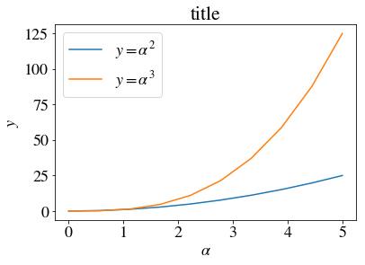

</div>
</div>
</div>


### Formatting Colors, Linewidths, and Linetypes
- We can use the MATLAB-like syntax where 'b' means blue...
-'b.-' means a blue line with dots.
-'g--' means a green line with dashed lines.


<div markdown="1" class="cell code_cell">
<div class="input_area" markdown="1">
```python
# MATLAB style line color and style 
ax.plot(x, x**2, 'b.-') # blue line with dots
ax.plot(x, x**3, 'g--') # green dashed line

```
</div>

<div class="output_wrapper" markdown="1">
<div class="output_subarea" markdown="1">


{:.output_data_text}
```
[<matplotlib.lines.Line2D at 0x10eea16a0>]
```


</div>
</div>
</div>


We can also define colors by their names or RGB hex codes and optionally provide an alpha value using the `color` and `alpha` keyword arguments:


<div markdown="1" class="cell code_cell">
<div class="input_area" markdown="1">
```python
fig, ax = plt.subplots()
ax.plot(x, x, 'r.-', label=r"$y = \alpha$",  alpha=0.5) #
ax.plot(x, x**2, label=r"$y = \alpha^2$", color="#1155dd", alpha=0.5)
ax.plot(x, x**3, 'y--', label=r"$y = \alpha^3$", ) # green dashed line
ax.legend(loc=2) # upper left corner
ax.set_xlabel(r'$\alpha$')
ax.set_ylabel(r'$y$')
ax.set_title('title');


```
</div>

<div class="output_wrapper" markdown="1">
<div class="output_subarea" markdown="1">

{:.output_png}
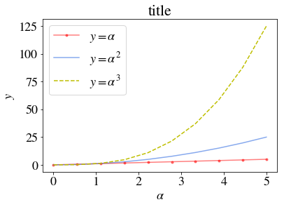

</div>
</div>
</div>


### Linewidth
- To change the line width, we can use the `linewidth` or `lw` keyword argument. The line style can be selected using the `linestyle` or `ls` keyword arguments:


<div markdown="1" class="cell code_cell">
<div class="input_area" markdown="1">
```python
fig, ax = plt.subplots(figsize=(12,6))

ax.plot(x, x+1, color="blue", linewidth=0.25)
ax.plot(x, x+2, color="blue", linewidth=0.50)
ax.plot(x, x+3, color="blue", linewidth=1.00)
ax.plot(x, x+4, color="blue", linewidth=2.00)

# possible linestype options ‘-‘, ‘--’, ‘-.’, ‘:’, ‘steps’
ax.plot(x, x+5, color="red", lw=2, linestyle='-')
ax.plot(x, x+6, color="red", lw=2, ls='-.')
ax.plot(x, x+7, color="red", lw=2, ls=':')

# custom dash
line, = ax.plot(x, x+8, color="black", lw=1.50)
line.set_dashes([5, 10, 15, 10]) # format: line length, space length, ...

# possible marker symbols: marker = '+', 'o', '*', 's', ',', '.', '1', '2', '3', '4', ...
ax.plot(x, x+ 9, color="green", lw=2, ls='--', marker='+')
ax.plot(x, x+10, color="green", lw=2, ls='--', marker='o')
ax.plot(x, x+11, color="green", lw=2, ls='--', marker='s')
ax.plot(x, x+12, color="green", lw=2, ls='--', marker='1')

# marker size and color
ax.plot(x, x+13, color="purple", lw=1, ls='-', marker='o', markersize=2)
ax.plot(x, x+14, color="purple", lw=1, ls='-', marker='o', markersize=4)
ax.plot(x, x+15, color="purple", lw=1, ls='-', marker='o', markersize=8, markerfacecolor="red")
ax.plot(x, x+16, color="purple", lw=1, ls='-', marker='s', markersize=8, 
        markerfacecolor="yellow", markeredgewidth=2, markeredgecolor="blue");

```
</div>

<div class="output_wrapper" markdown="1">
<div class="output_subarea" markdown="1">

{:.output_png}
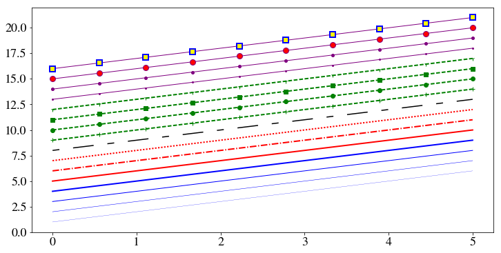

</div>
</div>
</div>


### Control Over Axis Appearance


The appearance of the axes is an important aspect of a figure that we often need to modify to make a publication quality graphics. We need to be able to control where the ticks and labels are placed, modify the font size and possibly the labels used on the axes. In this section we will look at controling those properties in a matplotlib figure.


#### Plot range


### Control Over Axis Appearance
- Configure ranges of the axes with `set_ylim` and `set_xlim` methods or `axis('tight')` for automatrically getting "tightly fitted" axes ranges.


<div markdown="1" class="cell code_cell">
<div class="input_area" markdown="1">
```python
fig, axes = plt.subplots(1, 3, figsize=(12, 4))

axes[0].plot(x, x**2, x, x**3)
axes[0].set_title("default axes ranges")

axes[1].plot(x, x**2, x, x**3)
axes[1].axis('tight')
axes[1].set_title("tight axes")

axes[2].plot(x, x**2, x, x**3)
axes[2].set_ylim([0, 60])
axes[2].set_xlim([2, 5])
axes[2].set_title("custom axes range");

```
</div>

<div class="output_wrapper" markdown="1">
<div class="output_subarea" markdown="1">

{:.output_png}
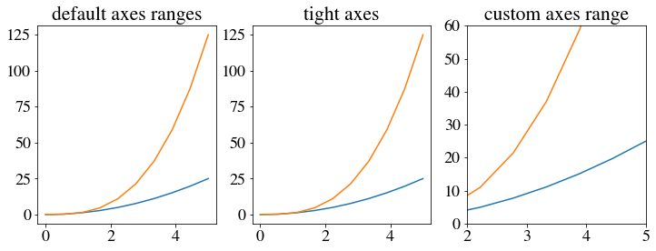

</div>
</div>
</div>


#### Logarithmic scale
- It is also possible to set a logarithmic scale for one or both axes. 
- Each of the axes' scales are set seperately using `set_xscale` and `set_yscale` methods which accept one parameter (with the value "log" in this case):


<div markdown="1" class="cell code_cell">
<div class="input_area" markdown="1">
```python
fig, axes = plt.subplots(1, 2, figsize=(10,4))
axes[0].plot(x, x**2, x, np.exp(x))
axes[0].set_title("Normal scale")

axes[1].plot(x, x**2, x, np.exp(x))
axes[1].set_yscale("log")
axes[1].set_title("Logarithmic scale (y)");

```
</div>

<div class="output_wrapper" markdown="1">
<div class="output_subarea" markdown="1">

{:.output_png}
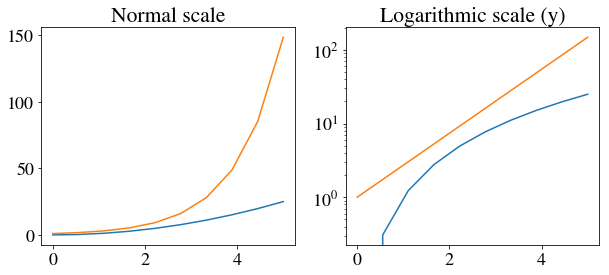

</div>
</div>
</div>


### Other 2D plot styles
- 'scatter`
- `step`
- `bar` 
- For more see http://matplotlib.org/gallery.html. 


<div markdown="1" class="cell code_cell">
<div class="input_area" markdown="1">
```python
n = np.array([0,1,2,3,4,5])

```
</div>

</div>


<div markdown="1" class="cell code_cell">
<div class="input_area" markdown="1">
```python
n = np.array([0,1,2,3,4,5])
fig, axes = plt.subplots(1, 3, figsize=(12,3))

axes[0].scatter(n, n + 0.25*np.random.randn(len(n)))
axes[0].set_title("scatter")

axes[1].step(n, n**2, lw=2)
axes[1].set_title("step")

axes[2].bar(n, n**2, align="center", width=0.5, alpha=0.5)
axes[2].set_title("bar")


```
</div>

<div class="output_wrapper" markdown="1">
<div class="output_subarea" markdown="1">


{:.output_data_text}
```
<matplotlib.text.Text at 0x10e537b70>
```


</div>
</div>
<div class="output_wrapper" markdown="1">
<div class="output_subarea" markdown="1">

{:.output_png}
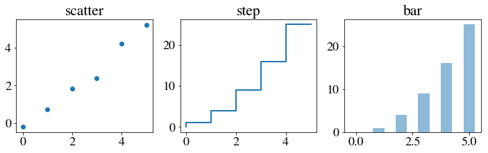

</div>
</div>
</div>


<div markdown="1" class="cell code_cell">
<div class="input_area" markdown="1">
```python
# A histogram
n = np.random.randn(100000)
fig, axes = plt.subplots(1, 2, figsize=(12,4))

axes[0].hist(n)
axes[0].set_title("Default histogram")
axes[0].set_xlim((min(n), max(n)))

axes[1].hist(n, cumulative=True, bins=50)
axes[1].set_title("Cumulative detailed histogram")
axes[1].set_xlim((min(n), max(n)));

```
</div>

<div class="output_wrapper" markdown="1">
<div class="output_subarea" markdown="1">

{:.output_png}
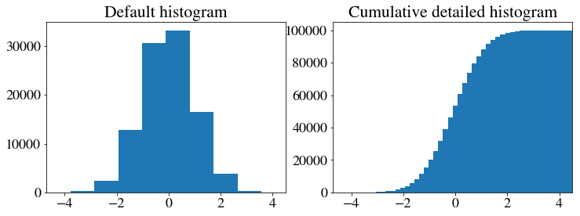

</div>
</div>
</div>


<div markdown="1" class="cell code_cell">
<div class="input_area" markdown="1">
```python
import pandas as pd
df = pd.read_csv('../input/iris.csv')
df.head()

```
</div>

<div class="output_wrapper" markdown="1">
<div class="output_subarea" markdown="1">


<div markdown="0" class="output output_html">
<div>
<table border="1" class="dataframe">
  <thead>
    <tr style="text-align: right;">
      <th></th>
      <th>sepal_length</th>
      <th>sepal_width</th>
      <th>petal_length</th>
      <th>petal_width</th>
      <th>species</th>
    </tr>
  </thead>
  <tbody>
    <tr>
      <th>0</th>
      <td>5.1</td>
      <td>3.5</td>
      <td>1.4</td>
      <td>0.2</td>
      <td>setosa</td>
    </tr>
    <tr>
      <th>1</th>
      <td>4.9</td>
      <td>3.0</td>
      <td>1.4</td>
      <td>0.2</td>
      <td>setosa</td>
    </tr>
    <tr>
      <th>2</th>
      <td>4.7</td>
      <td>3.2</td>
      <td>1.3</td>
      <td>0.2</td>
      <td>setosa</td>
    </tr>
    <tr>
      <th>3</th>
      <td>4.6</td>
      <td>3.1</td>
      <td>1.5</td>
      <td>0.2</td>
      <td>setosa</td>
    </tr>
    <tr>
      <th>4</th>
      <td>5.0</td>
      <td>3.6</td>
      <td>1.4</td>
      <td>0.2</td>
      <td>setosa</td>
    </tr>
  </tbody>
</table>
</div>
</div>


</div>
</div>
</div>


<div markdown="1" class="cell code_cell">
<div class="input_area" markdown="1">
```python
# This plots using the .plot extension from Pandas dataframes.
df.plot(kind="scatter", x="sepal_length", y="sepal_width")

```
</div>

<div class="output_wrapper" markdown="1">
<div class="output_subarea" markdown="1">


{:.output_data_text}
```
<matplotlib.axes._subplots.AxesSubplot at 0x7f60d99c5748>
```


</div>
</div>
<div class="output_wrapper" markdown="1">
<div class="output_subarea" markdown="1">

{:.output_png}
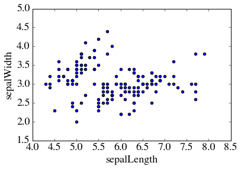

</div>
</div>
</div>


Copyright [AnalyticsDojo](http://rpi.analyticsdojo.com) 2016.
This work is licensed under the [Creative Commons Attribution 4.0 International](https://creativecommons.org/licenses/by/4.0/) license agreement

This has been adopted from the [IPython notebook](http://ipython.org/notebook.html) available at [http://github.com/jrjohansson/scientific-python-lectures](http://github.com/jrjohansson/scientific-python-lectures) by J.R. Johansson.


