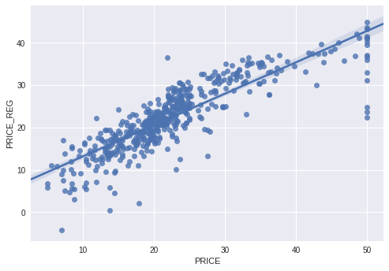

[](http://rpi.analyticsdojo.com)
<center><h1>Boston Housing</h1></center>
<center><h3><a href = 'http://rpi.analyticsdojo.com'>rpi.analyticsdojo.com</a></h3></center>


<div markdown="1" class="cell code_cell">
<div class="input_area" markdown="1">
```python
#This uses the same mechansims. 
%matplotlib inline

```
</div>

</div>


## Overview
- Getting the Data
- Reviewing Data
- Modeling 
- Model Evaluation
- Using Model
- Storing Model


## Getting Data
- Available in the [sklearn package](http://scikit-learn.org/stable/modules/generated/sklearn.datasets.load_boston.html) as a Bunch object (dictionary).
- From FAQ: ["Don’t make a bunch object! They are not part of the scikit-learn API. Bunch objects are just a way to package some numpy arrays. As a scikit-learn user you only ever need numpy arrays to feed your model with data."](http://scikit-learn.org/stable/faq.html)
- Available in the UCI data repository. 
- Better to convert to Pandas dataframe. 


<div markdown="1" class="cell code_cell">
<div class="input_area" markdown="1">
```python
#From sklearn tutorial.
from sklearn.datasets import load_boston
boston = load_boston()
print( "Type of boston dataset:", type(boston))


```
</div>

<div class="output_wrapper" markdown="1">
<div class="output_subarea" markdown="1">
{:.output_stream}
```
Type of boston dataset: <class 'sklearn.utils.Bunch'>
```
</div>
</div>
</div>


<div markdown="1" class="cell code_cell">
<div class="input_area" markdown="1">
```python
#A bunch is you remember is a dictionary based dataset.  Dictionaries are addressed by keys. 
#Let's look at the keys. 
print(boston.keys())


```
</div>

<div class="output_wrapper" markdown="1">
<div class="output_subarea" markdown="1">
{:.output_stream}
```
dict_keys(['data', 'target', 'feature_names', 'DESCR', 'filename'])
```
</div>
</div>
</div>


<div markdown="1" class="cell code_cell">
<div class="input_area" markdown="1">
```python
#DESCR sounds like it could be useful. Let's print the description.
print(boston['DESCR'])

```
</div>

<div class="output_wrapper" markdown="1">
<div class="output_subarea" markdown="1">
{:.output_stream}
```
.. _boston_dataset:

Boston house prices dataset
---------------------------

**Data Set Characteristics:**  

    :Number of Instances: 506 

    :Number of Attributes: 13 numeric/categorical predictive. Median Value (attribute 14) is usually the target.

    :Attribute Information (in order):
        - CRIM     per capita crime rate by town
        - ZN       proportion of residential land zoned for lots over 25,000 sq.ft.
        - INDUS    proportion of non-retail business acres per town
        - CHAS     Charles River dummy variable (= 1 if tract bounds river; 0 otherwise)
        - NOX      nitric oxides concentration (parts per 10 million)
        - RM       average number of rooms per dwelling
        - AGE      proportion of owner-occupied units built prior to 1940
        - DIS      weighted distances to five Boston employment centres
        - RAD      index of accessibility to radial highways
        - TAX      full-value property-tax rate per $10,000
        - PTRATIO  pupil-teacher ratio by town
        - B        1000(Bk - 0.63)^2 where Bk is the proportion of blacks by town
        - LSTAT    % lower status of the population
        - MEDV     Median value of owner-occupied homes in $1000's

    :Missing Attribute Values: None

    :Creator: Harrison, D. and Rubinfeld, D.L.

This is a copy of UCI ML housing dataset.
https://archive.ics.uci.edu/ml/machine-learning-databases/housing/


This dataset was taken from the StatLib library which is maintained at Carnegie Mellon University.

The Boston house-price data of Harrison, D. and Rubinfeld, D.L. 'Hedonic
prices and the demand for clean air', J. Environ. Economics & Management,
vol.5, 81-102, 1978.   Used in Belsley, Kuh & Welsch, 'Regression diagnostics
...', Wiley, 1980.   N.B. Various transformations are used in the table on
pages 244-261 of the latter.

The Boston house-price data has been used in many machine learning papers that address regression
problems.   
     
.. topic:: References

   - Belsley, Kuh & Welsch, 'Regression diagnostics: Identifying Influential Data and Sources of Collinearity', Wiley, 1980. 244-261.
   - Quinlan,R. (1993). Combining Instance-Based and Model-Based Learning. In Proceedings on the Tenth International Conference of Machine Learning, 236-243, University of Massachusetts, Amherst. Morgan Kaufmann.

```
</div>
</div>
</div>


<div markdown="1" class="cell code_cell">
<div class="input_area" markdown="1">
```python
# Let's change the data to a Panda's Dataframe
import pandas as pd
boston_df = pd.DataFrame(boston['data'] )
boston_df.head()

```
</div>

<div class="output_wrapper" markdown="1">
<div class="output_subarea" markdown="1">


<div markdown="0" class="output output_html">
<div>
<style scoped>
    .dataframe tbody tr th:only-of-type {
        vertical-align: middle;
    }

    .dataframe tbody tr th {
        vertical-align: top;
    }

    .dataframe thead th {
        text-align: right;
    }
</style>
<table border="1" class="dataframe">
  <thead>
    <tr style="text-align: right;">
      <th></th>
      <th>0</th>
      <th>1</th>
      <th>2</th>
      <th>3</th>
      <th>4</th>
      <th>5</th>
      <th>6</th>
      <th>7</th>
      <th>8</th>
      <th>9</th>
      <th>10</th>
      <th>11</th>
      <th>12</th>
    </tr>
  </thead>
  <tbody>
    <tr>
      <th>0</th>
      <td>0.00632</td>
      <td>18.0</td>
      <td>2.31</td>
      <td>0.0</td>
      <td>0.538</td>
      <td>6.575</td>
      <td>65.2</td>
      <td>4.0900</td>
      <td>1.0</td>
      <td>296.0</td>
      <td>15.3</td>
      <td>396.90</td>
      <td>4.98</td>
    </tr>
    <tr>
      <th>1</th>
      <td>0.02731</td>
      <td>0.0</td>
      <td>7.07</td>
      <td>0.0</td>
      <td>0.469</td>
      <td>6.421</td>
      <td>78.9</td>
      <td>4.9671</td>
      <td>2.0</td>
      <td>242.0</td>
      <td>17.8</td>
      <td>396.90</td>
      <td>9.14</td>
    </tr>
    <tr>
      <th>2</th>
      <td>0.02729</td>
      <td>0.0</td>
      <td>7.07</td>
      <td>0.0</td>
      <td>0.469</td>
      <td>7.185</td>
      <td>61.1</td>
      <td>4.9671</td>
      <td>2.0</td>
      <td>242.0</td>
      <td>17.8</td>
      <td>392.83</td>
      <td>4.03</td>
    </tr>
    <tr>
      <th>3</th>
      <td>0.03237</td>
      <td>0.0</td>
      <td>2.18</td>
      <td>0.0</td>
      <td>0.458</td>
      <td>6.998</td>
      <td>45.8</td>
      <td>6.0622</td>
      <td>3.0</td>
      <td>222.0</td>
      <td>18.7</td>
      <td>394.63</td>
      <td>2.94</td>
    </tr>
    <tr>
      <th>4</th>
      <td>0.06905</td>
      <td>0.0</td>
      <td>2.18</td>
      <td>0.0</td>
      <td>0.458</td>
      <td>7.147</td>
      <td>54.2</td>
      <td>6.0622</td>
      <td>3.0</td>
      <td>222.0</td>
      <td>18.7</td>
      <td>396.90</td>
      <td>5.33</td>
    </tr>
  </tbody>
</table>
</div>
</div>


</div>
</div>
</div>


<div markdown="1" class="cell code_cell">
<div class="input_area" markdown="1">
```python
#Now add the column names.
boston_df.columns = boston['feature_names']
boston_df.head()

```
</div>

<div class="output_wrapper" markdown="1">
<div class="output_subarea" markdown="1">


<div markdown="0" class="output output_html">
<div>
<style scoped>
    .dataframe tbody tr th:only-of-type {
        vertical-align: middle;
    }

    .dataframe tbody tr th {
        vertical-align: top;
    }

    .dataframe thead th {
        text-align: right;
    }
</style>
<table border="1" class="dataframe">
  <thead>
    <tr style="text-align: right;">
      <th></th>
      <th>CRIM</th>
      <th>ZN</th>
      <th>INDUS</th>
      <th>CHAS</th>
      <th>NOX</th>
      <th>RM</th>
      <th>AGE</th>
      <th>DIS</th>
      <th>RAD</th>
      <th>TAX</th>
      <th>PTRATIO</th>
      <th>B</th>
      <th>LSTAT</th>
    </tr>
  </thead>
  <tbody>
    <tr>
      <th>0</th>
      <td>0.00632</td>
      <td>18.0</td>
      <td>2.31</td>
      <td>0.0</td>
      <td>0.538</td>
      <td>6.575</td>
      <td>65.2</td>
      <td>4.0900</td>
      <td>1.0</td>
      <td>296.0</td>
      <td>15.3</td>
      <td>396.90</td>
      <td>4.98</td>
    </tr>
    <tr>
      <th>1</th>
      <td>0.02731</td>
      <td>0.0</td>
      <td>7.07</td>
      <td>0.0</td>
      <td>0.469</td>
      <td>6.421</td>
      <td>78.9</td>
      <td>4.9671</td>
      <td>2.0</td>
      <td>242.0</td>
      <td>17.8</td>
      <td>396.90</td>
      <td>9.14</td>
    </tr>
    <tr>
      <th>2</th>
      <td>0.02729</td>
      <td>0.0</td>
      <td>7.07</td>
      <td>0.0</td>
      <td>0.469</td>
      <td>7.185</td>
      <td>61.1</td>
      <td>4.9671</td>
      <td>2.0</td>
      <td>242.0</td>
      <td>17.8</td>
      <td>392.83</td>
      <td>4.03</td>
    </tr>
    <tr>
      <th>3</th>
      <td>0.03237</td>
      <td>0.0</td>
      <td>2.18</td>
      <td>0.0</td>
      <td>0.458</td>
      <td>6.998</td>
      <td>45.8</td>
      <td>6.0622</td>
      <td>3.0</td>
      <td>222.0</td>
      <td>18.7</td>
      <td>394.63</td>
      <td>2.94</td>
    </tr>
    <tr>
      <th>4</th>
      <td>0.06905</td>
      <td>0.0</td>
      <td>2.18</td>
      <td>0.0</td>
      <td>0.458</td>
      <td>7.147</td>
      <td>54.2</td>
      <td>6.0622</td>
      <td>3.0</td>
      <td>222.0</td>
      <td>18.7</td>
      <td>396.90</td>
      <td>5.33</td>
    </tr>
  </tbody>
</table>
</div>
</div>


</div>
</div>
</div>


<div markdown="1" class="cell code_cell">
<div class="input_area" markdown="1">
```python
#Add the target as PRICE. 
boston_df['PRICE']= boston['target']
boston_df.head()

```
</div>

<div class="output_wrapper" markdown="1">
<div class="output_subarea" markdown="1">


<div markdown="0" class="output output_html">
<div>
<style scoped>
    .dataframe tbody tr th:only-of-type {
        vertical-align: middle;
    }

    .dataframe tbody tr th {
        vertical-align: top;
    }

    .dataframe thead th {
        text-align: right;
    }
</style>
<table border="1" class="dataframe">
  <thead>
    <tr style="text-align: right;">
      <th></th>
      <th>CRIM</th>
      <th>ZN</th>
      <th>INDUS</th>
      <th>CHAS</th>
      <th>NOX</th>
      <th>RM</th>
      <th>AGE</th>
      <th>DIS</th>
      <th>RAD</th>
      <th>TAX</th>
      <th>PTRATIO</th>
      <th>B</th>
      <th>LSTAT</th>
      <th>PRICE</th>
    </tr>
  </thead>
  <tbody>
    <tr>
      <th>0</th>
      <td>0.00632</td>
      <td>18.0</td>
      <td>2.31</td>
      <td>0.0</td>
      <td>0.538</td>
      <td>6.575</td>
      <td>65.2</td>
      <td>4.0900</td>
      <td>1.0</td>
      <td>296.0</td>
      <td>15.3</td>
      <td>396.90</td>
      <td>4.98</td>
      <td>24.0</td>
    </tr>
    <tr>
      <th>1</th>
      <td>0.02731</td>
      <td>0.0</td>
      <td>7.07</td>
      <td>0.0</td>
      <td>0.469</td>
      <td>6.421</td>
      <td>78.9</td>
      <td>4.9671</td>
      <td>2.0</td>
      <td>242.0</td>
      <td>17.8</td>
      <td>396.90</td>
      <td>9.14</td>
      <td>21.6</td>
    </tr>
    <tr>
      <th>2</th>
      <td>0.02729</td>
      <td>0.0</td>
      <td>7.07</td>
      <td>0.0</td>
      <td>0.469</td>
      <td>7.185</td>
      <td>61.1</td>
      <td>4.9671</td>
      <td>2.0</td>
      <td>242.0</td>
      <td>17.8</td>
      <td>392.83</td>
      <td>4.03</td>
      <td>34.7</td>
    </tr>
    <tr>
      <th>3</th>
      <td>0.03237</td>
      <td>0.0</td>
      <td>2.18</td>
      <td>0.0</td>
      <td>0.458</td>
      <td>6.998</td>
      <td>45.8</td>
      <td>6.0622</td>
      <td>3.0</td>
      <td>222.0</td>
      <td>18.7</td>
      <td>394.63</td>
      <td>2.94</td>
      <td>33.4</td>
    </tr>
    <tr>
      <th>4</th>
      <td>0.06905</td>
      <td>0.0</td>
      <td>2.18</td>
      <td>0.0</td>
      <td>0.458</td>
      <td>7.147</td>
      <td>54.2</td>
      <td>6.0622</td>
      <td>3.0</td>
      <td>222.0</td>
      <td>18.7</td>
      <td>396.90</td>
      <td>5.33</td>
      <td>36.2</td>
    </tr>
  </tbody>
</table>
</div>
</div>


</div>
</div>
</div>


 ## Attribute Information (in order):
 Looks like they are all continuous IV and continuous DV. 
        - CRIM     per capita crime rate by town
        - ZN       proportion of residential land zoned for lots over 25,000 sq.ft.
        - INDUS    proportion of non-retail business acres per town
        - CHAS     Charles River dummy variable (= 1 if tract bounds river; 0 otherwise)
        - NOX      nitric oxides concentration (parts per 10 million)
        - RM       average number of rooms per dwelling
        - AGE      proportion of owner-occupied units built prior to 1940
        - DIS      weighted distances to five Boston employment centres
        - RAD      index of accessibility to radial highways
        - TAX      full-value property-tax rate per 10,000
        - PTRATIO  pupil-teacher ratio by town
        - B        1000(Bk - 0.63)^2 where Bk is the proportion of blacks by town
        - LSTAT    % lower status of the population
        - MEDV     Median value of owner-occupied homes in 1000's
 Let's check for missing values.


<div markdown="1" class="cell code_cell">
<div class="input_area" markdown="1">
```python
import numpy as np
#check for missing values
print(np.sum(np.isnan(boston_df)))

```
</div>

<div class="output_wrapper" markdown="1">
<div class="output_subarea" markdown="1">
{:.output_stream}
```
CRIM       0
ZN         0
INDUS      0
CHAS       0
NOX        0
RM         0
AGE        0
DIS        0
RAD        0
TAX        0
PTRATIO    0
B          0
LSTAT      0
PRICE      0
dtype: int64
```
</div>
</div>
</div>


## What type of data are there?
- First let's focus on the dependent variable, as the nature of the DV is critical to selection of model. 
- *Median value of owner-occupied homes in $1000's* is the Dependent Variable  (continuous variable).
- It is relevant to look at the distribution of the dependent variable, so let's do that first.
- Here there is a normal distribution for the most part, with some at the top end of the distribution we could explore later.


<div markdown="1" class="cell code_cell">
<div class="input_area" markdown="1">
```python
#Let's us seaborn, because it is pretty. ;) 
#See more here. http://seaborn.pydata.org/tutorial/distributions.html
import seaborn as sns
sns.distplot(boston_df['PRICE']);

```
</div>

<div class="output_wrapper" markdown="1">
<div class="output_subarea" markdown="1">

{:.output_png}


</div>
</div>
</div>


<div markdown="1" class="cell code_cell">
<div class="input_area" markdown="1">
```python
#We can quickly look at other data. 
#Look at the bottom row to see thinks likely coorelated with price. 
#Look along the diagonal to see histograms of each. 
sns.pairplot(boston_df);

```
</div>

<div class="output_wrapper" markdown="1">
<div class="output_subarea" markdown="1">

{:.output_png}


</div>
</div>
</div>


## Preparing to Model
- It is common to separate `y` as the dependent variable and `X` as the matrix of independent variables.
- Here we are using `train_test_split` to split the test and train.
- This creates 4 subsets, with IV and DV separted: `X_train, X_test, y_train, y_test`
 


<div markdown="1" class="cell code_cell">
<div class="input_area" markdown="1">
```python
#This will throw and error at import if haven't upgraded. 
# from sklearn.cross_validation  import train_test_split  
from sklearn.model_selection  import train_test_split
#y is the dependent variable.
y = boston_df['PRICE']
#As we know, iloc is used to slice the array by index number. Here this is the matrix of 
#independent variables.
X = boston_df.iloc[:,0:13]

# Split the data into a training set and a test set
X_train, X_test, y_train, y_test = train_test_split(X, y, test_size=0.3, random_state=0)

print(X_train.shape, X_test.shape, y_train.shape, y_test.shape)


```
</div>

<div class="output_wrapper" markdown="1">
<div class="output_subarea" markdown="1">
{:.output_stream}
```
(354, 13) (152, 13) (354,) (152,)
```
</div>
</div>
</div>


## Modeling
- First import the package: `from sklearn.linear_model import LinearRegression`
- Then create the model object.  
- Then fit the data. 
- This creates a trained model (an object) of class regression.
- The variety of methods and attributes available for regression are shown [here](http://scikit-learn.org/stable/modules/generated/sklearn.linear_model.LinearRegression.html).


<div markdown="1" class="cell code_cell">
<div class="input_area" markdown="1">
```python
from sklearn.linear_model import LinearRegression
lm = LinearRegression()
lm.fit( X_train, y_train )


```
</div>

<div class="output_wrapper" markdown="1">
<div class="output_subarea" markdown="1">


{:.output_data_text}
```
LinearRegression(copy_X=True, fit_intercept=True, n_jobs=None,
         normalize=False)
```


</div>
</div>
</div>


## Evaluating the Model Results
- You have fit a model. 
- You can now store this model, save the object to disk, or evaluate it with different outcomes. 
- Trained regression objects have coefficients (`coef_`) and intercepts (`intercept_`) as attributes. 
- R-Squared is determined from the `score` method of the regression object.
- For Regression, we are going to use the coefficient of determination as our way of evaluating the results, [also referred to as R-Squared](https://en.wikipedia.org/wiki/Coefficient_of_determination)


<div markdown="1" class="cell code_cell">
<div class="input_area" markdown="1">
```python
print('labels\n',X.columns)
print('Coefficients: \n', lm.coef_)
print('Intercept: \n', lm.intercept_)
print('R2 for Train)', lm.score( X_train, y_train ))
print('R2 for Test (cross validation)', lm.score(X_test, y_test))

```
</div>

<div class="output_wrapper" markdown="1">
<div class="output_subarea" markdown="1">
{:.output_stream}
```
labels
 Index(['CRIM', 'ZN', 'INDUS', 'CHAS', 'NOX', 'RM', 'AGE', 'DIS', 'RAD', 'TAX',
       'PTRATIO', 'B', 'LSTAT'],
      dtype='object')
Coefficients: 
 [-1.21310401e-01  4.44664254e-02  1.13416945e-02  2.51124642e+00
 -1.62312529e+01  3.85906801e+00 -9.98516565e-03 -1.50026956e+00
  2.42143466e-01 -1.10716124e-02 -1.01775264e+00  6.81446545e-03
 -4.86738066e-01]
Intercept: 
 37.937107741833294
R2 for Train) 0.7645451026942549
R2 for Test (cross validation) 0.6733825506400183
```
</div>
</div>
</div>


<div markdown="1" class="cell code_cell">
<div class="input_area" markdown="1">
```python
#Alternately, we can show the results in a dataframe using the zip command.
pd.DataFrame( list(zip(X.columns, lm.coef_)),
            columns=['features', 'estimatedCoeffs'])

```
</div>

<div class="output_wrapper" markdown="1">
<div class="output_subarea" markdown="1">


<div markdown="0" class="output output_html">
<div>
<style scoped>
    .dataframe tbody tr th:only-of-type {
        vertical-align: middle;
    }

    .dataframe tbody tr th {
        vertical-align: top;
    }

    .dataframe thead th {
        text-align: right;
    }
</style>
<table border="1" class="dataframe">
  <thead>
    <tr style="text-align: right;">
      <th></th>
      <th>features</th>
      <th>estimatedCoeffs</th>
    </tr>
  </thead>
  <tbody>
    <tr>
      <th>0</th>
      <td>CRIM</td>
      <td>-0.121310</td>
    </tr>
    <tr>
      <th>1</th>
      <td>ZN</td>
      <td>0.044466</td>
    </tr>
    <tr>
      <th>2</th>
      <td>INDUS</td>
      <td>0.011342</td>
    </tr>
    <tr>
      <th>3</th>
      <td>CHAS</td>
      <td>2.511246</td>
    </tr>
    <tr>
      <th>4</th>
      <td>NOX</td>
      <td>-16.231253</td>
    </tr>
    <tr>
      <th>5</th>
      <td>RM</td>
      <td>3.859068</td>
    </tr>
    <tr>
      <th>6</th>
      <td>AGE</td>
      <td>-0.009985</td>
    </tr>
    <tr>
      <th>7</th>
      <td>DIS</td>
      <td>-1.500270</td>
    </tr>
    <tr>
      <th>8</th>
      <td>RAD</td>
      <td>0.242143</td>
    </tr>
    <tr>
      <th>9</th>
      <td>TAX</td>
      <td>-0.011072</td>
    </tr>
    <tr>
      <th>10</th>
      <td>PTRATIO</td>
      <td>-1.017753</td>
    </tr>
    <tr>
      <th>11</th>
      <td>B</td>
      <td>0.006814</td>
    </tr>
    <tr>
      <th>12</th>
      <td>LSTAT</td>
      <td>-0.486738</td>
    </tr>
  </tbody>
</table>
</div>
</div>


</div>
</div>
</div>


## Cross Validation and Hyperparameter Tuning
- The basic way of having a train and a test set can result in overfitting if there are parameters within the model that are being optimized. [Further described here](http://scikit-learn.org/stable/modules/cross_validation.html#cross-validation).  
- Because of this, a third validation set can be partitioned, but at times there isn't enough data.
- So Cross validation can split the data into (`cv`) different datasets and check results. 
- Returning MSE rather than R2. 


<div markdown="1" class="cell code_cell">
<div class="input_area" markdown="1">
```python
from sklearn.model_selection import cross_val_score
scores = cross_val_score(lm, X_train, y_train, cv=8) 
print("R2:", scores, "\n R2_avg: %0.2f (+/- %0.2f)" % (scores.mean(), scores.std() * 2))


```
</div>

<div class="output_wrapper" markdown="1">
<div class="output_subarea" markdown="1">
{:.output_stream}
```
R2: [0.69809776 0.6848557  0.61677678 0.74414545 0.75431003 0.62128711
 0.84406153 0.78197333] 
 R2_avg: 0.72 (+/- 0.15)
```
</div>
</div>
</div>


## Calculation of Null Model
- We also want to compare a null model (baseline model) with our result.  
- To do this, we have to generate an array of equal size to the train and test set. 


<div markdown="1" class="cell code_cell">
<div class="input_area" markdown="1">
```python
#Here we need to constructor our Base model 
#This syntax multiplies a list by a number, genarating a list of length equal to that number.
#Then we can cast it as a Pandas series.
y_train_base = pd.Series([np.mean(y_train)] * y_train.size)
y_test_base = pd.Series([np.mean(y_train)] * y_test.size)
print(y_train_base.head(), '\n Size:', y_train_base.size)
print(y_test_base.head(), '\n Size:', y_test_base.size)

```
</div>

<div class="output_wrapper" markdown="1">
<div class="output_subarea" markdown="1">
{:.output_stream}
```
0    22.74548
1    22.74548
2    22.74548
3    22.74548
4    22.74548
dtype: float64 
 Size: 354
0    22.74548
1    22.74548
2    22.74548
3    22.74548
4    22.74548
dtype: float64 
 Size: 152
```
</div>
</div>
</div>


## Scoring of Null Model
- While previously we generated the R2 score from the `fit` method, passing X and Y, we can also score the r2 using the `r2_score` method, which is imported from sklearn.metrix.
- The `r2_score` method accepts that true value and the predicted value.  


<div markdown="1" class="cell code_cell">
<div class="input_area" markdown="1">
```python
from sklearn.metrics import r2_score
r2_train_base= r2_score(y_train, y_train_base)
r2_train_reg = r2_score(y_train, lm.predict(X_train))

r2_test_base = r2_score(y_test, y_test_base)
r2_test_reg = r2_score(y_test, lm.predict(X_test))
print(r2_train_base, r2_train_reg,r2_test_base,r2_test_reg  )

```
</div>

<div class="output_wrapper" markdown="1">
<div class="output_subarea" markdown="1">
{:.output_stream}
```
-2.220446049250313e-16 0.7645451026942549 -0.006019731947687124 0.6733825506400184
```
</div>
</div>
</div>


## Scoring of Null Model
- We got a 0 R-squared for our model.  Why 0?  
- This is where it is important to understand what R-squared is actually measuring.
- On the left side you see the total sum of squared values (ss_tot_train below).  
- On the right you see the sum of squares regression (ss_reg_train).
- For the null model, the ss_tot_train = ss_reg_train, so R-squared = 0.
<br>

- By Orzetto (Own work) [CC BY-SA 3.0 (http://creativecommons.org/licenses/by-sa/3.0) or GFDL (http://www.gnu.org/copyleft/fdl.html)], via Wikimedia Commons


<div markdown="1" class="cell code_cell">
<div class="input_area" markdown="1">
```python
#total sum of squares 
ss_tot_train=np.sum((y_train-np.mean(y_train))**2)
ss_res_train=np.sum((y_train-lm.predict(X_train))**2)
ss_reg_train=np.sum((lm.predict(X_train)-np.mean(y_train))**2)

r2_train_reg_manual= 1-(ss_res_train/ss_tot_train)

print(r2_train_reg, r2_train_reg_manual, ss_tot_train, ss_res_train, ss_reg_train )


```
</div>

<div class="output_wrapper" markdown="1">
<div class="output_subarea" markdown="1">
{:.output_stream}
```
0.7645451026942549 0.7645451026942549 30006.637768361583 7065.209814240268 22941.427954121522
```
</div>
</div>
</div>


## Predict Outcomes
- The regression predict uses the trained coefficients and accepts input.  
- Here, by passing the origional from boston_df, we can create a new column for the predicted value. 


<div markdown="1" class="cell code_cell">
<div class="input_area" markdown="1">
```python
boston_df['PRICE_REG']=lm.predict(boston_df.iloc[:,0:13])
boston_df[['PRICE', 'PRICE_REG']].head()

```
</div>

<div class="output_wrapper" markdown="1">
<div class="output_subarea" markdown="1">


<div markdown="0" class="output output_html">
<div>
<style scoped>
    .dataframe tbody tr th:only-of-type {
        vertical-align: middle;
    }

    .dataframe tbody tr th {
        vertical-align: top;
    }

    .dataframe thead th {
        text-align: right;
    }
</style>
<table border="1" class="dataframe">
  <thead>
    <tr style="text-align: right;">
      <th></th>
      <th>PRICE</th>
      <th>PRICE_REG</th>
    </tr>
  </thead>
  <tbody>
    <tr>
      <th>0</th>
      <td>24.0</td>
      <td>30.290795</td>
    </tr>
    <tr>
      <th>1</th>
      <td>21.6</td>
      <td>24.885615</td>
    </tr>
    <tr>
      <th>2</th>
      <td>34.7</td>
      <td>30.471178</td>
    </tr>
    <tr>
      <th>3</th>
      <td>33.4</td>
      <td>28.472236</td>
    </tr>
    <tr>
      <th>4</th>
      <td>36.2</td>
      <td>27.811077</td>
    </tr>
  </tbody>
</table>
</div>
</div>


</div>
</div>
</div>


## Graph Outcomes
- Common to grapy predicted vs actual.
- Results should show a randomly distributed error function. 
- Note that there seem to be much larger errors on right side of grant, suggesting something else might be impacting highest values. 


<div markdown="1" class="cell code_cell">
<div class="input_area" markdown="1">
```python
import matplotlib.pyplot as plt
%matplotlib inline
plt.scatter( boston_df['PRICE'], boston_df['PRICE_REG'], s=5 )
plt.xlabel( "Prices")
plt.ylabel( "Predicted Prices")
plt.title( "Real vs Predicted Housing Prices")

```
</div>

<div class="output_wrapper" markdown="1">
<div class="output_subarea" markdown="1">


{:.output_data_text}
```
Text(0.5, 1.0, 'Real vs Predicted Housing Prices')
```


</div>
</div>
<div class="output_wrapper" markdown="1">
<div class="output_subarea" markdown="1">

{:.output_png}


</div>
</div>
</div>


<div markdown="1" class="cell code_cell">
<div class="input_area" markdown="1">
```python
#Let's make it look pretty with pickle
import seaborn as sns; sns.set(color_codes=True)
ax = sns.regplot(x="PRICE", y="PRICE_REG", data=boston_df[['PRICE','PRICE_REG']])

```
</div>

<div class="output_wrapper" markdown="1">
<div class="output_subarea" markdown="1">

{:.output_png}


</div>
</div>
</div>


## Graph Residuals
- Common to graph predicted - actual (error term).
- Results should show a randomly distributed error function. 
- Here we are showing train and test as different 


<div markdown="1" class="cell code_cell">
<div class="input_area" markdown="1">
```python
#
plt.scatter( lm.predict(X_train), lm.predict(X_train) - y_train,
           c ='b', s=30, alpha=0.4 )
plt.scatter( lm.predict(X_test), lm.predict(X_test) - y_test,
           c ='g', s=30 )
#The expected error is 0. 
plt.hlines( y=0, xmin=-5, xmax=55)
plt.title( "Residuals" )
plt.ylabel( "Residuals" )

```
</div>

<div class="output_wrapper" markdown="1">
<div class="output_subarea" markdown="1">


{:.output_data_text}
```
Text(0, 0.5, 'Residuals')
```


</div>
</div>
<div class="output_wrapper" markdown="1">
<div class="output_subarea" markdown="1">

{:.output_png}


</div>
</div>
</div>


## Persistent Models
- I could be that you would want to maintain 
- The `pickle` package enables storing objects to disk and then retreive them. 
- For example, for a trained model we might want to store it, and then use it to score additional data.


<div markdown="1" class="cell code_cell">
<div class="input_area" markdown="1">
```python
#save the data
boston_df.to_csv('boston.csv')

```
</div>

</div>


<div markdown="1" class="cell code_cell">
<div class="input_area" markdown="1">
```python
import pickle
pickle.dump( lm, open( 'lm_reg_boston.p', 'wb' ) )

```
</div>

</div>


<div markdown="1" class="cell code_cell">
<div class="input_area" markdown="1">
```python
#Load the pickled object. 
lm_pickled = pickle.load( open( "lm_reg_boston.p", "rb" ) )

lm_pickled.score(X_train, y_train)

```
</div>

<div class="output_wrapper" markdown="1">
<div class="output_subarea" markdown="1">


{:.output_data_text}
```
0.7645451026942549
```


</div>
</div>
</div>


Copyright [AnalyticsDojo](http://rpi.analyticsdojo.com) 2016.
This work is licensed under the [Creative Commons Attribution 4.0 International](https://creativecommons.org/licenses/by/4.0/) license agreement.


