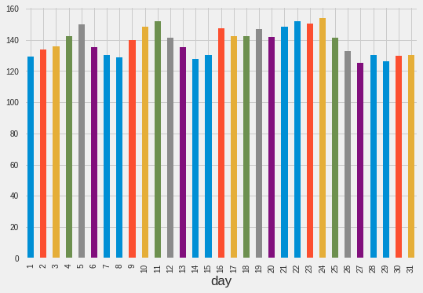

[](http://rpi.analyticsdojo.com)
<center><h1> Time Series Data</h1></center>
<center><h3><a href = 'http://rpi.analyticsdojo.com'>rpi.analyticsdojo.com</a></h3></center>


<div markdown="1" class="cell code_cell">
<div class="input_area" markdown="1">
```python
!pwd

```
</div>

<div class="output_wrapper" markdown="1">
<div class="output_subarea" markdown="1">
{:.output_stream}
```
/Users/jasonkuruzovich/githubdesktop/0_class/spring2019-materials/09-intro-timeseries
```
</div>
</div>
</div>


<div markdown="1" class="cell code_cell">
<div class="input_area" markdown="1">
```python
#Load pandas 
import pandas as pd
#Set urls
url_train = 'https://raw.githubusercontent.com/llSourcell/Time_Series_Prediction/master/Train_SU63ISt.csv'
url_test= 'https://raw.githubusercontent.com/llSourcell/Time_Series_Prediction/master/Test_0qrQsBZ.csv'
#Pandas can now load urls directly. No more wget. 
train = pd.read_csv(url_train)
test = pd.read_csv(url_test)

```
</div>

</div>


Code adopted from https://github.com/llSourcell/Time_Series_Prediction/blob/master/Time%20Series.ipynb


<div markdown="1" class="cell code_cell">
<div class="input_area" markdown="1">
```python
#Load pandas 
import pandas as pd
#Set urls
url_train = 'https://raw.githubusercontent.com/llSourcell/Time_Series_Prediction/master/Train_SU63ISt.csv'
url_test= 'https://raw.githubusercontent.com/llSourcell/Time_Series_Prediction/master/Test_0qrQsBZ.csv'
#Pandas can now load urls directly. No more wget. 
train = pd.read_csv(url_train)
test = pd.read_csv(url_test)

```
</div>

</div>


<div markdown="1" class="cell code_cell">
<div class="input_area" markdown="1">
```python
import numpy as np
import matplotlib.pyplot as plt
from datetime import datetime
from pandas import Series
import warnings
warnings.filterwarnings("ignore")
plt.style.use('fivethirtyeight')

```
</div>

</div>


<div markdown="1" class="cell code_cell">
<div class="input_area" markdown="1">
```python
train.head(5)
 


```
</div>

<div class="output_wrapper" markdown="1">
<div class="output_subarea" markdown="1">


<div markdown="0" class="output output_html">
<div>
<style scoped>
    .dataframe tbody tr th:only-of-type {
        vertical-align: middle;
    }

    .dataframe tbody tr th {
        vertical-align: top;
    }

    .dataframe thead th {
        text-align: right;
    }
</style>
<table border="1" class="dataframe">
  <thead>
    <tr style="text-align: right;">
      <th></th>
      <th>ID</th>
      <th>Datetime</th>
      <th>Count</th>
    </tr>
  </thead>
  <tbody>
    <tr>
      <th>0</th>
      <td>0</td>
      <td>25-08-2012 00:00</td>
      <td>8</td>
    </tr>
    <tr>
      <th>1</th>
      <td>1</td>
      <td>25-08-2012 01:00</td>
      <td>2</td>
    </tr>
    <tr>
      <th>2</th>
      <td>2</td>
      <td>25-08-2012 02:00</td>
      <td>6</td>
    </tr>
    <tr>
      <th>3</th>
      <td>3</td>
      <td>25-08-2012 03:00</td>
      <td>2</td>
    </tr>
    <tr>
      <th>4</th>
      <td>4</td>
      <td>25-08-2012 04:00</td>
      <td>2</td>
    </tr>
  </tbody>
</table>
</div>
</div>


</div>
</div>
</div>


<div markdown="1" class="cell code_cell">
<div class="input_area" markdown="1">
```python
train.shape

```
</div>

<div class="output_wrapper" markdown="1">
<div class="output_subarea" markdown="1">


{:.output_data_text}
```
(18288, 3)
```


</div>
</div>
</div>


<div markdown="1" class="cell code_cell">
<div class="input_area" markdown="1">
```python
test.head(5)

```
</div>

<div class="output_wrapper" markdown="1">
<div class="output_subarea" markdown="1">


<div markdown="0" class="output output_html">
<div>
<style scoped>
    .dataframe tbody tr th:only-of-type {
        vertical-align: middle;
    }

    .dataframe tbody tr th {
        vertical-align: top;
    }

    .dataframe thead th {
        text-align: right;
    }
</style>
<table border="1" class="dataframe">
  <thead>
    <tr style="text-align: right;">
      <th></th>
      <th>ID</th>
      <th>Datetime</th>
    </tr>
  </thead>
  <tbody>
    <tr>
      <th>0</th>
      <td>18288</td>
      <td>26-09-2014 00:00</td>
    </tr>
    <tr>
      <th>1</th>
      <td>18289</td>
      <td>26-09-2014 01:00</td>
    </tr>
    <tr>
      <th>2</th>
      <td>18290</td>
      <td>26-09-2014 02:00</td>
    </tr>
    <tr>
      <th>3</th>
      <td>18291</td>
      <td>26-09-2014 03:00</td>
    </tr>
    <tr>
      <th>4</th>
      <td>18292</td>
      <td>26-09-2014 04:00</td>
    </tr>
  </tbody>
</table>
</div>
</div>


</div>
</div>
</div>


<div markdown="1" class="cell code_cell">
<div class="input_area" markdown="1">
```python
test.shape

```
</div>

<div class="output_wrapper" markdown="1">
<div class="output_subarea" markdown="1">


{:.output_data_text}
```
(5112, 2)
```


</div>
</div>
</div>


***Set Column to Datetime***

To have a time series data, we need to tell pandas that we have a specific column with the date and time.  While we have named it datetime, we have to take the further step of updateing it. 


<div markdown="1" class="cell code_cell">
<div class="input_area" markdown="1">
```python
#Let's look at the data. Note a slightly different way to find data type.
print(train['Datetime'][0], "Data Type:", train.Datetime.dtypes)

```
</div>

<div class="output_wrapper" markdown="1">
<div class="output_subarea" markdown="1">
{:.output_stream}
```
25-08-2012 00:00 Data Type: object
```
</div>
</div>
</div>


<div markdown="1" class="cell code_cell">
<div class="input_area" markdown="1">
```python
#Update to Datetime
train['Datetime'] = pd.to_datetime(train.Datetime, format = '%d-%m-%Y %H:%M')
test['Datetime'] = pd.to_datetime(test.Datetime, format = '%d-%m-%Y %H:%M')


```
</div>

</div>


<div markdown="1" class="cell code_cell">
<div class="input_area" markdown="1">
```python
#Let's look at the data
print(train['Datetime'][0], "Data Type:", train.Datetime.dtypes)

```
</div>

<div class="output_wrapper" markdown="1">
<div class="output_subarea" markdown="1">
{:.output_stream}
```
2012-08-25 00:00:00 Data Type: datetime64[ns]
```
</div>
</div>
</div>


### Dates are full of Features
- We can extract numerous features out of our data. 
- Examples. Year, Month, Day, Hour, Day of Week, Weekend, etc.


<div markdown="1" class="cell code_cell">
<div class="input_area" markdown="1">
```python
#Performing operations on multiple data frames.
for i in (train, test):
    i['year'] = i.Datetime.dt.year
    i['month'] = i.Datetime.dt.month
    i['day']= i.Datetime.dt.day
    i['hour']=i.Datetime.dt.hour

```
</div>

</div>


<div markdown="1" class="cell code_cell">
<div class="input_area" markdown="1">
```python
#Now let's get the day of the week using datetime. 
train['day_of_week'] = train['Datetime'].dt.dayofweek
temp = train['Datetime']


```
</div>

</div>


<div markdown="1" class="cell code_cell">
<div class="input_area" markdown="1">
```python
#Is it a weekend?
def is_weekend(day):
    if day.dayofweek == 5 or day.dayofweek == 6:
        return 1
    else:
        return 0
      
train['weekend'] = train['Datetime'].apply(is_weekend)
train.head(5)


```
</div>

<div class="output_wrapper" markdown="1">
<div class="output_subarea" markdown="1">


<div markdown="0" class="output output_html">
<div>
<style scoped>
    .dataframe tbody tr th:only-of-type {
        vertical-align: middle;
    }

    .dataframe tbody tr th {
        vertical-align: top;
    }

    .dataframe thead th {
        text-align: right;
    }
</style>
<table border="1" class="dataframe">
  <thead>
    <tr style="text-align: right;">
      <th></th>
      <th>ID</th>
      <th>Datetime</th>
      <th>Count</th>
      <th>year</th>
      <th>month</th>
      <th>day</th>
      <th>hour</th>
      <th>day_of_week</th>
      <th>weekend</th>
    </tr>
  </thead>
  <tbody>
    <tr>
      <th>0</th>
      <td>0</td>
      <td>2012-08-25 00:00:00</td>
      <td>8</td>
      <td>2012</td>
      <td>8</td>
      <td>25</td>
      <td>0</td>
      <td>5</td>
      <td>1</td>
    </tr>
    <tr>
      <th>1</th>
      <td>1</td>
      <td>2012-08-25 01:00:00</td>
      <td>2</td>
      <td>2012</td>
      <td>8</td>
      <td>25</td>
      <td>1</td>
      <td>5</td>
      <td>1</td>
    </tr>
    <tr>
      <th>2</th>
      <td>2</td>
      <td>2012-08-25 02:00:00</td>
      <td>6</td>
      <td>2012</td>
      <td>8</td>
      <td>25</td>
      <td>2</td>
      <td>5</td>
      <td>1</td>
    </tr>
    <tr>
      <th>3</th>
      <td>3</td>
      <td>2012-08-25 03:00:00</td>
      <td>2</td>
      <td>2012</td>
      <td>8</td>
      <td>25</td>
      <td>3</td>
      <td>5</td>
      <td>1</td>
    </tr>
    <tr>
      <th>4</th>
      <td>4</td>
      <td>2012-08-25 04:00:00</td>
      <td>2</td>
      <td>2012</td>
      <td>8</td>
      <td>25</td>
      <td>4</td>
      <td>5</td>
      <td>1</td>
    </tr>
  </tbody>
</table>
</div>
</div>


</div>
</div>
</div>


### Plot Value (Count) vs Time
This will plot the entire range.


<div markdown="1" class="cell code_cell">
<div class="input_area" markdown="1">
```python
train.index = train['Datetime']
df = train.drop('ID',1)
ts = df['Count']
plt.figure(figsize = (16,8))
plt.plot(ts)
plt.title("Time Series")
plt.xlabel("Time (year-month)")
plt.ylabel("Passenger Count")
plt.legend(loc = 'best')

```
</div>

<div class="output_wrapper" markdown="1">
<div class="output_subarea" markdown="1">


{:.output_data_text}
```
<matplotlib.legend.Legend at 0x7fe98acaab70>
```


</div>
</div>
<div class="output_wrapper" markdown="1">
<div class="output_subarea" markdown="1">

{:.output_png}


</div>
</div>
</div>


*** Exploratory Analysis***
- This indicates the value for the mean level of the count for each year. 


<div markdown="1" class="cell code_cell">
<div class="input_area" markdown="1">
```python
train.groupby('year')['Count'].mean().plot.bar()

```
</div>

<div class="output_wrapper" markdown="1">
<div class="output_subarea" markdown="1">


{:.output_data_text}
```
<matplotlib.axes._subplots.AxesSubplot at 0x7fe98b314e10>
```


</div>
</div>
<div class="output_wrapper" markdown="1">
<div class="output_subarea" markdown="1">

{:.output_png}


</div>
</div>
</div>


<div markdown="1" class="cell code_cell">
<div class="input_area" markdown="1">
```python
train.groupby('month')['Count'].mean().plot.bar()

```
</div>

<div class="output_wrapper" markdown="1">
<div class="output_subarea" markdown="1">


{:.output_data_text}
```
<matplotlib.axes._subplots.AxesSubplot at 0x7fe988c06080>
```


</div>
</div>
<div class="output_wrapper" markdown="1">
<div class="output_subarea" markdown="1">

{:.output_png}


</div>
</div>
</div>


<div markdown="1" class="cell code_cell">
<div class="input_area" markdown="1">
```python
temp = train.groupby(['year', 'month'])['Count'].mean()
temp.plot(figsize =(15,5), title = "Passenger Count(Monthwise)", fontsize = 14)

```
</div>

<div class="output_wrapper" markdown="1">
<div class="output_subarea" markdown="1">


{:.output_data_text}
```
<matplotlib.axes._subplots.AxesSubplot at 0x7fe98ad50c50>
```


</div>
</div>
<div class="output_wrapper" markdown="1">
<div class="output_subarea" markdown="1">

{:.output_png}


</div>
</div>
</div>


<div markdown="1" class="cell code_cell">
<div class="input_area" markdown="1">
```python
train.groupby('day') ['Count'].mean().plot.bar()

```
</div>

<div class="output_wrapper" markdown="1">
<div class="output_subarea" markdown="1">


{:.output_data_text}
```
<matplotlib.axes._subplots.AxesSubplot at 0x7fe988afc9e8>
```


</div>
</div>
<div class="output_wrapper" markdown="1">
<div class="output_subarea" markdown="1">

{:.output_png}


</div>
</div>
</div>


<div markdown="1" class="cell code_cell">
<div class="input_area" markdown="1">
```python
train.groupby('hour')['Count'].mean().plot.bar()

```
</div>

<div class="output_wrapper" markdown="1">
<div class="output_subarea" markdown="1">


{:.output_data_text}
```
<matplotlib.axes._subplots.AxesSubplot at 0x7fe988b887b8>
```


</div>
</div>
<div class="output_wrapper" markdown="1">
<div class="output_subarea" markdown="1">

{:.output_png}


</div>
</div>
</div>


<div markdown="1" class="cell code_cell">
<div class="input_area" markdown="1">
```python
train.groupby('weekend') ['Count'].mean().plot.bar()

```
</div>

<div class="output_wrapper" markdown="1">
<div class="output_subarea" markdown="1">


{:.output_data_text}
```
<matplotlib.axes._subplots.AxesSubplot at 0x7fe9889bb7f0>
```


</div>
</div>
<div class="output_wrapper" markdown="1">
<div class="output_subarea" markdown="1">

{:.output_png}


</div>
</div>
</div>


<div markdown="1" class="cell code_cell">
<div class="input_area" markdown="1">
```python
train.groupby('day_of_week') ['Count'].mean().plot.bar()

```
</div>

<div class="output_wrapper" markdown="1">
<div class="output_subarea" markdown="1">


{:.output_data_text}
```
<matplotlib.axes._subplots.AxesSubplot at 0x7fe988900390>
```


</div>
</div>
<div class="output_wrapper" markdown="1">
<div class="output_subarea" markdown="1">

{:.output_png}


</div>
</div>
</div>


# Resample data
Convenience method for frequency conversion and resampling of time series  Often you don't want to have the same 


<div markdown="1" class="cell code_cell">
<div class="input_area" markdown="1">
```python
train.Timestamp = pd.to_datetime(train.Datetime, format = '%d-%m-%y %H:%M')
#Here we need to set the index to a timestamp
train.index = train.Timestamp

#Hourly
hourly = train.resample('H').mean()

#Daily
daily = train.resample('D').mean()

#Weekly
weekly = train.resample('W').mean()

#Monthly
monthly = train.resample('M').mean()

```
</div>

</div>


<div markdown="1" class="cell code_cell">
<div class="input_area" markdown="1">
```python
hourly.head(5)

```
</div>

<div class="output_wrapper" markdown="1">
<div class="output_subarea" markdown="1">


<div markdown="0" class="output output_html">
<div>
<style scoped>
    .dataframe tbody tr th:only-of-type {
        vertical-align: middle;
    }

    .dataframe tbody tr th {
        vertical-align: top;
    }

    .dataframe thead th {
        text-align: right;
    }
</style>
<table border="1" class="dataframe">
  <thead>
    <tr style="text-align: right;">
      <th></th>
      <th>ID</th>
      <th>Count</th>
      <th>year</th>
      <th>month</th>
      <th>day</th>
      <th>hour</th>
      <th>day_of_week</th>
      <th>weekend</th>
    </tr>
    <tr>
      <th>Datetime</th>
      <th></th>
      <th></th>
      <th></th>
      <th></th>
      <th></th>
      <th></th>
      <th></th>
      <th></th>
    </tr>
  </thead>
  <tbody>
    <tr>
      <th>2012-08-25 00:00:00</th>
      <td>0</td>
      <td>8</td>
      <td>2012</td>
      <td>8</td>
      <td>25</td>
      <td>0</td>
      <td>5</td>
      <td>1</td>
    </tr>
    <tr>
      <th>2012-08-25 01:00:00</th>
      <td>1</td>
      <td>2</td>
      <td>2012</td>
      <td>8</td>
      <td>25</td>
      <td>1</td>
      <td>5</td>
      <td>1</td>
    </tr>
    <tr>
      <th>2012-08-25 02:00:00</th>
      <td>2</td>
      <td>6</td>
      <td>2012</td>
      <td>8</td>
      <td>25</td>
      <td>2</td>
      <td>5</td>
      <td>1</td>
    </tr>
    <tr>
      <th>2012-08-25 03:00:00</th>
      <td>3</td>
      <td>2</td>
      <td>2012</td>
      <td>8</td>
      <td>25</td>
      <td>3</td>
      <td>5</td>
      <td>1</td>
    </tr>
    <tr>
      <th>2012-08-25 04:00:00</th>
      <td>4</td>
      <td>2</td>
      <td>2012</td>
      <td>8</td>
      <td>25</td>
      <td>4</td>
      <td>5</td>
      <td>1</td>
    </tr>
  </tbody>
</table>
</div>
</div>


</div>
</div>
</div>


<div markdown="1" class="cell code_cell">
<div class="input_area" markdown="1">
```python
monthly.head(5)

```
</div>

<div class="output_wrapper" markdown="1">
<div class="output_subarea" markdown="1">


<div markdown="0" class="output output_html">
<div>
<style scoped>
    .dataframe tbody tr th:only-of-type {
        vertical-align: middle;
    }

    .dataframe tbody tr th {
        vertical-align: top;
    }

    .dataframe thead th {
        text-align: right;
    }
</style>
<table border="1" class="dataframe">
  <thead>
    <tr style="text-align: right;">
      <th></th>
      <th>ID</th>
      <th>Count</th>
      <th>year</th>
      <th>month</th>
      <th>day</th>
      <th>hour</th>
      <th>day_of_week</th>
      <th>weekend</th>
    </tr>
    <tr>
      <th>Datetime</th>
      <th></th>
      <th></th>
      <th></th>
      <th></th>
      <th></th>
      <th></th>
      <th></th>
      <th></th>
    </tr>
  </thead>
  <tbody>
    <tr>
      <th>2012-08-31</th>
      <td>83.5</td>
      <td>2.952381</td>
      <td>2012.0</td>
      <td>8.0</td>
      <td>28.0</td>
      <td>11.5</td>
      <td>3.000000</td>
      <td>0.285714</td>
    </tr>
    <tr>
      <th>2012-09-30</th>
      <td>527.5</td>
      <td>4.444444</td>
      <td>2012.0</td>
      <td>9.0</td>
      <td>15.5</td>
      <td>11.5</td>
      <td>3.166667</td>
      <td>0.333333</td>
    </tr>
    <tr>
      <th>2012-10-31</th>
      <td>1259.5</td>
      <td>10.986559</td>
      <td>2012.0</td>
      <td>10.0</td>
      <td>16.0</td>
      <td>11.5</td>
      <td>2.806452</td>
      <td>0.258065</td>
    </tr>
    <tr>
      <th>2012-11-30</th>
      <td>1991.5</td>
      <td>15.827778</td>
      <td>2012.0</td>
      <td>11.0</td>
      <td>15.5</td>
      <td>11.5</td>
      <td>3.033333</td>
      <td>0.266667</td>
    </tr>
    <tr>
      <th>2012-12-31</th>
      <td>2723.5</td>
      <td>15.680108</td>
      <td>2012.0</td>
      <td>12.0</td>
      <td>16.0</td>
      <td>11.5</td>
      <td>3.064516</td>
      <td>0.322581</td>
    </tr>
  </tbody>
</table>
</div>
</div>


</div>
</div>
</div>


<div markdown="1" class="cell code_cell">
<div class="input_area" markdown="1">
```python
#Plots...notice the variablity.
fig,axs = plt.subplots(4,1)

hourly.Count.plot(figsize = (15,8), title = "Hourly", fontsize = 14, ax = axs[0])
daily.Count.plot(figsize = (15,8), title = "Daily", fontsize = 14, ax = axs[1])
weekly.Count.plot(figsize = (15,8), title = "Weekly", fontsize = 14, ax = axs[2])
monthly.Count.plot(figsize = (15,8), title = "Monthly", fontsize = 14, ax = axs[3])

```
</div>

<div class="output_wrapper" markdown="1">
<div class="output_subarea" markdown="1">


{:.output_data_text}
```
<matplotlib.axes._subplots.AxesSubplot at 0x7fe988819be0>
```


</div>
</div>
<div class="output_wrapper" markdown="1">
<div class="output_subarea" markdown="1">

{:.output_png}


</div>
</div>
</div>


<div markdown="1" class="cell code_cell">
<div class="input_area" markdown="1">
```python
test.Timestamp = pd.to_datetime(test.Datetime, format='%d-%m-%Y %H:%M')
test.index = test.Timestamp

#Converting to Daily mean 
test = test.resample('D').mean()

train.Timestamp = pd.to_datetime(train.Datetime, format='%d-%m-%Y %H:%M')
train.index = train.Timestamp

#Converting to Daily mean
train = train.resample('D').mean()

```
</div>

</div>


***Divide data into training and validation***
-A key aspect of what you use for training data is what time periods are selected.  
- You can't just select a random sample, but need to split by a specific time. 


<div markdown="1" class="cell code_cell">
<div class="input_area" markdown="1">
```python
Train = train.ix['2012-08-25':'2014-06-24']
valid = train.ix['2014-06-25':'2014-09-25']
Train.shape,valid.shape

```
</div>

<div class="output_wrapper" markdown="1">
<div class="output_subarea" markdown="1">


{:.output_data_text}
```
((669, 8), (93, 8))
```


</div>
</div>
</div>


<div markdown="1" class="cell code_cell">
<div class="input_area" markdown="1">
```python
Train.Count.plot(figsize = (15,8), title = 'Daily Ridership', fontsize = 14, label = 'Train')
valid.Count.plot(figsize = (15,8), title = 'Daily Ridership', fontsize =14, label = 'Valid')
plt.xlabel('Datetime')
plt.ylabel('Passenger Count')
plt.legend(loc = 'best')

```
</div>

<div class="output_wrapper" markdown="1">
<div class="output_subarea" markdown="1">


{:.output_data_text}
```
<matplotlib.legend.Legend at 0x7fe9889794e0>
```


</div>
</div>
<div class="output_wrapper" markdown="1">
<div class="output_subarea" markdown="1">

{:.output_png}


</div>
</div>
</div>


** Naive Approach**
- For the Naive model, we will just include the most recent value as our preduction for the rest of the training set. 


<div markdown="1" class="cell code_cell">
<div class="input_area" markdown="1">
```python
dd = np.asarray(Train.Count)
y_hat =valid.copy()
y_hat['naive']= dd[len(dd)- 1] #this just selects the last value. 
plt.figure(figsize = (12,8))
plt.plot(Train.index, Train['Count'],label = 'Train')
plt.plot(valid.index, valid['Count'], label = 'Validation')
plt.plot(y_hat.index, y_hat['naive'],  label = 'Naive')
plt.legend(loc = 'best')
plt.title('Naive Forecast')

```
</div>

<div class="output_wrapper" markdown="1">
<div class="output_subarea" markdown="1">


{:.output_data_text}
```
Text(0.5, 1.0, 'Naive Forecast')
```


</div>
</div>
<div class="output_wrapper" markdown="1">
<div class="output_subarea" markdown="1">

{:.output_png}


</div>
</div>
</div>


*** Calculate RMS Error for Naive Approach***


<div markdown="1" class="cell code_cell">
<div class="input_area" markdown="1">
```python
from sklearn.metrics import mean_squared_error
from math import sqrt
rmse = sqrt(mean_squared_error(valid.Count, y_hat.naive))
rmse

```
</div>

<div class="output_wrapper" markdown="1">
<div class="output_subarea" markdown="1">


{:.output_data_text}
```
111.79050467496724
```


</div>
</div>
</div>


Moving Average Approach and Calculate RMS Error for Moving Average Approach
- It is also possible to forcast based on a "rolling" window
- This will create a smoothing effect 


<div markdown="1" class="cell code_cell">
<div class="input_area" markdown="1">
```python
y_hat_avg = valid.copy()
y_hat_avg['moving_average_forecast'] = Train['Count'].rolling(10).mean().iloc[-1]
plt.figure(figsize = (15,5))
plt.plot(Train['Count'], label = 'Train')
plt.plot(valid['Count'], label = 'Validation')
plt.plot(y_hat_avg['moving_average_forecast'], label = 'Moving Average Forecast with 10 Observations')
plt.legend(loc = 'best')
plt.show()
rmse = sqrt(mean_squared_error(valid['Count'], y_hat_avg['moving_average_forecast']))
rmse


```
</div>

<div class="output_wrapper" markdown="1">
<div class="output_subarea" markdown="1">

{:.output_png}


</div>
</div>
<div class="output_wrapper" markdown="1">
<div class="output_subarea" markdown="1">


{:.output_data_text}
```
134.23733308950264
```


</div>
</div>
</div>


<div markdown="1" class="cell code_cell">
<div class="input_area" markdown="1">
```python
y_hat_avg = valid.copy()
y_hat_avg['moving_average_forecast'] = Train['Count'].rolling(20).mean().iloc[-1]
plt.figure(figsize = (15,5))
plt.plot(Train['Count'], label = 'Train')
plt.plot(valid['Count'], label = 'Validation')
plt.plot(y_hat_avg['moving_average_forecast'],label = 'Moving Average Forecast with 20 Observations')
plt.legend(loc = 'best')
plt.show()
rmse = sqrt(mean_squared_error(valid['Count'], y_hat_avg['moving_average_forecast']))
rmse


```
</div>

<div class="output_wrapper" markdown="1">
<div class="output_subarea" markdown="1">

{:.output_png}


</div>
</div>
<div class="output_wrapper" markdown="1">
<div class="output_subarea" markdown="1">


{:.output_data_text}
```
130.44984977550422
```


</div>
</div>
</div>


<div markdown="1" class="cell code_cell">
<div class="input_area" markdown="1">
```python
y_hat_avg = valid.copy()
y_hat_avg['moving_average_forecast']= Train['Count'].rolling(50).mean().iloc[-1]
plt.figure(figsize = (15,5))
plt.plot(Train['Count'], label = 'Train')
plt.plot(valid['Count'], label = 'Validation')
plt.plot(y_hat_avg['moving_average_forecast'], label = "Moving Average Forecast with 50 Observations")
plt.legend(loc = 'best')
plt.show()
rmse = sqrt(mean_squared_error(valid['Count'], y_hat_avg['moving_average_forecast']))
rmse

```
</div>

<div class="output_wrapper" markdown="1">
<div class="output_subarea" markdown="1">

{:.output_png}


</div>
</div>
<div class="output_wrapper" markdown="1">
<div class="output_subarea" markdown="1">


{:.output_data_text}
```
144.19175679986802
```


</div>
</div>
</div>

