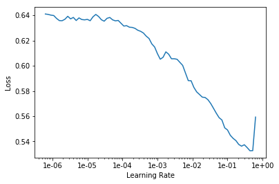

[](http://rpi.analyticsdojo.com)
<center><h1>Fastai - Revisiting Titanic</h1></center>
<center><h3><a href = 'http://rpi.analyticsdojo.com'>rpi.analyticsdojo.com</a></h3></center>


<div markdown="1" class="cell code_cell">
<div class="input_area" markdown="1">
```python
from fastai import *
from fastai.tabular import * 
import numpy as np
import pandas as pd
import pandas as pd

train= pd.read_csv('https://raw.githubusercontent.com/rpi-techfundamentals/fall2018-materials/master/input/train.csv')
test = pd.read_csv('https://raw.githubusercontent.com/rpi-techfundamentals/fall2018-materials/master/input/test.csv')


```
</div>

</div>


<div markdown="1" class="cell code_cell">
<div class="input_area" markdown="1">
```python
#Create a categorical variable from the family count 
def family(x):
    if x < 2:
        return 'Single'
    elif x == 2:
        return 'Couple'
    elif x <= 4:
        return 'InterM'
    else:
        return 'Large'


for df in [train, test]:
    df['Title'] = df['Name'].str.split(',').str[1].str.split(' ').str[1]
    df['Title'] = df['Title'].replace(['Lady', 'the Countess', 'Countess', 'Capt', 'Col', 'Don', 'Dr', 'Major', 'Rev', 'Sir', 'Jonkheer', 'Dona', 'Ms', 'Mme', 'Mlle'], 'Rare')
    df['Age']=df['Age'].fillna(df['Age'].median())
    df['Fare']=df['Fare'].fillna(df['Fare'].median())
    df['Embarked']=df['Embarked'].fillna('S')
    df['NameLength'] = df['Name'].map(lambda x: len(x))
    df['FamilyS'] = df['SibSp'] + df['Parch'] + 1
    df['FamilyS'] = df['FamilyS'].apply(family)
train.isnull().sum(axis = 0)


```
</div>

<div class="output_wrapper" markdown="1">
<div class="output_subarea" markdown="1">


{:.output_data_text}
```
PassengerId      0
Survived         0
Pclass           0
Name             0
Sex              0
Age              0
SibSp            0
Parch            0
Ticket           0
Fare             0
Cabin          687
Embarked         0
Title            0
NameLength       0
FamilyS          0
dtype: int64
```


</div>
</div>
</div>


<div markdown="1" class="cell code_cell">
<div class="input_area" markdown="1">
```python
train.head()

```
</div>

<div class="output_wrapper" markdown="1">
<div class="output_subarea" markdown="1">


<div markdown="0" class="output output_html">
<div>
<style scoped>
    .dataframe tbody tr th:only-of-type {
        vertical-align: middle;
    }

    .dataframe tbody tr th {
        vertical-align: top;
    }

    .dataframe thead th {
        text-align: right;
    }
</style>
<table border="1" class="dataframe">
  <thead>
    <tr style="text-align: right;">
      <th></th>
      <th>PassengerId</th>
      <th>Survived</th>
      <th>Pclass</th>
      <th>Name</th>
      <th>Sex</th>
      <th>Age</th>
      <th>SibSp</th>
      <th>Parch</th>
      <th>Ticket</th>
      <th>Fare</th>
      <th>Cabin</th>
      <th>Embarked</th>
      <th>Title</th>
      <th>NameLength</th>
      <th>FamilyS</th>
    </tr>
  </thead>
  <tbody>
    <tr>
      <th>0</th>
      <td>1</td>
      <td>0</td>
      <td>3</td>
      <td>Braund, Mr. Owen Harris</td>
      <td>male</td>
      <td>22.0</td>
      <td>1</td>
      <td>0</td>
      <td>A/5 21171</td>
      <td>7.2500</td>
      <td>NaN</td>
      <td>S</td>
      <td>Mr.</td>
      <td>23</td>
      <td>Couple</td>
    </tr>
    <tr>
      <th>1</th>
      <td>2</td>
      <td>1</td>
      <td>1</td>
      <td>Cumings, Mrs. John Bradley (Florence Briggs Th...</td>
      <td>female</td>
      <td>38.0</td>
      <td>1</td>
      <td>0</td>
      <td>PC 17599</td>
      <td>71.2833</td>
      <td>C85</td>
      <td>C</td>
      <td>Mrs.</td>
      <td>51</td>
      <td>Couple</td>
    </tr>
    <tr>
      <th>2</th>
      <td>3</td>
      <td>1</td>
      <td>3</td>
      <td>Heikkinen, Miss. Laina</td>
      <td>female</td>
      <td>26.0</td>
      <td>0</td>
      <td>0</td>
      <td>STON/O2. 3101282</td>
      <td>7.9250</td>
      <td>NaN</td>
      <td>S</td>
      <td>Miss.</td>
      <td>22</td>
      <td>Single</td>
    </tr>
    <tr>
      <th>3</th>
      <td>4</td>
      <td>1</td>
      <td>1</td>
      <td>Futrelle, Mrs. Jacques Heath (Lily May Peel)</td>
      <td>female</td>
      <td>35.0</td>
      <td>1</td>
      <td>0</td>
      <td>113803</td>
      <td>53.1000</td>
      <td>C123</td>
      <td>S</td>
      <td>Mrs.</td>
      <td>44</td>
      <td>Couple</td>
    </tr>
    <tr>
      <th>4</th>
      <td>5</td>
      <td>0</td>
      <td>3</td>
      <td>Allen, Mr. William Henry</td>
      <td>male</td>
      <td>35.0</td>
      <td>0</td>
      <td>0</td>
      <td>373450</td>
      <td>8.0500</td>
      <td>NaN</td>
      <td>S</td>
      <td>Mr.</td>
      <td>24</td>
      <td>Single</td>
    </tr>
  </tbody>
</table>
</div>
</div>


</div>
</div>
</div>


<div markdown="1" class="cell code_cell">
<div class="input_area" markdown="1">
```python
dep_var = 'Survived'
cat_names = ['Pclass', 'Sex', 'Embarked', 'Title', 'FamilyS']
cont_names = ['Age', 'Fare', 'SibSp', 'Parch', 'NameLength']
procs = [FillMissing, Categorify, Normalize]
test_data = (TabularList.from_df(test, path='.', cat_names=cat_names, cont_names=cont_names, procs=procs))


```
</div>

</div>


<div markdown="1" class="cell code_cell">
<div class="input_area" markdown="1">
```python

data = (TabularList.from_df(train, path='.', cat_names=cat_names, cont_names=cont_names, procs=procs)
                           .split_by_idx(list(range(0,200)))
                           .label_from_df(cols=dep_var)
                           .add_test(test_data, label=0)
                           .databunch())

```
</div>

</div>


<div markdown="1" class="cell code_cell">
<div class="input_area" markdown="1">
```python
#Shows the Data
data.show_batch()

```
</div>

<div class="output_wrapper" markdown="1">
<div class="output_subarea" markdown="1">

<div markdown="0" class="output output_html">
<table border="1" class="dataframe">
  <thead>
    <tr style="text-align: right;">
      <th>Pclass</th>
      <th>Sex</th>
      <th>Embarked</th>
      <th>Title</th>
      <th>FamilyS</th>
      <th>Age</th>
      <th>Fare</th>
      <th>SibSp</th>
      <th>Parch</th>
      <th>NameLength</th>
      <th>target</th>
    </tr>
  </thead>
  <tbody>
    <tr>
      <td>2</td>
      <td>male</td>
      <td>S</td>
      <td>Mr.</td>
      <td>Couple</td>
      <td>0.5653</td>
      <td>-0.1432</td>
      <td>0.5043</td>
      <td>-0.4658</td>
      <td>-0.4163</td>
      <td>0</td>
    </tr>
    <tr>
      <td>3</td>
      <td>male</td>
      <td>S</td>
      <td>Mr.</td>
      <td>Single</td>
      <td>-0.3706</td>
      <td>-0.4860</td>
      <td>-0.4610</td>
      <td>-0.4658</td>
      <td>-0.6319</td>
      <td>0</td>
    </tr>
    <tr>
      <td>3</td>
      <td>male</td>
      <td>S</td>
      <td>Mr.</td>
      <td>Single</td>
      <td>-0.1366</td>
      <td>-0.4982</td>
      <td>-0.4610</td>
      <td>-0.4658</td>
      <td>-0.5241</td>
      <td>0</td>
    </tr>
    <tr>
      <td>3</td>
      <td>male</td>
      <td>S</td>
      <td>Mr.</td>
      <td>Single</td>
      <td>3.4510</td>
      <td>-0.4883</td>
      <td>-0.4610</td>
      <td>-0.4658</td>
      <td>-0.8475</td>
      <td>0</td>
    </tr>
    <tr>
      <td>3</td>
      <td>male</td>
      <td>S</td>
      <td>Mr.</td>
      <td>Couple</td>
      <td>-0.9165</td>
      <td>-0.5125</td>
      <td>0.5043</td>
      <td>-0.4658</td>
      <td>-0.2008</td>
      <td>0</td>
    </tr>
  </tbody>
</table>
</div>

</div>
</div>
</div>


<div markdown="1" class="cell code_cell">
<div class="input_area" markdown="1">
```python
#Define our Learner
learn = tabular_learner(data, layers=[300,100], metrics=accuracy)


```
</div>

</div>


<div markdown="1" class="cell code_cell">
<div class="input_area" markdown="1">
```python
learn.lr_find()
learn.recorder.plot()

```
</div>

<div class="output_wrapper" markdown="1">
<div class="output_subarea" markdown="1">

<div markdown="0" class="output output_html">

</div>

</div>
</div>
<div class="output_wrapper" markdown="1">
<div class="output_subarea" markdown="1">
{:.output_stream}
```
LR Finder is complete, type {learner_name}.recorder.plot() to see the graph.
```
</div>
</div>
<div class="output_wrapper" markdown="1">
<div class="output_subarea" markdown="1">

{:.output_png}


</div>
</div>
</div>


<div markdown="1" class="cell code_cell">
<div class="input_area" markdown="1">
```python
#fit the learner
learn.fit(7, 1e-2)  #Number of epocs and the learning rate. learn.save('final_train')

```
</div>

<div class="output_wrapper" markdown="1">
<div class="output_subarea" markdown="1">

<div markdown="0" class="output output_html">
<table border="1" class="dataframe">
  <thead>
    <tr style="text-align: left;">
      <th>epoch</th>
      <th>train_loss</th>
      <th>valid_loss</th>
      <th>accuracy</th>
      <th>time</th>
    </tr>
  </thead>
  <tbody>
    <tr>
      <td>0</td>
      <td>0.544682</td>
      <td>0.566284</td>
      <td>0.740000</td>
      <td>00:00</td>
    </tr>
    <tr>
      <td>1</td>
      <td>0.490425</td>
      <td>0.473522</td>
      <td>0.845000</td>
      <td>00:00</td>
    </tr>
    <tr>
      <td>2</td>
      <td>0.467682</td>
      <td>0.453977</td>
      <td>0.845000</td>
      <td>00:00</td>
    </tr>
    <tr>
      <td>3</td>
      <td>0.448043</td>
      <td>0.414292</td>
      <td>0.830000</td>
      <td>00:00</td>
    </tr>
    <tr>
      <td>4</td>
      <td>0.434118</td>
      <td>0.406961</td>
      <td>0.865000</td>
      <td>00:00</td>
    </tr>
    <tr>
      <td>5</td>
      <td>0.424244</td>
      <td>0.426844</td>
      <td>0.855000</td>
      <td>00:00</td>
    </tr>
    <tr>
      <td>6</td>
      <td>0.413750</td>
      <td>0.411579</td>
      <td>0.845000</td>
      <td>00:00</td>
    </tr>
  </tbody>
</table>
</div>

</div>
</div>
</div>


<div markdown="1" class="cell code_cell">
<div class="input_area" markdown="1">
```python
#Show the results
learn.show_results()

```
</div>

<div class="output_wrapper" markdown="1">
<div class="output_subarea" markdown="1">

<div markdown="0" class="output output_html">
<table border="1" class="dataframe">
  <thead>
    <tr style="text-align: right;">
      <th>Pclass</th>
      <th>Sex</th>
      <th>Embarked</th>
      <th>Title</th>
      <th>FamilyS</th>
      <th>Age</th>
      <th>Fare</th>
      <th>SibSp</th>
      <th>Parch</th>
      <th>NameLength</th>
      <th>target</th>
      <th>prediction</th>
    </tr>
  </thead>
  <tbody>
    <tr>
      <td>3</td>
      <td>male</td>
      <td>S</td>
      <td>Mr.</td>
      <td>Couple</td>
      <td>-0.6046</td>
      <td>-0.4982</td>
      <td>0.5043</td>
      <td>-0.4658</td>
      <td>-0.4163</td>
      <td>0</td>
      <td>0</td>
    </tr>
    <tr>
      <td>1</td>
      <td>female</td>
      <td>C</td>
      <td>Mrs.</td>
      <td>Couple</td>
      <td>0.6433</td>
      <td>0.7144</td>
      <td>0.5043</td>
      <td>-0.4658</td>
      <td>2.6017</td>
      <td>1</td>
      <td>1</td>
    </tr>
    <tr>
      <td>3</td>
      <td>female</td>
      <td>S</td>
      <td>Miss.</td>
      <td>Single</td>
      <td>-0.2926</td>
      <td>-0.4855</td>
      <td>-0.4610</td>
      <td>-0.4658</td>
      <td>-0.5241</td>
      <td>1</td>
      <td>0</td>
    </tr>
    <tr>
      <td>1</td>
      <td>female</td>
      <td>S</td>
      <td>Mrs.</td>
      <td>Couple</td>
      <td>0.4093</td>
      <td>0.3700</td>
      <td>0.5043</td>
      <td>-0.4658</td>
      <td>1.8472</td>
      <td>1</td>
      <td>1</td>
    </tr>
    <tr>
      <td>3</td>
      <td>male</td>
      <td>S</td>
      <td>Mr.</td>
      <td>Single</td>
      <td>0.4093</td>
      <td>-0.4831</td>
      <td>-0.4610</td>
      <td>-0.4658</td>
      <td>-0.3085</td>
      <td>0</td>
      <td>0</td>
    </tr>
  </tbody>
</table>
</div>

</div>
</div>
</div>


<div markdown="1" class="cell code_cell">
<div class="input_area" markdown="1">
```python
#This will get predictions
predictions, *_ = learn.get_preds(DatasetType.Test)
labels = to_np(np.argmax(predictions, 1))
labels.shape


```
</div>

<div class="output_wrapper" markdown="1">
<div class="output_subarea" markdown="1">


{:.output_data_text}
```
(418,)
```


</div>
</div>
</div>


<div markdown="1" class="cell code_cell">
<div class="input_area" markdown="1">
```python
#Writing to File
submission=pd.DataFrame(test.loc[:,['PassengerId']])
submission['Survived']=labels
#Any files you save will be available in the output tab below

submission.to_csv('submission.csv', index=False)

```
</div>

</div>


<div markdown="1" class="cell code_cell">
<div class="input_area" markdown="1">
```python
from google.colab import files
files.download('submission.csv')

```
</div>

</div>

