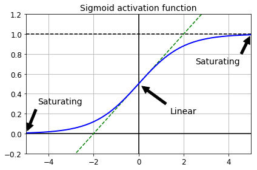
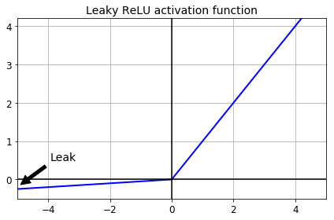
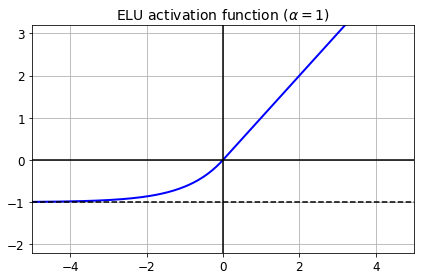
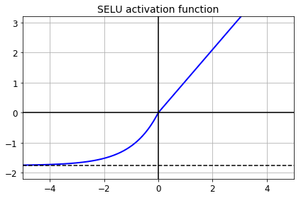
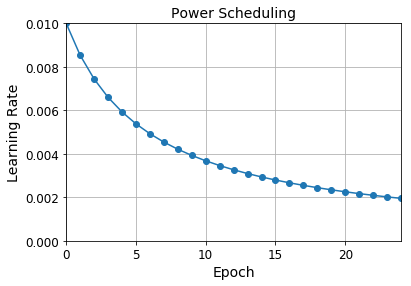
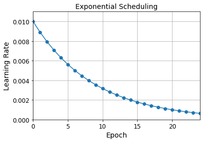
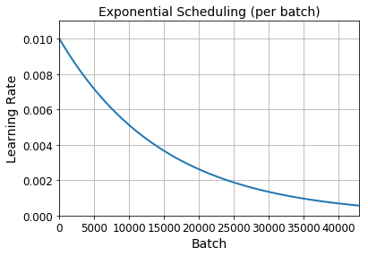
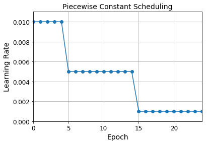
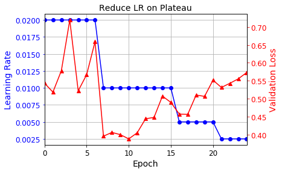
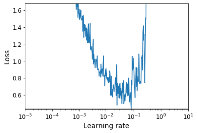

---
redirect_from:
  - "/notebooks/24-tensorflow/11-training-deep-neural-networks"
interact_link: content/notebooks/24-tensorflow/11_training_deep_neural_networks.ipynb
kernel_name: python3
has_widgets: false
title: 'TF-training'
prev_page:
  url: /notebooks/24-tensorflow/10_neural_nets_with_keras.html
  title: 'TF-Keras'
next_page:
  url: /notebooks/24-tensorflow/13_loading_and_preprocessing_data.html
  title: 'TF-data'
comment: "***PROGRAMMATICALLY GENERATED, DO NOT EDIT. SEE ORIGINAL FILES IN /content***"
---


**Chapter 11 – Training Deep Neural Networks**


_This notebook contains all the sample code and solutions to the exercises in chapter 11._


<table align="left">
  <td>
    <a target="_blank" href="https://colab.research.google.com/github/ageron/handson-ml2/blob/master/11_training_deep_neural_networks.ipynb">Run in Google Colab</a>
  </td>
</table>


# Setup


First, let's import a few common modules, ensure MatplotLib plots figures inline and prepare a function to save the figures. We also check that Python 3.5 or later is installed (although Python 2.x may work, it is deprecated so we strongly recommend you use Python 3 instead), as well as Scikit-Learn ≥0.20 and TensorFlow ≥2.0.


<div markdown="1" class="cell code_cell">
<div class="input_area" markdown="1">
```python
# Python ≥3.5 is required
import sys
assert sys.version_info >= (3, 5)

# Scikit-Learn ≥0.20 is required
import sklearn
assert sklearn.__version__ >= "0.20"

try:
    # %tensorflow_version only exists in Colab.
    %tensorflow_version 2.x
except Exception:
    pass

# TensorFlow ≥2.0 is required
import tensorflow as tf
from tensorflow import keras
assert tf.__version__ >= "2.0"

# Common imports
import numpy as np
import os

# to make this notebook's output stable across runs
np.random.seed(42)

# To plot pretty figures
%matplotlib inline
import matplotlib as mpl
import matplotlib.pyplot as plt
mpl.rc('axes', labelsize=14)
mpl.rc('xtick', labelsize=12)
mpl.rc('ytick', labelsize=12)

# Where to save the figures
PROJECT_ROOT_DIR = "."
CHAPTER_ID = "deep"
IMAGES_PATH = os.path.join(PROJECT_ROOT_DIR, "images", CHAPTER_ID)
os.makedirs(IMAGES_PATH, exist_ok=True)

def save_fig(fig_id, tight_layout=True, fig_extension="png", resolution=300):
    path = os.path.join(IMAGES_PATH, fig_id + "." + fig_extension)
    print("Saving figure", fig_id)
    if tight_layout:
        plt.tight_layout()
    plt.savefig(path, format=fig_extension, dpi=resolution)

```
</div>

</div>


# Vanishing/Exploding Gradients Problem


<div markdown="1" class="cell code_cell">
<div class="input_area" markdown="1">
```python
def logit(z):
    return 1 / (1 + np.exp(-z))

```
</div>

</div>


<div markdown="1" class="cell code_cell">
<div class="input_area" markdown="1">
```python
z = np.linspace(-5, 5, 200)

plt.plot([-5, 5], [0, 0], 'k-')
plt.plot([-5, 5], [1, 1], 'k--')
plt.plot([0, 0], [-0.2, 1.2], 'k-')
plt.plot([-5, 5], [-3/4, 7/4], 'g--')
plt.plot(z, logit(z), "b-", linewidth=2)
props = dict(facecolor='black', shrink=0.1)
plt.annotate('Saturating', xytext=(3.5, 0.7), xy=(5, 1), arrowprops=props, fontsize=14, ha="center")
plt.annotate('Saturating', xytext=(-3.5, 0.3), xy=(-5, 0), arrowprops=props, fontsize=14, ha="center")
plt.annotate('Linear', xytext=(2, 0.2), xy=(0, 0.5), arrowprops=props, fontsize=14, ha="center")
plt.grid(True)
plt.title("Sigmoid activation function", fontsize=14)
plt.axis([-5, 5, -0.2, 1.2])

save_fig("sigmoid_saturation_plot")
plt.show()

```
</div>

<div class="output_wrapper" markdown="1">
<div class="output_subarea" markdown="1">
{:.output_stream}
```
Saving figure sigmoid_saturation_plot
```
</div>
</div>
<div class="output_wrapper" markdown="1">
<div class="output_subarea" markdown="1">

{:.output_png}


</div>
</div>
</div>


## Xavier and He Initialization


<div markdown="1" class="cell code_cell">
<div class="input_area" markdown="1">
```python
[name for name in dir(keras.initializers) if not name.startswith("_")]

```
</div>

<div class="output_wrapper" markdown="1">
<div class="output_subarea" markdown="1">


{:.output_data_text}
```
['Constant',
 'GlorotNormal',
 'GlorotUniform',
 'Identity',
 'Initializer',
 'Ones',
 'Orthogonal',
 'RandomNormal',
 'RandomUniform',
 'TruncatedNormal',
 'VarianceScaling',
 'Zeros',
 'constant',
 'deserialize',
 'get',
 'glorot_normal',
 'glorot_uniform',
 'he_normal',
 'he_uniform',
 'identity',
 'lecun_normal',
 'lecun_uniform',
 'ones',
 'orthogonal',
 'serialize',
 'zeros']
```


</div>
</div>
</div>


<div markdown="1" class="cell code_cell">
<div class="input_area" markdown="1">
```python
keras.layers.Dense(10, activation="relu", kernel_initializer="he_normal")

```
</div>

<div class="output_wrapper" markdown="1">
<div class="output_subarea" markdown="1">


{:.output_data_text}
```
<tensorflow.python.keras.layers.core.Dense at 0x1110c82e8>
```


</div>
</div>
</div>


<div markdown="1" class="cell code_cell">
<div class="input_area" markdown="1">
```python
init = keras.initializers.VarianceScaling(scale=2., mode='fan_avg',
                                          distribution='uniform')
keras.layers.Dense(10, activation="relu", kernel_initializer=init)

```
</div>

<div class="output_wrapper" markdown="1">
<div class="output_subarea" markdown="1">


{:.output_data_text}
```
<tensorflow.python.keras.layers.core.Dense at 0x1110adeb8>
```


</div>
</div>
</div>


## Nonsaturating Activation Functions


### Leaky ReLU


<div markdown="1" class="cell code_cell">
<div class="input_area" markdown="1">
```python
def leaky_relu(z, alpha=0.01):
    return np.maximum(alpha*z, z)

```
</div>

</div>


<div markdown="1" class="cell code_cell">
<div class="input_area" markdown="1">
```python
plt.plot(z, leaky_relu(z, 0.05), "b-", linewidth=2)
plt.plot([-5, 5], [0, 0], 'k-')
plt.plot([0, 0], [-0.5, 4.2], 'k-')
plt.grid(True)
props = dict(facecolor='black', shrink=0.1)
plt.annotate('Leak', xytext=(-3.5, 0.5), xy=(-5, -0.2), arrowprops=props, fontsize=14, ha="center")
plt.title("Leaky ReLU activation function", fontsize=14)
plt.axis([-5, 5, -0.5, 4.2])

save_fig("leaky_relu_plot")
plt.show()

```
</div>

<div class="output_wrapper" markdown="1">
<div class="output_subarea" markdown="1">
{:.output_stream}
```
Saving figure leaky_relu_plot
```
</div>
</div>
<div class="output_wrapper" markdown="1">
<div class="output_subarea" markdown="1">

{:.output_png}


</div>
</div>
</div>


<div markdown="1" class="cell code_cell">
<div class="input_area" markdown="1">
```python
[m for m in dir(keras.activations) if not m.startswith("_")]

```
</div>

<div class="output_wrapper" markdown="1">
<div class="output_subarea" markdown="1">


{:.output_data_text}
```
['deserialize',
 'elu',
 'exponential',
 'get',
 'hard_sigmoid',
 'linear',
 'relu',
 'selu',
 'serialize',
 'sigmoid',
 'softmax',
 'softplus',
 'softsign',
 'tanh']
```


</div>
</div>
</div>


<div markdown="1" class="cell code_cell">
<div class="input_area" markdown="1">
```python
[m for m in dir(keras.layers) if "relu" in m.lower()]

```
</div>

<div class="output_wrapper" markdown="1">
<div class="output_subarea" markdown="1">


{:.output_data_text}
```
['LeakyReLU', 'PReLU', 'ReLU', 'ThresholdedReLU']
```


</div>
</div>
</div>


Let's train a neural network on Fashion MNIST using the Leaky ReLU:


<div markdown="1" class="cell code_cell">
<div class="input_area" markdown="1">
```python
(X_train_full, y_train_full), (X_test, y_test) = keras.datasets.fashion_mnist.load_data()
X_train_full = X_train_full / 255.0
X_test = X_test / 255.0
X_valid, X_train = X_train_full[:5000], X_train_full[5000:]
y_valid, y_train = y_train_full[:5000], y_train_full[5000:]

```
</div>

</div>


<div markdown="1" class="cell code_cell">
<div class="input_area" markdown="1">
```python
tf.random.set_seed(42)
np.random.seed(42)

model = keras.models.Sequential([
    keras.layers.Flatten(input_shape=[28, 28]),
    keras.layers.Dense(300, kernel_initializer="he_normal"),
    keras.layers.LeakyReLU(),
    keras.layers.Dense(100, kernel_initializer="he_normal"),
    keras.layers.LeakyReLU(),
    keras.layers.Dense(10, activation="softmax")
])

```
</div>

</div>


<div markdown="1" class="cell code_cell">
<div class="input_area" markdown="1">
```python
model.compile(loss="sparse_categorical_crossentropy",
              optimizer=keras.optimizers.SGD(lr=1e-3),
              metrics=["accuracy"])

```
</div>

</div>


<div markdown="1" class="cell code_cell">
<div class="input_area" markdown="1">
```python
history = model.fit(X_train, y_train, epochs=10,
                    validation_data=(X_valid, y_valid))

```
</div>

<div class="output_wrapper" markdown="1">
<div class="output_subarea" markdown="1">
{:.output_stream}
```
Train on 55000 samples, validate on 5000 samples
Epoch 1/10
55000/55000 [==============================] - 3s 50us/sample - loss: 1.2806 - accuracy: 0.6250 - val_loss: 0.8883 - val_accuracy: 0.7152
Epoch 2/10
55000/55000 [==============================] - 2s 40us/sample - loss: 0.7954 - accuracy: 0.7373 - val_loss: 0.7135 - val_accuracy: 0.7648
Epoch 3/10
55000/55000 [==============================] - 2s 42us/sample - loss: 0.6816 - accuracy: 0.7727 - val_loss: 0.6356 - val_accuracy: 0.7882
Epoch 4/10
55000/55000 [==============================] - 2s 42us/sample - loss: 0.6215 - accuracy: 0.7935 - val_loss: 0.5922 - val_accuracy: 0.8012
Epoch 5/10
55000/55000 [==============================] - 2s 42us/sample - loss: 0.5830 - accuracy: 0.8081 - val_loss: 0.5596 - val_accuracy: 0.8172
Epoch 6/10
55000/55000 [==============================] - 2s 42us/sample - loss: 0.5553 - accuracy: 0.8155 - val_loss: 0.5338 - val_accuracy: 0.8240
Epoch 7/10
55000/55000 [==============================] - 2s 40us/sample - loss: 0.5340 - accuracy: 0.8221 - val_loss: 0.5157 - val_accuracy: 0.8310
Epoch 8/10
55000/55000 [==============================] - 2s 41us/sample - loss: 0.5172 - accuracy: 0.8265 - val_loss: 0.5035 - val_accuracy: 0.8336
Epoch 9/10
55000/55000 [==============================] - 2s 42us/sample - loss: 0.5036 - accuracy: 0.8299 - val_loss: 0.4950 - val_accuracy: 0.8354
Epoch 10/10
55000/55000 [==============================] - 2s 42us/sample - loss: 0.4922 - accuracy: 0.8324 - val_loss: 0.4797 - val_accuracy: 0.8430
```
</div>
</div>
</div>


Now let's try PReLU:


<div markdown="1" class="cell code_cell">
<div class="input_area" markdown="1">
```python
tf.random.set_seed(42)
np.random.seed(42)

model = keras.models.Sequential([
    keras.layers.Flatten(input_shape=[28, 28]),
    keras.layers.Dense(300, kernel_initializer="he_normal"),
    keras.layers.PReLU(),
    keras.layers.Dense(100, kernel_initializer="he_normal"),
    keras.layers.PReLU(),
    keras.layers.Dense(10, activation="softmax")
])

```
</div>

</div>


<div markdown="1" class="cell code_cell">
<div class="input_area" markdown="1">
```python
model.compile(loss="sparse_categorical_crossentropy",
              optimizer=keras.optimizers.SGD(lr=1e-3),
              metrics=["accuracy"])

```
</div>

</div>


<div markdown="1" class="cell code_cell">
<div class="input_area" markdown="1">
```python
history = model.fit(X_train, y_train, epochs=10,
                    validation_data=(X_valid, y_valid))

```
</div>

<div class="output_wrapper" markdown="1">
<div class="output_subarea" markdown="1">
{:.output_stream}
```
Train on 55000 samples, validate on 5000 samples
Epoch 1/10
55000/55000 [==============================] - 3s 61us/sample - loss: 1.3460 - accuracy: 0.6233 - val_loss: 0.9251 - val_accuracy: 0.7208
Epoch 2/10
55000/55000 [==============================] - 3s 56us/sample - loss: 0.8208 - accuracy: 0.7359 - val_loss: 0.7318 - val_accuracy: 0.7626
Epoch 3/10
55000/55000 [==============================] - 3s 55us/sample - loss: 0.6974 - accuracy: 0.7695 - val_loss: 0.6500 - val_accuracy: 0.7886
Epoch 4/10
55000/55000 [==============================] - 3s 55us/sample - loss: 0.6338 - accuracy: 0.7904 - val_loss: 0.6000 - val_accuracy: 0.8070
Epoch 5/10
55000/55000 [==============================] - 3s 57us/sample - loss: 0.5920 - accuracy: 0.8045 - val_loss: 0.5662 - val_accuracy: 0.8172
Epoch 6/10
55000/55000 [==============================] - 3s 55us/sample - loss: 0.5620 - accuracy: 0.8138 - val_loss: 0.5416 - val_accuracy: 0.8230
Epoch 7/10
55000/55000 [==============================] - 3s 55us/sample - loss: 0.5393 - accuracy: 0.8203 - val_loss: 0.5218 - val_accuracy: 0.8302
Epoch 8/10
55000/55000 [==============================] - 3s 57us/sample - loss: 0.5216 - accuracy: 0.8248 - val_loss: 0.5051 - val_accuracy: 0.8340
Epoch 9/10
55000/55000 [==============================] - 3s 59us/sample - loss: 0.5069 - accuracy: 0.8289 - val_loss: 0.4923 - val_accuracy: 0.8384
Epoch 10/10
55000/55000 [==============================] - 3s 62us/sample - loss: 0.4948 - accuracy: 0.8322 - val_loss: 0.4847 - val_accuracy: 0.8372
```
</div>
</div>
</div>


### ELU


<div markdown="1" class="cell code_cell">
<div class="input_area" markdown="1">
```python
def elu(z, alpha=1):
    return np.where(z < 0, alpha * (np.exp(z) - 1), z)

```
</div>

</div>


<div markdown="1" class="cell code_cell">
<div class="input_area" markdown="1">
```python
plt.plot(z, elu(z), "b-", linewidth=2)
plt.plot([-5, 5], [0, 0], 'k-')
plt.plot([-5, 5], [-1, -1], 'k--')
plt.plot([0, 0], [-2.2, 3.2], 'k-')
plt.grid(True)
plt.title(r"ELU activation function ($\alpha=1$)", fontsize=14)
plt.axis([-5, 5, -2.2, 3.2])

save_fig("elu_plot")
plt.show()

```
</div>

<div class="output_wrapper" markdown="1">
<div class="output_subarea" markdown="1">
{:.output_stream}
```
Saving figure elu_plot
```
</div>
</div>
<div class="output_wrapper" markdown="1">
<div class="output_subarea" markdown="1">

{:.output_png}


</div>
</div>
</div>


Implementing ELU in TensorFlow is trivial, just specify the activation function when building each layer:


<div markdown="1" class="cell code_cell">
<div class="input_area" markdown="1">
```python
keras.layers.Dense(10, activation="elu")

```
</div>

<div class="output_wrapper" markdown="1">
<div class="output_subarea" markdown="1">


{:.output_data_text}
```
<tensorflow.python.keras.layers.core.Dense at 0x10dca50f0>
```


</div>
</div>
</div>


### SELU


This activation function was proposed in this [great paper](https://arxiv.org/pdf/1706.02515.pdf) by Günter Klambauer, Thomas Unterthiner and Andreas Mayr, published in June 2017. During training, a neural network composed exclusively of a stack of dense layers using the SELU activation function and LeCun initialization will self-normalize: the output of each layer will tend to preserve the same mean and variance during training, which solves the vanishing/exploding gradients problem. As a result, this activation function outperforms the other activation functions very significantly for such neural nets, so you should really try it out. Unfortunately, the self-normalizing property of the SELU activation function is easily broken: you cannot use ℓ<sub>1</sub> or ℓ<sub>2</sub> regularization, regular dropout, max-norm, skip connections or other non-sequential topologies (so recurrent neural networks won't self-normalize). However, in practice it works quite well with sequential CNNs. If you break self-normalization, SELU will not necessarily outperform other activation functions.


<div markdown="1" class="cell code_cell">
<div class="input_area" markdown="1">
```python
from scipy.special import erfc

# alpha and scale to self normalize with mean 0 and standard deviation 1
# (see equation 14 in the paper):
alpha_0_1 = -np.sqrt(2 / np.pi) / (erfc(1/np.sqrt(2)) * np.exp(1/2) - 1)
scale_0_1 = (1 - erfc(1 / np.sqrt(2)) * np.sqrt(np.e)) * np.sqrt(2 * np.pi) * (2 * erfc(np.sqrt(2))*np.e**2 + np.pi*erfc(1/np.sqrt(2))**2*np.e - 2*(2+np.pi)*erfc(1/np.sqrt(2))*np.sqrt(np.e)+np.pi+2)**(-1/2)

```
</div>

</div>


<div markdown="1" class="cell code_cell">
<div class="input_area" markdown="1">
```python
def selu(z, scale=scale_0_1, alpha=alpha_0_1):
    return scale * elu(z, alpha)

```
</div>

</div>


<div markdown="1" class="cell code_cell">
<div class="input_area" markdown="1">
```python
plt.plot(z, selu(z), "b-", linewidth=2)
plt.plot([-5, 5], [0, 0], 'k-')
plt.plot([-5, 5], [-1.758, -1.758], 'k--')
plt.plot([0, 0], [-2.2, 3.2], 'k-')
plt.grid(True)
plt.title("SELU activation function", fontsize=14)
plt.axis([-5, 5, -2.2, 3.2])

save_fig("selu_plot")
plt.show()

```
</div>

<div class="output_wrapper" markdown="1">
<div class="output_subarea" markdown="1">
{:.output_stream}
```
Saving figure selu_plot
```
</div>
</div>
<div class="output_wrapper" markdown="1">
<div class="output_subarea" markdown="1">

{:.output_png}


</div>
</div>
</div>


By default, the SELU hyperparameters (`scale` and `alpha`) are tuned in such a way that the mean output of each neuron remains close to 0, and the standard deviation remains close to 1 (assuming the inputs are standardized with mean 0 and standard deviation 1 too). Using this activation function, even a 1,000 layer deep neural network preserves roughly mean 0 and standard deviation 1 across all layers, avoiding the exploding/vanishing gradients problem:


<div markdown="1" class="cell code_cell">
<div class="input_area" markdown="1">
```python
np.random.seed(42)
Z = np.random.normal(size=(500, 100)) # standardized inputs
for layer in range(1000):
    W = np.random.normal(size=(100, 100), scale=np.sqrt(1 / 100)) # LeCun initialization
    Z = selu(np.dot(Z, W))
    means = np.mean(Z, axis=0).mean()
    stds = np.std(Z, axis=0).mean()
    if layer % 100 == 0:
        print("Layer {}: mean {:.2f}, std deviation {:.2f}".format(layer, means, stds))

```
</div>

<div class="output_wrapper" markdown="1">
<div class="output_subarea" markdown="1">
{:.output_stream}
```
Layer 0: mean -0.00, std deviation 1.00
Layer 100: mean 0.02, std deviation 0.96
Layer 200: mean 0.01, std deviation 0.90
Layer 300: mean -0.02, std deviation 0.92
Layer 400: mean 0.05, std deviation 0.89
Layer 500: mean 0.01, std deviation 0.93
Layer 600: mean 0.02, std deviation 0.92
Layer 700: mean -0.02, std deviation 0.90
Layer 800: mean 0.05, std deviation 0.83
Layer 900: mean 0.02, std deviation 1.00
```
</div>
</div>
</div>


Using SELU is easy:


<div markdown="1" class="cell code_cell">
<div class="input_area" markdown="1">
```python
keras.layers.Dense(10, activation="selu",
                   kernel_initializer="lecun_normal")

```
</div>

<div class="output_wrapper" markdown="1">
<div class="output_subarea" markdown="1">


{:.output_data_text}
```
<tensorflow.python.keras.layers.core.Dense at 0x158a45630>
```


</div>
</div>
</div>


Let's create a neural net for Fashion MNIST with 100 hidden layers, using the SELU activation function:


<div markdown="1" class="cell code_cell">
<div class="input_area" markdown="1">
```python
np.random.seed(42)
tf.random.set_seed(42)

```
</div>

</div>


<div markdown="1" class="cell code_cell">
<div class="input_area" markdown="1">
```python
model = keras.models.Sequential()
model.add(keras.layers.Flatten(input_shape=[28, 28]))
model.add(keras.layers.Dense(300, activation="selu",
                             kernel_initializer="lecun_normal"))
for layer in range(99):
    model.add(keras.layers.Dense(100, activation="selu",
                                 kernel_initializer="lecun_normal"))
model.add(keras.layers.Dense(10, activation="softmax"))

```
</div>

</div>


<div markdown="1" class="cell code_cell">
<div class="input_area" markdown="1">
```python
model.compile(loss="sparse_categorical_crossentropy",
              optimizer=keras.optimizers.SGD(lr=1e-3),
              metrics=["accuracy"])

```
</div>

</div>


Now let's train it. Do not forget to scale the inputs to mean 0 and standard deviation 1:


<div markdown="1" class="cell code_cell">
<div class="input_area" markdown="1">
```python
pixel_means = X_train.mean(axis=0, keepdims=True)
pixel_stds = X_train.std(axis=0, keepdims=True)
X_train_scaled = (X_train - pixel_means) / pixel_stds
X_valid_scaled = (X_valid - pixel_means) / pixel_stds
X_test_scaled = (X_test - pixel_means) / pixel_stds

```
</div>

</div>


<div markdown="1" class="cell code_cell">
<div class="input_area" markdown="1">
```python
history = model.fit(X_train_scaled, y_train, epochs=5,
                    validation_data=(X_valid_scaled, y_valid))

```
</div>

<div class="output_wrapper" markdown="1">
<div class="output_subarea" markdown="1">
{:.output_stream}
```
Train on 55000 samples, validate on 5000 samples
Epoch 1/5
55000/55000 [==============================] - 35s 644us/sample - loss: 1.0197 - accuracy: 0.6154 - val_loss: 0.7386 - val_accuracy: 0.7348
Epoch 2/5
55000/55000 [==============================] - 33s 607us/sample - loss: 0.7149 - accuracy: 0.7401 - val_loss: 0.6187 - val_accuracy: 0.7774
Epoch 3/5
55000/55000 [==============================] - 32s 583us/sample - loss: 0.6193 - accuracy: 0.7803 - val_loss: 0.5926 - val_accuracy: 0.8036
Epoch 4/5
55000/55000 [==============================] - 32s 586us/sample - loss: 0.5555 - accuracy: 0.8043 - val_loss: 0.5208 - val_accuracy: 0.8262
Epoch 5/5
55000/55000 [==============================] - 32s 573us/sample - loss: 0.5159 - accuracy: 0.8238 - val_loss: 0.4790 - val_accuracy: 0.8358
```
</div>
</div>
</div>


Now look at what happens if we try to use the ReLU activation function instead:


<div markdown="1" class="cell code_cell">
<div class="input_area" markdown="1">
```python
np.random.seed(42)
tf.random.set_seed(42)

```
</div>

</div>


<div markdown="1" class="cell code_cell">
<div class="input_area" markdown="1">
```python
model = keras.models.Sequential()
model.add(keras.layers.Flatten(input_shape=[28, 28]))
model.add(keras.layers.Dense(300, activation="relu", kernel_initializer="he_normal"))
for layer in range(99):
    model.add(keras.layers.Dense(100, activation="relu", kernel_initializer="he_normal"))
model.add(keras.layers.Dense(10, activation="softmax"))

```
</div>

</div>


<div markdown="1" class="cell code_cell">
<div class="input_area" markdown="1">
```python
model.compile(loss="sparse_categorical_crossentropy",
              optimizer=keras.optimizers.SGD(lr=1e-3),
              metrics=["accuracy"])

```
</div>

</div>


<div markdown="1" class="cell code_cell">
<div class="input_area" markdown="1">
```python
history = model.fit(X_train_scaled, y_train, epochs=5,
                    validation_data=(X_valid_scaled, y_valid))

```
</div>

<div class="output_wrapper" markdown="1">
<div class="output_subarea" markdown="1">
{:.output_stream}
```
Train on 55000 samples, validate on 5000 samples
Epoch 1/5
55000/55000 [==============================] - 18s 319us/sample - loss: 1.9174 - accuracy: 0.2242 - val_loss: 1.3856 - val_accuracy: 0.3846
Epoch 2/5
55000/55000 [==============================] - 15s 279us/sample - loss: 1.2147 - accuracy: 0.4750 - val_loss: 1.0691 - val_accuracy: 0.5510
Epoch 3/5
55000/55000 [==============================] - 15s 281us/sample - loss: 0.9576 - accuracy: 0.6025 - val_loss: 0.7688 - val_accuracy: 0.7036
Epoch 4/5
55000/55000 [==============================] - 15s 281us/sample - loss: 0.8116 - accuracy: 0.6762 - val_loss: 0.7276 - val_accuracy: 0.7288
Epoch 5/5
55000/55000 [==============================] - 15s 278us/sample - loss: 0.8167 - accuracy: 0.6862 - val_loss: 0.7697 - val_accuracy: 0.7032
```
</div>
</div>
</div>


Not great at all, we suffered from the vanishing/exploding gradients problem.


# Batch Normalization


<div markdown="1" class="cell code_cell">
<div class="input_area" markdown="1">
```python
model = keras.models.Sequential([
    keras.layers.Flatten(input_shape=[28, 28]),
    keras.layers.BatchNormalization(),
    keras.layers.Dense(300, activation="relu"),
    keras.layers.BatchNormalization(),
    keras.layers.Dense(100, activation="relu"),
    keras.layers.BatchNormalization(),
    keras.layers.Dense(10, activation="softmax")
])

```
</div>

</div>


<div markdown="1" class="cell code_cell">
<div class="input_area" markdown="1">
```python
model.summary()

```
</div>

<div class="output_wrapper" markdown="1">
<div class="output_subarea" markdown="1">
{:.output_stream}
```
Model: "sequential_3"
_________________________________________________________________
Layer (type)                 Output Shape              Param #   
=================================================================
flatten_3 (Flatten)          (None, 784)               0         
_________________________________________________________________
batch_normalization_v2 (Batc (None, 784)               3136      
_________________________________________________________________
dense_210 (Dense)            (None, 300)               235500    
_________________________________________________________________
batch_normalization_v2_1 (Ba (None, 300)               1200      
_________________________________________________________________
dense_211 (Dense)            (None, 100)               30100     
_________________________________________________________________
batch_normalization_v2_2 (Ba (None, 100)               400       
_________________________________________________________________
dense_212 (Dense)            (None, 10)                1010      
=================================================================
Total params: 271,346
Trainable params: 268,978
Non-trainable params: 2,368
_________________________________________________________________
```
</div>
</div>
</div>


<div markdown="1" class="cell code_cell">
<div class="input_area" markdown="1">
```python
bn1 = model.layers[1]
[(var.name, var.trainable) for var in bn1.variables]

```
</div>

<div class="output_wrapper" markdown="1">
<div class="output_subarea" markdown="1">


{:.output_data_text}
```
[('batch_normalization_v2/gamma:0', True),
 ('batch_normalization_v2/beta:0', True),
 ('batch_normalization_v2/moving_mean:0', False),
 ('batch_normalization_v2/moving_variance:0', False)]
```


</div>
</div>
</div>


<div markdown="1" class="cell code_cell">
<div class="input_area" markdown="1">
```python
bn1.updates

```
</div>

<div class="output_wrapper" markdown="1">
<div class="output_subarea" markdown="1">


{:.output_data_text}
```
ListWrapper([<tf.Operation 'batch_normalization_v2/cond_2/Identity' type=Identity>, <tf.Operation 'batch_normalization_v2/cond_3/Identity' type=Identity>])
```


</div>
</div>
</div>


<div markdown="1" class="cell code_cell">
<div class="input_area" markdown="1">
```python
model.compile(loss="sparse_categorical_crossentropy",
              optimizer=keras.optimizers.SGD(lr=1e-3),
              metrics=["accuracy"])

```
</div>

</div>


<div markdown="1" class="cell code_cell">
<div class="input_area" markdown="1">
```python
history = model.fit(X_train, y_train, epochs=10,
                    validation_data=(X_valid, y_valid))

```
</div>

<div class="output_wrapper" markdown="1">
<div class="output_subarea" markdown="1">
{:.output_stream}
```
Train on 55000 samples, validate on 5000 samples
Epoch 1/10
55000/55000 [==============================] - 5s 85us/sample - loss: 0.8756 - accuracy: 0.7140 - val_loss: 0.5514 - val_accuracy: 0.8212
Epoch 2/10
55000/55000 [==============================] - 4s 74us/sample - loss: 0.5765 - accuracy: 0.8033 - val_loss: 0.4742 - val_accuracy: 0.8436
Epoch 3/10
55000/55000 [==============================] - 4s 75us/sample - loss: 0.5146 - accuracy: 0.8216 - val_loss: 0.4382 - val_accuracy: 0.8530
Epoch 4/10
55000/55000 [==============================] - 4s 75us/sample - loss: 0.4821 - accuracy: 0.8322 - val_loss: 0.4170 - val_accuracy: 0.8604
Epoch 5/10
55000/55000 [==============================] - 4s 75us/sample - loss: 0.4589 - accuracy: 0.8402 - val_loss: 0.4003 - val_accuracy: 0.8658
Epoch 6/10
55000/55000 [==============================] - 4s 75us/sample - loss: 0.4428 - accuracy: 0.8459 - val_loss: 0.3883 - val_accuracy: 0.8698
Epoch 7/10
55000/55000 [==============================] - 4s 78us/sample - loss: 0.4220 - accuracy: 0.8521 - val_loss: 0.3792 - val_accuracy: 0.8720
Epoch 8/10
55000/55000 [==============================] - 4s 77us/sample - loss: 0.4150 - accuracy: 0.8546 - val_loss: 0.3696 - val_accuracy: 0.8754
Epoch 9/10
55000/55000 [==============================] - 4s 77us/sample - loss: 0.4013 - accuracy: 0.8589 - val_loss: 0.3629 - val_accuracy: 0.8746
Epoch 10/10
55000/55000 [==============================] - 4s 74us/sample - loss: 0.3931 - accuracy: 0.8615 - val_loss: 0.3581 - val_accuracy: 0.8766
```
</div>
</div>
</div>


Sometimes applying BN before the activation function works better (there's a debate on this topic). Moreover, the layer before a `BatchNormalization` layer does not need to have bias terms, since the `BatchNormalization` layer some as well, it would be a waste of parameters, so you can set `use_bias=False` when creating those layers:


<div markdown="1" class="cell code_cell">
<div class="input_area" markdown="1">
```python
model = keras.models.Sequential([
    keras.layers.Flatten(input_shape=[28, 28]),
    keras.layers.BatchNormalization(),
    keras.layers.Dense(300, use_bias=False),
    keras.layers.BatchNormalization(),
    keras.layers.Activation("relu"),
    keras.layers.Dense(100, use_bias=False),
    keras.layers.Activation("relu"),
    keras.layers.BatchNormalization(),
    keras.layers.Dense(10, activation="softmax")
])

```
</div>

</div>


<div markdown="1" class="cell code_cell">
<div class="input_area" markdown="1">
```python
model.compile(loss="sparse_categorical_crossentropy",
              optimizer=keras.optimizers.SGD(lr=1e-3),
              metrics=["accuracy"])

```
</div>

</div>


<div markdown="1" class="cell code_cell">
<div class="input_area" markdown="1">
```python
history = model.fit(X_train, y_train, epochs=10,
                    validation_data=(X_valid, y_valid))

```
</div>

<div class="output_wrapper" markdown="1">
<div class="output_subarea" markdown="1">
{:.output_stream}
```
Train on 55000 samples, validate on 5000 samples
Epoch 1/10
55000/55000 [==============================] - 5s 89us/sample - loss: 0.8617 - accuracy: 0.7095 - val_loss: 0.5649 - val_accuracy: 0.8102
Epoch 2/10
55000/55000 [==============================] - 4s 76us/sample - loss: 0.5803 - accuracy: 0.8015 - val_loss: 0.4833 - val_accuracy: 0.8344
Epoch 3/10
55000/55000 [==============================] - 4s 79us/sample - loss: 0.5153 - accuracy: 0.8208 - val_loss: 0.4463 - val_accuracy: 0.8462
Epoch 4/10
55000/55000 [==============================] - 4s 76us/sample - loss: 0.4846 - accuracy: 0.8307 - val_loss: 0.4256 - val_accuracy: 0.8530
Epoch 5/10
55000/55000 [==============================] - 4s 79us/sample - loss: 0.4576 - accuracy: 0.8402 - val_loss: 0.4106 - val_accuracy: 0.8590
Epoch 6/10
55000/55000 [==============================] - 4s 77us/sample - loss: 0.4401 - accuracy: 0.8467 - val_loss: 0.3973 - val_accuracy: 0.8610
Epoch 7/10
55000/55000 [==============================] - 4s 78us/sample - loss: 0.4296 - accuracy: 0.8482 - val_loss: 0.3899 - val_accuracy: 0.8650
Epoch 8/10
55000/55000 [==============================] - 4s 76us/sample - loss: 0.4127 - accuracy: 0.8559 - val_loss: 0.3818 - val_accuracy: 0.8658
Epoch 9/10
55000/55000 [==============================] - 4s 78us/sample - loss: 0.4007 - accuracy: 0.8588 - val_loss: 0.3741 - val_accuracy: 0.8682
Epoch 10/10
55000/55000 [==============================] - 4s 79us/sample - loss: 0.3929 - accuracy: 0.8621 - val_loss: 0.3694 - val_accuracy: 0.8734
```
</div>
</div>
</div>


## Gradient Clipping


All Keras optimizers accept `clipnorm` or `clipvalue` arguments:


<div markdown="1" class="cell code_cell">
<div class="input_area" markdown="1">
```python
optimizer = keras.optimizers.SGD(clipvalue=1.0)

```
</div>

</div>


<div markdown="1" class="cell code_cell">
<div class="input_area" markdown="1">
```python
optimizer = keras.optimizers.SGD(clipnorm=1.0)

```
</div>

</div>


## Reusing Pretrained Layers


### Reusing a Keras model


Let's split the fashion MNIST training set in two:
* `X_train_A`: all images of all items except for sandals and shirts (classes 5 and 6).
* `X_train_B`: a much smaller training set of just the first 200 images of sandals or shirts.

The validation set and the test set are also split this way, but without restricting the number of images.

We will train a model on set A (classification task with 8 classes), and try to reuse it to tackle set B (binary classification). We hope to transfer a little bit of knowledge from task A to task B, since classes in set A (sneakers, ankle boots, coats, t-shirts, etc.) are somewhat similar to classes in set B (sandals and shirts). However, since we are using `Dense` layers, only patterns that occur at the same location can be reused (in contrast, convolutional layers will transfer much better, since learned patterns can be detected anywhere on the image, as we will see in the CNN chapter).


<div markdown="1" class="cell code_cell">
<div class="input_area" markdown="1">
```python
def split_dataset(X, y):
    y_5_or_6 = (y == 5) | (y == 6) # sandals or shirts
    y_A = y[~y_5_or_6]
    y_A[y_A > 6] -= 2 # class indices 7, 8, 9 should be moved to 5, 6, 7
    y_B = (y[y_5_or_6] == 6).astype(np.float32) # binary classification task: is it a shirt (class 6)?
    return ((X[~y_5_or_6], y_A),
            (X[y_5_or_6], y_B))

(X_train_A, y_train_A), (X_train_B, y_train_B) = split_dataset(X_train, y_train)
(X_valid_A, y_valid_A), (X_valid_B, y_valid_B) = split_dataset(X_valid, y_valid)
(X_test_A, y_test_A), (X_test_B, y_test_B) = split_dataset(X_test, y_test)
X_train_B = X_train_B[:200]
y_train_B = y_train_B[:200]

```
</div>

</div>


<div markdown="1" class="cell code_cell">
<div class="input_area" markdown="1">
```python
X_train_A.shape

```
</div>

<div class="output_wrapper" markdown="1">
<div class="output_subarea" markdown="1">


{:.output_data_text}
```
(43986, 28, 28)
```


</div>
</div>
</div>


<div markdown="1" class="cell code_cell">
<div class="input_area" markdown="1">
```python
X_train_B.shape

```
</div>

<div class="output_wrapper" markdown="1">
<div class="output_subarea" markdown="1">


{:.output_data_text}
```
(200, 28, 28)
```


</div>
</div>
</div>


<div markdown="1" class="cell code_cell">
<div class="input_area" markdown="1">
```python
y_train_A[:30]

```
</div>

<div class="output_wrapper" markdown="1">
<div class="output_subarea" markdown="1">


{:.output_data_text}
```
array([4, 0, 5, 7, 7, 7, 4, 4, 3, 4, 0, 1, 6, 3, 4, 3, 2, 6, 5, 3, 4, 5,
       1, 3, 4, 2, 0, 6, 7, 1], dtype=uint8)
```


</div>
</div>
</div>


<div markdown="1" class="cell code_cell">
<div class="input_area" markdown="1">
```python
y_train_B[:30]

```
</div>

<div class="output_wrapper" markdown="1">
<div class="output_subarea" markdown="1">


{:.output_data_text}
```
array([1., 1., 0., 0., 0., 0., 1., 1., 1., 0., 0., 1., 1., 0., 0., 0., 0.,
       0., 0., 1., 1., 0., 0., 1., 1., 0., 1., 1., 1., 1.], dtype=float32)
```


</div>
</div>
</div>


<div markdown="1" class="cell code_cell">
<div class="input_area" markdown="1">
```python
tf.random.set_seed(42)
np.random.seed(42)

```
</div>

</div>


<div markdown="1" class="cell code_cell">
<div class="input_area" markdown="1">
```python
model_A = keras.models.Sequential()
model_A.add(keras.layers.Flatten(input_shape=[28, 28]))
for n_hidden in (300, 100, 50, 50, 50):
    model_A.add(keras.layers.Dense(n_hidden, activation="selu"))
model_A.add(keras.layers.Dense(8, activation="softmax"))

```
</div>

</div>


<div markdown="1" class="cell code_cell">
<div class="input_area" markdown="1">
```python
model_A.compile(loss="sparse_categorical_crossentropy",
                optimizer=keras.optimizers.SGD(lr=1e-3),
                metrics=["accuracy"])

```
</div>

</div>


<div markdown="1" class="cell code_cell">
<div class="input_area" markdown="1">
```python
history = model_A.fit(X_train_A, y_train_A, epochs=20,
                    validation_data=(X_valid_A, y_valid_A))

```
</div>

<div class="output_wrapper" markdown="1">
<div class="output_subarea" markdown="1">
{:.output_stream}
```
Train on 43986 samples, validate on 4014 samples
Epoch 1/20
43986/43986 [==============================] - 3s 78us/sample - loss: 0.5887 - accuracy: 0.8123 - val_loss: 0.3749 - val_accuracy: 0.8734
Epoch 2/20
43986/43986 [==============================] - 3s 69us/sample - loss: 0.3516 - accuracy: 0.8793 - val_loss: 0.3223 - val_accuracy: 0.8874
Epoch 3/20
43986/43986 [==============================] - 3s 68us/sample - loss: 0.3160 - accuracy: 0.8894 - val_loss: 0.3009 - val_accuracy: 0.8956
Epoch 4/20
43986/43986 [==============================] - 3s 70us/sample - loss: 0.2963 - accuracy: 0.8979 - val_loss: 0.2850 - val_accuracy: 0.9036
Epoch 5/20
43986/43986 [==============================] - 3s 68us/sample - loss: 0.2825 - accuracy: 0.9035 - val_loss: 0.2767 - val_accuracy: 0.9076
Epoch 6/20
43986/43986 [==============================] - 3s 69us/sample - loss: 0.2720 - accuracy: 0.9068 - val_loss: 0.2672 - val_accuracy: 0.9093
Epoch 7/20
43986/43986 [==============================] - 3s 72us/sample - loss: 0.2638 - accuracy: 0.9093 - val_loss: 0.2658 - val_accuracy: 0.9103
Epoch 8/20
43986/43986 [==============================] - 3s 70us/sample - loss: 0.2570 - accuracy: 0.9120 - val_loss: 0.2592 - val_accuracy: 0.9106
Epoch 9/20
43986/43986 [==============================] - 3s 71us/sample - loss: 0.2514 - accuracy: 0.9139 - val_loss: 0.2570 - val_accuracy: 0.9128
Epoch 10/20
43986/43986 [==============================] - 3s 72us/sample - loss: 0.2465 - accuracy: 0.9166 - val_loss: 0.2557 - val_accuracy: 0.9108
Epoch 11/20
43986/43986 [==============================] - 3s 69us/sample - loss: 0.2418 - accuracy: 0.9178 - val_loss: 0.2484 - val_accuracy: 0.9178
Epoch 12/20
43986/43986 [==============================] - 3s 70us/sample - loss: 0.2379 - accuracy: 0.9192 - val_loss: 0.2461 - val_accuracy: 0.9178
Epoch 13/20
43986/43986 [==============================] - 3s 71us/sample - loss: 0.2342 - accuracy: 0.9199 - val_loss: 0.2425 - val_accuracy: 0.9188
Epoch 14/20
43986/43986 [==============================] - 3s 68us/sample - loss: 0.2313 - accuracy: 0.9215 - val_loss: 0.2412 - val_accuracy: 0.9185
Epoch 15/20
43986/43986 [==============================] - 3s 68us/sample - loss: 0.2280 - accuracy: 0.9222 - val_loss: 0.2382 - val_accuracy: 0.9173
Epoch 16/20
43986/43986 [==============================] - 3s 71us/sample - loss: 0.2252 - accuracy: 0.9224 - val_loss: 0.2360 - val_accuracy: 0.9205
Epoch 17/20
43986/43986 [==============================] - 3s 71us/sample - loss: 0.2229 - accuracy: 0.9232 - val_loss: 0.2419 - val_accuracy: 0.9158
Epoch 18/20
43986/43986 [==============================] - 3s 71us/sample - loss: 0.2195 - accuracy: 0.9249 - val_loss: 0.2357 - val_accuracy: 0.9170
Epoch 19/20
43986/43986 [==============================] - 3s 68us/sample - loss: 0.2177 - accuracy: 0.9254 - val_loss: 0.2331 - val_accuracy: 0.9200
Epoch 20/20
43986/43986 [==============================] - 3s 70us/sample - loss: 0.2154 - accuracy: 0.9260 - val_loss: 0.2372 - val_accuracy: 0.9158
```
</div>
</div>
</div>


<div markdown="1" class="cell code_cell">
<div class="input_area" markdown="1">
```python
model_A.save("my_model_A.h5")

```
</div>

</div>


<div markdown="1" class="cell code_cell">
<div class="input_area" markdown="1">
```python
model_B = keras.models.Sequential()
model_B.add(keras.layers.Flatten(input_shape=[28, 28]))
for n_hidden in (300, 100, 50, 50, 50):
    model_B.add(keras.layers.Dense(n_hidden, activation="selu"))
model_B.add(keras.layers.Dense(1, activation="sigmoid"))

```
</div>

</div>


<div markdown="1" class="cell code_cell">
<div class="input_area" markdown="1">
```python
model_B.compile(loss="binary_crossentropy",
                optimizer=keras.optimizers.SGD(lr=1e-3),
                metrics=["accuracy"])

```
</div>

</div>


<div markdown="1" class="cell code_cell">
<div class="input_area" markdown="1">
```python
history = model_B.fit(X_train_B, y_train_B, epochs=20,
                      validation_data=(X_valid_B, y_valid_B))

```
</div>

<div class="output_wrapper" markdown="1">
<div class="output_subarea" markdown="1">
{:.output_stream}
```
Train on 200 samples, validate on 986 samples
Epoch 1/20
200/200 [==============================] - 0s 2ms/sample - loss: 0.9537 - accuracy: 0.4800 - val_loss: 0.6472 - val_accuracy: 0.5710
Epoch 2/20
200/200 [==============================] - 0s 318us/sample - loss: 0.5805 - accuracy: 0.6850 - val_loss: 0.4863 - val_accuracy: 0.8428
Epoch 3/20
200/200 [==============================] - 0s 318us/sample - loss: 0.4561 - accuracy: 0.8750 - val_loss: 0.4116 - val_accuracy: 0.8905
Epoch 4/20
200/200 [==============================] - 0s 308us/sample - loss: 0.3885 - accuracy: 0.9100 - val_loss: 0.3650 - val_accuracy: 0.9148
Epoch 5/20
200/200 [==============================] - 0s 311us/sample - loss: 0.3426 - accuracy: 0.9250 - val_loss: 0.3308 - val_accuracy: 0.9270
Epoch 6/20
200/200 [==============================] - 0s 317us/sample - loss: 0.3084 - accuracy: 0.9300 - val_loss: 0.3044 - val_accuracy: 0.9371
Epoch 7/20
200/200 [==============================] - 0s 309us/sample - loss: 0.2810 - accuracy: 0.9400 - val_loss: 0.2806 - val_accuracy: 0.9432
Epoch 8/20
200/200 [==============================] - 0s 313us/sample - loss: 0.2572 - accuracy: 0.9500 - val_loss: 0.2607 - val_accuracy: 0.9462
Epoch 9/20
200/200 [==============================] - 0s 312us/sample - loss: 0.2372 - accuracy: 0.9600 - val_loss: 0.2439 - val_accuracy: 0.9513
Epoch 10/20
200/200 [==============================] - 0s 319us/sample - loss: 0.2202 - accuracy: 0.9600 - val_loss: 0.2290 - val_accuracy: 0.9523
Epoch 11/20
200/200 [==============================] - 0s 315us/sample - loss: 0.2047 - accuracy: 0.9650 - val_loss: 0.2161 - val_accuracy: 0.9564
Epoch 12/20
200/200 [==============================] - 0s 325us/sample - loss: 0.1917 - accuracy: 0.9700 - val_loss: 0.2046 - val_accuracy: 0.9584
Epoch 13/20
200/200 [==============================] - 0s 335us/sample - loss: 0.1798 - accuracy: 0.9750 - val_loss: 0.1944 - val_accuracy: 0.9604
Epoch 14/20
200/200 [==============================] - 0s 319us/sample - loss: 0.1690 - accuracy: 0.9750 - val_loss: 0.1860 - val_accuracy: 0.9604
Epoch 15/20
200/200 [==============================] - 0s 319us/sample - loss: 0.1594 - accuracy: 0.9850 - val_loss: 0.1774 - val_accuracy: 0.9635
Epoch 16/20
200/200 [==============================] - 0s 343us/sample - loss: 0.1508 - accuracy: 0.9850 - val_loss: 0.1691 - val_accuracy: 0.9675
Epoch 17/20
200/200 [==============================] - 0s 328us/sample - loss: 0.1426 - accuracy: 0.9900 - val_loss: 0.1621 - val_accuracy: 0.9686
Epoch 18/20
200/200 [==============================] - 0s 340us/sample - loss: 0.1355 - accuracy: 0.9900 - val_loss: 0.1558 - val_accuracy: 0.9706
Epoch 19/20
200/200 [==============================] - 0s 306us/sample - loss: 0.1288 - accuracy: 0.9900 - val_loss: 0.1505 - val_accuracy: 0.9706
Epoch 20/20
200/200 [==============================] - 0s 312us/sample - loss: 0.1230 - accuracy: 0.9900 - val_loss: 0.1454 - val_accuracy: 0.9716
```
</div>
</div>
</div>


<div markdown="1" class="cell code_cell">
<div class="input_area" markdown="1">
```python
model.summary()

```
</div>

<div class="output_wrapper" markdown="1">
<div class="output_subarea" markdown="1">
{:.output_stream}
```
Model: "sequential_4"
_________________________________________________________________
Layer (type)                 Output Shape              Param #   
=================================================================
flatten_4 (Flatten)          (None, 784)               0         
_________________________________________________________________
batch_normalization_v2_3 (Ba (None, 784)               3136      
_________________________________________________________________
dense_213 (Dense)            (None, 300)               235500    
_________________________________________________________________
batch_normalization_v2_4 (Ba (None, 300)               1200      
_________________________________________________________________
activation (Activation)      (None, 300)               0         
_________________________________________________________________
dense_214 (Dense)            (None, 100)               30100     
_________________________________________________________________
activation_1 (Activation)    (None, 100)               0         
_________________________________________________________________
batch_normalization_v2_5 (Ba (None, 100)               400       
_________________________________________________________________
dense_215 (Dense)            (None, 10)                1010      
=================================================================
Total params: 271,346
Trainable params: 268,978
Non-trainable params: 2,368
_________________________________________________________________
```
</div>
</div>
</div>


<div markdown="1" class="cell code_cell">
<div class="input_area" markdown="1">
```python
model_A = keras.models.load_model("my_model_A.h5")
model_B_on_A = keras.models.Sequential(model_A.layers[:-1])
model_B_on_A.add(keras.layers.Dense(1, activation="sigmoid"))

```
</div>

</div>


<div markdown="1" class="cell code_cell">
<div class="input_area" markdown="1">
```python
model_A_clone = keras.models.clone_model(model_A)
model_A_clone.set_weights(model_A.get_weights())

```
</div>

</div>


<div markdown="1" class="cell code_cell">
<div class="input_area" markdown="1">
```python
for layer in model_B_on_A.layers[:-1]:
    layer.trainable = False

model_B_on_A.compile(loss="binary_crossentropy",
                     optimizer=keras.optimizers.SGD(lr=1e-3),
                     metrics=["accuracy"])

```
</div>

</div>


<div markdown="1" class="cell code_cell">
<div class="input_area" markdown="1">
```python
history = model_B_on_A.fit(X_train_B, y_train_B, epochs=4,
                           validation_data=(X_valid_B, y_valid_B))

for layer in model_B_on_A.layers[:-1]:
    layer.trainable = True

model_B_on_A.compile(loss="binary_crossentropy",
                     optimizer=keras.optimizers.SGD(lr=1e-3),
                     metrics=["accuracy"])
history = model_B_on_A.fit(X_train_B, y_train_B, epochs=16,
                           validation_data=(X_valid_B, y_valid_B))

```
</div>

<div class="output_wrapper" markdown="1">
<div class="output_subarea" markdown="1">
{:.output_stream}
```
Train on 200 samples, validate on 986 samples
Epoch 1/4
200/200 [==============================] - 0s 2ms/sample - loss: 0.5851 - accuracy: 0.6600 - val_loss: 0.5855 - val_accuracy: 0.6318
Epoch 2/4
200/200 [==============================] - 0s 303us/sample - loss: 0.5484 - accuracy: 0.6850 - val_loss: 0.5484 - val_accuracy: 0.6775
Epoch 3/4
200/200 [==============================] - 0s 294us/sample - loss: 0.5116 - accuracy: 0.7250 - val_loss: 0.5141 - val_accuracy: 0.7160
Epoch 4/4
200/200 [==============================] - 0s 316us/sample - loss: 0.4779 - accuracy: 0.7450 - val_loss: 0.4859 - val_accuracy: 0.7363
Train on 200 samples, validate on 986 samples
Epoch 1/16
200/200 [==============================] - 0s 2ms/sample - loss: 0.3989 - accuracy: 0.8050 - val_loss: 0.3419 - val_accuracy: 0.8702
Epoch 2/16
200/200 [==============================] - 0s 328us/sample - loss: 0.2795 - accuracy: 0.9300 - val_loss: 0.2624 - val_accuracy: 0.9280
Epoch 3/16
200/200 [==============================] - 0s 319us/sample - loss: 0.2128 - accuracy: 0.9650 - val_loss: 0.2150 - val_accuracy: 0.9544
Epoch 4/16
200/200 [==============================] - 0s 318us/sample - loss: 0.1720 - accuracy: 0.9800 - val_loss: 0.1826 - val_accuracy: 0.9635
Epoch 5/16
200/200 [==============================] - 0s 317us/sample - loss: 0.1436 - accuracy: 0.9800 - val_loss: 0.1586 - val_accuracy: 0.9736
Epoch 6/16
200/200 [==============================] - 0s 317us/sample - loss: 0.1231 - accuracy: 0.9850 - val_loss: 0.1407 - val_accuracy: 0.9807
Epoch 7/16
200/200 [==============================] - 0s 325us/sample - loss: 0.1074 - accuracy: 0.9900 - val_loss: 0.1270 - val_accuracy: 0.9828
Epoch 8/16
200/200 [==============================] - 0s 326us/sample - loss: 0.0953 - accuracy: 0.9950 - val_loss: 0.1158 - val_accuracy: 0.9848
Epoch 9/16
200/200 [==============================] - 0s 319us/sample - loss: 0.0854 - accuracy: 1.0000 - val_loss: 0.1076 - val_accuracy: 0.9878
Epoch 10/16
200/200 [==============================] - 0s 322us/sample - loss: 0.0781 - accuracy: 1.0000 - val_loss: 0.1007 - val_accuracy: 0.9888
Epoch 11/16
200/200 [==============================] - 0s 316us/sample - loss: 0.0718 - accuracy: 1.0000 - val_loss: 0.0944 - val_accuracy: 0.9888
Epoch 12/16
200/200 [==============================] - 0s 319us/sample - loss: 0.0662 - accuracy: 1.0000 - val_loss: 0.0891 - val_accuracy: 0.9899
Epoch 13/16
200/200 [==============================] - 0s 318us/sample - loss: 0.0613 - accuracy: 1.0000 - val_loss: 0.0846 - val_accuracy: 0.9899
Epoch 14/16
200/200 [==============================] - 0s 332us/sample - loss: 0.0574 - accuracy: 1.0000 - val_loss: 0.0806 - val_accuracy: 0.9899
Epoch 15/16
200/200 [==============================] - 0s 320us/sample - loss: 0.0538 - accuracy: 1.0000 - val_loss: 0.0770 - val_accuracy: 0.9899
Epoch 16/16
200/200 [==============================] - 0s 320us/sample - loss: 0.0505 - accuracy: 1.0000 - val_loss: 0.0740 - val_accuracy: 0.9899
```
</div>
</div>
</div>


So, what's the final verdict?


<div markdown="1" class="cell code_cell">
<div class="input_area" markdown="1">
```python
model_B.evaluate(X_test_B, y_test_B)

```
</div>

<div class="output_wrapper" markdown="1">
<div class="output_subarea" markdown="1">
{:.output_stream}
```
2000/2000 [==============================] - 0s 41us/sample - loss: 0.1431 - accuracy: 0.9705
```
</div>
</div>
<div class="output_wrapper" markdown="1">
<div class="output_subarea" markdown="1">


{:.output_data_text}
```
[0.1430660070180893, 0.9705]
```


</div>
</div>
</div>


<div markdown="1" class="cell code_cell">
<div class="input_area" markdown="1">
```python
model_B_on_A.evaluate(X_test_B, y_test_B)

```
</div>

<div class="output_wrapper" markdown="1">
<div class="output_subarea" markdown="1">
{:.output_stream}
```
2000/2000 [==============================] - 0s 38us/sample - loss: 0.0689 - accuracy: 0.9925
```
</div>
</div>
<div class="output_wrapper" markdown="1">
<div class="output_subarea" markdown="1">


{:.output_data_text}
```
[0.06887910133600235, 0.9925]
```


</div>
</div>
</div>


Great! We got quite a bit of transfer: the error rate dropped by a factor of almost 4!


<div markdown="1" class="cell code_cell">
<div class="input_area" markdown="1">
```python
(100 - 97.05) / (100 - 99.25)

```
</div>

<div class="output_wrapper" markdown="1">
<div class="output_subarea" markdown="1">


{:.output_data_text}
```
3.933333333333337
```


</div>
</div>
</div>


# Faster Optimizers


## Momentum optimization


<div markdown="1" class="cell code_cell">
<div class="input_area" markdown="1">
```python
optimizer = keras.optimizers.SGD(lr=0.001, momentum=0.9)

```
</div>

</div>


## Nesterov Accelerated Gradient


<div markdown="1" class="cell code_cell">
<div class="input_area" markdown="1">
```python
optimizer = keras.optimizers.SGD(lr=0.001, momentum=0.9, nesterov=True)

```
</div>

</div>


## AdaGrad


<div markdown="1" class="cell code_cell">
<div class="input_area" markdown="1">
```python
optimizer = keras.optimizers.Adagrad(lr=0.001)

```
</div>

</div>


## RMSProp


<div markdown="1" class="cell code_cell">
<div class="input_area" markdown="1">
```python
optimizer = keras.optimizers.RMSprop(lr=0.001, rho=0.9)

```
</div>

</div>


## Adam Optimization


<div markdown="1" class="cell code_cell">
<div class="input_area" markdown="1">
```python
optimizer = keras.optimizers.Adam(lr=0.001, beta_1=0.9, beta_2=0.999)

```
</div>

</div>


## Adamax Optimization


<div markdown="1" class="cell code_cell">
<div class="input_area" markdown="1">
```python
optimizer = keras.optimizers.Adamax(lr=0.001, beta_1=0.9, beta_2=0.999)

```
</div>

</div>


## Nadam Optimization


<div markdown="1" class="cell code_cell">
<div class="input_area" markdown="1">
```python
optimizer = keras.optimizers.Nadam(lr=0.001, beta_1=0.9, beta_2=0.999)

```
</div>

</div>


## Learning Rate Scheduling


### Power Scheduling


```lr = lr0 / (1 + steps / s)**c```
* Keras uses `c=1` and `s = 1 / decay`


<div markdown="1" class="cell code_cell">
<div class="input_area" markdown="1">
```python
optimizer = keras.optimizers.SGD(lr=0.01, decay=1e-4)

```
</div>

</div>


<div markdown="1" class="cell code_cell">
<div class="input_area" markdown="1">
```python
model = keras.models.Sequential([
    keras.layers.Flatten(input_shape=[28, 28]),
    keras.layers.Dense(300, activation="selu", kernel_initializer="lecun_normal"),
    keras.layers.Dense(100, activation="selu", kernel_initializer="lecun_normal"),
    keras.layers.Dense(10, activation="softmax")
])
model.compile(loss="sparse_categorical_crossentropy", optimizer=optimizer, metrics=["accuracy"])

```
</div>

</div>


<div markdown="1" class="cell code_cell">
<div class="input_area" markdown="1">
```python
n_epochs = 25
history = model.fit(X_train_scaled, y_train, epochs=n_epochs,
                    validation_data=(X_valid_scaled, y_valid))

```
</div>

<div class="output_wrapper" markdown="1">
<div class="output_subarea" markdown="1">
{:.output_stream}
```
Train on 55000 samples, validate on 5000 samples
Epoch 1/25
55000/55000 [==============================] - 4s 66us/sample - loss: 0.4840 - accuracy: 0.8296 - val_loss: 0.4038 - val_accuracy: 0.8630
Epoch 2/25
55000/55000 [==============================] - 3s 63us/sample - loss: 0.3787 - accuracy: 0.8653 - val_loss: 0.3846 - val_accuracy: 0.8706
Epoch 3/25
55000/55000 [==============================] - 3s 62us/sample - loss: 0.3461 - accuracy: 0.8770 - val_loss: 0.3606 - val_accuracy: 0.8776
Epoch 4/25
55000/55000 [==============================] - 3s 63us/sample - loss: 0.3248 - accuracy: 0.8844 - val_loss: 0.3661 - val_accuracy: 0.8738
Epoch 5/25
55000/55000 [==============================] - 3s 62us/sample - loss: 0.3092 - accuracy: 0.8902 - val_loss: 0.3516 - val_accuracy: 0.8792
Epoch 6/25
55000/55000 [==============================] - 3s 63us/sample - loss: 0.2967 - accuracy: 0.8938 - val_loss: 0.3467 - val_accuracy: 0.8810
Epoch 7/25
55000/55000 [==============================] - 3s 63us/sample - loss: 0.2862 - accuracy: 0.8967 - val_loss: 0.3398 - val_accuracy: 0.8844
Epoch 8/25
55000/55000 [==============================] - 3s 61us/sample - loss: 0.2771 - accuracy: 0.8997 - val_loss: 0.3384 - val_accuracy: 0.8832
Epoch 9/25
55000/55000 [==============================] - 3s 62us/sample - loss: 0.2696 - accuracy: 0.9035 - val_loss: 0.3345 - val_accuracy: 0.8860
Epoch 10/25
55000/55000 [==============================] - 3s 62us/sample - loss: 0.2628 - accuracy: 0.9057 - val_loss: 0.3343 - val_accuracy: 0.8830
Epoch 11/25
55000/55000 [==============================] - 3s 61us/sample - loss: 0.2568 - accuracy: 0.9083 - val_loss: 0.3290 - val_accuracy: 0.8882
Epoch 12/25
55000/55000 [==============================] - 3s 62us/sample - loss: 0.2510 - accuracy: 0.9099 - val_loss: 0.3243 - val_accuracy: 0.8904
Epoch 13/25
55000/55000 [==============================] - 3s 61us/sample - loss: 0.2459 - accuracy: 0.9118 - val_loss: 0.3271 - val_accuracy: 0.8874
Epoch 14/25
55000/55000 [==============================] - 3s 62us/sample - loss: 0.2415 - accuracy: 0.9130 - val_loss: 0.3259 - val_accuracy: 0.8886
Epoch 15/25
55000/55000 [==============================] - 3s 62us/sample - loss: 0.2370 - accuracy: 0.9157 - val_loss: 0.3249 - val_accuracy: 0.8896
Epoch 16/25
55000/55000 [==============================] - 3s 61us/sample - loss: 0.2332 - accuracy: 0.9177 - val_loss: 0.3267 - val_accuracy: 0.8892
Epoch 17/25
55000/55000 [==============================] - 3s 63us/sample - loss: 0.2296 - accuracy: 0.9177 - val_loss: 0.3251 - val_accuracy: 0.8880
Epoch 18/25
55000/55000 [==============================] - 3s 61us/sample - loss: 0.2257 - accuracy: 0.9194 - val_loss: 0.3221 - val_accuracy: 0.8900
Epoch 19/25
55000/55000 [==============================] - 3s 61us/sample - loss: 0.2228 - accuracy: 0.9212 - val_loss: 0.3237 - val_accuracy: 0.8910
Epoch 20/25
55000/55000 [==============================] - 3s 60us/sample - loss: 0.2198 - accuracy: 0.9223 - val_loss: 0.3217 - val_accuracy: 0.8904
Epoch 21/25
55000/55000 [==============================] - 3s 63us/sample - loss: 0.2166 - accuracy: 0.9238 - val_loss: 0.3185 - val_accuracy: 0.8938
Epoch 22/25
55000/55000 [==============================] - 3s 61us/sample - loss: 0.2140 - accuracy: 0.9252 - val_loss: 0.3212 - val_accuracy: 0.8902
Epoch 23/25
55000/55000 [==============================] - 3s 62us/sample - loss: 0.2113 - accuracy: 0.9256 - val_loss: 0.3235 - val_accuracy: 0.8898
Epoch 24/25
55000/55000 [==============================] - 3s 62us/sample - loss: 0.2088 - accuracy: 0.9262 - val_loss: 0.3216 - val_accuracy: 0.8930
Epoch 25/25
55000/55000 [==============================] - 3s 62us/sample - loss: 0.2061 - accuracy: 0.9273 - val_loss: 0.3199 - val_accuracy: 0.8922
```
</div>
</div>
</div>


<div markdown="1" class="cell code_cell">
<div class="input_area" markdown="1">
```python
learning_rate = 0.01
decay = 1e-4
batch_size = 32
n_steps_per_epoch = len(X_train) // batch_size
epochs = np.arange(n_epochs)
lrs = learning_rate / (1 + decay * epochs * n_steps_per_epoch)

plt.plot(epochs, lrs,  "o-")
plt.axis([0, n_epochs - 1, 0, 0.01])
plt.xlabel("Epoch")
plt.ylabel("Learning Rate")
plt.title("Power Scheduling", fontsize=14)
plt.grid(True)
plt.show()

```
</div>

<div class="output_wrapper" markdown="1">
<div class="output_subarea" markdown="1">

{:.output_png}


</div>
</div>
</div>


### Exponential Scheduling


```lr = lr0 * 0.1**(epoch / s)```


<div markdown="1" class="cell code_cell">
<div class="input_area" markdown="1">
```python
def exponential_decay_fn(epoch):
    return 0.01 * 0.1**(epoch / 20)

```
</div>

</div>


<div markdown="1" class="cell code_cell">
<div class="input_area" markdown="1">
```python
def exponential_decay(lr0, s):
    def exponential_decay_fn(epoch):
        return lr0 * 0.1**(epoch / s)
    return exponential_decay_fn

exponential_decay_fn = exponential_decay(lr0=0.01, s=20)

```
</div>

</div>


<div markdown="1" class="cell code_cell">
<div class="input_area" markdown="1">
```python
model = keras.models.Sequential([
    keras.layers.Flatten(input_shape=[28, 28]),
    keras.layers.Dense(300, activation="selu", kernel_initializer="lecun_normal"),
    keras.layers.Dense(100, activation="selu", kernel_initializer="lecun_normal"),
    keras.layers.Dense(10, activation="softmax")
])
model.compile(loss="sparse_categorical_crossentropy", optimizer="nadam", metrics=["accuracy"])
n_epochs = 25

```
</div>

</div>


<div markdown="1" class="cell code_cell">
<div class="input_area" markdown="1">
```python
lr_scheduler = keras.callbacks.LearningRateScheduler(exponential_decay_fn)
history = model.fit(X_train_scaled, y_train, epochs=n_epochs,
                    validation_data=(X_valid_scaled, y_valid),
                    callbacks=[lr_scheduler])

```
</div>

<div class="output_wrapper" markdown="1">
<div class="output_subarea" markdown="1">
{:.output_stream}
```
Train on 55000 samples, validate on 5000 samples
Epoch 1/25
55000/55000 [==============================] - 6s 107us/sample - loss: 0.8245 - accuracy: 0.7595 - val_loss: 1.0870 - val_accuracy: 0.7106
Epoch 2/25
55000/55000 [==============================] - 6s 101us/sample - loss: 0.6391 - accuracy: 0.8064 - val_loss: 0.6125 - val_accuracy: 0.8160
Epoch 3/25
55000/55000 [==============================] - 6s 101us/sample - loss: 0.5962 - accuracy: 0.8174 - val_loss: 0.6526 - val_accuracy: 0.8086
Epoch 4/25
55000/55000 [==============================] - 5s 99us/sample - loss: 0.5420 - accuracy: 0.8306 - val_loss: 0.7521 - val_accuracy: 0.7766
Epoch 5/25
55000/55000 [==============================] - 5s 100us/sample - loss: 0.4853 - accuracy: 0.8460 - val_loss: 0.5616 - val_accuracy: 0.8314
Epoch 6/25
55000/55000 [==============================] - 5s 98us/sample - loss: 0.4443 - accuracy: 0.8571 - val_loss: 0.5430 - val_accuracy: 0.8664
Epoch 7/25
55000/55000 [==============================] - 5s 99us/sample - loss: 0.4128 - accuracy: 0.8687 - val_loss: 0.4954 - val_accuracy: 0.8610
Epoch 8/25
55000/55000 [==============================] - 6s 100us/sample - loss: 0.3763 - accuracy: 0.8773 - val_loss: 0.5770 - val_accuracy: 0.8578
Epoch 9/25
55000/55000 [==============================] - 6s 102us/sample - loss: 0.3459 - accuracy: 0.8847 - val_loss: 0.5267 - val_accuracy: 0.8688
Epoch 10/25
55000/55000 [==============================] - 5s 99us/sample - loss: 0.3250 - accuracy: 0.8931 - val_loss: 0.4606 - val_accuracy: 0.8644
Epoch 11/25
55000/55000 [==============================] - 5s 97us/sample - loss: 0.2984 - accuracy: 0.9010 - val_loss: 0.5083 - val_accuracy: 0.8610
Epoch 12/25
55000/55000 [==============================] - 5s 99us/sample - loss: 0.2736 - accuracy: 0.9080 - val_loss: 0.4497 - val_accuracy: 0.8826
Epoch 13/25
55000/55000 [==============================] - 5s 99us/sample - loss: 0.2603 - accuracy: 0.9128 - val_loss: 0.4366 - val_accuracy: 0.8808
Epoch 14/25
55000/55000 [==============================] - 5s 100us/sample - loss: 0.2382 - accuracy: 0.9197 - val_loss: 0.4692 - val_accuracy: 0.8828
Epoch 15/25
55000/55000 [==============================] - 6s 102us/sample - loss: 0.2240 - accuracy: 0.9252 - val_loss: 0.4609 - val_accuracy: 0.8774
Epoch 16/25
55000/55000 [==============================] - 5s 99us/sample - loss: 0.2020 - accuracy: 0.9306 - val_loss: 0.4950 - val_accuracy: 0.8808
Epoch 17/25
55000/55000 [==============================] - 5s 100us/sample - loss: 0.1950 - accuracy: 0.9340 - val_loss: 0.4985 - val_accuracy: 0.8856
Epoch 18/25
55000/55000 [==============================] - 6s 102us/sample - loss: 0.1785 - accuracy: 0.9388 - val_loss: 0.5071 - val_accuracy: 0.8854
Epoch 19/25
55000/55000 [==============================] - 5s 100us/sample - loss: 0.1649 - accuracy: 0.9447 - val_loss: 0.4798 - val_accuracy: 0.8890
Epoch 20/25
55000/55000 [==============================] - 5s 100us/sample - loss: 0.1561 - accuracy: 0.9471 - val_loss: 0.5023 - val_accuracy: 0.8896
Epoch 21/25
55000/55000 [==============================] - 5s 98us/sample - loss: 0.1442 - accuracy: 0.9520 - val_loss: 0.5253 - val_accuracy: 0.8952
Epoch 22/25
55000/55000 [==============================] - 5s 99us/sample - loss: 0.1369 - accuracy: 0.9540 - val_loss: 0.5558 - val_accuracy: 0.8922
Epoch 23/25
55000/55000 [==============================] - 5s 98us/sample - loss: 0.1277 - accuracy: 0.9576 - val_loss: 0.5786 - val_accuracy: 0.8908
Epoch 24/25
55000/55000 [==============================] - 5s 99us/sample - loss: 0.1204 - accuracy: 0.9611 - val_loss: 0.5991 - val_accuracy: 0.8902
Epoch 25/25
55000/55000 [==============================] - 6s 102us/sample - loss: 0.1130 - accuracy: 0.9638 - val_loss: 0.5984 - val_accuracy: 0.8894
```
</div>
</div>
</div>


<div markdown="1" class="cell code_cell">
<div class="input_area" markdown="1">
```python
plt.plot(history.epoch, history.history["lr"], "o-")
plt.axis([0, n_epochs - 1, 0, 0.011])
plt.xlabel("Epoch")
plt.ylabel("Learning Rate")
plt.title("Exponential Scheduling", fontsize=14)
plt.grid(True)
plt.show()

```
</div>

<div class="output_wrapper" markdown="1">
<div class="output_subarea" markdown="1">

{:.output_png}


</div>
</div>
</div>


The schedule function can take the current learning rate as a second argument:


<div markdown="1" class="cell code_cell">
<div class="input_area" markdown="1">
```python
def exponential_decay_fn(epoch, lr):
    return lr * 0.1**(1 / 20)

```
</div>

</div>


If you want to update the learning rate at each iteration rather than at each epoch, you must write your own callback class:


<div markdown="1" class="cell code_cell">
<div class="input_area" markdown="1">
```python
K = keras.backend

class ExponentialDecay(keras.callbacks.Callback):
    def __init__(self, s=40000):
        super().__init__()
        self.s = s

    def on_batch_begin(self, batch, logs=None):
        # Note: the `batch` argument is reset at each epoch
        lr = K.get_value(self.model.optimizer.lr)
        K.set_value(self.model.optimizer.lr, lr * 0.1**(1 / s))

    def on_epoch_end(self, epoch, logs=None):
        logs = logs or {}
        logs['lr'] = K.get_value(self.model.optimizer.lr)

model = keras.models.Sequential([
    keras.layers.Flatten(input_shape=[28, 28]),
    keras.layers.Dense(300, activation="selu", kernel_initializer="lecun_normal"),
    keras.layers.Dense(100, activation="selu", kernel_initializer="lecun_normal"),
    keras.layers.Dense(10, activation="softmax")
])
lr0 = 0.01
optimizer = keras.optimizers.Nadam(lr=lr0)
model.compile(loss="sparse_categorical_crossentropy", optimizer=optimizer, metrics=["accuracy"])
n_epochs = 25

s = 20 * len(X_train) // 32 # number of steps in 20 epochs (batch size = 32)
exp_decay = ExponentialDecay(s)
history = model.fit(X_train_scaled, y_train, epochs=n_epochs,
                    validation_data=(X_valid_scaled, y_valid),
                    callbacks=[exp_decay])

```
</div>

<div class="output_wrapper" markdown="1">
<div class="output_subarea" markdown="1">
{:.output_stream}
```
Train on 55000 samples, validate on 5000 samples
Epoch 1/25
55000/55000 [==============================] - 7s 132us/sample - loss: 0.8067 - accuracy: 0.7678 - val_loss: 0.7942 - val_accuracy: 0.7780
Epoch 2/25
55000/55000 [==============================] - 7s 122us/sample - loss: 0.6784 - accuracy: 0.7937 - val_loss: 0.8375 - val_accuracy: 0.8120
Epoch 3/25
55000/55000 [==============================] - 6s 114us/sample - loss: 0.6060 - accuracy: 0.8148 - val_loss: 0.6303 - val_accuracy: 0.8304
Epoch 4/25
55000/55000 [==============================] - 6s 114us/sample - loss: 0.5279 - accuracy: 0.8341 - val_loss: 0.5724 - val_accuracy: 0.8196
Epoch 5/25
55000/55000 [==============================] - 6s 112us/sample - loss: 0.4803 - accuracy: 0.8486 - val_loss: 0.5488 - val_accuracy: 0.8486
Epoch 6/25
55000/55000 [==============================] - 6s 113us/sample - loss: 0.4305 - accuracy: 0.8611 - val_loss: 0.4778 - val_accuracy: 0.8470
Epoch 7/25
55000/55000 [==============================] - 6s 112us/sample - loss: 0.3969 - accuracy: 0.8699 - val_loss: 0.4922 - val_accuracy: 0.8584
Epoch 8/25
55000/55000 [==============================] - 6s 111us/sample - loss: 0.3799 - accuracy: 0.8777 - val_loss: 0.5417 - val_accuracy: 0.8614
Epoch 9/25
55000/55000 [==============================] - 6s 111us/sample - loss: 0.3475 - accuracy: 0.8851 - val_loss: 0.5032 - val_accuracy: 0.8734
Epoch 10/25
55000/55000 [==============================] - 6s 110us/sample - loss: 0.3256 - accuracy: 0.8937 - val_loss: 0.4433 - val_accuracy: 0.8802
Epoch 11/25
55000/55000 [==============================] - 6s 110us/sample - loss: 0.2944 - accuracy: 0.9017 - val_loss: 0.4888 - val_accuracy: 0.8742
Epoch 12/25
55000/55000 [==============================] - 6s 110us/sample - loss: 0.2767 - accuracy: 0.9077 - val_loss: 0.4626 - val_accuracy: 0.8706
Epoch 13/25
55000/55000 [==============================] - 6s 111us/sample - loss: 0.2572 - accuracy: 0.9134 - val_loss: 0.4750 - val_accuracy: 0.8770
Epoch 14/25
55000/55000 [==============================] - 6s 111us/sample - loss: 0.2391 - accuracy: 0.9185 - val_loss: 0.4633 - val_accuracy: 0.8900
Epoch 15/25
55000/55000 [==============================] - 6s 112us/sample - loss: 0.2180 - accuracy: 0.9251 - val_loss: 0.4573 - val_accuracy: 0.8768
Epoch 16/25
55000/55000 [==============================] - 6s 110us/sample - loss: 0.2029 - accuracy: 0.9311 - val_loss: 0.4748 - val_accuracy: 0.8840
Epoch 17/25
55000/55000 [==============================] - 6s 112us/sample - loss: 0.1884 - accuracy: 0.9357 - val_loss: 0.5171 - val_accuracy: 0.8840
Epoch 18/25
55000/55000 [==============================] - 6s 111us/sample - loss: 0.1813 - accuracy: 0.9382 - val_loss: 0.5293 - val_accuracy: 0.8822
Epoch 19/25
55000/55000 [==============================] - 6s 112us/sample - loss: 0.1618 - accuracy: 0.9445 - val_loss: 0.5328 - val_accuracy: 0.8872
Epoch 20/25
55000/55000 [==============================] - 6s 111us/sample - loss: 0.1570 - accuracy: 0.9483 - val_loss: 0.5453 - val_accuracy: 0.8870
Epoch 21/25
55000/55000 [==============================] - 6s 112us/sample - loss: 0.1422 - accuracy: 0.9523 - val_loss: 0.5596 - val_accuracy: 0.8892
Epoch 22/25
55000/55000 [==============================] - 6s 111us/sample - loss: 0.1329 - accuracy: 0.9563 - val_loss: 0.5717 - val_accuracy: 0.8894
Epoch 23/25
55000/55000 [==============================] - 6s 110us/sample - loss: 0.1248 - accuracy: 0.9592 - val_loss: 0.5959 - val_accuracy: 0.8930
Epoch 24/25
55000/55000 [==============================] - 6s 112us/sample - loss: 0.1178 - accuracy: 0.9606 - val_loss: 0.5875 - val_accuracy: 0.8896
Epoch 25/25
55000/55000 [==============================] - 6s 111us/sample - loss: 0.1103 - accuracy: 0.9646 - val_loss: 0.6103 - val_accuracy: 0.8904
```
</div>
</div>
</div>


<div markdown="1" class="cell code_cell">
<div class="input_area" markdown="1">
```python
n_steps = n_epochs * len(X_train) // 32
steps = np.arange(n_steps)
lrs = lr0 * 0.1**(steps / s)

```
</div>

</div>


<div markdown="1" class="cell code_cell">
<div class="input_area" markdown="1">
```python
plt.plot(steps, lrs, "-", linewidth=2)
plt.axis([0, n_steps - 1, 0, lr0 * 1.1])
plt.xlabel("Batch")
plt.ylabel("Learning Rate")
plt.title("Exponential Scheduling (per batch)", fontsize=14)
plt.grid(True)
plt.show()

```
</div>

<div class="output_wrapper" markdown="1">
<div class="output_subarea" markdown="1">

{:.output_png}


</div>
</div>
</div>


### Piecewise Constant Scheduling


<div markdown="1" class="cell code_cell">
<div class="input_area" markdown="1">
```python
def piecewise_constant_fn(epoch):
    if epoch < 5:
        return 0.01
    elif epoch < 15:
        return 0.005
    else:
        return 0.001

```
</div>

</div>


<div markdown="1" class="cell code_cell">
<div class="input_area" markdown="1">
```python
def piecewise_constant(boundaries, values):
    boundaries = np.array([0] + boundaries)
    values = np.array(values)
    def piecewise_constant_fn(epoch):
        return values[np.argmax(boundaries > epoch) - 1]
    return piecewise_constant_fn

piecewise_constant_fn = piecewise_constant([5, 15], [0.01, 0.005, 0.001])

```
</div>

</div>


<div markdown="1" class="cell code_cell">
<div class="input_area" markdown="1">
```python
lr_scheduler = keras.callbacks.LearningRateScheduler(piecewise_constant_fn)

model = keras.models.Sequential([
    keras.layers.Flatten(input_shape=[28, 28]),
    keras.layers.Dense(300, activation="selu", kernel_initializer="lecun_normal"),
    keras.layers.Dense(100, activation="selu", kernel_initializer="lecun_normal"),
    keras.layers.Dense(10, activation="softmax")
])
model.compile(loss="sparse_categorical_crossentropy", optimizer="nadam", metrics=["accuracy"])
n_epochs = 25
history = model.fit(X_train_scaled, y_train, epochs=n_epochs,
                    validation_data=(X_valid_scaled, y_valid),
                    callbacks=[lr_scheduler])

```
</div>

<div class="output_wrapper" markdown="1">
<div class="output_subarea" markdown="1">
{:.output_stream}
```
Train on 55000 samples, validate on 5000 samples
Epoch 1/25
55000/55000 [==============================] - 6s 111us/sample - loss: 0.8151 - accuracy: 0.7655 - val_loss: 0.6868 - val_accuracy: 0.7780
Epoch 2/25
55000/55000 [==============================] - 6s 102us/sample - loss: 0.8153 - accuracy: 0.7659 - val_loss: 1.0604 - val_accuracy: 0.7148
Epoch 3/25
55000/55000 [==============================] - 6s 104us/sample - loss: 0.9138 - accuracy: 0.7218 - val_loss: 1.3223 - val_accuracy: 0.6660
Epoch 4/25
55000/55000 [==============================] - 6s 103us/sample - loss: 0.8506 - accuracy: 0.7627 - val_loss: 0.6807 - val_accuracy: 0.8174
Epoch 5/25
55000/55000 [==============================] - 6s 101us/sample - loss: 0.7213 - accuracy: 0.8068 - val_loss: 1.0441 - val_accuracy: 0.8030
Epoch 6/25
55000/55000 [==============================] - 6s 101us/sample - loss: 0.4882 - accuracy: 0.8548 - val_loss: 0.5411 - val_accuracy: 0.8494
Epoch 7/25
55000/55000 [==============================] - 6s 101us/sample - loss: 0.4721 - accuracy: 0.8568 - val_loss: 0.5808 - val_accuracy: 0.8448
Epoch 8/25
55000/55000 [==============================] - 6s 101us/sample - loss: 0.4412 - accuracy: 0.8659 - val_loss: 0.5466 - val_accuracy: 0.8526
Epoch 9/25
55000/55000 [==============================] - 6s 100us/sample - loss: 0.4234 - accuracy: 0.8718 - val_loss: 0.5611 - val_accuracy: 0.8528
Epoch 10/25
55000/55000 [==============================] - 5s 99us/sample - loss: 0.4300 - accuracy: 0.8721 - val_loss: 0.5049 - val_accuracy: 0.8650
Epoch 11/25
55000/55000 [==============================] - 5s 100us/sample - loss: 0.4162 - accuracy: 0.8768 - val_loss: 0.5957 - val_accuracy: 0.8534
Epoch 12/25
55000/55000 [==============================] - 6s 101us/sample - loss: 0.4122 - accuracy: 0.8780 - val_loss: 0.5707 - val_accuracy: 0.8640
Epoch 13/25
55000/55000 [==============================] - 6s 101us/sample - loss: 0.3951 - accuracy: 0.8833 - val_loss: 0.5523 - val_accuracy: 0.8690
Epoch 14/25
55000/55000 [==============================] - 5s 100us/sample - loss: 0.3961 - accuracy: 0.8834 - val_loss: 0.7371 - val_accuracy: 0.8452
Epoch 15/25
55000/55000 [==============================] - 5s 100us/sample - loss: 0.4201 - accuracy: 0.8839 - val_loss: 0.6546 - val_accuracy: 0.8558
Epoch 16/25
55000/55000 [==============================] - 6s 100us/sample - loss: 0.2645 - accuracy: 0.9162 - val_loss: 0.4655 - val_accuracy: 0.8844
Epoch 17/25
55000/55000 [==============================] - 6s 100us/sample - loss: 0.2440 - accuracy: 0.9222 - val_loss: 0.4758 - val_accuracy: 0.8830
Epoch 18/25
55000/55000 [==============================] - 6s 100us/sample - loss: 0.2320 - accuracy: 0.9256 - val_loss: 0.4917 - val_accuracy: 0.8880
Epoch 19/25
55000/55000 [==============================] - 6s 100us/sample - loss: 0.2248 - accuracy: 0.9279 - val_loss: 0.4644 - val_accuracy: 0.8878
Epoch 20/25
55000/55000 [==============================] - 6s 100us/sample - loss: 0.2172 - accuracy: 0.9302 - val_loss: 0.5036 - val_accuracy: 0.8848
Epoch 21/25
55000/55000 [==============================] - 6s 100us/sample - loss: 0.2139 - accuracy: 0.9327 - val_loss: 0.4921 - val_accuracy: 0.8914
Epoch 22/25
55000/55000 [==============================] - 6s 101us/sample - loss: 0.2030 - accuracy: 0.9360 - val_loss: 0.5197 - val_accuracy: 0.8860
Epoch 23/25
55000/55000 [==============================] - 5s 100us/sample - loss: 0.2014 - accuracy: 0.9360 - val_loss: 0.5231 - val_accuracy: 0.8892
Epoch 24/25
55000/55000 [==============================] - 5s 100us/sample - loss: 0.1912 - accuracy: 0.9391 - val_loss: 0.5223 - val_accuracy: 0.8876
Epoch 25/25
55000/55000 [==============================] - 5s 99us/sample - loss: 0.1872 - accuracy: 0.9418 - val_loss: 0.5068 - val_accuracy: 0.8886
```
</div>
</div>
</div>


<div markdown="1" class="cell code_cell">
<div class="input_area" markdown="1">
```python
plt.plot(history.epoch, [piecewise_constant_fn(epoch) for epoch in history.epoch], "o-")
plt.axis([0, n_epochs - 1, 0, 0.011])
plt.xlabel("Epoch")
plt.ylabel("Learning Rate")
plt.title("Piecewise Constant Scheduling", fontsize=14)
plt.grid(True)
plt.show()

```
</div>

<div class="output_wrapper" markdown="1">
<div class="output_subarea" markdown="1">

{:.output_png}


</div>
</div>
</div>


### Performance Scheduling


<div markdown="1" class="cell code_cell">
<div class="input_area" markdown="1">
```python
tf.random.set_seed(42)
np.random.seed(42)

```
</div>

</div>


<div markdown="1" class="cell code_cell">
<div class="input_area" markdown="1">
```python
lr_scheduler = keras.callbacks.ReduceLROnPlateau(factor=0.5, patience=5)

model = keras.models.Sequential([
    keras.layers.Flatten(input_shape=[28, 28]),
    keras.layers.Dense(300, activation="selu", kernel_initializer="lecun_normal"),
    keras.layers.Dense(100, activation="selu", kernel_initializer="lecun_normal"),
    keras.layers.Dense(10, activation="softmax")
])
optimizer = keras.optimizers.SGD(lr=0.02, momentum=0.9)
model.compile(loss="sparse_categorical_crossentropy", optimizer=optimizer, metrics=["accuracy"])
n_epochs = 25
history = model.fit(X_train_scaled, y_train, epochs=n_epochs,
                    validation_data=(X_valid_scaled, y_valid),
                    callbacks=[lr_scheduler])

```
</div>

<div class="output_wrapper" markdown="1">
<div class="output_subarea" markdown="1">
{:.output_stream}
```
Train on 55000 samples, validate on 5000 samples
Epoch 1/25
55000/55000 [==============================] - 4s 79us/sample - loss: 0.5954 - accuracy: 0.8055 - val_loss: 0.5432 - val_accuracy: 0.8154
Epoch 2/25
55000/55000 [==============================] - 4s 74us/sample - loss: 0.5194 - accuracy: 0.8345 - val_loss: 0.5184 - val_accuracy: 0.8468
Epoch 3/25
55000/55000 [==============================] - 4s 73us/sample - loss: 0.5080 - accuracy: 0.8453 - val_loss: 0.5780 - val_accuracy: 0.8384
Epoch 4/25
55000/55000 [==============================] - 4s 73us/sample - loss: 0.5360 - accuracy: 0.8452 - val_loss: 0.7195 - val_accuracy: 0.8350
Epoch 5/25
55000/55000 [==============================] - 4s 74us/sample - loss: 0.5239 - accuracy: 0.8504 - val_loss: 0.5219 - val_accuracy: 0.8562
Epoch 6/25
55000/55000 [==============================] - 4s 74us/sample - loss: 0.5163 - accuracy: 0.8528 - val_loss: 0.5669 - val_accuracy: 0.8382
Epoch 7/25
55000/55000 [==============================] - 4s 74us/sample - loss: 0.5088 - accuracy: 0.8561 - val_loss: 0.6591 - val_accuracy: 0.8268
Epoch 8/25
55000/55000 [==============================] - 4s 77us/sample - loss: 0.3022 - accuracy: 0.8938 - val_loss: 0.3955 - val_accuracy: 0.8834
Epoch 9/25
55000/55000 [==============================] - 4s 76us/sample - loss: 0.2501 - accuracy: 0.9087 - val_loss: 0.4060 - val_accuracy: 0.8792
Epoch 10/25
55000/55000 [==============================] - 4s 75us/sample - loss: 0.2304 - accuracy: 0.9158 - val_loss: 0.3998 - val_accuracy: 0.8846
Epoch 11/25
55000/55000 [==============================] - 4s 75us/sample - loss: 0.2155 - accuracy: 0.9206 - val_loss: 0.3880 - val_accuracy: 0.8898
Epoch 12/25
55000/55000 [==============================] - 4s 75us/sample - loss: 0.2034 - accuracy: 0.9253 - val_loss: 0.4049 - val_accuracy: 0.8838
Epoch 13/25
55000/55000 [==============================] - 4s 77us/sample - loss: 0.1878 - accuracy: 0.9285 - val_loss: 0.4440 - val_accuracy: 0.8838
Epoch 14/25
55000/55000 [==============================] - 4s 80us/sample - loss: 0.1839 - accuracy: 0.9325 - val_loss: 0.4478 - val_accuracy: 0.8838
Epoch 15/25
55000/55000 [==============================] - 4s 76us/sample - loss: 0.1747 - accuracy: 0.9348 - val_loss: 0.5072 - val_accuracy: 0.8806
Epoch 16/25
55000/55000 [==============================] - 4s 75us/sample - loss: 0.1689 - accuracy: 0.9367 - val_loss: 0.4897 - val_accuracy: 0.8790
Epoch 17/25
55000/55000 [==============================] - 4s 78us/sample - loss: 0.1090 - accuracy: 0.9576 - val_loss: 0.4571 - val_accuracy: 0.8900
Epoch 18/25
55000/55000 [==============================] - 4s 74us/sample - loss: 0.0926 - accuracy: 0.9639 - val_loss: 0.4563 - val_accuracy: 0.8934
Epoch 19/25
55000/55000 [==============================] - 4s 75us/sample - loss: 0.0861 - accuracy: 0.9671 - val_loss: 0.5103 - val_accuracy: 0.8898
Epoch 20/25
55000/55000 [==============================] - 4s 75us/sample - loss: 0.0794 - accuracy: 0.9692 - val_loss: 0.5065 - val_accuracy: 0.8936
Epoch 21/25
55000/55000 [==============================] - 4s 75us/sample - loss: 0.0737 - accuracy: 0.9721 - val_loss: 0.5516 - val_accuracy: 0.8928
Epoch 22/25
55000/55000 [==============================] - 4s 76us/sample - loss: 0.0547 - accuracy: 0.9803 - val_loss: 0.5315 - val_accuracy: 0.8944
Epoch 23/25
55000/55000 [==============================] - 4s 78us/sample - loss: 0.0487 - accuracy: 0.9827 - val_loss: 0.5429 - val_accuracy: 0.8928
Epoch 24/25
55000/55000 [==============================] - 4s 80us/sample - loss: 0.0455 - accuracy: 0.9844 - val_loss: 0.5554 - val_accuracy: 0.8918
Epoch 25/25
55000/55000 [==============================] - 4s 79us/sample - loss: 0.0427 - accuracy: 0.9850 - val_loss: 0.5730 - val_accuracy: 0.8920
```
</div>
</div>
</div>


<div markdown="1" class="cell code_cell">
<div class="input_area" markdown="1">
```python
plt.plot(history.epoch, history.history["lr"], "bo-")
plt.xlabel("Epoch")
plt.ylabel("Learning Rate", color='b')
plt.tick_params('y', colors='b')
plt.gca().set_xlim(0, n_epochs - 1)
plt.grid(True)

ax2 = plt.gca().twinx()
ax2.plot(history.epoch, history.history["val_loss"], "r^-")
ax2.set_ylabel('Validation Loss', color='r')
ax2.tick_params('y', colors='r')

plt.title("Reduce LR on Plateau", fontsize=14)
plt.show()

```
</div>

<div class="output_wrapper" markdown="1">
<div class="output_subarea" markdown="1">

{:.output_png}


</div>
</div>
</div>


### tf.keras schedulers


<div markdown="1" class="cell code_cell">
<div class="input_area" markdown="1">
```python
model = keras.models.Sequential([
    keras.layers.Flatten(input_shape=[28, 28]),
    keras.layers.Dense(300, activation="selu", kernel_initializer="lecun_normal"),
    keras.layers.Dense(100, activation="selu", kernel_initializer="lecun_normal"),
    keras.layers.Dense(10, activation="softmax")
])
s = 20 * len(X_train) // 32 # number of steps in 20 epochs (batch size = 32)
learning_rate = keras.optimizers.schedules.ExponentialDecay(0.01, s, 0.1)
optimizer = keras.optimizers.SGD(learning_rate)
model.compile(loss="sparse_categorical_crossentropy", optimizer=optimizer, metrics=["accuracy"])
n_epochs = 25
history = model.fit(X_train_scaled, y_train, epochs=n_epochs,
                    validation_data=(X_valid_scaled, y_valid))

```
</div>

<div class="output_wrapper" markdown="1">
<div class="output_subarea" markdown="1">
{:.output_stream}
```
Train on 55000 samples, validate on 5000 samples
Epoch 1/25
55000/55000 [==============================] - 4s 77us/sample - loss: 0.4887 - accuracy: 0.8282 - val_loss: 0.4245 - val_accuracy: 0.8526
Epoch 2/25
55000/55000 [==============================] - 4s 71us/sample - loss: 0.3830 - accuracy: 0.8641 - val_loss: 0.3798 - val_accuracy: 0.8688
Epoch 3/25
55000/55000 [==============================] - 4s 71us/sample - loss: 0.3491 - accuracy: 0.8758 - val_loss: 0.3650 - val_accuracy: 0.8730
Epoch 4/25
55000/55000 [==============================] - 4s 78us/sample - loss: 0.3267 - accuracy: 0.8839 - val_loss: 0.3564 - val_accuracy: 0.8746
Epoch 5/25
55000/55000 [==============================] - 4s 72us/sample - loss: 0.3102 - accuracy: 0.8893 - val_loss: 0.3493 - val_accuracy: 0.8770
Epoch 6/25
55000/55000 [==============================] - 4s 73us/sample - loss: 0.2969 - accuracy: 0.8939 - val_loss: 0.3400 - val_accuracy: 0.8818
Epoch 7/25
55000/55000 [==============================] - 4s 77us/sample - loss: 0.2855 - accuracy: 0.8983 - val_loss: 0.3385 - val_accuracy: 0.8830
Epoch 8/25
55000/55000 [==============================] - 4s 68us/sample - loss: 0.2764 - accuracy: 0.9025 - val_loss: 0.3372 - val_accuracy: 0.8824
Epoch 9/25
55000/55000 [==============================] - 4s 67us/sample - loss: 0.2684 - accuracy: 0.9039 - val_loss: 0.3337 - val_accuracy: 0.8848
Epoch 10/25
55000/55000 [==============================] - 4s 73us/sample - loss: 0.2613 - accuracy: 0.9072 - val_loss: 0.3277 - val_accuracy: 0.8862
Epoch 11/25
55000/55000 [==============================] - 4s 71us/sample - loss: 0.2555 - accuracy: 0.9086 - val_loss: 0.3273 - val_accuracy: 0.8860
Epoch 12/25
55000/55000 [==============================] - 4s 73us/sample - loss: 0.2500 - accuracy: 0.9111 - val_loss: 0.3244 - val_accuracy: 0.8840
Epoch 13/25
55000/55000 [==============================] - 4s 73us/sample - loss: 0.2454 - accuracy: 0.9124 - val_loss: 0.3194 - val_accuracy: 0.8904
Epoch 14/25
55000/55000 [==============================] - 4s 71us/sample - loss: 0.2414 - accuracy: 0.9141 - val_loss: 0.3226 - val_accuracy: 0.8884
Epoch 15/25
55000/55000 [==============================] - 4s 73us/sample - loss: 0.2378 - accuracy: 0.9160 - val_loss: 0.3233 - val_accuracy: 0.8860
Epoch 16/25
55000/55000 [==============================] - 4s 69us/sample - loss: 0.2347 - accuracy: 0.9174 - val_loss: 0.3207 - val_accuracy: 0.8904
Epoch 17/25
55000/55000 [==============================] - 4s 71us/sample - loss: 0.2318 - accuracy: 0.9179 - val_loss: 0.3195 - val_accuracy: 0.8892
Epoch 18/25
55000/55000 [==============================] - 4s 69us/sample - loss: 0.2293 - accuracy: 0.9193 - val_loss: 0.3184 - val_accuracy: 0.8916
Epoch 19/25
55000/55000 [==============================] - 4s 67us/sample - loss: 0.2272 - accuracy: 0.9201 - val_loss: 0.3196 - val_accuracy: 0.8886
Epoch 20/25
55000/55000 [==============================] - 4s 68us/sample - loss: 0.2253 - accuracy: 0.9206 - val_loss: 0.3190 - val_accuracy: 0.8918
Epoch 21/25
55000/55000 [==============================] - 4s 68us/sample - loss: 0.2235 - accuracy: 0.9214 - val_loss: 0.3176 - val_accuracy: 0.8912
Epoch 22/25
55000/55000 [==============================] - 4s 69us/sample - loss: 0.2220 - accuracy: 0.9220 - val_loss: 0.3181 - val_accuracy: 0.8900
Epoch 23/25
55000/55000 [==============================] - 4s 71us/sample - loss: 0.2206 - accuracy: 0.9226 - val_loss: 0.3187 - val_accuracy: 0.8894
Epoch 24/25
55000/55000 [==============================] - 4s 68us/sample - loss: 0.2193 - accuracy: 0.9231 - val_loss: 0.3168 - val_accuracy: 0.8908
Epoch 25/25
55000/55000 [==============================] - 4s 68us/sample - loss: 0.2181 - accuracy: 0.9234 - val_loss: 0.3171 - val_accuracy: 0.8898
```
</div>
</div>
</div>


For piecewise constant scheduling, try this:


<div markdown="1" class="cell code_cell">
<div class="input_area" markdown="1">
```python
learning_rate = keras.optimizers.schedules.PiecewiseConstantDecay(
    boundaries=[5. * n_steps_per_epoch, 15. * n_steps_per_epoch],
    values=[0.01, 0.005, 0.001])

```
</div>

</div>


### 1Cycle scheduling


<div markdown="1" class="cell code_cell">
<div class="input_area" markdown="1">
```python
K = keras.backend

class ExponentialLearningRate(keras.callbacks.Callback):
    def __init__(self, factor):
        self.factor = factor
        self.rates = []
        self.losses = []
    def on_batch_end(self, batch, logs):
        self.rates.append(K.get_value(self.model.optimizer.lr))
        self.losses.append(logs["loss"])
        K.set_value(self.model.optimizer.lr, self.model.optimizer.lr * self.factor)

def find_learning_rate(model, X, y, epochs=1, batch_size=32, min_rate=10**-5, max_rate=10):
    init_weights = model.get_weights()
    iterations = len(X) // batch_size * epochs
    factor = np.exp(np.log(max_rate / min_rate) / iterations)
    init_lr = K.get_value(model.optimizer.lr)
    K.set_value(model.optimizer.lr, min_rate)
    exp_lr = ExponentialLearningRate(factor)
    history = model.fit(X, y, epochs=epochs, batch_size=batch_size,
                        callbacks=[exp_lr])
    K.set_value(model.optimizer.lr, init_lr)
    model.set_weights(init_weights)
    return exp_lr.rates, exp_lr.losses

def plot_lr_vs_loss(rates, losses):
    plt.plot(rates, losses)
    plt.gca().set_xscale('log')
    plt.hlines(min(losses), min(rates), max(rates))
    plt.axis([min(rates), max(rates), min(losses), (losses[0] + min(losses)) / 2])
    plt.xlabel("Learning rate")
    plt.ylabel("Loss")

```
</div>

</div>


<div markdown="1" class="cell code_cell">
<div class="input_area" markdown="1">
```python
tf.random.set_seed(42)
np.random.seed(42)

model = keras.models.Sequential([
    keras.layers.Flatten(input_shape=[28, 28]),
    keras.layers.Dense(300, activation="selu", kernel_initializer="lecun_normal"),
    keras.layers.Dense(100, activation="selu", kernel_initializer="lecun_normal"),
    keras.layers.Dense(10, activation="softmax")
])
model.compile(loss="sparse_categorical_crossentropy",
              optimizer=keras.optimizers.SGD(lr=1e-3),
              metrics=["accuracy"])

```
</div>

</div>


<div markdown="1" class="cell code_cell">
<div class="input_area" markdown="1">
```python
batch_size = 128
rates, losses = find_learning_rate(model, X_train_scaled, y_train, epochs=1, batch_size=batch_size)
plot_lr_vs_loss(rates, losses)

```
</div>

<div class="output_wrapper" markdown="1">
<div class="output_subarea" markdown="1">
{:.output_stream}
```
Train on 55000 samples
55000/55000 [==============================] - 2s 28us/sample - loss: nan - accuracy: 0.3888
```
</div>
</div>
<div class="output_wrapper" markdown="1">
<div class="output_subarea" markdown="1">

{:.output_png}


</div>
</div>
</div>


<div markdown="1" class="cell code_cell">
<div class="input_area" markdown="1">
```python
class OneCycleScheduler(keras.callbacks.Callback):
    def __init__(self, iterations, max_rate, start_rate=None,
                 last_iterations=None, last_rate=None):
        self.iterations = iterations
        self.max_rate = max_rate
        self.start_rate = start_rate or max_rate / 10
        self.last_iterations = last_iterations or iterations // 10 + 1
        self.half_iteration = (iterations - self.last_iterations) // 2
        self.last_rate = last_rate or self.start_rate / 1000
        self.iteration = 0
    def _interpolate(self, iter1, iter2, rate1, rate2):
        return ((rate2 - rate1) * (self.iteration - iter1)
                / (iter2 - iter1) + rate1)
    def on_batch_begin(self, batch, logs):
        if self.iteration < self.half_iteration:
            rate = self._interpolate(0, self.half_iteration, self.start_rate, self.max_rate)
        elif self.iteration < 2 * self.half_iteration:
            rate = self._interpolate(self.half_iteration, 2 * self.half_iteration,
                                     self.max_rate, self.start_rate)
        else:
            rate = self._interpolate(2 * self.half_iteration, self.iterations,
                                     self.start_rate, self.last_rate)
            rate = max(rate, self.last_rate)
        self.iteration += 1
        K.set_value(self.model.optimizer.lr, rate)

```
</div>

</div>


<div markdown="1" class="cell code_cell">
<div class="input_area" markdown="1">
```python
n_epochs = 25
onecycle = OneCycleScheduler(len(X_train) // batch_size * n_epochs, max_rate=0.05)
history = model.fit(X_train_scaled, y_train, epochs=n_epochs, batch_size=batch_size,
                    validation_data=(X_valid_scaled, y_valid),
                    callbacks=[onecycle])

```
</div>

<div class="output_wrapper" markdown="1">
<div class="output_subarea" markdown="1">
{:.output_stream}
```
Train on 55000 samples, validate on 5000 samples
Epoch 1/25
55000/55000 [==============================] - 1s 23us/sample - loss: 0.6569 - accuracy: 0.7750 - val_loss: 0.4875 - val_accuracy: 0.8300
Epoch 2/25
55000/55000 [==============================] - 1s 22us/sample - loss: 0.4584 - accuracy: 0.8391 - val_loss: 0.4390 - val_accuracy: 0.8476
Epoch 3/25
55000/55000 [==============================] - 1s 21us/sample - loss: 0.4124 - accuracy: 0.8541 - val_loss: 0.4102 - val_accuracy: 0.8570
Epoch 4/25
55000/55000 [==============================] - 1s 22us/sample - loss: 0.3842 - accuracy: 0.8643 - val_loss: 0.3893 - val_accuracy: 0.8652
Epoch 5/25
55000/55000 [==============================] - 1s 21us/sample - loss: 0.3641 - accuracy: 0.8707 - val_loss: 0.3736 - val_accuracy: 0.8678
Epoch 6/25
55000/55000 [==============================] - 1s 22us/sample - loss: 0.3456 - accuracy: 0.8781 - val_loss: 0.3652 - val_accuracy: 0.8726
Epoch 7/25
55000/55000 [==============================] - 1s 23us/sample - loss: 0.3318 - accuracy: 0.8818 - val_loss: 0.3596 - val_accuracy: 0.8768
Epoch 8/25
55000/55000 [==============================] - 1s 24us/sample - loss: 0.3180 - accuracy: 0.8862 - val_loss: 0.3845 - val_accuracy: 0.8602
Epoch 9/25
55000/55000 [==============================] - 1s 23us/sample - loss: 0.3062 - accuracy: 0.8893 - val_loss: 0.3824 - val_accuracy: 0.8660
Epoch 10/25
55000/55000 [==============================] - 1s 23us/sample - loss: 0.2938 - accuracy: 0.8934 - val_loss: 0.3516 - val_accuracy: 0.8742
Epoch 11/25
55000/55000 [==============================] - 1s 23us/sample - loss: 0.2838 - accuracy: 0.8975 - val_loss: 0.3609 - val_accuracy: 0.8740
Epoch 12/25
55000/55000 [==============================] - 1s 23us/sample - loss: 0.2716 - accuracy: 0.9025 - val_loss: 0.3843 - val_accuracy: 0.8666
Epoch 13/25
55000/55000 [==============================] - 1s 22us/sample - loss: 0.2541 - accuracy: 0.9091 - val_loss: 0.3282 - val_accuracy: 0.8844
Epoch 14/25
55000/55000 [==============================] - 1s 22us/sample - loss: 0.2390 - accuracy: 0.9139 - val_loss: 0.3336 - val_accuracy: 0.8838
Epoch 15/25
55000/55000 [==============================] - 1s 23us/sample - loss: 0.2273 - accuracy: 0.9177 - val_loss: 0.3283 - val_accuracy: 0.8884
Epoch 16/25
55000/55000 [==============================] - 1s 22us/sample - loss: 0.2156 - accuracy: 0.9234 - val_loss: 0.3288 - val_accuracy: 0.8862
Epoch 17/25
55000/55000 [==============================] - 1s 26us/sample - loss: 0.2062 - accuracy: 0.9265 - val_loss: 0.3215 - val_accuracy: 0.8896
Epoch 18/25
55000/55000 [==============================] - 1s 24us/sample - loss: 0.1973 - accuracy: 0.9299 - val_loss: 0.3284 - val_accuracy: 0.8912
Epoch 19/25
55000/55000 [==============================] - 1s 22us/sample - loss: 0.1892 - accuracy: 0.9344 - val_loss: 0.3229 - val_accuracy: 0.8904
Epoch 20/25
55000/55000 [==============================] - 1s 22us/sample - loss: 0.1822 - accuracy: 0.9366 - val_loss: 0.3196 - val_accuracy: 0.8902
Epoch 21/25
55000/55000 [==============================] - 1s 24us/sample - loss: 0.1758 - accuracy: 0.9388 - val_loss: 0.3184 - val_accuracy: 0.8940
Epoch 22/25
55000/55000 [==============================] - 1s 27us/sample - loss: 0.1699 - accuracy: 0.9422 - val_loss: 0.3221 - val_accuracy: 0.8912
Epoch 23/25
55000/55000 [==============================] - 1s 26us/sample - loss: 0.1657 - accuracy: 0.9444 - val_loss: 0.3173 - val_accuracy: 0.8944
Epoch 24/25
55000/55000 [==============================] - 1s 23us/sample - loss: 0.1630 - accuracy: 0.9457 - val_loss: 0.3162 - val_accuracy: 0.8946
Epoch 25/25
55000/55000 [==============================] - 1s 26us/sample - loss: 0.1610 - accuracy: 0.9464 - val_loss: 0.3169 - val_accuracy: 0.8942
```
</div>
</div>
</div>


# Avoiding Overfitting Through Regularization


## $\ell_1$ and $\ell_2$ regularization


<div markdown="1" class="cell code_cell">
<div class="input_area" markdown="1">
```python
layer = keras.layers.Dense(100, activation="elu",
                           kernel_initializer="he_normal",
                           kernel_regularizer=keras.regularizers.l2(0.01))
# or l1(0.1) for ℓ1 regularization with a factor or 0.1
# or l1_l2(0.1, 0.01) for both ℓ1 and ℓ2 regularization, with factors 0.1 and 0.01 respectively

```
</div>

</div>


<div markdown="1" class="cell code_cell">
<div class="input_area" markdown="1">
```python
model = keras.models.Sequential([
    keras.layers.Flatten(input_shape=[28, 28]),
    keras.layers.Dense(300, activation="elu",
                       kernel_initializer="he_normal",
                       kernel_regularizer=keras.regularizers.l2(0.01)),
    keras.layers.Dense(100, activation="elu",
                       kernel_initializer="he_normal",
                       kernel_regularizer=keras.regularizers.l2(0.01)),
    keras.layers.Dense(10, activation="softmax",
                       kernel_regularizer=keras.regularizers.l2(0.01))
])
model.compile(loss="sparse_categorical_crossentropy", optimizer="nadam", metrics=["accuracy"])
n_epochs = 2
history = model.fit(X_train_scaled, y_train, epochs=n_epochs,
                    validation_data=(X_valid_scaled, y_valid))

```
</div>

<div class="output_wrapper" markdown="1">
<div class="output_subarea" markdown="1">
{:.output_stream}
```
Train on 55000 samples, validate on 5000 samples
Epoch 1/2
55000/55000 [==============================] - 7s 128us/sample - loss: 1.6073 - accuracy: 0.8112 - val_loss: 0.7314 - val_accuracy: 0.8242
Epoch 2/2
55000/55000 [==============================] - 6s 117us/sample - loss: 0.7193 - accuracy: 0.8256 - val_loss: 0.7029 - val_accuracy: 0.8304
```
</div>
</div>
</div>


<div markdown="1" class="cell code_cell">
<div class="input_area" markdown="1">
```python
from functools import partial

RegularizedDense = partial(keras.layers.Dense,
                           activation="elu",
                           kernel_initializer="he_normal",
                           kernel_regularizer=keras.regularizers.l2(0.01))

model = keras.models.Sequential([
    keras.layers.Flatten(input_shape=[28, 28]),
    RegularizedDense(300),
    RegularizedDense(100),
    RegularizedDense(10, activation="softmax")
])
model.compile(loss="sparse_categorical_crossentropy", optimizer="nadam", metrics=["accuracy"])
n_epochs = 2
history = model.fit(X_train_scaled, y_train, epochs=n_epochs,
                    validation_data=(X_valid_scaled, y_valid))

```
</div>

<div class="output_wrapper" markdown="1">
<div class="output_subarea" markdown="1">
{:.output_stream}
```
Train on 55000 samples, validate on 5000 samples
Epoch 1/2
55000/55000 [==============================] - 7s 129us/sample - loss: 1.6597 - accuracy: 0.8128 - val_loss: 0.7630 - val_accuracy: 0.8080
Epoch 2/2
55000/55000 [==============================] - 7s 124us/sample - loss: 0.7176 - accuracy: 0.8271 - val_loss: 0.6848 - val_accuracy: 0.8360
```
</div>
</div>
</div>


## Dropout


<div markdown="1" class="cell code_cell">
<div class="input_area" markdown="1">
```python
model = keras.models.Sequential([
    keras.layers.Flatten(input_shape=[28, 28]),
    keras.layers.Dropout(rate=0.2),
    keras.layers.Dense(300, activation="elu", kernel_initializer="he_normal"),
    keras.layers.Dropout(rate=0.2),
    keras.layers.Dense(100, activation="elu", kernel_initializer="he_normal"),
    keras.layers.Dropout(rate=0.2),
    keras.layers.Dense(10, activation="softmax")
])
model.compile(loss="sparse_categorical_crossentropy", optimizer="nadam", metrics=["accuracy"])
n_epochs = 2
history = model.fit(X_train_scaled, y_train, epochs=n_epochs,
                    validation_data=(X_valid_scaled, y_valid))

```
</div>

<div class="output_wrapper" markdown="1">
<div class="output_subarea" markdown="1">
{:.output_stream}
```
Train on 55000 samples, validate on 5000 samples
Epoch 1/2
55000/55000 [==============================] - 8s 145us/sample - loss: 0.5741 - accuracy: 0.8030 - val_loss: 0.3841 - val_accuracy: 0.8572
Epoch 2/2
55000/55000 [==============================] - 7s 134us/sample - loss: 0.4218 - accuracy: 0.8469 - val_loss: 0.3534 - val_accuracy: 0.8728
```
</div>
</div>
</div>


## Alpha Dropout


<div markdown="1" class="cell code_cell">
<div class="input_area" markdown="1">
```python
tf.random.set_seed(42)
np.random.seed(42)

```
</div>

</div>


<div markdown="1" class="cell code_cell">
<div class="input_area" markdown="1">
```python
model = keras.models.Sequential([
    keras.layers.Flatten(input_shape=[28, 28]),
    keras.layers.AlphaDropout(rate=0.2),
    keras.layers.Dense(300, activation="selu", kernel_initializer="lecun_normal"),
    keras.layers.AlphaDropout(rate=0.2),
    keras.layers.Dense(100, activation="selu", kernel_initializer="lecun_normal"),
    keras.layers.AlphaDropout(rate=0.2),
    keras.layers.Dense(10, activation="softmax")
])
optimizer = keras.optimizers.SGD(lr=0.01, momentum=0.9, nesterov=True)
model.compile(loss="sparse_categorical_crossentropy", optimizer=optimizer, metrics=["accuracy"])
n_epochs = 20
history = model.fit(X_train_scaled, y_train, epochs=n_epochs,
                    validation_data=(X_valid_scaled, y_valid))

```
</div>

<div class="output_wrapper" markdown="1">
<div class="output_subarea" markdown="1">
{:.output_stream}
```
Train on 55000 samples, validate on 5000 samples
Epoch 1/20
55000/55000 [==============================] - 6s 111us/sample - loss: 0.6639 - accuracy: 0.7582 - val_loss: 0.5840 - val_accuracy: 0.8410
Epoch 2/20
55000/55000 [==============================] - 5s 97us/sample - loss: 0.5517 - accuracy: 0.7968 - val_loss: 0.5747 - val_accuracy: 0.8430
Epoch 3/20
55000/55000 [==============================] - 5s 94us/sample - loss: 0.5260 - accuracy: 0.8062 - val_loss: 0.5233 - val_accuracy: 0.8486
Epoch 4/20
55000/55000 [==============================] - 5s 94us/sample - loss: 0.5055 - accuracy: 0.8136 - val_loss: 0.4687 - val_accuracy: 0.8606
Epoch 5/20
55000/55000 [==============================] - 5s 96us/sample - loss: 0.4897 - accuracy: 0.8187 - val_loss: 0.5188 - val_accuracy: 0.8588
Epoch 6/20
55000/55000 [==============================] - 5s 93us/sample - loss: 0.4812 - accuracy: 0.8217 - val_loss: 0.4929 - val_accuracy: 0.8508
Epoch 7/20
55000/55000 [==============================] - 5s 90us/sample - loss: 0.4687 - accuracy: 0.8251 - val_loss: 0.4840 - val_accuracy: 0.8572
Epoch 8/20
55000/55000 [==============================] - 5s 90us/sample - loss: 0.4709 - accuracy: 0.8249 - val_loss: 0.4227 - val_accuracy: 0.8660
Epoch 9/20
55000/55000 [==============================] - 5s 92us/sample - loss: 0.4515 - accuracy: 0.8313 - val_loss: 0.4796 - val_accuracy: 0.8670
Epoch 10/20
55000/55000 [==============================] - 5s 93us/sample - loss: 0.4508 - accuracy: 0.8329 - val_loss: 0.4901 - val_accuracy: 0.8588
Epoch 11/20
55000/55000 [==============================] - 5s 93us/sample - loss: 0.4484 - accuracy: 0.8338 - val_loss: 0.4678 - val_accuracy: 0.8640
Epoch 12/20
55000/55000 [==============================] - 5s 95us/sample - loss: 0.4417 - accuracy: 0.8366 - val_loss: 0.4684 - val_accuracy: 0.8610
Epoch 13/20
55000/55000 [==============================] - 5s 93us/sample - loss: 0.4421 - accuracy: 0.8370 - val_loss: 0.4347 - val_accuracy: 0.8640
Epoch 14/20
55000/55000 [==============================] - 5s 98us/sample - loss: 0.4377 - accuracy: 0.8369 - val_loss: 0.4204 - val_accuracy: 0.8734
Epoch 15/20
55000/55000 [==============================] - 5s 95us/sample - loss: 0.4329 - accuracy: 0.8384 - val_loss: 0.4820 - val_accuracy: 0.8718
Epoch 16/20
55000/55000 [==============================] - 6s 100us/sample - loss: 0.4328 - accuracy: 0.8388 - val_loss: 0.4447 - val_accuracy: 0.8754
Epoch 17/20
55000/55000 [==============================] - 5s 96us/sample - loss: 0.4243 - accuracy: 0.8413 - val_loss: 0.4502 - val_accuracy: 0.8776
Epoch 18/20
55000/55000 [==============================] - 5s 95us/sample - loss: 0.4242 - accuracy: 0.8432 - val_loss: 0.4070 - val_accuracy: 0.8720
Epoch 19/20
55000/55000 [==============================] - 5s 94us/sample - loss: 0.4195 - accuracy: 0.8437 - val_loss: 0.4738 - val_accuracy: 0.8670
Epoch 20/20
55000/55000 [==============================] - 5s 96us/sample - loss: 0.4191 - accuracy: 0.8439 - val_loss: 0.4163 - val_accuracy: 0.8790
```
</div>
</div>
</div>


<div markdown="1" class="cell code_cell">
<div class="input_area" markdown="1">
```python
model.evaluate(X_test_scaled, y_test)

```
</div>

<div class="output_wrapper" markdown="1">
<div class="output_subarea" markdown="1">
{:.output_stream}
```
10000/10000 [==============================] - 0s 39us/sample - loss: 0.4535 - accuracy: 0.8680
```
</div>
</div>
<div class="output_wrapper" markdown="1">
<div class="output_subarea" markdown="1">


{:.output_data_text}
```
[0.45350628316402436, 0.868]
```


</div>
</div>
</div>


<div markdown="1" class="cell code_cell">
<div class="input_area" markdown="1">
```python
model.evaluate(X_train_scaled, y_train)

```
</div>

<div class="output_wrapper" markdown="1">
<div class="output_subarea" markdown="1">
{:.output_stream}
```
55000/55000 [==============================] - 2s 41us/sample - loss: 0.3357 - accuracy: 0.8887
```
</div>
</div>
<div class="output_wrapper" markdown="1">
<div class="output_subarea" markdown="1">


{:.output_data_text}
```
[0.335701530437036, 0.88872725]
```


</div>
</div>
</div>


<div markdown="1" class="cell code_cell">
<div class="input_area" markdown="1">
```python
history = model.fit(X_train_scaled, y_train)

```
</div>

</div>


## MC Dropout


<div markdown="1" class="cell code_cell">
<div class="input_area" markdown="1">
```python
tf.random.set_seed(42)
np.random.seed(42)

```
</div>

</div>


<div markdown="1" class="cell code_cell">
<div class="input_area" markdown="1">
```python
y_probas = np.stack([model(X_test_scaled, training=True)
                     for sample in range(100)])
y_proba = y_probas.mean(axis=0)
y_std = y_probas.std(axis=0)

```
</div>

</div>


<div markdown="1" class="cell code_cell">
<div class="input_area" markdown="1">
```python
np.round(model.predict(X_test_scaled[:1]), 2)

```
</div>

<div class="output_wrapper" markdown="1">
<div class="output_subarea" markdown="1">


{:.output_data_text}
```
array([[0.  , 0.  , 0.  , 0.  , 0.  , 0.  , 0.  , 0.01, 0.  , 0.99]],
      dtype=float32)
```


</div>
</div>
</div>


<div markdown="1" class="cell code_cell">
<div class="input_area" markdown="1">
```python
np.round(y_probas[:, :1], 2)

```
</div>

<div class="output_wrapper" markdown="1">
<div class="output_subarea" markdown="1">


{:.output_data_text}
```
array([[[0.  , 0.  , 0.  , 0.  , 0.  , 0.  , 0.  , 0.01, 0.  , 0.99]],

       [[0.  , 0.  , 0.  , 0.  , 0.  , 0.  , 0.  , 0.01, 0.  , 0.99]],

       [[0.  , 0.  , 0.  , 0.  , 0.  , 0.  , 0.  , 0.01, 0.  , 0.99]],

       [[0.  , 0.  , 0.  , 0.  , 0.  , 0.  , 0.  , 0.01, 0.  , 0.99]],

       [[0.  , 0.  , 0.  , 0.  , 0.  , 0.  , 0.  , 0.01, 0.  , 0.99]],

       [[0.  , 0.  , 0.  , 0.  , 0.  , 0.  , 0.  , 0.01, 0.  , 0.99]],

       [[0.  , 0.  , 0.  , 0.  , 0.  , 0.  , 0.  , 0.01, 0.  , 0.99]],

       [[0.  , 0.  , 0.  , 0.  , 0.  , 0.  , 0.  , 0.01, 0.  , 0.99]],

       [[0.  , 0.  , 0.  , 0.  , 0.  , 0.  , 0.  , 0.01, 0.  , 0.99]],

       [[0.  , 0.  , 0.  , 0.  , 0.  , 0.  , 0.  , 0.01, 0.  , 0.99]],

       [[0.  , 0.  , 0.  , 0.  , 0.  , 0.  , 0.  , 0.01, 0.  , 0.99]],

       [[0.  , 0.  , 0.  , 0.  , 0.  , 0.  , 0.  , 0.01, 0.  , 0.99]],

       [[0.  , 0.  , 0.  , 0.  , 0.  , 0.  , 0.  , 0.01, 0.  , 0.99]],

       [[0.  , 0.  , 0.  , 0.  , 0.  , 0.  , 0.  , 0.01, 0.  , 0.99]],

       [[0.  , 0.  , 0.  , 0.  , 0.  , 0.  , 0.  , 0.01, 0.  , 0.99]],

       [[0.  , 0.  , 0.  , 0.  , 0.  , 0.  , 0.  , 0.01, 0.  , 0.99]],

       [[0.  , 0.  , 0.  , 0.  , 0.  , 0.  , 0.  , 0.01, 0.  , 0.99]],

       [[0.  , 0.  , 0.  , 0.  , 0.  , 0.  , 0.  , 0.01, 0.  , 0.99]],

       [[0.  , 0.  , 0.  , 0.  , 0.  , 0.  , 0.  , 0.01, 0.  , 0.99]],

       [[0.  , 0.  , 0.  , 0.  , 0.  , 0.  , 0.  , 0.01, 0.  , 0.99]],

       [[0.  , 0.  , 0.  , 0.  , 0.  , 0.  , 0.  , 0.01, 0.  , 0.99]],

       [[0.  , 0.  , 0.  , 0.  , 0.  , 0.  , 0.  , 0.01, 0.  , 0.99]],

       [[0.  , 0.  , 0.  , 0.  , 0.  , 0.  , 0.  , 0.01, 0.  , 0.99]],

       [[0.  , 0.  , 0.  , 0.  , 0.  , 0.  , 0.  , 0.01, 0.  , 0.99]],

       [[0.  , 0.  , 0.  , 0.  , 0.  , 0.  , 0.  , 0.01, 0.  , 0.99]],

       [[0.  , 0.  , 0.  , 0.  , 0.  , 0.  , 0.  , 0.01, 0.  , 0.99]],

       [[0.  , 0.  , 0.  , 0.  , 0.  , 0.  , 0.  , 0.01, 0.  , 0.99]],

       [[0.  , 0.  , 0.  , 0.  , 0.  , 0.  , 0.  , 0.01, 0.  , 0.99]],

       [[0.  , 0.  , 0.  , 0.  , 0.  , 0.  , 0.  , 0.01, 0.  , 0.99]],

       [[0.  , 0.  , 0.  , 0.  , 0.  , 0.  , 0.  , 0.01, 0.  , 0.99]],

       [[0.  , 0.  , 0.  , 0.  , 0.  , 0.  , 0.  , 0.01, 0.  , 0.99]],

       [[0.  , 0.  , 0.  , 0.  , 0.  , 0.  , 0.  , 0.01, 0.  , 0.99]],

       [[0.  , 0.  , 0.  , 0.  , 0.  , 0.  , 0.  , 0.01, 0.  , 0.99]],

       [[0.  , 0.  , 0.  , 0.  , 0.  , 0.  , 0.  , 0.01, 0.  , 0.99]],

       [[0.  , 0.  , 0.  , 0.  , 0.  , 0.  , 0.  , 0.01, 0.  , 0.99]],

       [[0.  , 0.  , 0.  , 0.  , 0.  , 0.  , 0.  , 0.01, 0.  , 0.99]],

       [[0.  , 0.  , 0.  , 0.  , 0.  , 0.  , 0.  , 0.01, 0.  , 0.99]],

       [[0.  , 0.  , 0.  , 0.  , 0.  , 0.  , 0.  , 0.01, 0.  , 0.99]],

       [[0.  , 0.  , 0.  , 0.  , 0.  , 0.  , 0.  , 0.01, 0.  , 0.99]],

       [[0.  , 0.  , 0.  , 0.  , 0.  , 0.  , 0.  , 0.01, 0.  , 0.99]],

       [[0.  , 0.  , 0.  , 0.  , 0.  , 0.  , 0.  , 0.01, 0.  , 0.99]],

       [[0.  , 0.  , 0.  , 0.  , 0.  , 0.  , 0.  , 0.01, 0.  , 0.99]],

       [[0.  , 0.  , 0.  , 0.  , 0.  , 0.  , 0.  , 0.01, 0.  , 0.99]],

       [[0.  , 0.  , 0.  , 0.  , 0.  , 0.  , 0.  , 0.01, 0.  , 0.99]],

       [[0.  , 0.  , 0.  , 0.  , 0.  , 0.  , 0.  , 0.01, 0.  , 0.99]],

       [[0.  , 0.  , 0.  , 0.  , 0.  , 0.  , 0.  , 0.01, 0.  , 0.99]],

       [[0.  , 0.  , 0.  , 0.  , 0.  , 0.  , 0.  , 0.01, 0.  , 0.99]],

       [[0.  , 0.  , 0.  , 0.  , 0.  , 0.  , 0.  , 0.01, 0.  , 0.99]],

       [[0.  , 0.  , 0.  , 0.  , 0.  , 0.  , 0.  , 0.01, 0.  , 0.99]],

       [[0.  , 0.  , 0.  , 0.  , 0.  , 0.  , 0.  , 0.01, 0.  , 0.99]],

       [[0.  , 0.  , 0.  , 0.  , 0.  , 0.  , 0.  , 0.01, 0.  , 0.99]],

       [[0.  , 0.  , 0.  , 0.  , 0.  , 0.  , 0.  , 0.01, 0.  , 0.99]],

       [[0.  , 0.  , 0.  , 0.  , 0.  , 0.  , 0.  , 0.01, 0.  , 0.99]],

       [[0.  , 0.  , 0.  , 0.  , 0.  , 0.  , 0.  , 0.01, 0.  , 0.99]],

       [[0.  , 0.  , 0.  , 0.  , 0.  , 0.  , 0.  , 0.01, 0.  , 0.99]],

       [[0.  , 0.  , 0.  , 0.  , 0.  , 0.  , 0.  , 0.01, 0.  , 0.99]],

       [[0.  , 0.  , 0.  , 0.  , 0.  , 0.  , 0.  , 0.01, 0.  , 0.99]],

       [[0.  , 0.  , 0.  , 0.  , 0.  , 0.  , 0.  , 0.01, 0.  , 0.99]],

       [[0.  , 0.  , 0.  , 0.  , 0.  , 0.  , 0.  , 0.01, 0.  , 0.99]],

       [[0.  , 0.  , 0.  , 0.  , 0.  , 0.  , 0.  , 0.01, 0.  , 0.99]],

       [[0.  , 0.  , 0.  , 0.  , 0.  , 0.  , 0.  , 0.01, 0.  , 0.99]],

       [[0.  , 0.  , 0.  , 0.  , 0.  , 0.  , 0.  , 0.01, 0.  , 0.99]],

       [[0.  , 0.  , 0.  , 0.  , 0.  , 0.  , 0.  , 0.01, 0.  , 0.99]],

       [[0.  , 0.  , 0.  , 0.  , 0.  , 0.  , 0.  , 0.01, 0.  , 0.99]],

       [[0.  , 0.  , 0.  , 0.  , 0.  , 0.  , 0.  , 0.01, 0.  , 0.99]],

       [[0.  , 0.  , 0.  , 0.  , 0.  , 0.  , 0.  , 0.01, 0.  , 0.99]],

       [[0.  , 0.  , 0.  , 0.  , 0.  , 0.  , 0.  , 0.01, 0.  , 0.99]],

       [[0.  , 0.  , 0.  , 0.  , 0.  , 0.  , 0.  , 0.01, 0.  , 0.99]],

       [[0.  , 0.  , 0.  , 0.  , 0.  , 0.  , 0.  , 0.01, 0.  , 0.99]],

       [[0.  , 0.  , 0.  , 0.  , 0.  , 0.  , 0.  , 0.01, 0.  , 0.99]],

       [[0.  , 0.  , 0.  , 0.  , 0.  , 0.  , 0.  , 0.01, 0.  , 0.99]],

       [[0.  , 0.  , 0.  , 0.  , 0.  , 0.  , 0.  , 0.01, 0.  , 0.99]],

       [[0.  , 0.  , 0.  , 0.  , 0.  , 0.  , 0.  , 0.01, 0.  , 0.99]],

       [[0.  , 0.  , 0.  , 0.  , 0.  , 0.  , 0.  , 0.01, 0.  , 0.99]],

       [[0.  , 0.  , 0.  , 0.  , 0.  , 0.  , 0.  , 0.01, 0.  , 0.99]],

       [[0.  , 0.  , 0.  , 0.  , 0.  , 0.  , 0.  , 0.01, 0.  , 0.99]],

       [[0.  , 0.  , 0.  , 0.  , 0.  , 0.  , 0.  , 0.01, 0.  , 0.99]],

       [[0.  , 0.  , 0.  , 0.  , 0.  , 0.  , 0.  , 0.01, 0.  , 0.99]],

       [[0.  , 0.  , 0.  , 0.  , 0.  , 0.  , 0.  , 0.01, 0.  , 0.99]],

       [[0.  , 0.  , 0.  , 0.  , 0.  , 0.  , 0.  , 0.01, 0.  , 0.99]],

       [[0.  , 0.  , 0.  , 0.  , 0.  , 0.  , 0.  , 0.01, 0.  , 0.99]],

       [[0.  , 0.  , 0.  , 0.  , 0.  , 0.  , 0.  , 0.01, 0.  , 0.99]],

       [[0.  , 0.  , 0.  , 0.  , 0.  , 0.  , 0.  , 0.01, 0.  , 0.99]],

       [[0.  , 0.  , 0.  , 0.  , 0.  , 0.  , 0.  , 0.01, 0.  , 0.99]],

       [[0.  , 0.  , 0.  , 0.  , 0.  , 0.  , 0.  , 0.01, 0.  , 0.99]],

       [[0.  , 0.  , 0.  , 0.  , 0.  , 0.  , 0.  , 0.01, 0.  , 0.99]],

       [[0.  , 0.  , 0.  , 0.  , 0.  , 0.  , 0.  , 0.01, 0.  , 0.99]],

       [[0.  , 0.  , 0.  , 0.  , 0.  , 0.  , 0.  , 0.01, 0.  , 0.99]],

       [[0.  , 0.  , 0.  , 0.  , 0.  , 0.  , 0.  , 0.01, 0.  , 0.99]],

       [[0.  , 0.  , 0.  , 0.  , 0.  , 0.  , 0.  , 0.01, 0.  , 0.99]],

       [[0.  , 0.  , 0.  , 0.  , 0.  , 0.  , 0.  , 0.01, 0.  , 0.99]],

       [[0.  , 0.  , 0.  , 0.  , 0.  , 0.  , 0.  , 0.01, 0.  , 0.99]],

       [[0.  , 0.  , 0.  , 0.  , 0.  , 0.  , 0.  , 0.01, 0.  , 0.99]],

       [[0.  , 0.  , 0.  , 0.  , 0.  , 0.  , 0.  , 0.01, 0.  , 0.99]],

       [[0.  , 0.  , 0.  , 0.  , 0.  , 0.  , 0.  , 0.01, 0.  , 0.99]],

       [[0.  , 0.  , 0.  , 0.  , 0.  , 0.  , 0.  , 0.01, 0.  , 0.99]],

       [[0.  , 0.  , 0.  , 0.  , 0.  , 0.  , 0.  , 0.01, 0.  , 0.99]],

       [[0.  , 0.  , 0.  , 0.  , 0.  , 0.  , 0.  , 0.01, 0.  , 0.99]],

       [[0.  , 0.  , 0.  , 0.  , 0.  , 0.  , 0.  , 0.01, 0.  , 0.99]],

       [[0.  , 0.  , 0.  , 0.  , 0.  , 0.  , 0.  , 0.01, 0.  , 0.99]]],
      dtype=float32)
```


</div>
</div>
</div>


<div markdown="1" class="cell code_cell">
<div class="input_area" markdown="1">
```python
np.round(y_proba[:1], 2)

```
</div>

<div class="output_wrapper" markdown="1">
<div class="output_subarea" markdown="1">


{:.output_data_text}
```
array([[0.  , 0.  , 0.  , 0.  , 0.  , 0.  , 0.  , 0.01, 0.  , 0.99]],
      dtype=float32)
```


</div>
</div>
</div>


<div markdown="1" class="cell code_cell">
<div class="input_area" markdown="1">
```python
y_std = y_probas.std(axis=0)
np.round(y_std[:1], 2)

```
</div>

<div class="output_wrapper" markdown="1">
<div class="output_subarea" markdown="1">


{:.output_data_text}
```
array([[0., 0., 0., 0., 0., 0., 0., 0., 0., 0.]], dtype=float32)
```


</div>
</div>
</div>


<div markdown="1" class="cell code_cell">
<div class="input_area" markdown="1">
```python
y_pred = np.argmax(y_proba, axis=1)

```
</div>

</div>


<div markdown="1" class="cell code_cell">
<div class="input_area" markdown="1">
```python
accuracy = np.sum(y_pred == y_test) / len(y_test)
accuracy

```
</div>

<div class="output_wrapper" markdown="1">
<div class="output_subarea" markdown="1">


{:.output_data_text}
```
0.868
```


</div>
</div>
</div>


<div markdown="1" class="cell code_cell">
<div class="input_area" markdown="1">
```python
class MCDropout(keras.layers.Dropout):
    def call(self, inputs):
        return super().call(inputs, training=True)

class MCAlphaDropout(keras.layers.AlphaDropout):
    def call(self, inputs):
        return super().call(inputs, training=True)

```
</div>

</div>


<div markdown="1" class="cell code_cell">
<div class="input_area" markdown="1">
```python
tf.random.set_seed(42)
np.random.seed(42)

```
</div>

</div>


<div markdown="1" class="cell code_cell">
<div class="input_area" markdown="1">
```python
mc_model = keras.models.Sequential([
    MCAlphaDropout(layer.rate) if isinstance(layer, keras.layers.AlphaDropout) else layer
    for layer in model.layers
])

```
</div>

</div>


<div markdown="1" class="cell code_cell">
<div class="input_area" markdown="1">
```python
mc_model.summary()

```
</div>

<div class="output_wrapper" markdown="1">
<div class="output_subarea" markdown="1">
{:.output_stream}
```
Model: "sequential_36"
_________________________________________________________________
Layer (type)                 Output Shape              Param #   
=================================================================
flatten_33 (Flatten)         (None, 784)               0         
_________________________________________________________________
mc_alpha_dropout_3 (MCAlphaD (None, 784)               0         
_________________________________________________________________
dense_311 (Dense)            (None, 300)               235500    
_________________________________________________________________
mc_alpha_dropout_4 (MCAlphaD (None, 300)               0         
_________________________________________________________________
dense_312 (Dense)            (None, 100)               30100     
_________________________________________________________________
mc_alpha_dropout_5 (MCAlphaD (None, 100)               0         
_________________________________________________________________
dense_313 (Dense)            (None, 10)                1010      
=================================================================
Total params: 266,610
Trainable params: 266,610
Non-trainable params: 0
_________________________________________________________________
```
</div>
</div>
</div>


<div markdown="1" class="cell code_cell">
<div class="input_area" markdown="1">
```python
optimizer = keras.optimizers.SGD(lr=0.01, momentum=0.9, nesterov=True)
mc_model.compile(loss="sparse_categorical_crossentropy", optimizer=optimizer, metrics=["accuracy"])

```
</div>

</div>


<div markdown="1" class="cell code_cell">
<div class="input_area" markdown="1">
```python
mc_model.set_weights(model.get_weights())

```
</div>

</div>


Now we can use the model with MC Dropout:


<div markdown="1" class="cell code_cell">
<div class="input_area" markdown="1">
```python
np.round(np.mean([mc_model.predict(X_test_scaled[:1]) for sample in range(100)], axis=0), 2)

```
</div>

<div class="output_wrapper" markdown="1">
<div class="output_subarea" markdown="1">


{:.output_data_text}
```
array([[0.  , 0.  , 0.  , 0.  , 0.  , 0.17, 0.  , 0.19, 0.  , 0.64]],
      dtype=float32)
```


</div>
</div>
</div>


## Max norm


<div markdown="1" class="cell code_cell">
<div class="input_area" markdown="1">
```python
layer = keras.layers.Dense(100, activation="selu", kernel_initializer="lecun_normal",
                           kernel_constraint=keras.constraints.max_norm(1.))

```
</div>

</div>


<div markdown="1" class="cell code_cell">
<div class="input_area" markdown="1">
```python
MaxNormDense = partial(keras.layers.Dense,
                       activation="selu", kernel_initializer="lecun_normal",
                       kernel_constraint=keras.constraints.max_norm(1.))

model = keras.models.Sequential([
    keras.layers.Flatten(input_shape=[28, 28]),
    MaxNormDense(300),
    MaxNormDense(100),
    keras.layers.Dense(10, activation="softmax")
])
model.compile(loss="sparse_categorical_crossentropy", optimizer="nadam", metrics=["accuracy"])
n_epochs = 2
history = model.fit(X_train_scaled, y_train, epochs=n_epochs,
                    validation_data=(X_valid_scaled, y_valid))

```
</div>

<div class="output_wrapper" markdown="1">
<div class="output_subarea" markdown="1">
{:.output_stream}
```
Train on 55000 samples, validate on 5000 samples
Epoch 1/2
55000/55000 [==============================] - 8s 147us/sample - loss: 0.4745 - accuracy: 0.8329 - val_loss: 0.3988 - val_accuracy: 0.8584
Epoch 2/2
55000/55000 [==============================] - 7s 135us/sample - loss: 0.3554 - accuracy: 0.8688 - val_loss: 0.3681 - val_accuracy: 0.8726
```
</div>
</div>
</div>


# Exercises


## 1. to 7.


See appendix A.


## 8. Deep Learning


### 8.1.


_Exercise: Build a DNN with five hidden layers of 100 neurons each, He initialization, and the ELU activation function._


### 8.2.


_Exercise: Using Adam optimization and early stopping, try training it on MNIST but only on digits 0 to 4, as we will use transfer learning for digits 5 to 9 in the next exercise. You will need a softmax output layer with five neurons, and as always make sure to save checkpoints at regular intervals and save the final model so you can reuse it later._


### 8.3.


_Exercise: Tune the hyperparameters using cross-validation and see what precision you can achieve._


### 8.4.


_Exercise: Now try adding Batch Normalization and compare the learning curves: is it converging faster than before? Does it produce a better model?_


### 8.5.


_Exercise: is the model overfitting the training set? Try adding dropout to every layer and try again. Does it help?_


## 9. Transfer learning


### 9.1.


_Exercise: create a new DNN that reuses all the pretrained hidden layers of the previous model, freezes them, and replaces the softmax output layer with a new one._


### 9.2.


_Exercise: train this new DNN on digits 5 to 9, using only 100 images per digit, and time how long it takes. Despite this small number of examples, can you achieve high precision?_


### 9.3.


_Exercise: try caching the frozen layers, and train the model again: how much faster is it now?_


### 9.4.


_Exercise: try again reusing just four hidden layers instead of five. Can you achieve a higher precision?_


### 9.5.


_Exercise: now unfreeze the top two hidden layers and continue training: can you get the model to perform even better?_


## 10. Pretraining on an auxiliary task


In this exercise you will build a DNN that compares two MNIST digit images and predicts whether they represent the same digit or not. Then you will reuse the lower layers of this network to train an MNIST classifier using very little training data.


### 10.1.
Exercise: _Start by building two DNNs (let's call them DNN A and B), both similar to the one you built earlier but without the output layer: each DNN should have five hidden layers of 100 neurons each, He initialization, and ELU activation. Next, add one more hidden layer with 10 units on top of both DNNs. You should use the `keras.layers.concatenate()` function to concatenate the outputs of both DNNs, then feed the result to the hidden layer. Finally, add an output layer with a single neuron using the logistic activation function._


### 10.2.
_Exercise: split the MNIST training set in two sets: split #1 should containing 55,000 images, and split #2 should contain contain 5,000 images. Create a function that generates a training batch where each instance is a pair of MNIST images picked from split #1. Half of the training instances should be pairs of images that belong to the same class, while the other half should be images from different classes. For each pair, the training label should be 0 if the images are from the same class, or 1 if they are from different classes._


### 10.3.
_Exercise: train the DNN on this training set. For each image pair, you can simultaneously feed the first image to DNN A and the second image to DNN B. The whole network will gradually learn to tell whether two images belong to the same class or not._


### 10.4.
_Exercise: now create a new DNN by reusing and freezing the hidden layers of DNN A and adding a softmax output layer on top with 10 neurons. Train this network on split #2 and see if you can achieve high performance despite having only 500 images per class._

