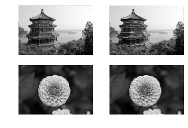
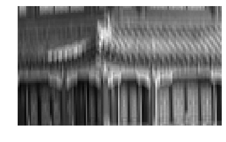
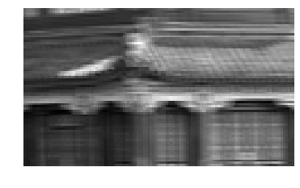
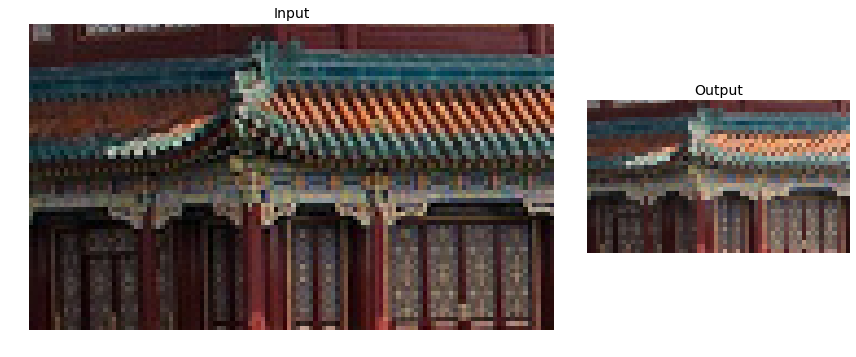
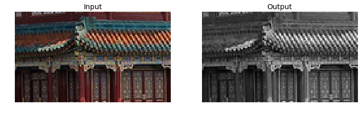
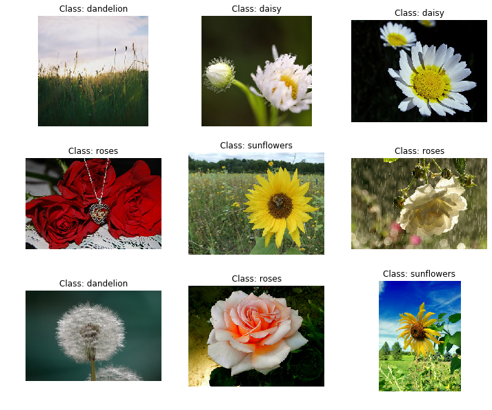
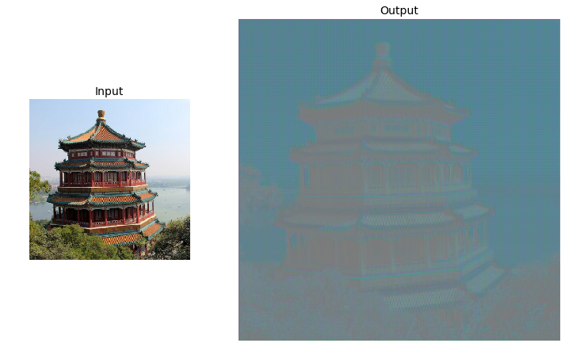

---
redirect_from:
  - "/notebooks/24-tensorflow/14-deep-computer-vision-with-cnns"
interact_link: content/notebooks/24-tensorflow/14_deep_computer_vision_with_cnns.ipynb
kernel_name: python3
has_widgets: false
title: 'TF-CNN'
prev_page:
  url: /notebooks/24-tensorflow/13_loading_and_preprocessing_data.html
  title: 'TF-data'
next_page:
  url: /notebooks/24-tensorflow/15_processing_sequences_using_rnns_and_cnns.html
  title: 'TF-RNN'
comment: "***PROGRAMMATICALLY GENERATED, DO NOT EDIT. SEE ORIGINAL FILES IN /content***"
---


**Chapter 14 – Deep Computer Vision Using Convolutional Neural Networks**


_This notebook contains all the sample code in chapter 14._


<table align="left">
  <td>
    <a target="_blank" href="https://colab.research.google.com/github/ageron/handson-ml2/blob/master/14_deep_computer_vision_with_cnns.ipynb">Run in Google Colab</a>
  </td>
</table>


# Setup


First, let's import a few common modules, ensure MatplotLib plots figures inline and prepare a function to save the figures. We also check that Python 3.5 or later is installed (although Python 2.x may work, it is deprecated so we strongly recommend you use Python 3 instead), as well as Scikit-Learn ≥0.20 and TensorFlow ≥2.0.


<div markdown="1" class="cell code_cell">
<div class="input_area" markdown="1">
```python
# Python ≥3.5 is required
import sys
assert sys.version_info >= (3, 5)

# Scikit-Learn ≥0.20 is required
import sklearn
assert sklearn.__version__ >= "0.20"

try:
    # %tensorflow_version only exists in Colab.
    %tensorflow_version 2.x
    IS_COLAB = True
except Exception:
    IS_COLAB = False

# TensorFlow ≥2.0 is required
import tensorflow as tf
from tensorflow import keras
assert tf.__version__ >= "2.0"

if not tf.test.is_gpu_available():
    print("No GPU was detected. CNNs can be very slow without a GPU.")
    if IS_COLAB:
        print("Go to Runtime > Change runtime and select a GPU hardware accelerator.")

# Common imports
import numpy as np
import os

# to make this notebook's output stable across runs
np.random.seed(42)
tf.random.set_seed(42)

# To plot pretty figures
%matplotlib inline
import matplotlib as mpl
import matplotlib.pyplot as plt
mpl.rc('axes', labelsize=14)
mpl.rc('xtick', labelsize=12)
mpl.rc('ytick', labelsize=12)

# Where to save the figures
PROJECT_ROOT_DIR = "."
CHAPTER_ID = "cnn"
IMAGES_PATH = os.path.join(PROJECT_ROOT_DIR, "images", CHAPTER_ID)
os.makedirs(IMAGES_PATH, exist_ok=True)

def save_fig(fig_id, tight_layout=True, fig_extension="png", resolution=300):
    path = os.path.join(IMAGES_PATH, fig_id + "." + fig_extension)
    print("Saving figure", fig_id)
    if tight_layout:
        plt.tight_layout()
    plt.savefig(path, format=fig_extension, dpi=resolution)

```
</div>

<div class="output_wrapper" markdown="1">
<div class="output_subarea" markdown="1">
{:.output_stream}
```
No GPU was detected. CNNs can be very slow without a GPU.
```
</div>
</div>
</div>


A couple utility functions to plot grayscale and RGB images:


<div markdown="1" class="cell code_cell">
<div class="input_area" markdown="1">
```python
def plot_image(image):
    plt.imshow(image, cmap="gray", interpolation="nearest")
    plt.axis("off")

def plot_color_image(image):
    plt.imshow(image, interpolation="nearest")
    plt.axis("off")

```
</div>

</div>


# What is a Convolution?


<div markdown="1" class="cell code_cell">
<div class="input_area" markdown="1">
```python
import numpy as np
from sklearn.datasets import load_sample_image

# Load sample images
china = load_sample_image("china.jpg") / 255
flower = load_sample_image("flower.jpg") / 255
images = np.array([china, flower])
batch_size, height, width, channels = images.shape

# Create 2 filters
filters = np.zeros(shape=(7, 7, channels, 2), dtype=np.float32)
filters[:, 3, :, 0] = 1  # vertical line
filters[3, :, :, 1] = 1  # horizontal line

outputs = tf.nn.conv2d(images, filters, strides=1, padding="SAME")

plt.imshow(outputs[0, :, :, 1], cmap="gray") # plot 1st image's 2nd feature map
plt.axis("off") # Not shown in the book
plt.show()

```
</div>

<div class="output_wrapper" markdown="1">
<div class="output_subarea" markdown="1">

{:.output_png}


</div>
</div>
</div>


<div markdown="1" class="cell code_cell">
<div class="input_area" markdown="1">
```python
for image_index in (0, 1):
    for feature_map_index in (0, 1):
        plt.subplot(2, 2, image_index * 2 + feature_map_index + 1)
        plot_image(outputs[image_index, :, :, feature_map_index])

plt.show()

```
</div>

<div class="output_wrapper" markdown="1">
<div class="output_subarea" markdown="1">

{:.output_png}


</div>
</div>
</div>


<div markdown="1" class="cell code_cell">
<div class="input_area" markdown="1">
```python
def crop(images):
    return images[150:220, 130:250]

```
</div>

</div>


<div markdown="1" class="cell code_cell">
<div class="input_area" markdown="1">
```python
plot_image(crop(images[0, :, :, 0]))
save_fig("china_original", tight_layout=False)
plt.show()

for feature_map_index, filename in enumerate(["china_vertical", "china_horizontal"]):
    plot_image(crop(outputs[0, :, :, feature_map_index]))
    save_fig(filename, tight_layout=False)
    plt.show()

```
</div>

<div class="output_wrapper" markdown="1">
<div class="output_subarea" markdown="1">
{:.output_stream}
```
Saving figure china_original
```
</div>
</div>
<div class="output_wrapper" markdown="1">
<div class="output_subarea" markdown="1">

{:.output_png}


</div>
</div>
<div class="output_wrapper" markdown="1">
<div class="output_subarea" markdown="1">
{:.output_stream}
```
Saving figure china_vertical
```
</div>
</div>
<div class="output_wrapper" markdown="1">
<div class="output_subarea" markdown="1">

{:.output_png}


</div>
</div>
<div class="output_wrapper" markdown="1">
<div class="output_subarea" markdown="1">
{:.output_stream}
```
Saving figure china_horizontal
```
</div>
</div>
<div class="output_wrapper" markdown="1">
<div class="output_subarea" markdown="1">

{:.output_png}


</div>
</div>
</div>


<div markdown="1" class="cell code_cell">
<div class="input_area" markdown="1">
```python
plot_image(filters[:, :, 0, 0])
plt.show()
plot_image(filters[:, :, 0, 1])
plt.show()

```
</div>

<div class="output_wrapper" markdown="1">
<div class="output_subarea" markdown="1">

{:.output_png}


</div>
</div>
<div class="output_wrapper" markdown="1">
<div class="output_subarea" markdown="1">

{:.output_png}


</div>
</div>
</div>


## Convolutional Layer


Using `keras.layers.Conv2D()`:


<div markdown="1" class="cell code_cell">
<div class="input_area" markdown="1">
```python
conv = keras.layers.Conv2D(filters=32, kernel_size=3, strides=1,
                           padding="SAME", activation="relu")

```
</div>

</div>


<div markdown="1" class="cell code_cell">
<div class="input_area" markdown="1">
```python
plot_image(crop(outputs[0, :, :, 0]))
plt.show()

```
</div>

<div class="output_wrapper" markdown="1">
<div class="output_subarea" markdown="1">

{:.output_png}


</div>
</div>
</div>


## VALID vs SAME padding


<div markdown="1" class="cell code_cell">
<div class="input_area" markdown="1">
```python
def feature_map_size(input_size, kernel_size, strides=1, padding="SAME"):
    if padding == "SAME":
        return (input_size - 1) // strides + 1
    else:
        return (input_size - kernel_size) // strides + 1

```
</div>

</div>


<div markdown="1" class="cell code_cell">
<div class="input_area" markdown="1">
```python
def pad_before_and_padded_size(input_size, kernel_size, strides=1):
    fmap_size = feature_map_size(input_size, kernel_size, strides)
    padded_size = max((fmap_size - 1) * strides + kernel_size, input_size)
    pad_before = (padded_size - input_size) // 2
    return pad_before, padded_size

```
</div>

</div>


<div markdown="1" class="cell code_cell">
<div class="input_area" markdown="1">
```python
def manual_same_padding(images, kernel_size, strides=1):
    if kernel_size == 1:
        return images.astype(np.float32)
    batch_size, height, width, channels = images.shape
    top_pad, padded_height = pad_before_and_padded_size(height, kernel_size, strides)
    left_pad, padded_width  = pad_before_and_padded_size(width, kernel_size, strides)
    padded_shape = [batch_size, padded_height, padded_width, channels]
    padded_images = np.zeros(padded_shape, dtype=np.float32)
    padded_images[:, top_pad:height+top_pad, left_pad:width+left_pad, :] = images
    return padded_images

```
</div>

</div>


Using `"SAME"` padding is equivalent to padding manually using `manual_same_padding()` then using `"VALID"` padding (confusingly, `"VALID"` padding means no padding at all):


<div markdown="1" class="cell code_cell">
<div class="input_area" markdown="1">
```python
kernel_size = 7
strides = 2

conv_valid = keras.layers.Conv2D(filters=1, kernel_size=kernel_size, strides=strides, padding="VALID")
conv_same = keras.layers.Conv2D(filters=1, kernel_size=kernel_size, strides=strides, padding="SAME")

valid_output = conv_valid(manual_same_padding(images, kernel_size, strides))

# Need to call build() so conv_same's weights get created
conv_same.build(tf.TensorShape(images.shape))

# Copy the weights from conv_valid to conv_same
conv_same.set_weights(conv_valid.get_weights())

same_output = conv_same(images.astype(np.float32))

assert np.allclose(valid_output.numpy(), same_output.numpy())

```
</div>

</div>


# Pooling layer


## Max pooling


<div markdown="1" class="cell code_cell">
<div class="input_area" markdown="1">
```python
max_pool = keras.layers.MaxPool2D(pool_size=2)

```
</div>

</div>


<div markdown="1" class="cell code_cell">
<div class="input_area" markdown="1">
```python
cropped_images = np.array([crop(image) for image in images])
output = max_pool(cropped_images)

```
</div>

</div>


<div markdown="1" class="cell code_cell">
<div class="input_area" markdown="1">
```python
fig = plt.figure(figsize=(12, 8))
gs = mpl.gridspec.GridSpec(nrows=1, ncols=2, width_ratios=[2, 1])

ax1 = fig.add_subplot(gs[0, 0])
ax1.set_title("Input", fontsize=14)
ax1.imshow(cropped_images[0])  # plot the 1st image
ax1.axis("off")
ax2 = fig.add_subplot(gs[0, 1])
ax2.set_title("Output", fontsize=14)
ax2.imshow(output[0])  # plot the output for the 1st image
ax2.axis("off")
save_fig("china_max_pooling")
plt.show()

```
</div>

<div class="output_wrapper" markdown="1">
<div class="output_subarea" markdown="1">
{:.output_stream}
```
Saving figure china_max_pooling
```
</div>
</div>
<div class="output_wrapper" markdown="1">
<div class="output_subarea" markdown="1">

{:.output_png}


</div>
</div>
</div>


## Depth-wise pooling


<div markdown="1" class="cell code_cell">
<div class="input_area" markdown="1">
```python
class DepthMaxPool(keras.layers.Layer):
    def __init__(self, pool_size, strides=None, padding="VALID", **kwargs):
        super().__init__(**kwargs)
        if strides is None:
            strides = pool_size
        self.pool_size = pool_size
        self.strides = strides
        self.padding = padding
    def call(self, inputs):
        return tf.nn.max_pool(inputs,
                              ksize=(1, 1, 1, self.pool_size),
                              strides=(1, 1, 1, self.pool_size),
                              padding=self.padding)

```
</div>

</div>


<div markdown="1" class="cell code_cell">
<div class="input_area" markdown="1">
```python
depth_pool = DepthMaxPool(3)
with tf.device("/cpu:0"): # there is no GPU-kernel yet
    depth_output = depth_pool(cropped_images)
depth_output.shape

```
</div>

<div class="output_wrapper" markdown="1">
<div class="output_subarea" markdown="1">


{:.output_data_text}
```
TensorShape([2, 70, 120, 1])
```


</div>
</div>
</div>


Or just use a `Lambda` layer:


<div markdown="1" class="cell code_cell">
<div class="input_area" markdown="1">
```python
depth_pool = keras.layers.Lambda(lambda X: tf.nn.max_pool(
    X, ksize=(1, 1, 1, 3), strides=(1, 1, 1, 3), padding="VALID"))
with tf.device("/cpu:0"): # there is no GPU-kernel yet
    depth_output = depth_pool(cropped_images)
depth_output.shape

```
</div>

<div class="output_wrapper" markdown="1">
<div class="output_subarea" markdown="1">


{:.output_data_text}
```
TensorShape([2, 70, 120, 1])
```


</div>
</div>
</div>


<div markdown="1" class="cell code_cell">
<div class="input_area" markdown="1">
```python
plt.figure(figsize=(12, 8))
plt.subplot(1, 2, 1)
plt.title("Input", fontsize=14)
plot_color_image(cropped_images[0])  # plot the 1st image
plt.subplot(1, 2, 2)
plt.title("Output", fontsize=14)
plot_image(depth_output[0, ..., 0])  # plot the output for the 1st image
plt.axis("off")
plt.show()

```
</div>

<div class="output_wrapper" markdown="1">
<div class="output_subarea" markdown="1">

{:.output_png}


</div>
</div>
</div>


## Average pooling


<div markdown="1" class="cell code_cell">
<div class="input_area" markdown="1">
```python
avg_pool = keras.layers.AvgPool2D(pool_size=2)

```
</div>

</div>


<div markdown="1" class="cell code_cell">
<div class="input_area" markdown="1">
```python
output_avg = avg_pool(cropped_images)

```
</div>

</div>


<div markdown="1" class="cell code_cell">
<div class="input_area" markdown="1">
```python
fig = plt.figure(figsize=(12, 8))
gs = mpl.gridspec.GridSpec(nrows=1, ncols=2, width_ratios=[2, 1])

ax1 = fig.add_subplot(gs[0, 0])
ax1.set_title("Input", fontsize=14)
ax1.imshow(cropped_images[0])  # plot the 1st image
ax1.axis("off")
ax2 = fig.add_subplot(gs[0, 1])
ax2.set_title("Output", fontsize=14)
ax2.imshow(output_avg[0])  # plot the output for the 1st image
ax2.axis("off")
plt.show()

```
</div>

<div class="output_wrapper" markdown="1">
<div class="output_subarea" markdown="1">

{:.output_png}


</div>
</div>
</div>


## Global Average Pooling


<div markdown="1" class="cell code_cell">
<div class="input_area" markdown="1">
```python
global_avg_pool = keras.layers.GlobalAvgPool2D()
global_avg_pool(cropped_images)

```
</div>

<div class="output_wrapper" markdown="1">
<div class="output_subarea" markdown="1">


{:.output_data_text}
```
<tf.Tensor: id=151, shape=(2, 3), dtype=float64, numpy=
array([[0.27887768, 0.2250719 , 0.20967274],
       [0.51288515, 0.45951634, 0.33423483]])>
```


</div>
</div>
</div>


<div markdown="1" class="cell code_cell">
<div class="input_area" markdown="1">
```python
output_global_avg2 = keras.layers.Lambda(lambda X: tf.reduce_mean(X, axis=[1, 2]))
output_global_avg2(cropped_images)

```
</div>

<div class="output_wrapper" markdown="1">
<div class="output_subarea" markdown="1">


{:.output_data_text}
```
<tf.Tensor: id=155, shape=(2, 3), dtype=float64, numpy=
array([[0.27887768, 0.2250719 , 0.20967274],
       [0.51288515, 0.45951634, 0.33423483]])>
```


</div>
</div>
</div>


# Tackling Fashion MNIST With a CNN


<div markdown="1" class="cell code_cell">
<div class="input_area" markdown="1">
```python
(X_train_full, y_train_full), (X_test, y_test) = keras.datasets.fashion_mnist.load_data()
X_train, X_valid = X_train_full[:-5000], X_train_full[-5000:]
y_train, y_valid = y_train_full[:-5000], y_train_full[-5000:]

X_mean = X_train.mean(axis=0, keepdims=True)
X_std = X_train.std(axis=0, keepdims=True) + 1e-7
X_train = (X_train - X_mean) / X_std
X_valid = (X_valid - X_mean) / X_std
X_test = (X_test - X_mean) / X_std

X_train = X_train[..., np.newaxis]
X_valid = X_valid[..., np.newaxis]
X_test = X_test[..., np.newaxis]

```
</div>

</div>


<div markdown="1" class="cell code_cell">
<div class="input_area" markdown="1">
```python
from functools import partial

DefaultConv2D = partial(keras.layers.Conv2D,
                        kernel_size=3, activation='relu', padding="SAME")

model = keras.models.Sequential([
    DefaultConv2D(filters=64, kernel_size=7, input_shape=[28, 28, 1]),
    keras.layers.MaxPooling2D(pool_size=2),
    DefaultConv2D(filters=128),
    DefaultConv2D(filters=128),
    keras.layers.MaxPooling2D(pool_size=2),
    DefaultConv2D(filters=256),
    DefaultConv2D(filters=256),
    keras.layers.MaxPooling2D(pool_size=2),
    keras.layers.Flatten(),
    keras.layers.Dense(units=128, activation='relu'),
    keras.layers.Dropout(0.5),
    keras.layers.Dense(units=64, activation='relu'),
    keras.layers.Dropout(0.5),
    keras.layers.Dense(units=10, activation='softmax'),
])

```
</div>

</div>


<div markdown="1" class="cell code_cell">
<div class="input_area" markdown="1">
```python
model.compile(loss="sparse_categorical_crossentropy", optimizer="nadam", metrics=["accuracy"])
history = model.fit(X_train, y_train, epochs=10, validation_data=[X_valid, y_valid])
score = model.evaluate(X_test, y_test)
X_new = X_test[:10] # pretend we have new images
y_pred = model.predict(X_new)

```
</div>

<div class="output_wrapper" markdown="1">
<div class="output_subarea" markdown="1">
{:.output_stream}
```
Train on 55000 samples, validate on 5000 samples
Epoch 1/10
55000/55000 [==============================] - 51s 923us/sample - loss: 0.7183 - accuracy: 0.7529 - val_loss: 0.4029 - val_accuracy: 0.8510
Epoch 2/10
55000/55000 [==============================] - 47s 863us/sample - loss: 0.4185 - accuracy: 0.8592 - val_loss: 0.3285 - val_accuracy: 0.8854
Epoch 3/10
55000/55000 [==============================] - 46s 836us/sample - loss: 0.3691 - accuracy: 0.8765 - val_loss: 0.2905 - val_accuracy: 0.8936
Epoch 4/10
55000/55000 [==============================] - 46s 832us/sample - loss: 0.3324 - accuracy: 0.8879 - val_loss: 0.2794 - val_accuracy: 0.8970
Epoch 5/10
55000/55000 [==============================] - 48s 880us/sample - loss: 0.3100 - accuracy: 0.8960 - val_loss: 0.2872 - val_accuracy: 0.8942
Epoch 6/10
55000/55000 [==============================] - 51s 921us/sample - loss: 0.2930 - accuracy: 0.9008 - val_loss: 0.2863 - val_accuracy: 0.8980
Epoch 7/10
55000/55000 [==============================] - 50s 918us/sample - loss: 0.2847 - accuracy: 0.9030 - val_loss: 0.2825 - val_accuracy: 0.8972
Epoch 8/10
55000/55000 [==============================] - 50s 915us/sample - loss: 0.2728 - accuracy: 0.9080 - val_loss: 0.2734 - val_accuracy: 0.8990
Epoch 9/10
55000/55000 [==============================] - 50s 913us/sample - loss: 0.2558 - accuracy: 0.9139 - val_loss: 0.2775 - val_accuracy: 0.9056
Epoch 10/10
55000/55000 [==============================] - 50s 911us/sample - loss: 0.2561 - accuracy: 0.9145 - val_loss: 0.2891 - val_accuracy: 0.9036
10000/10000 [==============================] - 2s 239us/sample - loss: 0.2972 - accuracy: 0.8983
```
</div>
</div>
</div>


## ResNet-34


<div markdown="1" class="cell code_cell">
<div class="input_area" markdown="1">
```python
DefaultConv2D = partial(keras.layers.Conv2D, kernel_size=3, strides=1,
                        padding="SAME", use_bias=False)

class ResidualUnit(keras.layers.Layer):
    def __init__(self, filters, strides=1, activation="relu", **kwargs):
        super().__init__(**kwargs)
        self.activation = keras.activations.get(activation)
        self.main_layers = [
            DefaultConv2D(filters, strides=strides),
            keras.layers.BatchNormalization(),
            self.activation,
            DefaultConv2D(filters),
            keras.layers.BatchNormalization()]
        self.skip_layers = []
        if strides > 1:
            self.skip_layers = [
                DefaultConv2D(filters, kernel_size=1, strides=strides),
                keras.layers.BatchNormalization()]

    def call(self, inputs):
        Z = inputs
        for layer in self.main_layers:
            Z = layer(Z)
        skip_Z = inputs
        for layer in self.skip_layers:
            skip_Z = layer(skip_Z)
        return self.activation(Z + skip_Z)

```
</div>

</div>


<div markdown="1" class="cell code_cell">
<div class="input_area" markdown="1">
```python
model = keras.models.Sequential()
model.add(DefaultConv2D(64, kernel_size=7, strides=2,
                        input_shape=[224, 224, 3]))
model.add(keras.layers.BatchNormalization())
model.add(keras.layers.Activation("relu"))
model.add(keras.layers.MaxPool2D(pool_size=3, strides=2, padding="SAME"))
prev_filters = 64
for filters in [64] * 3 + [128] * 4 + [256] * 6 + [512] * 3:
    strides = 1 if filters == prev_filters else 2
    model.add(ResidualUnit(filters, strides=strides))
    prev_filters = filters
model.add(keras.layers.GlobalAvgPool2D())
model.add(keras.layers.Flatten())
model.add(keras.layers.Dense(10, activation="softmax"))

```
</div>

</div>


<div markdown="1" class="cell code_cell">
<div class="input_area" markdown="1">
```python
model.summary()

```
</div>

<div class="output_wrapper" markdown="1">
<div class="output_subarea" markdown="1">
{:.output_stream}
```
Model: "sequential"
_________________________________________________________________
Layer (type)                 Output Shape              Param #   
=================================================================
conv2d (Conv2D)              (None, 112, 112, 64)      9408      
_________________________________________________________________
batch_normalization (BatchNo (None, 112, 112, 64)      256       
_________________________________________________________________
activation (Activation)      (None, 112, 112, 64)      0         
_________________________________________________________________
max_pooling2d (MaxPooling2D) (None, 56, 56, 64)        0         
_________________________________________________________________
residual_unit (ResidualUnit) (None, 56, 56, 64)        74240     
_________________________________________________________________
residual_unit_1 (ResidualUni (None, 56, 56, 64)        74240     
_________________________________________________________________
residual_unit_2 (ResidualUni (None, 56, 56, 64)        74240     
_________________________________________________________________
residual_unit_3 (ResidualUni (None, 28, 28, 128)       230912    
_________________________________________________________________
residual_unit_4 (ResidualUni (None, 28, 28, 128)       295936    
_________________________________________________________________
residual_unit_5 (ResidualUni (None, 28, 28, 128)       295936    
_________________________________________________________________
residual_unit_6 (ResidualUni (None, 28, 28, 128)       295936    
_________________________________________________________________
residual_unit_7 (ResidualUni (None, 14, 14, 256)       920576    
_________________________________________________________________
residual_unit_8 (ResidualUni (None, 14, 14, 256)       1181696   
_________________________________________________________________
residual_unit_9 (ResidualUni (None, 14, 14, 256)       1181696   
_________________________________________________________________
residual_unit_10 (ResidualUn (None, 14, 14, 256)       1181696   
_________________________________________________________________
residual_unit_11 (ResidualUn (None, 14, 14, 256)       1181696   
_________________________________________________________________
residual_unit_12 (ResidualUn (None, 14, 14, 256)       1181696   
_________________________________________________________________
residual_unit_13 (ResidualUn (None, 7, 7, 512)         3676160   
_________________________________________________________________
residual_unit_14 (ResidualUn (None, 7, 7, 512)         4722688   
_________________________________________________________________
residual_unit_15 (ResidualUn (None, 7, 7, 512)         4722688   
_________________________________________________________________
global_average_pooling2d (Gl (None, 512)               0         
_________________________________________________________________
flatten (Flatten)            (None, 512)               0         
_________________________________________________________________
dense (Dense)                (None, 10)                5130      
=================================================================
Total params: 21,306,826
Trainable params: 21,289,802
Non-trainable params: 17,024
_________________________________________________________________
```
</div>
</div>
</div>


## Using a Pretrained Model


<div markdown="1" class="cell code_cell">
<div class="input_area" markdown="1">
```python
model = keras.applications.resnet50.ResNet50(weights="imagenet")

```
</div>

</div>


<div markdown="1" class="cell code_cell">
<div class="input_area" markdown="1">
```python
images_resized = tf.image.resize(images, [224, 224])
plot_color_image(images_resized[0])
plt.show()

```
</div>

<div class="output_wrapper" markdown="1">
<div class="output_subarea" markdown="1">

{:.output_png}


</div>
</div>
</div>


<div markdown="1" class="cell code_cell">
<div class="input_area" markdown="1">
```python
images_resized = tf.image.resize_with_pad(images, 224, 224, antialias=True)
plot_color_image(images_resized[0])

```
</div>

<div class="output_wrapper" markdown="1">
<div class="output_subarea" markdown="1">

{:.output_png}


</div>
</div>
</div>


<div markdown="1" class="cell code_cell">
<div class="input_area" markdown="1">
```python
images_resized = tf.image.resize_with_crop_or_pad(images, 224, 224)
plot_color_image(images_resized[0])
plt.show()

```
</div>

<div class="output_wrapper" markdown="1">
<div class="output_subarea" markdown="1">

{:.output_png}


</div>
</div>
</div>


<div markdown="1" class="cell code_cell">
<div class="input_area" markdown="1">
```python
china_box = [0, 0.03, 1, 0.68]
flower_box = [0.19, 0.26, 0.86, 0.7]
images_resized = tf.image.crop_and_resize(images, [china_box, flower_box], [0, 1], [224, 224])
plot_color_image(images_resized[0])
plt.show()
plot_color_image(images_resized[1])
plt.show()

```
</div>

<div class="output_wrapper" markdown="1">
<div class="output_subarea" markdown="1">

{:.output_png}


</div>
</div>
<div class="output_wrapper" markdown="1">
<div class="output_subarea" markdown="1">

{:.output_png}


</div>
</div>
</div>


<div markdown="1" class="cell code_cell">
<div class="input_area" markdown="1">
```python
inputs = keras.applications.resnet50.preprocess_input(images_resized * 255)
Y_proba = model.predict(inputs)

```
</div>

</div>


<div markdown="1" class="cell code_cell">
<div class="input_area" markdown="1">
```python
Y_proba.shape

```
</div>

<div class="output_wrapper" markdown="1">
<div class="output_subarea" markdown="1">


{:.output_data_text}
```
(2, 1000)
```


</div>
</div>
</div>


<div markdown="1" class="cell code_cell">
<div class="input_area" markdown="1">
```python
top_K = keras.applications.resnet50.decode_predictions(Y_proba, top=3)
for image_index in range(len(images)):
    print("Image #{}".format(image_index))
    for class_id, name, y_proba in top_K[image_index]:
        print("  {} - {:12s} {:.2f}%".format(class_id, name, y_proba * 100))
    print()

```
</div>

<div class="output_wrapper" markdown="1">
<div class="output_subarea" markdown="1">
{:.output_stream}
```
Image #0
  n03877845 - palace       42.87%
  n02825657 - bell_cote    40.57%
  n03781244 - monastery    14.56%

Image #1
  n04522168 - vase         46.83%
  n07930864 - cup          7.78%
  n11939491 - daisy        4.87%

```
</div>
</div>
</div>


## Pretrained Models for Transfer Learning


<div markdown="1" class="cell code_cell">
<div class="input_area" markdown="1">
```python
import tensorflow_datasets as tfds

dataset, info = tfds.load("tf_flowers", as_supervised=True, with_info=True)

```
</div>

</div>


<div markdown="1" class="cell code_cell">
<div class="input_area" markdown="1">
```python
info.splits

```
</div>

<div class="output_wrapper" markdown="1">
<div class="output_subarea" markdown="1">


{:.output_data_text}
```
{'train': <tfds.core.SplitInfo num_examples=3670>}
```


</div>
</div>
</div>


<div markdown="1" class="cell code_cell">
<div class="input_area" markdown="1">
```python
info.splits["train"]

```
</div>

<div class="output_wrapper" markdown="1">
<div class="output_subarea" markdown="1">


{:.output_data_text}
```
<tfds.core.SplitInfo num_examples=3670>
```


</div>
</div>
</div>


<div markdown="1" class="cell code_cell">
<div class="input_area" markdown="1">
```python
class_names = info.features["label"].names
class_names

```
</div>

<div class="output_wrapper" markdown="1">
<div class="output_subarea" markdown="1">


{:.output_data_text}
```
['dandelion', 'daisy', 'tulips', 'sunflowers', 'roses']
```


</div>
</div>
</div>


<div markdown="1" class="cell code_cell">
<div class="input_area" markdown="1">
```python
n_classes = info.features["label"].num_classes

```
</div>

</div>


<div markdown="1" class="cell code_cell">
<div class="input_area" markdown="1">
```python
dataset_size = info.splits["train"].num_examples
dataset_size

```
</div>

<div class="output_wrapper" markdown="1">
<div class="output_subarea" markdown="1">


{:.output_data_text}
```
3670
```


</div>
</div>
</div>


<div markdown="1" class="cell code_cell">
<div class="input_area" markdown="1">
```python
test_split, valid_split, train_split = tfds.Split.TRAIN.subsplit([10, 15, 75])

test_set_raw = tfds.load("tf_flowers", split=test_split, as_supervised=True)
valid_set_raw = tfds.load("tf_flowers", split=valid_split, as_supervised=True)
train_set_raw = tfds.load("tf_flowers", split=train_split, as_supervised=True)

```
</div>

</div>


<div markdown="1" class="cell code_cell">
<div class="input_area" markdown="1">
```python
plt.figure(figsize=(12, 10))
index = 0
for image, label in train_set_raw.take(9):
    index += 1
    plt.subplot(3, 3, index)
    plt.imshow(image)
    plt.title("Class: {}".format(class_names[label]))
    plt.axis("off")

plt.show()

```
</div>

<div class="output_wrapper" markdown="1">
<div class="output_subarea" markdown="1">

{:.output_png}


</div>
</div>
</div>


Basic preprocessing:


<div markdown="1" class="cell code_cell">
<div class="input_area" markdown="1">
```python
def preprocess(image, label):
    resized_image = tf.image.resize(image, [224, 224])
    final_image = keras.applications.xception.preprocess_input(resized_image)
    return final_image, label

```
</div>

</div>


Slightly fancier preprocessing (but you could add much more data augmentation):


<div markdown="1" class="cell code_cell">
<div class="input_area" markdown="1">
```python
def central_crop(image):
    shape = tf.shape(image)
    min_dim = tf.reduce_min([shape[0], shape[1]])
    top_crop = (shape[0] - min_dim) // 4
    bottom_crop = shape[0] - top_crop
    left_crop = (shape[1] - min_dim) // 4
    right_crop = shape[1] - left_crop
    return image[top_crop:bottom_crop, left_crop:right_crop]

def random_crop(image):
    shape = tf.shape(image)
    min_dim = tf.reduce_min([shape[0], shape[1]]) * 90 // 100
    return tf.image.random_crop(image, [min_dim, min_dim, 3])

def preprocess(image, label, randomize=False):
    if randomize:
        cropped_image = random_crop(image)
        cropped_image = tf.image.random_flip_left_right(cropped_image)
    else:
        cropped_image = central_crop(image)
    resized_image = tf.image.resize(cropped_image, [224, 224])
    final_image = keras.applications.xception.preprocess_input(resized_image)
    return final_image, label

batch_size = 32
train_set = train_set_raw.shuffle(1000).repeat()
train_set = train_set.map(partial(preprocess, randomize=True)).batch(batch_size).prefetch(1)
valid_set = valid_set_raw.map(preprocess).batch(batch_size).prefetch(1)
test_set = test_set_raw.map(preprocess).batch(batch_size).prefetch(1)

```
</div>

</div>


<div markdown="1" class="cell code_cell">
<div class="input_area" markdown="1">
```python
plt.figure(figsize=(12, 12))
for X_batch, y_batch in train_set.take(1):
    for index in range(9):
        plt.subplot(3, 3, index + 1)
        plt.imshow(X_batch[index] / 2 + 0.5)
        plt.title("Class: {}".format(class_names[y_batch[index]]))
        plt.axis("off")

plt.show()

```
</div>

<div class="output_wrapper" markdown="1">
<div class="output_subarea" markdown="1">

{:.output_png}


</div>
</div>
</div>


<div markdown="1" class="cell code_cell">
<div class="input_area" markdown="1">
```python
plt.figure(figsize=(12, 12))
for X_batch, y_batch in test_set.take(1):
    for index in range(9):
        plt.subplot(3, 3, index + 1)
        plt.imshow(X_batch[index] / 2 + 0.5)
        plt.title("Class: {}".format(class_names[y_batch[index]]))
        plt.axis("off")

plt.show()

```
</div>

<div class="output_wrapper" markdown="1">
<div class="output_subarea" markdown="1">

{:.output_png}


</div>
</div>
</div>


<div markdown="1" class="cell code_cell">
<div class="input_area" markdown="1">
```python
base_model = keras.applications.xception.Xception(weights="imagenet",
                                                  include_top=False)
avg = keras.layers.GlobalAveragePooling2D()(base_model.output)
output = keras.layers.Dense(n_classes, activation="softmax")(avg)
model = keras.models.Model(inputs=base_model.input, outputs=output)

```
</div>

</div>


<div markdown="1" class="cell code_cell">
<div class="input_area" markdown="1">
```python
for index, layer in enumerate(base_model.layers):
    print(index, layer.name)

```
</div>

<div class="output_wrapper" markdown="1">
<div class="output_subarea" markdown="1">
{:.output_stream}
```
0 input_2
1 block1_conv1
2 block1_conv1_bn
3 block1_conv1_act
4 block1_conv2
5 block1_conv2_bn
6 block1_conv2_act
7 block2_sepconv1
8 block2_sepconv1_bn
9 block2_sepconv2_act
10 block2_sepconv2
11 block2_sepconv2_bn
12 conv2d_44
13 block2_pool
14 batch_normalization_35
15 add_16
16 block3_sepconv1_act
17 block3_sepconv1
18 block3_sepconv1_bn
19 block3_sepconv2_act
20 block3_sepconv2
21 block3_sepconv2_bn
22 conv2d_45
23 block3_pool
24 batch_normalization_36
25 add_17
26 block4_sepconv1_act
27 block4_sepconv1
28 block4_sepconv1_bn
29 block4_sepconv2_act
30 block4_sepconv2
31 block4_sepconv2_bn
32 conv2d_46
33 block4_pool
34 batch_normalization_37
<<62 more lines>>
97 block11_sepconv1
98 block11_sepconv1_bn
99 block11_sepconv2_act
100 block11_sepconv2
101 block11_sepconv2_bn
102 block11_sepconv3_act
103 block11_sepconv3
104 block11_sepconv3_bn
105 add_25
106 block12_sepconv1_act
107 block12_sepconv1
108 block12_sepconv1_bn
109 block12_sepconv2_act
110 block12_sepconv2
111 block12_sepconv2_bn
112 block12_sepconv3_act
113 block12_sepconv3
114 block12_sepconv3_bn
115 add_26
116 block13_sepconv1_act
117 block13_sepconv1
118 block13_sepconv1_bn
119 block13_sepconv2_act
120 block13_sepconv2
121 block13_sepconv2_bn
122 conv2d_47
123 block13_pool
124 batch_normalization_38
125 add_27
126 block14_sepconv1
127 block14_sepconv1_bn
128 block14_sepconv1_act
129 block14_sepconv2
130 block14_sepconv2_bn
131 block14_sepconv2_act
```
</div>
</div>
</div>


<div markdown="1" class="cell code_cell">
<div class="input_area" markdown="1">
```python
for layer in base_model.layers:
    layer.trainable = False

optimizer = keras.optimizers.SGD(lr=0.2, momentum=0.9, decay=0.01)
model.compile(loss="sparse_categorical_crossentropy", optimizer=optimizer,
              metrics=["accuracy"])
history = model.fit(train_set,
                    steps_per_epoch=int(0.75 * dataset_size / batch_size),
                    validation_data=valid_set,
                    validation_steps=int(0.15 * dataset_size / batch_size),
                    epochs=5)

```
</div>

<div class="output_wrapper" markdown="1">
<div class="output_subarea" markdown="1">
{:.output_stream}
```
Epoch 1/5
86/86 [==============================] - 46s 532ms/step - loss: 0.6858 - accuracy: 0.7758 - val_loss: 1.7375 - val_accuracy: 0.7335
Epoch 2/5
86/86 [==============================] - 39s 450ms/step - loss: 0.3833 - accuracy: 0.8765 - val_loss: 1.2491 - val_accuracy: 0.7592
Epoch 3/5
86/86 [==============================] - 39s 450ms/step - loss: 0.3270 - accuracy: 0.8903 - val_loss: 1.2740 - val_accuracy: 0.7647
Epoch 4/5
86/86 [==============================] - 39s 451ms/step - loss: 0.2821 - accuracy: 0.9113 - val_loss: 1.1322 - val_accuracy: 0.7757
Epoch 5/5
86/86 [==============================] - 39s 452ms/step - loss: 0.2430 - accuracy: 0.9121 - val_loss: 1.5182 - val_accuracy: 0.7426
```
</div>
</div>
</div>


<div markdown="1" class="cell code_cell">
<div class="input_area" markdown="1">
```python
for layer in base_model.layers:
    layer.trainable = True

optimizer = keras.optimizers.SGD(learning_rate=0.01, momentum=0.9,
                                 nesterov=True, decay=0.001)
model.compile(loss="sparse_categorical_crossentropy", optimizer=optimizer,
              metrics=["accuracy"])
history = model.fit(train_set,
                    steps_per_epoch=int(0.75 * dataset_size / batch_size),
                    validation_data=valid_set,
                    validation_steps=int(0.15 * dataset_size / batch_size),
                    epochs=40)

```
</div>

<div class="output_wrapper" markdown="1">
<div class="output_subarea" markdown="1">
{:.output_stream}
```
Epoch 1/40
86/86 [==============================] - 172s 2s/step - loss: 0.2257 - accuracy: 0.9288 - val_loss: 0.6762 - val_accuracy: 0.8346
Epoch 2/40
86/86 [==============================] - 128s 1s/step - loss: 0.1124 - accuracy: 0.9640 - val_loss: 0.3932 - val_accuracy: 0.9154
Epoch 3/40
86/86 [==============================] - 129s 1s/step - loss: 0.0497 - accuracy: 0.9829 - val_loss: 0.2618 - val_accuracy: 0.9246
Epoch 4/40
86/86 [==============================] - 128s 1s/step - loss: 0.0425 - accuracy: 0.9836 - val_loss: 0.3446 - val_accuracy: 0.9136
Epoch 5/40
86/86 [==============================] - 128s 1s/step - loss: 0.0251 - accuracy: 0.9909 - val_loss: 0.2486 - val_accuracy: 0.9338
Epoch 6/40
86/86 [==============================] - 127s 1s/step - loss: 0.0142 - accuracy: 0.9949 - val_loss: 0.2324 - val_accuracy: 0.9430
Epoch 7/40
86/86 [==============================] - 128s 1s/step - loss: 0.0195 - accuracy: 0.9945 - val_loss: 0.2785 - val_accuracy: 0.9357
Epoch 8/40
86/86 [==============================] - 128s 1s/step - loss: 0.0154 - accuracy: 0.9956 - val_loss: 0.3262 - val_accuracy: 0.9173
Epoch 9/40
86/86 [==============================] - 128s 1s/step - loss: 0.0084 - accuracy: 0.9975 - val_loss: 0.2554 - val_accuracy: 0.9357
Epoch 10/40
86/86 [==============================] - 128s 1s/step - loss: 0.0091 - accuracy: 0.9975 - val_loss: 0.2573 - val_accuracy: 0.9357
Epoch 11/40
86/86 [==============================] - 128s 1s/step - loss: 0.0104 - accuracy: 0.9967 - val_loss: 0.2744 - val_accuracy: 0.9430
Epoch 12/40
86/86 [==============================] - 128s 1s/step - loss: 0.0066 - accuracy: 0.9985 - val_loss: 0.2788 - val_accuracy: 0.9301
Epoch 13/40
86/86 [==============================] - 128s 1s/step - loss: 0.0089 - accuracy: 0.9975 - val_loss: 0.2488 - val_accuracy: 0.9393
Epoch 14/40
86/86 [==============================] - 128s 1s/step - loss: 0.0113 - accuracy: 0.9956 - val_loss: 0.2703 - val_accuracy: 0.9430
Epoch 15/40
86/86 [==============================] - 129s 1s/step - loss: 0.0055 - accuracy: 0.9985 - val_loss: 0.2452 - val_accuracy: 0.9504
Epoch 16/40
86/86 [==============================] - 127s 1s/step - loss: 0.0053 - accuracy: 0.9982 - val_loss: 0.2327 - val_accuracy: 0.9522
Epoch 17/40
86/86 [==============================] - 127s 1s/step - loss: 0.0051 - accuracy: 0.9985 - val_loss: 0.2194 - val_accuracy: 0.9540
Epoch 18/40
86/86 [==============================] - 129s 1s/step - loss: 0.0048 - accuracy: 0.9989 - val_loss: 0.2283 - val_accuracy: 0.9540
Epoch 19/40
86/86 [==============================] - 128s 1s/step - loss: 0.0036 - accuracy: 0.9993 - val_loss: 0.2384 - val_accuracy: 0.9504
Epoch 20/40
86/86 [==============================] - 128s 1s/step - loss: 0.0033 - accuracy: 0.9993 - val_loss: 0.2610 - val_accuracy: 0.9467
Epoch 21/40
86/86 [==============================] - 128s 1s/step - loss: 0.0047 - accuracy: 0.9993 - val_loss: 0.2403 - val_accuracy: 0.9522
Epoch 22/40
86/86 [==============================] - 128s 1s/step - loss: 0.0035 - accuracy: 0.9989 - val_loss: 0.2339 - val_accuracy: 0.9485
Epoch 23/40
86/86 [==============================] - 128s 1s/step - loss: 0.0048 - accuracy: 0.9982 - val_loss: 0.2295 - val_accuracy: 0.9467
Epoch 24/40
86/86 [==============================] - 128s 1s/step - loss: 0.0033 - accuracy: 0.9989 - val_loss: 0.2327 - val_accuracy: 0.9485
Epoch 25/40
86/86 [==============================] - 128s 1s/step - loss: 0.0037 - accuracy: 0.9989 - val_loss: 0.2381 - val_accuracy: 0.9522
Epoch 26/40
86/86 [==============================] - 127s 1s/step - loss: 0.0021 - accuracy: 0.9996 - val_loss: 0.2348 - val_accuracy: 0.9467
Epoch 27/40
86/86 [==============================] - 127s 1s/step - loss: 0.0024 - accuracy: 0.9993 - val_loss: 0.2365 - val_accuracy: 0.9504
Epoch 28/40
86/86 [==============================] - 128s 1s/step - loss: 0.0075 - accuracy: 0.9975 - val_loss: 0.2526 - val_accuracy: 0.9467
Epoch 29/40
86/86 [==============================] - 127s 1s/step - loss: 0.0039 - accuracy: 0.9993 - val_loss: 0.2445 - val_accuracy: 0.9485
Epoch 30/40
86/86 [==============================] - 128s 1s/step - loss: 0.0014 - accuracy: 1.0000 - val_loss: 0.2423 - val_accuracy: 0.9485
Epoch 31/40
86/86 [==============================] - 127s 1s/step - loss: 0.0021 - accuracy: 0.9993 - val_loss: 0.2378 - val_accuracy: 0.9485
Epoch 32/40
86/86 [==============================] - 128s 1s/step - loss: 0.0032 - accuracy: 0.9989 - val_loss: 0.2440 - val_accuracy: 0.9504
Epoch 33/40
86/86 [==============================] - 128s 1s/step - loss: 0.0010 - accuracy: 1.0000 - val_loss: 0.2429 - val_accuracy: 0.9485
Epoch 34/40
86/86 [==============================] - 127s 1s/step - loss: 0.0013 - accuracy: 1.0000 - val_loss: 0.2450 - val_accuracy: 0.9504
Epoch 35/40
86/86 [==============================] - 127s 1s/step - loss: 6.0323e-04 - accuracy: 1.0000 - val_loss: 0.2460 - val_accuracy: 0.9522
Epoch 36/40
86/86 [==============================] - 126s 1s/step - loss: 0.0039 - accuracy: 0.9982 - val_loss: 0.2317 - val_accuracy: 0.9577
Epoch 37/40
86/86 [==============================] - 127s 1s/step - loss: 0.0011 - accuracy: 1.0000 - val_loss: 0.2332 - val_accuracy: 0.9559
Epoch 38/40
86/86 [==============================] - 126s 1s/step - loss: 9.6522e-04 - accuracy: 0.9996 - val_loss: 0.2356 - val_accuracy: 0.9522
Epoch 39/40
86/86 [==============================] - 127s 1s/step - loss: 0.0032 - accuracy: 0.9985 - val_loss: 0.2409 - val_accuracy: 0.9522
Epoch 40/40
86/86 [==============================] - 127s 1s/step - loss: 0.0021 - accuracy: 0.9996 - val_loss: 0.2386 - val_accuracy: 0.9540
```
</div>
</div>
</div>


# Classification and Localization


<div markdown="1" class="cell code_cell">
<div class="input_area" markdown="1">
```python
base_model = keras.applications.xception.Xception(weights="imagenet",
                                                  include_top=False)
avg = keras.layers.GlobalAveragePooling2D()(base_model.output)
class_output = keras.layers.Dense(n_classes, activation="softmax")(avg)
loc_output = keras.layers.Dense(4)(avg)
model = keras.models.Model(inputs=base_model.input,
                           outputs=[class_output, loc_output])
model.compile(loss=["sparse_categorical_crossentropy", "mse"],
              loss_weights=[0.8, 0.2], # depends on what you care most about
              optimizer=optimizer, metrics=["accuracy"])

```
</div>

</div>


<div markdown="1" class="cell code_cell">
<div class="input_area" markdown="1">
```python
def add_random_bounding_boxes(images, labels):
    fake_bboxes = tf.random.uniform([tf.shape(images)[0], 4])
    return images, (labels, fake_bboxes)

fake_train_set = train_set.take(5).repeat(2).map(add_random_bounding_boxes)

```
</div>

</div>


<div markdown="1" class="cell code_cell">
<div class="input_area" markdown="1">
```python
model.fit(fake_train_set, steps_per_epoch=5, epochs=2)

```
</div>

<div class="output_wrapper" markdown="1">
<div class="output_subarea" markdown="1">
{:.output_stream}
```
Epoch 1/2
5/5 [==============================] - 134s 27s/step - loss: 1.3279 - dense_5_loss: 1.5696 - dense_6_loss: 0.3612 - dense_5_accuracy: 0.2625 - dense_6_accuracy: 0.2562
Epoch 2/2
5/5 [==============================] - 93s 19s/step - loss: 1.0533 - dense_5_loss: 1.2658 - dense_6_loss: 0.2035 - dense_5_accuracy: 0.5938 - dense_6_accuracy: 0.2000
```
</div>
</div>
<div class="output_wrapper" markdown="1">
<div class="output_subarea" markdown="1">


{:.output_data_text}
```
<tensorflow.python.keras.callbacks.History at 0x152562d68>
```


</div>
</div>
</div>


### Mean Average Precision (mAP)


<div markdown="1" class="cell code_cell">
<div class="input_area" markdown="1">
```python
def maximum_precisions(precisions):
    return np.flip(np.maximum.accumulate(np.flip(precisions)))

```
</div>

</div>


<div markdown="1" class="cell code_cell">
<div class="input_area" markdown="1">
```python
recalls = np.linspace(0, 1, 11)

precisions = [0.91, 0.94, 0.96, 0.94, 0.95, 0.92, 0.80, 0.60, 0.45, 0.20, 0.10]
max_precisions = maximum_precisions(precisions)
mAP = max_precisions.mean()
plt.plot(recalls, precisions, "ro--", label="Precision")
plt.plot(recalls, max_precisions, "bo-", label="Max Precision")
plt.xlabel("Recall")
plt.ylabel("Precision")
plt.plot([0, 1], [mAP, mAP], "g:", linewidth=3, label="mAP")
plt.grid(True)
plt.axis([0, 1, 0, 1])
plt.legend(loc="lower center", fontsize=14)
plt.show()

```
</div>

<div class="output_wrapper" markdown="1">
<div class="output_subarea" markdown="1">

{:.output_png}


</div>
</div>
</div>


Transpose convolutions:


<div markdown="1" class="cell code_cell">
<div class="input_area" markdown="1">
```python
tf.random.set_seed(42)
X = images_resized.numpy()

conv_transpose = keras.layers.Conv2DTranspose(filters=5, kernel_size=3, strides=2, padding="VALID")
output = conv_transpose(X)
output.shape

```
</div>

<div class="output_wrapper" markdown="1">
<div class="output_subarea" markdown="1">


{:.output_data_text}
```
TensorShape([2, 449, 449, 5])
```


</div>
</div>
</div>


<div markdown="1" class="cell code_cell">
<div class="input_area" markdown="1">
```python
def normalize(X):
    return (X - tf.reduce_min(X)) / (tf.reduce_max(X) - tf.reduce_min(X))

fig = plt.figure(figsize=(12, 8))
gs = mpl.gridspec.GridSpec(nrows=1, ncols=2, width_ratios=[1, 2])

ax1 = fig.add_subplot(gs[0, 0])
ax1.set_title("Input", fontsize=14)
ax1.imshow(X[0])  # plot the 1st image
ax1.axis("off")
ax2 = fig.add_subplot(gs[0, 1])
ax2.set_title("Output", fontsize=14)
ax2.imshow(normalize(output[0, ..., :3]), interpolation="bicubic")  # plot the output for the 1st image
ax2.axis("off")
plt.show()

```
</div>

<div class="output_wrapper" markdown="1">
<div class="output_subarea" markdown="1">

{:.output_png}


</div>
</div>
</div>


<div markdown="1" class="cell code_cell">
<div class="input_area" markdown="1">
```python
def upscale_images(images, stride, kernel_size):
    batch_size, height, width, channels = images.shape
    upscaled = np.zeros((batch_size,
                         (height - 1) * stride + 2 * kernel_size - 1,
                         (width - 1) * stride + 2 * kernel_size - 1,
                         channels))
    upscaled[:,
             kernel_size - 1:(height - 1) * stride + kernel_size:stride,
             kernel_size - 1:(width - 1) * stride + kernel_size:stride,
             :] = images
    return upscaled

```
</div>

</div>


<div markdown="1" class="cell code_cell">
<div class="input_area" markdown="1">
```python
upscaled = upscale_images(X, stride=2, kernel_size=3)
weights, biases = conv_transpose.weights
reversed_filters = np.flip(weights.numpy(), axis=[0, 1])
reversed_filters = np.transpose(reversed_filters, [0, 1, 3, 2])
manual_output = tf.nn.conv2d(upscaled, reversed_filters, strides=1, padding="VALID")

```
</div>

</div>


<div markdown="1" class="cell code_cell">
<div class="input_area" markdown="1">
```python
def normalize(X):
    return (X - tf.reduce_min(X)) / (tf.reduce_max(X) - tf.reduce_min(X))

fig = plt.figure(figsize=(12, 8))
gs = mpl.gridspec.GridSpec(nrows=1, ncols=3, width_ratios=[1, 2, 2])

ax1 = fig.add_subplot(gs[0, 0])
ax1.set_title("Input", fontsize=14)
ax1.imshow(X[0])  # plot the 1st image
ax1.axis("off")
ax2 = fig.add_subplot(gs[0, 1])
ax2.set_title("Upscaled", fontsize=14)
ax2.imshow(upscaled[0], interpolation="bicubic")
ax2.axis("off")
ax3 = fig.add_subplot(gs[0, 2])
ax3.set_title("Output", fontsize=14)
ax3.imshow(normalize(manual_output[0, ..., :3]), interpolation="bicubic")  # plot the output for the 1st image
ax3.axis("off")
plt.show()

```
</div>

<div class="output_wrapper" markdown="1">
<div class="output_subarea" markdown="1">

{:.output_png}


</div>
</div>
</div>


<div markdown="1" class="cell code_cell">
<div class="input_area" markdown="1">
```python
np.allclose(output, manual_output.numpy(), atol=1e-7)

```
</div>

<div class="output_wrapper" markdown="1">
<div class="output_subarea" markdown="1">


{:.output_data_text}
```
True
```


</div>
</div>
</div>


# Exercises


## 1. to 8.


See appendix A.


## 9. High Accuracy CNN for MNIST
Exercise: Build your own CNN from scratch and try to achieve the highest possible accuracy on MNIST.


## 10.  Use transfer learning for large image classification

### 10.1)
Create a training set containing at least 100 images per class. For example, you could classify your own pictures based on the location (beach, mountain, city, etc.), or alternatively you can just use an existing dataset (e.g., from TensorFlow Datasets).


### 10.2)
Split it into a training set, a validation set and a test set.


### 10.3)
Build the input pipeline, including the appropriate preprocessing operations, and optionally add data augmentation.


### 10.4)
Fine-tune a pretrained model on this dataset.


## 11.
Exercise: Go through TensorFlow's [DeepDream tutorial](https://goo.gl/4b2s6g). It is a fun way to familiarize yourself with various ways of visualizing the patterns learned by a CNN, and to generate art using Deep Learning.


Simply download the notebook and follow its instructions. For extra fun, you can produce a series of images, by repeatedly zooming in and running the DeepDream algorithm: using a tool such as [ffmpeg](https://ffmpeg.org/) you can then create a video from these images. For example, here is a [DeepDream video](https://www.youtube.com/watch?v=l6i_fDg30p0) I made... as you will see, it quickly turns into a nightmare. ;-) You can find hundreds of [similar videos](https://www.youtube.com/results?search_query=+deepdream) (often much more artistic) on the web.

