---
redirect_from:
  - "/notebooks/24-tensorflow/15-processing-sequences-using-rnns-and-cnns"
interact_link: content/notebooks/24-tensorflow/15_processing_sequences_using_rnns_and_cnns.ipynb
kernel_name: python3
has_widgets: false
title: 'TF-RNN'
prev_page:
  url: /notebooks/24-tensorflow/14_deep_computer_vision_with_cnns.html
  title: 'TF-CNN'
next_page:
  url: /notebooks/24-tensorflow/16_nlp_with_rnns_and_attention.html
  title: 'TF-NLP'
comment: "***PROGRAMMATICALLY GENERATED, DO NOT EDIT. SEE ORIGINAL FILES IN /content***"
---


**Chapter 15 – Processing Sequences Using RNNs and CNNs**


_This notebook contains all the sample code in chapter 15._


<table align="left">
  <td>
    <a target="_blank" href="https://colab.research.google.com/github/ageron/handson-ml2/blob/master/15_processing_sequences_using_rnns_and_cnns.ipynb">Run in Google Colab</a>
  </td>
</table>


# Setup


First, let's import a few common modules, ensure MatplotLib plots figures inline and prepare a function to save the figures. We also check that Python 3.5 or later is installed (although Python 2.x may work, it is deprecated so we strongly recommend you use Python 3 instead), as well as Scikit-Learn ≥0.20 and TensorFlow ≥2.0.


<div markdown="1" class="cell code_cell">
<div class="input_area" markdown="1">
```python
# Python ≥3.5 is required
import sys
assert sys.version_info >= (3, 5)

# Scikit-Learn ≥0.20 is required
import sklearn
assert sklearn.__version__ >= "0.20"

try:
    # %tensorflow_version only exists in Colab.
    %tensorflow_version 2.x
    IS_COLAB = True
except Exception:
    IS_COLAB = False

# TensorFlow ≥2.0 is required
import tensorflow as tf
from tensorflow import keras
assert tf.__version__ >= "2.0"

if not tf.test.is_gpu_available():
    print("No GPU was detected. LSTMs and CNNs can be very slow without a GPU.")
    if IS_COLAB:
        print("Go to Runtime > Change runtime and select a GPU hardware accelerator.")

# Common imports
import numpy as np
import os

# to make this notebook's output stable across runs
np.random.seed(42)
tf.random.set_seed(42)

# To plot pretty figures
%matplotlib inline
import matplotlib as mpl
import matplotlib.pyplot as plt
mpl.rc('axes', labelsize=14)
mpl.rc('xtick', labelsize=12)
mpl.rc('ytick', labelsize=12)

# Where to save the figures
PROJECT_ROOT_DIR = "."
CHAPTER_ID = "rnn"
IMAGES_PATH = os.path.join(PROJECT_ROOT_DIR, "images", CHAPTER_ID)
os.makedirs(IMAGES_PATH, exist_ok=True)

def save_fig(fig_id, tight_layout=True, fig_extension="png", resolution=300):
    path = os.path.join(IMAGES_PATH, fig_id + "." + fig_extension)
    print("Saving figure", fig_id)
    if tight_layout:
        plt.tight_layout()
    plt.savefig(path, format=fig_extension, dpi=resolution)

```
</div>

</div>


# Basic RNNs


### Generate the Dataset


<div markdown="1" class="cell code_cell">
<div class="input_area" markdown="1">
```python
def generate_time_series(batch_size, n_steps):
    freq1, freq2, offsets1, offsets2 = np.random.rand(4, batch_size, 1)
    time = np.linspace(0, 1, n_steps)
    series = 0.5 * np.sin((time - offsets1) * (freq1 * 10 + 10))  #   wave 1
    series += 0.2 * np.sin((time - offsets2) * (freq2 * 20 + 20)) # + wave 2
    series += 0.1 * (np.random.rand(batch_size, n_steps) - 0.5)   # + noise
    return series[..., np.newaxis].astype(np.float32)

```
</div>

</div>


<div markdown="1" class="cell code_cell">
<div class="input_area" markdown="1">
```python
np.random.seed(42)

n_steps = 50
series = generate_time_series(10000, n_steps + 1)
X_train, y_train = series[:7000, :n_steps], series[:7000, -1]
X_valid, y_valid = series[7000:9000, :n_steps], series[7000:9000, -1]
X_test, y_test = series[9000:, :n_steps], series[9000:, -1]

```
</div>

</div>


<div markdown="1" class="cell code_cell">
<div class="input_area" markdown="1">
```python
X_train.shape, y_train.shape

```
</div>

<div class="output_wrapper" markdown="1">
<div class="output_subarea" markdown="1">


{:.output_data_text}
```
((7000, 50, 1), (7000, 1))
```


</div>
</div>
</div>


<div markdown="1" class="cell code_cell">
<div class="input_area" markdown="1">
```python
def plot_series(series, y=None, y_pred=None, x_label="$t$", y_label="$x(t)$"):
    plt.plot(series, ".-")
    if y is not None:
        plt.plot(n_steps, y, "bx", markersize=10)
    if y_pred is not None:
        plt.plot(n_steps, y_pred, "ro")
    plt.grid(True)
    if x_label:
        plt.xlabel(x_label, fontsize=16)
    if y_label:
        plt.ylabel(y_label, fontsize=16, rotation=0)
    plt.hlines(0, 0, 100, linewidth=1)
    plt.axis([0, n_steps + 1, -1, 1])

fig, axes = plt.subplots(nrows=1, ncols=3, sharey=True, figsize=(12, 4))
for col in range(3):
    plt.sca(axes[col])
    plot_series(X_valid[col, :, 0], y_valid[col, 0],
                y_label=("$x(t)$" if col==0 else None))
save_fig("time_series_plot")
plt.show()

```
</div>

<div class="output_wrapper" markdown="1">
<div class="output_subarea" markdown="1">
{:.output_stream}
```
Saving figure time_series_plot
```
</div>
</div>
<div class="output_wrapper" markdown="1">
<div class="output_subarea" markdown="1">

{:.output_png}
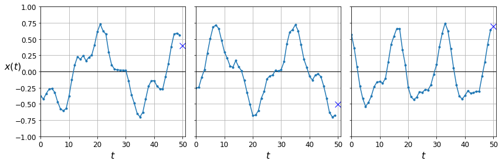

</div>
</div>
</div>


### Computing Some Baselines


Naive predictions (just predict the last observed value):


<div markdown="1" class="cell code_cell">
<div class="input_area" markdown="1">
```python
y_pred = X_valid[:, -1]
np.mean(keras.losses.mean_squared_error(y_valid, y_pred))

```
</div>

<div class="output_wrapper" markdown="1">
<div class="output_subarea" markdown="1">


{:.output_data_text}
```
0.020211367
```


</div>
</div>
</div>


<div markdown="1" class="cell code_cell">
<div class="input_area" markdown="1">
```python
plot_series(X_valid[0, :, 0], y_valid[0, 0], y_pred[0, 0])
plt.show()

```
</div>

<div class="output_wrapper" markdown="1">
<div class="output_subarea" markdown="1">

{:.output_png}


</div>
</div>
</div>


Linear predictions:


<div markdown="1" class="cell code_cell">
<div class="input_area" markdown="1">
```python
np.random.seed(42)
tf.random.set_seed(42)

model = keras.models.Sequential([
    keras.layers.Flatten(input_shape=[50, 1]),
    keras.layers.Dense(1)
])

model.compile(loss="mse", optimizer="adam")
history = model.fit(X_train, y_train, epochs=20,
                    validation_data=(X_valid, y_valid))

```
</div>

<div class="output_wrapper" markdown="1">
<div class="output_subarea" markdown="1">
{:.output_stream}
```
Train on 7000 samples, validate on 2000 samples
Epoch 1/20
7000/7000 [==============================] - 0s 44us/sample - loss: 0.1015 - val_loss: 0.0551
Epoch 2/20
7000/7000 [==============================] - 0s 27us/sample - loss: 0.0384 - val_loss: 0.0267
Epoch 3/20
7000/7000 [==============================] - 0s 27us/sample - loss: 0.0205 - val_loss: 0.0161
Epoch 4/20
7000/7000 [==============================] - 0s 28us/sample - loss: 0.0133 - val_loss: 0.0119
Epoch 5/20
7000/7000 [==============================] - 0s 28us/sample - loss: 0.0104 - val_loss: 0.0099
Epoch 6/20
7000/7000 [==============================] - 0s 28us/sample - loss: 0.0090 - val_loss: 0.0088
Epoch 7/20
7000/7000 [==============================] - 0s 28us/sample - loss: 0.0081 - val_loss: 0.0079
Epoch 8/20
7000/7000 [==============================] - 0s 27us/sample - loss: 0.0073 - val_loss: 0.0074
Epoch 9/20
7000/7000 [==============================] - 0s 28us/sample - loss: 0.0067 - val_loss: 0.0066
Epoch 10/20
7000/7000 [==============================] - 0s 28us/sample - loss: 0.0062 - val_loss: 0.0062
Epoch 11/20
7000/7000 [==============================] - 0s 28us/sample - loss: 0.0058 - val_loss: 0.0058
Epoch 12/20
7000/7000 [==============================] - 0s 27us/sample - loss: 0.0055 - val_loss: 0.0054
Epoch 13/20
7000/7000 [==============================] - 0s 27us/sample - loss: 0.0052 - val_loss: 0.0052
Epoch 14/20
7000/7000 [==============================] - 0s 27us/sample - loss: 0.0050 - val_loss: 0.0050
Epoch 15/20
7000/7000 [==============================] - 0s 27us/sample - loss: 0.0048 - val_loss: 0.0048
Epoch 16/20
7000/7000 [==============================] - 0s 28us/sample - loss: 0.0047 - val_loss: 0.0046
Epoch 17/20
7000/7000 [==============================] - 0s 28us/sample - loss: 0.0045 - val_loss: 0.0047
Epoch 18/20
7000/7000 [==============================] - 0s 28us/sample - loss: 0.0044 - val_loss: 0.0044
Epoch 19/20
7000/7000 [==============================] - 0s 28us/sample - loss: 0.0043 - val_loss: 0.0042
Epoch 20/20
7000/7000 [==============================] - 0s 27us/sample - loss: 0.0042 - val_loss: 0.0042
```
</div>
</div>
</div>


<div markdown="1" class="cell code_cell">
<div class="input_area" markdown="1">
```python
model.evaluate(X_valid, y_valid)

```
</div>

<div class="output_wrapper" markdown="1">
<div class="output_subarea" markdown="1">
{:.output_stream}
```
2000/2000 [==============================] - 0s 14us/sample - loss: 0.0042
```
</div>
</div>
<div class="output_wrapper" markdown="1">
<div class="output_subarea" markdown="1">


{:.output_data_text}
```
0.004174048032611608
```


</div>
</div>
</div>


<div markdown="1" class="cell code_cell">
<div class="input_area" markdown="1">
```python
def plot_learning_curves(loss, val_loss):
    plt.plot(np.arange(len(loss)) + 0.5, loss, "b.-", label="Training loss")
    plt.plot(np.arange(len(val_loss)) + 1, val_loss, "r.-", label="Validation loss")
    plt.gca().xaxis.set_major_locator(mpl.ticker.MaxNLocator(integer=True))
    plt.axis([1, 20, 0, 0.05])
    plt.legend(fontsize=14)
    plt.xlabel("Epochs")
    plt.ylabel("Loss")
    plt.grid(True)

plot_learning_curves(history.history["loss"], history.history["val_loss"])
plt.show()

```
</div>

<div class="output_wrapper" markdown="1">
<div class="output_subarea" markdown="1">

{:.output_png}
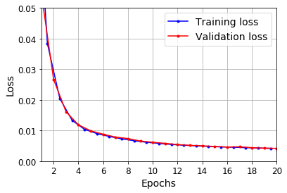

</div>
</div>
</div>


<div markdown="1" class="cell code_cell">
<div class="input_area" markdown="1">
```python
y_pred = model.predict(X_valid)
plot_series(X_valid[0, :, 0], y_valid[0, 0], y_pred[0, 0])
plt.show()

```
</div>

<div class="output_wrapper" markdown="1">
<div class="output_subarea" markdown="1">

{:.output_png}


</div>
</div>
</div>


### Using a Simple RNN


<div markdown="1" class="cell code_cell">
<div class="input_area" markdown="1">
```python
np.random.seed(42)
tf.random.set_seed(42)

model = keras.models.Sequential([
    keras.layers.SimpleRNN(1, input_shape=[None, 1])
])

optimizer = keras.optimizers.Adam(lr=0.005)
model.compile(loss="mse", optimizer=optimizer)
history = model.fit(X_train, y_train, epochs=20,
                    validation_data=(X_valid, y_valid))

```
</div>

<div class="output_wrapper" markdown="1">
<div class="output_subarea" markdown="1">
{:.output_stream}
```
Train on 7000 samples, validate on 2000 samples
Epoch 1/20
7000/7000 [==============================] - 3s 465us/sample - loss: 0.0960 - val_loss: 0.0482
Epoch 2/20
7000/7000 [==============================] - 3s 367us/sample - loss: 0.0366 - val_loss: 0.0293
Epoch 3/20
7000/7000 [==============================] - 3s 376us/sample - loss: 0.0251 - val_loss: 0.0216
Epoch 4/20
7000/7000 [==============================] - 3s 369us/sample - loss: 0.0196 - val_loss: 0.0175
Epoch 5/20
7000/7000 [==============================] - 3s 381us/sample - loss: 0.0165 - val_loss: 0.0150
Epoch 6/20
7000/7000 [==============================] - 3s 380us/sample - loss: 0.0145 - val_loss: 0.0133
Epoch 7/20
7000/7000 [==============================] - 3s 376us/sample - loss: 0.0132 - val_loss: 0.0123
Epoch 8/20
7000/7000 [==============================] - 3s 364us/sample - loss: 0.0123 - val_loss: 0.0116
Epoch 9/20
7000/7000 [==============================] - 3s 369us/sample - loss: 0.0118 - val_loss: 0.0112
Epoch 10/20
7000/7000 [==============================] - 3s 369us/sample - loss: 0.0116 - val_loss: 0.0110
Epoch 11/20
7000/7000 [==============================] - 3s 371us/sample - loss: 0.0114 - val_loss: 0.0109
Epoch 12/20
7000/7000 [==============================] - 3s 380us/sample - loss: 0.0114 - val_loss: 0.0109
Epoch 13/20
7000/7000 [==============================] - 3s 377us/sample - loss: 0.0114 - val_loss: 0.0109
Epoch 14/20
7000/7000 [==============================] - 3s 381us/sample - loss: 0.0114 - val_loss: 0.0109
Epoch 15/20
7000/7000 [==============================] - 3s 373us/sample - loss: 0.0114 - val_loss: 0.0109
Epoch 16/20
7000/7000 [==============================] - 3s 379us/sample - loss: 0.0114 - val_loss: 0.0109
Epoch 17/20
7000/7000 [==============================] - 3s 372us/sample - loss: 0.0114 - val_loss: 0.0109
Epoch 18/20
7000/7000 [==============================] - 3s 380us/sample - loss: 0.0114 - val_loss: 0.0110
Epoch 19/20
7000/7000 [==============================] - 3s 375us/sample - loss: 0.0114 - val_loss: 0.0109
Epoch 20/20
7000/7000 [==============================] - 3s 374us/sample - loss: 0.0114 - val_loss: 0.0108
```
</div>
</div>
</div>


<div markdown="1" class="cell code_cell">
<div class="input_area" markdown="1">
```python
model.evaluate(X_valid, y_valid)

```
</div>

<div class="output_wrapper" markdown="1">
<div class="output_subarea" markdown="1">
{:.output_stream}
```
2000/2000 [==============================] - 0s 194us/sample - loss: 0.0108
```
</div>
</div>
<div class="output_wrapper" markdown="1">
<div class="output_subarea" markdown="1">


{:.output_data_text}
```
0.010848855562508107
```


</div>
</div>
</div>


<div markdown="1" class="cell code_cell">
<div class="input_area" markdown="1">
```python
plot_learning_curves(history.history["loss"], history.history["val_loss"])
plt.show()

```
</div>

<div class="output_wrapper" markdown="1">
<div class="output_subarea" markdown="1">

{:.output_png}
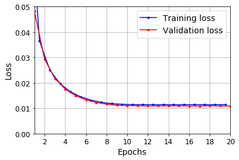

</div>
</div>
</div>


<div markdown="1" class="cell code_cell">
<div class="input_area" markdown="1">
```python
y_pred = model.predict(X_valid)
plot_series(X_valid[0, :, 0], y_valid[0, 0], y_pred[0, 0])
plt.show()

```
</div>

<div class="output_wrapper" markdown="1">
<div class="output_subarea" markdown="1">

{:.output_png}


</div>
</div>
</div>


## Deep RNNs


<div markdown="1" class="cell code_cell">
<div class="input_area" markdown="1">
```python
np.random.seed(42)
tf.random.set_seed(42)

model = keras.models.Sequential([
    keras.layers.SimpleRNN(20, return_sequences=True, input_shape=[None, 1]),
    keras.layers.SimpleRNN(20, return_sequences=True),
    keras.layers.SimpleRNN(1)
])

model.compile(loss="mse", optimizer="adam")
history = model.fit(X_train, y_train, epochs=20,
                    validation_data=(X_valid, y_valid))

```
</div>

<div class="output_wrapper" markdown="1">
<div class="output_subarea" markdown="1">
{:.output_stream}
```
Train on 7000 samples, validate on 2000 samples
Epoch 1/20
7000/7000 [==============================] - 10s 1ms/sample - loss: 0.0502 - val_loss: 0.0093
Epoch 2/20
7000/7000 [==============================] - 9s 1ms/sample - loss: 0.0069 - val_loss: 0.0055
Epoch 3/20
7000/7000 [==============================] - 9s 1ms/sample - loss: 0.0050 - val_loss: 0.0044
Epoch 4/20
7000/7000 [==============================] - 9s 1ms/sample - loss: 0.0048 - val_loss: 0.0040
Epoch 5/20
7000/7000 [==============================] - 9s 1ms/sample - loss: 0.0041 - val_loss: 0.0037
Epoch 6/20
7000/7000 [==============================] - 9s 1ms/sample - loss: 0.0041 - val_loss: 0.0043
Epoch 7/20
7000/7000 [==============================] - 9s 1ms/sample - loss: 0.0038 - val_loss: 0.0036
Epoch 8/20
7000/7000 [==============================] - 8s 1ms/sample - loss: 0.0037 - val_loss: 0.0032
Epoch 9/20
7000/7000 [==============================] - 8s 1ms/sample - loss: 0.0036 - val_loss: 0.0036
Epoch 10/20
7000/7000 [==============================] - 8s 1ms/sample - loss: 0.0035 - val_loss: 0.0031
Epoch 11/20
7000/7000 [==============================] - 8s 1ms/sample - loss: 0.0034 - val_loss: 0.0032
Epoch 12/20
7000/7000 [==============================] - 8s 1ms/sample - loss: 0.0034 - val_loss: 0.0036
Epoch 13/20
7000/7000 [==============================] - 8s 1ms/sample - loss: 0.0033 - val_loss: 0.0031
Epoch 14/20
7000/7000 [==============================] - 8s 1ms/sample - loss: 0.0033 - val_loss: 0.0030
Epoch 15/20
7000/7000 [==============================] - 8s 1ms/sample - loss: 0.0033 - val_loss: 0.0031
Epoch 16/20
7000/7000 [==============================] - 8s 1ms/sample - loss: 0.0033 - val_loss: 0.0029
Epoch 17/20
7000/7000 [==============================] - 8s 1ms/sample - loss: 0.0032 - val_loss: 0.0029
Epoch 18/20
7000/7000 [==============================] - 8s 1ms/sample - loss: 0.0032 - val_loss: 0.0029
Epoch 19/20
7000/7000 [==============================] - 8s 1ms/sample - loss: 0.0032 - val_loss: 0.0027
Epoch 20/20
7000/7000 [==============================] - 8s 1ms/sample - loss: 0.0031 - val_loss: 0.0029
```
</div>
</div>
</div>


<div markdown="1" class="cell code_cell">
<div class="input_area" markdown="1">
```python
model.evaluate(X_valid, y_valid)

```
</div>

<div class="output_wrapper" markdown="1">
<div class="output_subarea" markdown="1">
{:.output_stream}
```
2000/2000 [==============================] - 1s 567us/sample - loss: 0.0029
```
</div>
</div>
<div class="output_wrapper" markdown="1">
<div class="output_subarea" markdown="1">


{:.output_data_text}
```
0.002889613825827837
```


</div>
</div>
</div>


<div markdown="1" class="cell code_cell">
<div class="input_area" markdown="1">
```python
plot_learning_curves(history.history["loss"], history.history["val_loss"])
plt.show()

```
</div>

<div class="output_wrapper" markdown="1">
<div class="output_subarea" markdown="1">

{:.output_png}
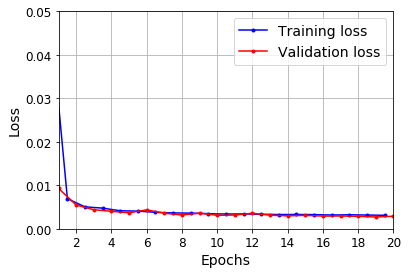

</div>
</div>
</div>


<div markdown="1" class="cell code_cell">
<div class="input_area" markdown="1">
```python
y_pred = model.predict(X_valid)
plot_series(X_valid[0, :, 0], y_valid[0, 0], y_pred[0, 0])
plt.show()

```
</div>

<div class="output_wrapper" markdown="1">
<div class="output_subarea" markdown="1">

{:.output_png}


</div>
</div>
</div>


Make the second `SimpleRNN` layer return only the last output:


<div markdown="1" class="cell code_cell">
<div class="input_area" markdown="1">
```python
np.random.seed(42)
tf.random.set_seed(42)

model = keras.models.Sequential([
    keras.layers.SimpleRNN(20, return_sequences=True, input_shape=[None, 1]),
    keras.layers.SimpleRNN(20),
    keras.layers.Dense(1)
])

model.compile(loss="mse", optimizer="adam")
history = model.fit(X_train, y_train, epochs=20,
                    validation_data=(X_valid, y_valid))

```
</div>

<div class="output_wrapper" markdown="1">
<div class="output_subarea" markdown="1">
{:.output_stream}
```
Train on 7000 samples, validate on 2000 samples
Epoch 1/20
7000/7000 [==============================] - 7s 976us/sample - loss: 0.0212 - val_loss: 0.0053
Epoch 2/20
7000/7000 [==============================] - 6s 811us/sample - loss: 0.0041 - val_loss: 0.0034
Epoch 3/20
7000/7000 [==============================] - 6s 809us/sample - loss: 0.0034 - val_loss: 0.0031
Epoch 4/20
7000/7000 [==============================] - 6s 804us/sample - loss: 0.0033 - val_loss: 0.0030
Epoch 5/20
7000/7000 [==============================] - 6s 823us/sample - loss: 0.0031 - val_loss: 0.0030
Epoch 6/20
7000/7000 [==============================] - 6s 842us/sample - loss: 0.0031 - val_loss: 0.0028
Epoch 7/20
7000/7000 [==============================] - 6s 839us/sample - loss: 0.0030 - val_loss: 0.0028
Epoch 8/20
7000/7000 [==============================] - 6s 806us/sample - loss: 0.0030 - val_loss: 0.0028
Epoch 9/20
7000/7000 [==============================] - 6s 810us/sample - loss: 0.0030 - val_loss: 0.0031
Epoch 10/20
7000/7000 [==============================] - 6s 805us/sample - loss: 0.0030 - val_loss: 0.0027
Epoch 11/20
7000/7000 [==============================] - 6s 802us/sample - loss: 0.0029 - val_loss: 0.0027
Epoch 12/20
7000/7000 [==============================] - 6s 807us/sample - loss: 0.0030 - val_loss: 0.0029
Epoch 13/20
7000/7000 [==============================] - 6s 801us/sample - loss: 0.0029 - val_loss: 0.0029
Epoch 14/20
7000/7000 [==============================] - 6s 818us/sample - loss: 0.0029 - val_loss: 0.0030
Epoch 15/20
7000/7000 [==============================] - 6s 806us/sample - loss: 0.0029 - val_loss: 0.0028
Epoch 16/20
7000/7000 [==============================] - 6s 820us/sample - loss: 0.0028 - val_loss: 0.0026
Epoch 17/20
7000/7000 [==============================] - 6s 809us/sample - loss: 0.0028 - val_loss: 0.0026
Epoch 18/20
7000/7000 [==============================] - 6s 821us/sample - loss: 0.0029 - val_loss: 0.0029
Epoch 19/20
7000/7000 [==============================] - 6s 806us/sample - loss: 0.0028 - val_loss: 0.0025
Epoch 20/20
7000/7000 [==============================] - 6s 816us/sample - loss: 0.0028 - val_loss: 0.0027
```
</div>
</div>
</div>


<div markdown="1" class="cell code_cell">
<div class="input_area" markdown="1">
```python
model.evaluate(X_valid, y_valid)

```
</div>

<div class="output_wrapper" markdown="1">
<div class="output_subarea" markdown="1">
{:.output_stream}
```
2000/2000 [==============================] - 1s 342us/sample - loss: 0.0027
```
</div>
</div>
<div class="output_wrapper" markdown="1">
<div class="output_subarea" markdown="1">


{:.output_data_text}
```
0.002677031420171261
```


</div>
</div>
</div>


<div markdown="1" class="cell code_cell">
<div class="input_area" markdown="1">
```python
plot_learning_curves(history.history["loss"], history.history["val_loss"])
plt.show()

```
</div>

<div class="output_wrapper" markdown="1">
<div class="output_subarea" markdown="1">

{:.output_png}
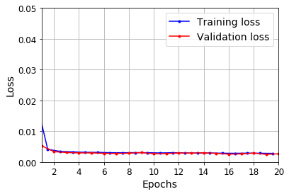

</div>
</div>
</div>


<div markdown="1" class="cell code_cell">
<div class="input_area" markdown="1">
```python
y_pred = model.predict(X_valid)
plot_series(X_valid[0, :, 0], y_valid[0, 0], y_pred[0, 0])
plt.show()

```
</div>

<div class="output_wrapper" markdown="1">
<div class="output_subarea" markdown="1">

{:.output_png}
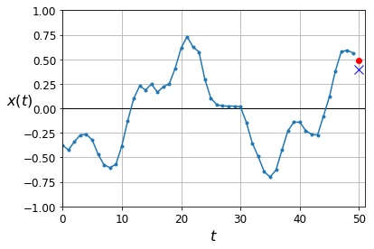

</div>
</div>
</div>


## Forecasting Several Steps Ahead


<div markdown="1" class="cell code_cell">
<div class="input_area" markdown="1">
```python
np.random.seed(43) # not 42, as it would give the first series in the train set

series = generate_time_series(1, n_steps + 10)
X_new, Y_new = series[:, :n_steps], series[:, n_steps:]
X = X_new
for step_ahead in range(10):
    y_pred_one = model.predict(X[:, step_ahead:])[:, np.newaxis, :]
    X = np.concatenate([X, y_pred_one], axis=1)

Y_pred = X[:, n_steps:]

```
</div>

</div>


<div markdown="1" class="cell code_cell">
<div class="input_area" markdown="1">
```python
Y_pred.shape

```
</div>

<div class="output_wrapper" markdown="1">
<div class="output_subarea" markdown="1">


{:.output_data_text}
```
(1, 10, 1)
```


</div>
</div>
</div>


<div markdown="1" class="cell code_cell">
<div class="input_area" markdown="1">
```python
def plot_multiple_forecasts(X, Y, Y_pred):
    n_steps = X.shape[1]
    ahead = Y.shape[1]
    plot_series(X[0, :, 0])
    plt.plot(np.arange(n_steps, n_steps + ahead), Y[0, :, 0], "ro-", label="Actual")
    plt.plot(np.arange(n_steps, n_steps + ahead), Y_pred[0, :, 0], "bx-", label="Forecast", markersize=10)
    plt.axis([0, n_steps + ahead, -1, 1])
    plt.legend(fontsize=14)

plot_multiple_forecasts(X_new, Y_new, Y_pred)
save_fig("forecast_ahead_plot")
plt.show()

```
</div>

<div class="output_wrapper" markdown="1">
<div class="output_subarea" markdown="1">
{:.output_stream}
```
Saving figure forecast_ahead_plot
```
</div>
</div>
<div class="output_wrapper" markdown="1">
<div class="output_subarea" markdown="1">

{:.output_png}
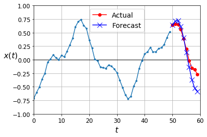

</div>
</div>
</div>


Now let's use this model to predict the next 10 values. We first need to regenerate the sequences with 9 more time steps.


<div markdown="1" class="cell code_cell">
<div class="input_area" markdown="1">
```python
np.random.seed(42)

n_steps = 50
series = generate_time_series(10000, n_steps + 10)
X_train, Y_train = series[:7000, :n_steps], series[:7000, -10:, 0]
X_valid, Y_valid = series[7000:9000, :n_steps], series[7000:9000, -10:, 0]
X_test, Y_test = series[9000:, :n_steps], series[9000:, -10:, 0]

```
</div>

</div>


Now let's predict the next 10 values one by one:


<div markdown="1" class="cell code_cell">
<div class="input_area" markdown="1">
```python
X = X_valid
for step_ahead in range(10):
    y_pred_one = model.predict(X)[:, np.newaxis, :]
    X = np.concatenate([X, y_pred_one], axis=1)

Y_pred = X[:, n_steps:, 0]

```
</div>

</div>


<div markdown="1" class="cell code_cell">
<div class="input_area" markdown="1">
```python
Y_pred.shape

```
</div>

<div class="output_wrapper" markdown="1">
<div class="output_subarea" markdown="1">


{:.output_data_text}
```
(2000, 10)
```


</div>
</div>
</div>


<div markdown="1" class="cell code_cell">
<div class="input_area" markdown="1">
```python
np.mean(keras.metrics.mean_squared_error(Y_valid, Y_pred))

```
</div>

<div class="output_wrapper" markdown="1">
<div class="output_subarea" markdown="1">


{:.output_data_text}
```
0.0285489
```


</div>
</div>
</div>


Let's compare this performance with some baselines: naive predictions and a simple linear model:


<div markdown="1" class="cell code_cell">
<div class="input_area" markdown="1">
```python
Y_naive_pred = Y_valid[:, -1:]
np.mean(keras.metrics.mean_squared_error(Y_valid, Y_naive_pred))

```
</div>

<div class="output_wrapper" markdown="1">
<div class="output_subarea" markdown="1">


{:.output_data_text}
```
0.22278848
```


</div>
</div>
</div>


<div markdown="1" class="cell code_cell">
<div class="input_area" markdown="1">
```python
np.random.seed(42)
tf.random.set_seed(42)

model = keras.models.Sequential([
    keras.layers.Flatten(input_shape=[50, 1]),
    keras.layers.Dense(10)
])

model.compile(loss="mse", optimizer="adam")
history = model.fit(X_train, Y_train, epochs=20,
                    validation_data=(X_valid, Y_valid))

```
</div>

<div class="output_wrapper" markdown="1">
<div class="output_subarea" markdown="1">
{:.output_stream}
```
Train on 7000 samples, validate on 2000 samples
Epoch 1/20
7000/7000 [==============================] - 0s 46us/sample - loss: 0.1334 - val_loss: 0.0605
Epoch 2/20
7000/7000 [==============================] - 0s 30us/sample - loss: 0.0498 - val_loss: 0.0424
Epoch 3/20
7000/7000 [==============================] - 0s 30us/sample - loss: 0.0385 - val_loss: 0.0356
Epoch 4/20
7000/7000 [==============================] - 0s 30us/sample - loss: 0.0332 - val_loss: 0.0313
Epoch 5/20
7000/7000 [==============================] - 0s 32us/sample - loss: 0.0298 - val_loss: 0.0284
Epoch 6/20
7000/7000 [==============================] - 0s 31us/sample - loss: 0.0274 - val_loss: 0.0264
Epoch 7/20
7000/7000 [==============================] - 0s 30us/sample - loss: 0.0256 - val_loss: 0.0248
Epoch 8/20
7000/7000 [==============================] - 0s 31us/sample - loss: 0.0244 - val_loss: 0.0239
Epoch 9/20
7000/7000 [==============================] - 0s 32us/sample - loss: 0.0234 - val_loss: 0.0229
Epoch 10/20
7000/7000 [==============================] - 0s 30us/sample - loss: 0.0226 - val_loss: 0.0223
Epoch 11/20
7000/7000 [==============================] - 0s 31us/sample - loss: 0.0220 - val_loss: 0.0216
Epoch 12/20
7000/7000 [==============================] - 0s 32us/sample - loss: 0.0215 - val_loss: 0.0213
Epoch 13/20
7000/7000 [==============================] - 0s 32us/sample - loss: 0.0210 - val_loss: 0.0207
Epoch 14/20
7000/7000 [==============================] - 0s 31us/sample - loss: 0.0207 - val_loss: 0.0204
Epoch 15/20
7000/7000 [==============================] - 0s 30us/sample - loss: 0.0203 - val_loss: 0.0201
Epoch 16/20
7000/7000 [==============================] - 0s 30us/sample - loss: 0.0199 - val_loss: 0.0196
Epoch 17/20
7000/7000 [==============================] - 0s 32us/sample - loss: 0.0196 - val_loss: 0.0196
Epoch 18/20
7000/7000 [==============================] - 0s 30us/sample - loss: 0.0194 - val_loss: 0.0191
Epoch 19/20
7000/7000 [==============================] - 0s 30us/sample - loss: 0.0191 - val_loss: 0.0189
Epoch 20/20
7000/7000 [==============================] - 0s 33us/sample - loss: 0.0188 - val_loss: 0.0188
```
</div>
</div>
</div>


Now let's create an RNN that predicts all 10 next values at once:


<div markdown="1" class="cell code_cell">
<div class="input_area" markdown="1">
```python
np.random.seed(42)
tf.random.set_seed(42)

model = keras.models.Sequential([
    keras.layers.SimpleRNN(20, return_sequences=True, input_shape=[None, 1]),
    keras.layers.SimpleRNN(20),
    keras.layers.Dense(10)
])

model.compile(loss="mse", optimizer="adam")
history = model.fit(X_train, Y_train, epochs=20,
                    validation_data=(X_valid, Y_valid))

```
</div>

<div class="output_wrapper" markdown="1">
<div class="output_subarea" markdown="1">
{:.output_stream}
```
Train on 7000 samples, validate on 2000 samples
Epoch 1/20
7000/7000 [==============================] - 7s 1ms/sample - loss: 0.0670 - val_loss: 0.0341
Epoch 2/20
7000/7000 [==============================] - 6s 867us/sample - loss: 0.0267 - val_loss: 0.0195
Epoch 3/20
7000/7000 [==============================] - 7s 961us/sample - loss: 0.0189 - val_loss: 0.0195
Epoch 4/20
7000/7000 [==============================] - 6s 903us/sample - loss: 0.0152 - val_loss: 0.0129
Epoch 5/20
7000/7000 [==============================] - 6s 870us/sample - loss: 0.0136 - val_loss: 0.0125
Epoch 6/20
7000/7000 [==============================] - 6s 914us/sample - loss: 0.0126 - val_loss: 0.0128
Epoch 7/20
7000/7000 [==============================] - 6s 860us/sample - loss: 0.0121 - val_loss: 0.0107
Epoch 8/20
7000/7000 [==============================] - 6s 840us/sample - loss: 0.0112 - val_loss: 0.0109
Epoch 9/20
7000/7000 [==============================] - 6s 886us/sample - loss: 0.0109 - val_loss: 0.0106
Epoch 10/20
7000/7000 [==============================] - 6s 857us/sample - loss: 0.0114 - val_loss: 0.0100
Epoch 11/20
7000/7000 [==============================] - 6s 841us/sample - loss: 0.0105 - val_loss: 0.0109
Epoch 12/20
7000/7000 [==============================] - 6s 824us/sample - loss: 0.0104 - val_loss: 0.0095
Epoch 13/20
7000/7000 [==============================] - 6s 823us/sample - loss: 0.0098 - val_loss: 0.0098
Epoch 14/20
7000/7000 [==============================] - 6s 839us/sample - loss: 0.0099 - val_loss: 0.0104
Epoch 15/20
7000/7000 [==============================] - 6s 818us/sample - loss: 0.0096 - val_loss: 0.0089
Epoch 16/20
7000/7000 [==============================] - 6s 821us/sample - loss: 0.0096 - val_loss: 0.0088
Epoch 17/20
7000/7000 [==============================] - 6s 827us/sample - loss: 0.0094 - val_loss: 0.0092
Epoch 18/20
7000/7000 [==============================] - 6s 840us/sample - loss: 0.0090 - val_loss: 0.0083
Epoch 19/20
7000/7000 [==============================] - 6s 812us/sample - loss: 0.0090 - val_loss: 0.0113
Epoch 20/20
7000/7000 [==============================] - 6s 808us/sample - loss: 0.0098 - val_loss: 0.0082
```
</div>
</div>
</div>


<div markdown="1" class="cell code_cell">
<div class="input_area" markdown="1">
```python
np.random.seed(43)

series = generate_time_series(1, 50 + 10)
X_new, Y_new = series[:, :50, :], series[:, -10:, :]
Y_pred = model.predict(X_new)[..., np.newaxis]

```
</div>

</div>


<div markdown="1" class="cell code_cell">
<div class="input_area" markdown="1">
```python
plot_multiple_forecasts(X_new, Y_new, Y_pred)
plt.show()

```
</div>

<div class="output_wrapper" markdown="1">
<div class="output_subarea" markdown="1">

{:.output_png}
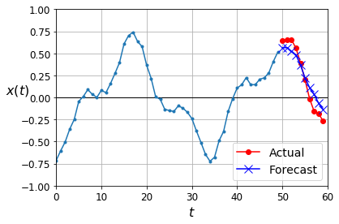

</div>
</div>
</div>


Now let's create an RNN that predicts the next 10 steps at each time step. That is, instead of just forecasting time steps 50 to 59 based on time steps 0 to 49, it will forecast time steps 1 to 10 at time step 0, then time steps 2 to 11 at time step 1, and so on, and finally it will forecast time steps 50 to 59 at the last time step. Notice that the model is causal: when it makes predictions at any time step, it can only see past time steps.


<div markdown="1" class="cell code_cell">
<div class="input_area" markdown="1">
```python
np.random.seed(42)

n_steps = 50
series = generate_time_series(10000, n_steps + 10)
X_train = series[:7000, :n_steps]
X_valid = series[7000:9000, :n_steps]
X_test = series[9000:, :n_steps]
Y = np.empty((10000, n_steps, 10))
for step_ahead in range(1, 10 + 1):
    Y[..., step_ahead - 1] = series[..., step_ahead:step_ahead + n_steps, 0]
Y_train = Y[:7000]
Y_valid = Y[7000:9000]
Y_test = Y[9000:]

```
</div>

</div>


<div markdown="1" class="cell code_cell">
<div class="input_area" markdown="1">
```python
X_train.shape, Y_train.shape

```
</div>

<div class="output_wrapper" markdown="1">
<div class="output_subarea" markdown="1">


{:.output_data_text}
```
((7000, 50, 1), (7000, 50, 10))
```


</div>
</div>
</div>


<div markdown="1" class="cell code_cell">
<div class="input_area" markdown="1">
```python
np.random.seed(42)
tf.random.set_seed(42)

model = keras.models.Sequential([
    keras.layers.SimpleRNN(20, return_sequences=True, input_shape=[None, 1]),
    keras.layers.SimpleRNN(20, return_sequences=True),
    keras.layers.TimeDistributed(keras.layers.Dense(10))
])

def last_time_step_mse(Y_true, Y_pred):
    return keras.metrics.mean_squared_error(Y_true[:, -1], Y_pred[:, -1])

model.compile(loss="mse", optimizer=keras.optimizers.Adam(lr=0.01), metrics=[last_time_step_mse])
history = model.fit(X_train, Y_train, epochs=20,
                    validation_data=(X_valid, Y_valid))

```
</div>

<div class="output_wrapper" markdown="1">
<div class="output_subarea" markdown="1">
{:.output_stream}
```
Train on 7000 samples, validate on 2000 samples
Epoch 1/20
7000/7000 [==============================] - 7s 1ms/sample - loss: 0.0505 - last_time_step_mse: 0.0395 - val_loss: 0.0422 - val_last_time_step_mse: 0.0321
Epoch 2/20
7000/7000 [==============================] - 6s 889us/sample - loss: 0.0408 - last_time_step_mse: 0.0306 - val_loss: 0.0421 - val_last_time_step_mse: 0.0350
Epoch 3/20
7000/7000 [==============================] - 6s 897us/sample - loss: 0.0376 - last_time_step_mse: 0.0291 - val_loss: 0.0345 - val_last_time_step_mse: 0.0270
Epoch 4/20
7000/7000 [==============================] - 6s 891us/sample - loss: 0.0317 - last_time_step_mse: 0.0215 - val_loss: 0.0274 - val_last_time_step_mse: 0.0155
Epoch 5/20
7000/7000 [==============================] - 6s 879us/sample - loss: 0.0279 - last_time_step_mse: 0.0166 - val_loss: 0.0259 - val_last_time_step_mse: 0.0136
Epoch 6/20
7000/7000 [==============================] - 6s 875us/sample - loss: 0.0244 - last_time_step_mse: 0.0120 - val_loss: 0.0233 - val_last_time_step_mse: 0.0105
Epoch 7/20
7000/7000 [==============================] - 6s 880us/sample - loss: 0.0225 - last_time_step_mse: 0.0101 - val_loss: 0.0213 - val_last_time_step_mse: 0.0091
Epoch 8/20
7000/7000 [==============================] - 6s 900us/sample - loss: 0.0210 - last_time_step_mse: 0.0086 - val_loss: 0.0201 - val_last_time_step_mse: 0.0082
Epoch 9/20
7000/7000 [==============================] - 6s 895us/sample - loss: 0.0203 - last_time_step_mse: 0.0080 - val_loss: 0.0212 - val_last_time_step_mse: 0.0097
Epoch 10/20
7000/7000 [==============================] - 6s 845us/sample - loss: 0.0198 - last_time_step_mse: 0.0076 - val_loss: 0.0196 - val_last_time_step_mse: 0.0080
Epoch 11/20
7000/7000 [==============================] - 6s 843us/sample - loss: 0.0196 - last_time_step_mse: 0.0074 - val_loss: 0.0188 - val_last_time_step_mse: 0.0068
Epoch 12/20
7000/7000 [==============================] - 6s 837us/sample - loss: 0.0191 - last_time_step_mse: 0.0071 - val_loss: 0.0190 - val_last_time_step_mse: 0.0067
Epoch 13/20
7000/7000 [==============================] - 6s 881us/sample - loss: 0.0189 - last_time_step_mse: 0.0069 - val_loss: 0.0184 - val_last_time_step_mse: 0.0068
Epoch 14/20
7000/7000 [==============================] - 6s 855us/sample - loss: 0.0193 - last_time_step_mse: 0.0076 - val_loss: 0.0198 - val_last_time_step_mse: 0.0079
Epoch 15/20
7000/7000 [==============================] - 6s 847us/sample - loss: 0.0189 - last_time_step_mse: 0.0070 - val_loss: 0.0181 - val_last_time_step_mse: 0.0065
Epoch 16/20
7000/7000 [==============================] - 6s 849us/sample - loss: 0.0189 - last_time_step_mse: 0.0072 - val_loss: 0.0180 - val_last_time_step_mse: 0.0058
Epoch 17/20
7000/7000 [==============================] - 6s 837us/sample - loss: 0.0186 - last_time_step_mse: 0.0068 - val_loss: 0.0173 - val_last_time_step_mse: 0.0056
Epoch 18/20
7000/7000 [==============================] - 6s 831us/sample - loss: 0.0181 - last_time_step_mse: 0.0063 - val_loss: 0.0184 - val_last_time_step_mse: 0.0072
Epoch 19/20
7000/7000 [==============================] - 6s 830us/sample - loss: 0.0184 - last_time_step_mse: 0.0067 - val_loss: 0.0180 - val_last_time_step_mse: 0.0066
Epoch 20/20
7000/7000 [==============================] - 6s 848us/sample - loss: 0.0181 - last_time_step_mse: 0.0066 - val_loss: 0.0198 - val_last_time_step_mse: 0.0095
```
</div>
</div>
</div>


<div markdown="1" class="cell code_cell">
<div class="input_area" markdown="1">
```python
np.random.seed(43)

series = generate_time_series(1, 50 + 10)
X_new, Y_new = series[:, :50, :], series[:, 50:, :]
Y_pred = model.predict(X_new)[:, -1][..., np.newaxis]

```
</div>

</div>


<div markdown="1" class="cell code_cell">
<div class="input_area" markdown="1">
```python
plot_multiple_forecasts(X_new, Y_new, Y_pred)
plt.show()

```
</div>

<div class="output_wrapper" markdown="1">
<div class="output_subarea" markdown="1">

{:.output_png}
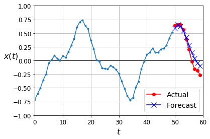

</div>
</div>
</div>


# Deep RNN with Batch Norm


<div markdown="1" class="cell code_cell">
<div class="input_area" markdown="1">
```python
np.random.seed(42)
tf.random.set_seed(42)

model = keras.models.Sequential([
    keras.layers.SimpleRNN(20, return_sequences=True, input_shape=[None, 1]),
    keras.layers.BatchNormalization(),
    keras.layers.SimpleRNN(20, return_sequences=True),
    keras.layers.BatchNormalization(),
    keras.layers.TimeDistributed(keras.layers.Dense(10))
])

model.compile(loss="mse", optimizer="adam", metrics=[last_time_step_mse])
history = model.fit(X_train, Y_train, epochs=20,
                    validation_data=(X_valid, Y_valid))

```
</div>

<div class="output_wrapper" markdown="1">
<div class="output_subarea" markdown="1">
{:.output_stream}
```
Train on 7000 samples, validate on 2000 samples
Epoch 1/20
7000/7000 [==============================] - 8s 1ms/sample - loss: 0.1939 - last_time_step_mse: 0.1922 - val_loss: 0.0876 - val_last_time_step_mse: 0.0834
Epoch 2/20
7000/7000 [==============================] - 6s 840us/sample - loss: 0.0536 - last_time_step_mse: 0.0448 - val_loss: 0.0553 - val_last_time_step_mse: 0.0467
Epoch 3/20
7000/7000 [==============================] - 6s 854us/sample - loss: 0.0472 - last_time_step_mse: 0.0377 - val_loss: 0.0450 - val_last_time_step_mse: 0.0353
Epoch 4/20
7000/7000 [==============================] - 6s 843us/sample - loss: 0.0438 - last_time_step_mse: 0.0338 - val_loss: 0.0423 - val_last_time_step_mse: 0.0331
Epoch 5/20
7000/7000 [==============================] - 6s 849us/sample - loss: 0.0408 - last_time_step_mse: 0.0304 - val_loss: 0.0394 - val_last_time_step_mse: 0.0285
Epoch 6/20
7000/7000 [==============================] - 6s 835us/sample - loss: 0.0385 - last_time_step_mse: 0.0277 - val_loss: 0.0381 - val_last_time_step_mse: 0.0274
Epoch 7/20
7000/7000 [==============================] - 6s 831us/sample - loss: 0.0365 - last_time_step_mse: 0.0253 - val_loss: 0.0363 - val_last_time_step_mse: 0.0244
Epoch 8/20
7000/7000 [==============================] - 6s 829us/sample - loss: 0.0350 - last_time_step_mse: 0.0236 - val_loss: 0.0348 - val_last_time_step_mse: 0.0242
Epoch 9/20
7000/7000 [==============================] - 6s 830us/sample - loss: 0.0339 - last_time_step_mse: 0.0223 - val_loss: 0.0333 - val_last_time_step_mse: 0.0212
Epoch 10/20
7000/7000 [==============================] - 6s 830us/sample - loss: 0.0330 - last_time_step_mse: 0.0215 - val_loss: 0.0345 - val_last_time_step_mse: 0.0241
Epoch 11/20
7000/7000 [==============================] - 6s 835us/sample - loss: 0.0321 - last_time_step_mse: 0.0206 - val_loss: 0.0319 - val_last_time_step_mse: 0.0203
Epoch 12/20
7000/7000 [==============================] - 6s 843us/sample - loss: 0.0316 - last_time_step_mse: 0.0199 - val_loss: 0.0314 - val_last_time_step_mse: 0.0200
Epoch 13/20
7000/7000 [==============================] - 6s 842us/sample - loss: 0.0312 - last_time_step_mse: 0.0195 - val_loss: 0.0313 - val_last_time_step_mse: 0.0195
Epoch 14/20
7000/7000 [==============================] - 6s 844us/sample - loss: 0.0307 - last_time_step_mse: 0.0190 - val_loss: 0.0339 - val_last_time_step_mse: 0.0227
Epoch 15/20
7000/7000 [==============================] - 6s 845us/sample - loss: 0.0303 - last_time_step_mse: 0.0183 - val_loss: 0.0306 - val_last_time_step_mse: 0.0184
Epoch 16/20
7000/7000 [==============================] - 6s 846us/sample - loss: 0.0297 - last_time_step_mse: 0.0178 - val_loss: 0.0292 - val_last_time_step_mse: 0.0172
Epoch 17/20
7000/7000 [==============================] - 6s 840us/sample - loss: 0.0294 - last_time_step_mse: 0.0174 - val_loss: 0.0291 - val_last_time_step_mse: 0.0168
Epoch 18/20
7000/7000 [==============================] - 6s 845us/sample - loss: 0.0291 - last_time_step_mse: 0.0172 - val_loss: 0.0286 - val_last_time_step_mse: 0.0160
Epoch 19/20
7000/7000 [==============================] - 6s 841us/sample - loss: 0.0288 - last_time_step_mse: 0.0169 - val_loss: 0.0294 - val_last_time_step_mse: 0.0174
Epoch 20/20
7000/7000 [==============================] - 6s 838us/sample - loss: 0.0282 - last_time_step_mse: 0.0161 - val_loss: 0.0289 - val_last_time_step_mse: 0.0171
```
</div>
</div>
</div>


# Deep RNNs with Layer Norm


<div markdown="1" class="cell code_cell">
<div class="input_area" markdown="1">
```python
from tensorflow.keras.layers import LayerNormalization

```
</div>

</div>


<div markdown="1" class="cell code_cell">
<div class="input_area" markdown="1">
```python
class LNSimpleRNNCell(keras.layers.Layer):
    def __init__(self, units, activation="tanh", **kwargs):
        super().__init__(**kwargs)
        self.state_size = units
        self.output_size = units
        self.simple_rnn_cell = keras.layers.SimpleRNNCell(units,
                                                          activation=None)
        self.layer_norm = LayerNormalization()
        self.activation = keras.activations.get(activation)
    def get_initial_state(self, inputs=None, batch_size=None, dtype=None):
        if inputs is not None:
            batch_size = tf.shape(inputs)[0]
            dtype = inputs.dtype
        return [tf.zeros([batch_size, self.state_size], dtype=dtype)]
    def call(self, inputs, states):
        outputs, new_states = self.simple_rnn_cell(inputs, states)
        norm_outputs = self.activation(self.layer_norm(outputs))
        return norm_outputs, [norm_outputs]

```
</div>

</div>


<div markdown="1" class="cell code_cell">
<div class="input_area" markdown="1">
```python
np.random.seed(42)
tf.random.set_seed(42)

model = keras.models.Sequential([
    keras.layers.RNN(LNSimpleRNNCell(20), return_sequences=True,
                     input_shape=[None, 1]),
    keras.layers.RNN(LNSimpleRNNCell(20), return_sequences=True),
    keras.layers.TimeDistributed(keras.layers.Dense(10))
])

model.compile(loss="mse", optimizer="adam", metrics=[last_time_step_mse])
history = model.fit(X_train, Y_train, epochs=20,
                    validation_data=(X_valid, Y_valid))

```
</div>

<div class="output_wrapper" markdown="1">
<div class="output_subarea" markdown="1">
{:.output_stream}
```
Train on 7000 samples, validate on 2000 samples
Epoch 1/20
7000/7000 [==============================] - 16s 2ms/sample - loss: 0.1636 - last_time_step_mse: 0.1493 - val_loss: 0.0725 - val_last_time_step_mse: 0.0675
Epoch 2/20
7000/7000 [==============================] - 13s 2ms/sample - loss: 0.0629 - last_time_step_mse: 0.0548 - val_loss: 0.0562 - val_last_time_step_mse: 0.0448
Epoch 3/20
7000/7000 [==============================] - 13s 2ms/sample - loss: 0.0528 - last_time_step_mse: 0.0415 - val_loss: 0.0487 - val_last_time_step_mse: 0.0357
Epoch 4/20
7000/7000 [==============================] - 13s 2ms/sample - loss: 0.0466 - last_time_step_mse: 0.0344 - val_loss: 0.0443 - val_last_time_step_mse: 0.0315
Epoch 5/20
7000/7000 [==============================] - 13s 2ms/sample - loss: 0.0428 - last_time_step_mse: 0.0306 - val_loss: 0.0408 - val_last_time_step_mse: 0.0284
Epoch 6/20
7000/7000 [==============================] - 13s 2ms/sample - loss: 0.0398 - last_time_step_mse: 0.0275 - val_loss: 0.0377 - val_last_time_step_mse: 0.0246
Epoch 7/20
7000/7000 [==============================] - 13s 2ms/sample - loss: 0.0376 - last_time_step_mse: 0.0257 - val_loss: 0.0368 - val_last_time_step_mse: 0.0254
Epoch 8/20
7000/7000 [==============================] - 13s 2ms/sample - loss: 0.0356 - last_time_step_mse: 0.0237 - val_loss: 0.0351 - val_last_time_step_mse: 0.0240
Epoch 9/20
7000/7000 [==============================] - 13s 2ms/sample - loss: 0.0343 - last_time_step_mse: 0.0223 - val_loss: 0.0333 - val_last_time_step_mse: 0.0210
Epoch 10/20
7000/7000 [==============================] - 14s 2ms/sample - loss: 0.0331 - last_time_step_mse: 0.0211 - val_loss: 0.0321 - val_last_time_step_mse: 0.0199
Epoch 11/20
7000/7000 [==============================] - 13s 2ms/sample - loss: 0.0323 - last_time_step_mse: 0.0203 - val_loss: 0.0316 - val_last_time_step_mse: 0.0193
Epoch 12/20
7000/7000 [==============================] - 14s 2ms/sample - loss: 0.0317 - last_time_step_mse: 0.0196 - val_loss: 0.0311 - val_last_time_step_mse: 0.0198
Epoch 13/20
7000/7000 [==============================] - 13s 2ms/sample - loss: 0.0309 - last_time_step_mse: 0.0188 - val_loss: 0.0301 - val_last_time_step_mse: 0.0169
Epoch 14/20
7000/7000 [==============================] - 13s 2ms/sample - loss: 0.0304 - last_time_step_mse: 0.0181 - val_loss: 0.0296 - val_last_time_step_mse: 0.0171
Epoch 15/20
7000/7000 [==============================] - 13s 2ms/sample - loss: 0.0299 - last_time_step_mse: 0.0174 - val_loss: 0.0295 - val_last_time_step_mse: 0.0168
Epoch 16/20
7000/7000 [==============================] - 13s 2ms/sample - loss: 0.0295 - last_time_step_mse: 0.0170 - val_loss: 0.0293 - val_last_time_step_mse: 0.0171
Epoch 17/20
7000/7000 [==============================] - 13s 2ms/sample - loss: 0.0292 - last_time_step_mse: 0.0166 - val_loss: 0.0288 - val_last_time_step_mse: 0.0162
Epoch 18/20
7000/7000 [==============================] - 13s 2ms/sample - loss: 0.0288 - last_time_step_mse: 0.0160 - val_loss: 0.0294 - val_last_time_step_mse: 0.0175
Epoch 19/20
7000/7000 [==============================] - 13s 2ms/sample - loss: 0.0284 - last_time_step_mse: 0.0158 - val_loss: 0.0277 - val_last_time_step_mse: 0.0151
Epoch 20/20
7000/7000 [==============================] - 13s 2ms/sample - loss: 0.0281 - last_time_step_mse: 0.0153 - val_loss: 0.0275 - val_last_time_step_mse: 0.0149
```
</div>
</div>
</div>


# Creating a Custom RNN Class


<div markdown="1" class="cell code_cell">
<div class="input_area" markdown="1">
```python
class MyRNN(keras.layers.Layer):
    def __init__(self, cell, return_sequences=False, **kwargs):
        super().__init__(**kwargs)
        self.cell = cell
        self.return_sequences = return_sequences
        self.get_initial_state = getattr(
            self.cell, "get_initial_state", self.fallback_initial_state)
    def fallback_initial_state(self, inputs):
        return [tf.zeros([self.cell.state_size], dtype=inputs.dtype)]
    @tf.function
    def call(self, inputs):
        states = self.get_initial_state(inputs)
        n_steps = tf.shape(inputs)[1]
        if self.return_sequences:
            sequences = tf.TensorArray(inputs.dtype, size=n_steps)
        outputs = tf.zeros(shape=[n_steps, self.cell.output_size], dtype=inputs.dtype)
        for step in tf.range(n_steps):
            outputs, states = self.cell(inputs[:, step], states)
            if self.return_sequences:
                sequences = sequences.write(step, outputs)
        if self.return_sequences:
            return sequences.stack()
        else:
            return outputs

```
</div>

</div>


<div markdown="1" class="cell code_cell">
<div class="input_area" markdown="1">
```python
np.random.seed(42)
tf.random.set_seed(42)

model = keras.models.Sequential([
    MyRNN(LNSimpleRNNCell(20), return_sequences=True,
          input_shape=[None, 1]),
    MyRNN(LNSimpleRNNCell(20), return_sequences=True),
    keras.layers.TimeDistributed(keras.layers.Dense(10))
])

model.compile(loss="mse", optimizer="adam", metrics=[last_time_step_mse])
history = model.fit(X_train, Y_train, epochs=20,
                    validation_data=(X_valid, Y_valid))

```
</div>

<div class="output_wrapper" markdown="1">
<div class="output_subarea" markdown="1">
{:.output_stream}
```
Train on 7000 samples, validate on 2000 samples
Epoch 1/20
7000/7000 [==============================] - 16s 2ms/sample - loss: 0.2296 - last_time_step_mse: 0.2117 - val_loss: 0.1150 - val_last_time_step_mse: 0.1047
Epoch 2/20
7000/7000 [==============================] - 13s 2ms/sample - loss: 0.0869 - last_time_step_mse: 0.0769 - val_loss: 0.0637 - val_last_time_step_mse: 0.0535
Epoch 3/20
7000/7000 [==============================] - 13s 2ms/sample - loss: 0.0562 - last_time_step_mse: 0.0452 - val_loss: 0.0514 - val_last_time_step_mse: 0.0397
Epoch 4/20
7000/7000 [==============================] - 13s 2ms/sample - loss: 0.0475 - last_time_step_mse: 0.0342 - val_loss: 0.0433 - val_last_time_step_mse: 0.0279
Epoch 5/20
7000/7000 [==============================] - 13s 2ms/sample - loss: 0.0414 - last_time_step_mse: 0.0268 - val_loss: 0.0393 - val_last_time_step_mse: 0.0244
Epoch 6/20
7000/7000 [==============================] - 13s 2ms/sample - loss: 0.0380 - last_time_step_mse: 0.0232 - val_loss: 0.0366 - val_last_time_step_mse: 0.0215
Epoch 7/20
7000/7000 [==============================] - 13s 2ms/sample - loss: 0.0357 - last_time_step_mse: 0.0210 - val_loss: 0.0342 - val_last_time_step_mse: 0.0192
Epoch 8/20
7000/7000 [==============================] - 13s 2ms/sample - loss: 0.0347 - last_time_step_mse: 0.0202 - val_loss: 0.0361 - val_last_time_step_mse: 0.0214
Epoch 9/20
7000/7000 [==============================] - 13s 2ms/sample - loss: 0.0339 - last_time_step_mse: 0.0192 - val_loss: 0.0329 - val_last_time_step_mse: 0.0175
Epoch 10/20
7000/7000 [==============================] - 13s 2ms/sample - loss: 0.0327 - last_time_step_mse: 0.0181 - val_loss: 0.0320 - val_last_time_step_mse: 0.0171
Epoch 11/20
7000/7000 [==============================] - 13s 2ms/sample - loss: 0.0319 - last_time_step_mse: 0.0176 - val_loss: 0.0315 - val_last_time_step_mse: 0.0170
Epoch 12/20
7000/7000 [==============================] - 13s 2ms/sample - loss: 0.0311 - last_time_step_mse: 0.0171 - val_loss: 0.0307 - val_last_time_step_mse: 0.0161
Epoch 13/20
7000/7000 [==============================] - 13s 2ms/sample - loss: 0.0307 - last_time_step_mse: 0.0166 - val_loss: 0.0304 - val_last_time_step_mse: 0.0166
Epoch 14/20
7000/7000 [==============================] - 14s 2ms/sample - loss: 0.0302 - last_time_step_mse: 0.0163 - val_loss: 0.0300 - val_last_time_step_mse: 0.0159
Epoch 15/20
7000/7000 [==============================] - 14s 2ms/sample - loss: 0.0297 - last_time_step_mse: 0.0159 - val_loss: 0.0294 - val_last_time_step_mse: 0.0154
Epoch 16/20
7000/7000 [==============================] - 14s 2ms/sample - loss: 0.0293 - last_time_step_mse: 0.0155 - val_loss: 0.0291 - val_last_time_step_mse: 0.0155
Epoch 17/20
7000/7000 [==============================] - 14s 2ms/sample - loss: 0.0288 - last_time_step_mse: 0.0151 - val_loss: 0.0283 - val_last_time_step_mse: 0.0141
Epoch 18/20
7000/7000 [==============================] - 14s 2ms/sample - loss: 0.0283 - last_time_step_mse: 0.0146 - val_loss: 0.0287 - val_last_time_step_mse: 0.0153
Epoch 19/20
7000/7000 [==============================] - 14s 2ms/sample - loss: 0.0280 - last_time_step_mse: 0.0144 - val_loss: 0.0275 - val_last_time_step_mse: 0.0134
Epoch 20/20
7000/7000 [==============================] - 14s 2ms/sample - loss: 0.0275 - last_time_step_mse: 0.0138 - val_loss: 0.0276 - val_last_time_step_mse: 0.0139
```
</div>
</div>
</div>


# LSTMs


<div markdown="1" class="cell code_cell">
<div class="input_area" markdown="1">
```python
np.random.seed(42)
tf.random.set_seed(42)

model = keras.models.Sequential([
    keras.layers.LSTM(20, return_sequences=True, input_shape=[None, 1]),
    keras.layers.LSTM(20, return_sequences=True),
    keras.layers.TimeDistributed(keras.layers.Dense(10))
])

model.compile(loss="mse", optimizer="adam", metrics=[last_time_step_mse])
history = model.fit(X_train, Y_train, epochs=20,
                    validation_data=(X_valid, Y_valid))

```
</div>

<div class="output_wrapper" markdown="1">
<div class="output_subarea" markdown="1">
{:.output_stream}
```
Train on 7000 samples, validate on 2000 samples
Epoch 1/20
7000/7000 [==============================] - 14s 2ms/sample - loss: 0.0759 - last_time_step_mse: 0.0615 - val_loss: 0.0551 - val_last_time_step_mse: 0.0364
Epoch 2/20
7000/7000 [==============================] - 11s 2ms/sample - loss: 0.0477 - last_time_step_mse: 0.0275 - val_loss: 0.0421 - val_last_time_step_mse: 0.0211
Epoch 3/20
7000/7000 [==============================] - 12s 2ms/sample - loss: 0.0390 - last_time_step_mse: 0.0183 - val_loss: 0.0364 - val_last_time_step_mse: 0.0151
Epoch 4/20
7000/7000 [==============================] - 12s 2ms/sample - loss: 0.0351 - last_time_step_mse: 0.0152 - val_loss: 0.0336 - val_last_time_step_mse: 0.0132
Epoch 5/20
7000/7000 [==============================] - 12s 2ms/sample - loss: 0.0327 - last_time_step_mse: 0.0135 - val_loss: 0.0314 - val_last_time_step_mse: 0.0121
Epoch 6/20
7000/7000 [==============================] - 12s 2ms/sample - loss: 0.0311 - last_time_step_mse: 0.0126 - val_loss: 0.0302 - val_last_time_step_mse: 0.0114
Epoch 7/20
7000/7000 [==============================] - 12s 2ms/sample - loss: 0.0300 - last_time_step_mse: 0.0120 - val_loss: 0.0293 - val_last_time_step_mse: 0.0111
Epoch 8/20
7000/7000 [==============================] - 11s 2ms/sample - loss: 0.0292 - last_time_step_mse: 0.0115 - val_loss: 0.0283 - val_last_time_step_mse: 0.0103
Epoch 9/20
7000/7000 [==============================] - 12s 2ms/sample - loss: 0.0283 - last_time_step_mse: 0.0110 - val_loss: 0.0289 - val_last_time_step_mse: 0.0112
Epoch 10/20
7000/7000 [==============================] - 12s 2ms/sample - loss: 0.0277 - last_time_step_mse: 0.0105 - val_loss: 0.0272 - val_last_time_step_mse: 0.0102
Epoch 11/20
7000/7000 [==============================] - 12s 2ms/sample - loss: 0.0271 - last_time_step_mse: 0.0104 - val_loss: 0.0268 - val_last_time_step_mse: 0.0101
Epoch 12/20
7000/7000 [==============================] - 12s 2ms/sample - loss: 0.0266 - last_time_step_mse: 0.0100 - val_loss: 0.0268 - val_last_time_step_mse: 0.0102
Epoch 13/20
7000/7000 [==============================] - 12s 2ms/sample - loss: 0.0262 - last_time_step_mse: 0.0098 - val_loss: 0.0260 - val_last_time_step_mse: 0.0100
Epoch 14/20
7000/7000 [==============================] - 12s 2ms/sample - loss: 0.0259 - last_time_step_mse: 0.0098 - val_loss: 0.0254 - val_last_time_step_mse: 0.0095
Epoch 15/20
7000/7000 [==============================] - 11s 2ms/sample - loss: 0.0255 - last_time_step_mse: 0.0097 - val_loss: 0.0259 - val_last_time_step_mse: 0.0112
Epoch 16/20
7000/7000 [==============================] - 13s 2ms/sample - loss: 0.0252 - last_time_step_mse: 0.0095 - val_loss: 0.0250 - val_last_time_step_mse: 0.0098
Epoch 17/20
7000/7000 [==============================] - 15s 2ms/sample - loss: 0.0248 - last_time_step_mse: 0.0093 - val_loss: 0.0245 - val_last_time_step_mse: 0.0091
Epoch 18/20
7000/7000 [==============================] - 14s 2ms/sample - loss: 0.0245 - last_time_step_mse: 0.0091 - val_loss: 0.0247 - val_last_time_step_mse: 0.0101
Epoch 19/20
7000/7000 [==============================] - 14s 2ms/sample - loss: 0.0242 - last_time_step_mse: 0.0090 - val_loss: 0.0240 - val_last_time_step_mse: 0.0090
Epoch 20/20
7000/7000 [==============================] - 13s 2ms/sample - loss: 0.0239 - last_time_step_mse: 0.0089 - val_loss: 0.0237 - val_last_time_step_mse: 0.0085
```
</div>
</div>
</div>


<div markdown="1" class="cell code_cell">
<div class="input_area" markdown="1">
```python
model.evaluate(X_valid, Y_valid)

```
</div>

<div class="output_wrapper" markdown="1">
<div class="output_subarea" markdown="1">
{:.output_stream}
```
2000/2000 [==============================] - 2s 753us/sample - loss: 0.0237 - last_time_step_mse: 0.0085
```
</div>
</div>
<div class="output_wrapper" markdown="1">
<div class="output_subarea" markdown="1">


{:.output_data_text}
```
[0.023689542233943938, 0.008518972]
```


</div>
</div>
</div>


<div markdown="1" class="cell code_cell">
<div class="input_area" markdown="1">
```python
plot_learning_curves(history.history["loss"], history.history["val_loss"])
plt.show()

```
</div>

<div class="output_wrapper" markdown="1">
<div class="output_subarea" markdown="1">

{:.output_png}
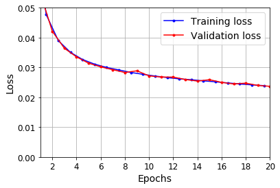

</div>
</div>
</div>


<div markdown="1" class="cell code_cell">
<div class="input_area" markdown="1">
```python
np.random.seed(43)

series = generate_time_series(1, 50 + 10)
X_new, Y_new = series[:, :50, :], series[:, 50:, :]
Y_pred = model.predict(X_new)[:, -1][..., np.newaxis]

```
</div>

</div>


<div markdown="1" class="cell code_cell">
<div class="input_area" markdown="1">
```python
plot_multiple_forecasts(X_new, Y_new, Y_pred)
plt.show()

```
</div>

<div class="output_wrapper" markdown="1">
<div class="output_subarea" markdown="1">

{:.output_png}
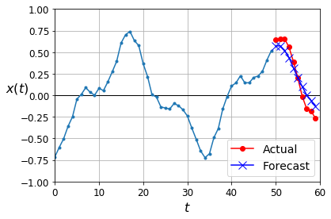

</div>
</div>
</div>


# GRUs


<div markdown="1" class="cell code_cell">
<div class="input_area" markdown="1">
```python
np.random.seed(42)
tf.random.set_seed(42)

model = keras.models.Sequential([
    keras.layers.GRU(20, return_sequences=True, input_shape=[None, 1]),
    keras.layers.GRU(20, return_sequences=True),
    keras.layers.TimeDistributed(keras.layers.Dense(10))
])

model.compile(loss="mse", optimizer="adam", metrics=[last_time_step_mse])
history = model.fit(X_train, Y_train, epochs=20,
                    validation_data=(X_valid, Y_valid))

```
</div>

<div class="output_wrapper" markdown="1">
<div class="output_subarea" markdown="1">
{:.output_stream}
```
Train on 7000 samples, validate on 2000 samples
Epoch 1/20
7000/7000 [==============================] - 21s 3ms/sample - loss: 0.0742 - last_time_step_mse: 0.0667 - val_loss: 0.0528 - val_last_time_step_mse: 0.0414
Epoch 2/20
7000/7000 [==============================] - 15s 2ms/sample - loss: 0.0476 - last_time_step_mse: 0.0365 - val_loss: 0.0440 - val_last_time_step_mse: 0.0326
Epoch 3/20
7000/7000 [==============================] - 14s 2ms/sample - loss: 0.0418 - last_time_step_mse: 0.0303 - val_loss: 0.0394 - val_last_time_step_mse: 0.0271
Epoch 4/20
7000/7000 [==============================] - 14s 2ms/sample - loss: 0.0373 - last_time_step_mse: 0.0249 - val_loss: 0.0359 - val_last_time_step_mse: 0.0226
Epoch 5/20
7000/7000 [==============================] - 14s 2ms/sample - loss: 0.0328 - last_time_step_mse: 0.0181 - val_loss: 0.0316 - val_last_time_step_mse: 0.0168
Epoch 6/20
7000/7000 [==============================] - 14s 2ms/sample - loss: 0.0308 - last_time_step_mse: 0.0157 - val_loss: 0.0299 - val_last_time_step_mse: 0.0146
Epoch 7/20
7000/7000 [==============================] - 14s 2ms/sample - loss: 0.0298 - last_time_step_mse: 0.0149 - val_loss: 0.0289 - val_last_time_step_mse: 0.0137
Epoch 8/20
7000/7000 [==============================] - 15s 2ms/sample - loss: 0.0288 - last_time_step_mse: 0.0140 - val_loss: 0.0282 - val_last_time_step_mse: 0.0136
Epoch 9/20
7000/7000 [==============================] - 14s 2ms/sample - loss: 0.0280 - last_time_step_mse: 0.0135 - val_loss: 0.0274 - val_last_time_step_mse: 0.0126
Epoch 10/20
7000/7000 [==============================] - 14s 2ms/sample - loss: 0.0272 - last_time_step_mse: 0.0126 - val_loss: 0.0268 - val_last_time_step_mse: 0.0126
Epoch 11/20
7000/7000 [==============================] - 14s 2ms/sample - loss: 0.0269 - last_time_step_mse: 0.0126 - val_loss: 0.0262 - val_last_time_step_mse: 0.0120
Epoch 12/20
7000/7000 [==============================] - 14s 2ms/sample - loss: 0.0264 - last_time_step_mse: 0.0122 - val_loss: 0.0264 - val_last_time_step_mse: 0.0128
Epoch 13/20
7000/7000 [==============================] - 14s 2ms/sample - loss: 0.0261 - last_time_step_mse: 0.0120 - val_loss: 0.0260 - val_last_time_step_mse: 0.0123
Epoch 14/20
7000/7000 [==============================] - 14s 2ms/sample - loss: 0.0258 - last_time_step_mse: 0.0119 - val_loss: 0.0254 - val_last_time_step_mse: 0.0116
Epoch 15/20
7000/7000 [==============================] - 14s 2ms/sample - loss: 0.0256 - last_time_step_mse: 0.0117 - val_loss: 0.0258 - val_last_time_step_mse: 0.0127
Epoch 16/20
7000/7000 [==============================] - 14s 2ms/sample - loss: 0.0254 - last_time_step_mse: 0.0116 - val_loss: 0.0253 - val_last_time_step_mse: 0.0116
Epoch 17/20
7000/7000 [==============================] - 14s 2ms/sample - loss: 0.0252 - last_time_step_mse: 0.0116 - val_loss: 0.0250 - val_last_time_step_mse: 0.0118
Epoch 18/20
7000/7000 [==============================] - 13s 2ms/sample - loss: 0.0248 - last_time_step_mse: 0.0111 - val_loss: 0.0250 - val_last_time_step_mse: 0.0120
Epoch 19/20
7000/7000 [==============================] - 13s 2ms/sample - loss: 0.0246 - last_time_step_mse: 0.0110 - val_loss: 0.0243 - val_last_time_step_mse: 0.0109
Epoch 20/20
7000/7000 [==============================] - 14s 2ms/sample - loss: 0.0245 - last_time_step_mse: 0.0110 - val_loss: 0.0246 - val_last_time_step_mse: 0.0111
```
</div>
</div>
</div>


<div markdown="1" class="cell code_cell">
<div class="input_area" markdown="1">
```python
model.evaluate(X_valid, Y_valid)

```
</div>

<div class="output_wrapper" markdown="1">
<div class="output_subarea" markdown="1">
{:.output_stream}
```
2000/2000 [==============================] - 2s 777us/sample - loss: 0.0246 - last_time_step_mse: 0.0111
```
</div>
</div>
<div class="output_wrapper" markdown="1">
<div class="output_subarea" markdown="1">


{:.output_data_text}
```
[0.024557730346918105, 0.011060879]
```


</div>
</div>
</div>


<div markdown="1" class="cell code_cell">
<div class="input_area" markdown="1">
```python
plot_learning_curves(history.history["loss"], history.history["val_loss"])
plt.show()

```
</div>

<div class="output_wrapper" markdown="1">
<div class="output_subarea" markdown="1">

{:.output_png}
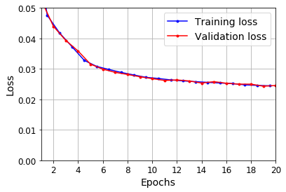

</div>
</div>
</div>


<div markdown="1" class="cell code_cell">
<div class="input_area" markdown="1">
```python
np.random.seed(43)

series = generate_time_series(1, 50 + 10)
X_new, Y_new = series[:, :50, :], series[:, 50:, :]
Y_pred = model.predict(X_new)[:, -1][..., np.newaxis]

```
</div>

</div>


<div markdown="1" class="cell code_cell">
<div class="input_area" markdown="1">
```python
plot_multiple_forecasts(X_new, Y_new, Y_pred)
plt.show()

```
</div>

<div class="output_wrapper" markdown="1">
<div class="output_subarea" markdown="1">

{:.output_png}
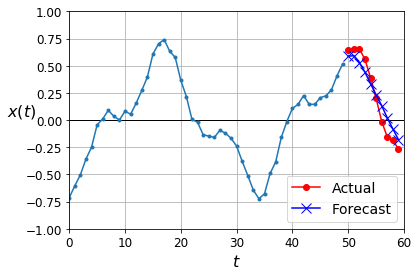

</div>
</div>
</div>


## Using One-Dimensional Convolutional Layers to Process Sequences


```
1D conv layer with kernel size 4, stride 2, VALID padding:

              |-----2-----|     |-----5---...------|     |-----23----|
        |-----1-----|     |-----4-----|   ...      |-----22----|
  |-----0----|      |-----3-----|     |---...|-----21----|
X: 0  1  2  3  4  5  6  7  8  9  10 11 12 ... 42 43 44 45 46 47 48 49
Y: 1  2  3  4  5  6  7  8  9  10 11 12 13 ... 43 44 45 46 47 48 49 50
  /10 11 12 13 14 15 16 17 18 19 20 21 22 ... 52 53 54 55 56 57 58 59

Output:

X:     0/3   2/5   4/7   6/9   8/11 10/13 .../43 42/45 44/47 46/49
Y:     4/13  6/15  8/17 10/19 12/21 14/23 .../53 46/55 48/57 50/59
```


<div markdown="1" class="cell code_cell">
<div class="input_area" markdown="1">
```python
np.random.seed(42)
tf.random.set_seed(42)

model = keras.models.Sequential([
    keras.layers.Conv1D(filters=20, kernel_size=4, strides=2, padding="valid",
                        input_shape=[None, 1]),
    keras.layers.GRU(20, return_sequences=True),
    keras.layers.GRU(20, return_sequences=True),
    keras.layers.TimeDistributed(keras.layers.Dense(10))
])

model.compile(loss="mse", optimizer="adam", metrics=[last_time_step_mse])
history = model.fit(X_train, Y_train[:, 3::2], epochs=20,
                    validation_data=(X_valid, Y_valid[:, 3::2]))

```
</div>

<div class="output_wrapper" markdown="1">
<div class="output_subarea" markdown="1">
{:.output_stream}
```
Train on 7000 samples, validate on 2000 samples
Epoch 1/20
7000/7000 [==============================] - 8s 1ms/sample - loss: 0.0681 - last_time_step_mse: 0.0608 - val_loss: 0.0477 - val_last_time_step_mse: 0.0397
Epoch 2/20
7000/7000 [==============================] - 7s 962us/sample - loss: 0.0411 - last_time_step_mse: 0.0338 - val_loss: 0.0367 - val_last_time_step_mse: 0.0287
Epoch 3/20
7000/7000 [==============================] - 7s 966us/sample - loss: 0.0339 - last_time_step_mse: 0.0259 - val_loss: 0.0310 - val_last_time_step_mse: 0.0217
Epoch 4/20
7000/7000 [==============================] - 7s 941us/sample - loss: 0.0284 - last_time_step_mse: 0.0186 - val_loss: 0.0260 - val_last_time_step_mse: 0.0151
Epoch 5/20
7000/7000 [==============================] - 7s 943us/sample - loss: 0.0248 - last_time_step_mse: 0.0140 - val_loss: 0.0243 - val_last_time_step_mse: 0.0137
Epoch 6/20
7000/7000 [==============================] - 6s 928us/sample - loss: 0.0234 - last_time_step_mse: 0.0126 - val_loss: 0.0228 - val_last_time_step_mse: 0.0118
Epoch 7/20
7000/7000 [==============================] - 7s 939us/sample - loss: 0.0227 - last_time_step_mse: 0.0119 - val_loss: 0.0222 - val_last_time_step_mse: 0.0112
Epoch 8/20
7000/7000 [==============================] - 7s 974us/sample - loss: 0.0221 - last_time_step_mse: 0.0112 - val_loss: 0.0217 - val_last_time_step_mse: 0.0109
Epoch 9/20
7000/7000 [==============================] - 7s 946us/sample - loss: 0.0217 - last_time_step_mse: 0.0109 - val_loss: 0.0215 - val_last_time_step_mse: 0.0108
Epoch 10/20
7000/7000 [==============================] - 6s 925us/sample - loss: 0.0212 - last_time_step_mse: 0.0105 - val_loss: 0.0210 - val_last_time_step_mse: 0.0102
Epoch 11/20
7000/7000 [==============================] - 7s 934us/sample - loss: 0.0210 - last_time_step_mse: 0.0105 - val_loss: 0.0208 - val_last_time_step_mse: 0.0098
Epoch 12/20
7000/7000 [==============================] - 7s 973us/sample - loss: 0.0207 - last_time_step_mse: 0.0101 - val_loss: 0.0206 - val_last_time_step_mse: 0.0100
Epoch 13/20
7000/7000 [==============================] - 7s 949us/sample - loss: 0.0204 - last_time_step_mse: 0.0099 - val_loss: 0.0205 - val_last_time_step_mse: 0.0099
Epoch 14/20
7000/7000 [==============================] - 7s 962us/sample - loss: 0.0202 - last_time_step_mse: 0.0098 - val_loss: 0.0200 - val_last_time_step_mse: 0.0094
Epoch 15/20
7000/7000 [==============================] - 7s 930us/sample - loss: 0.0200 - last_time_step_mse: 0.0096 - val_loss: 0.0200 - val_last_time_step_mse: 0.0094
Epoch 16/20
7000/7000 [==============================] - 7s 949us/sample - loss: 0.0197 - last_time_step_mse: 0.0094 - val_loss: 0.0200 - val_last_time_step_mse: 0.0094
Epoch 17/20
7000/7000 [==============================] - 7s 932us/sample - loss: 0.0196 - last_time_step_mse: 0.0093 - val_loss: 0.0195 - val_last_time_step_mse: 0.0093
Epoch 18/20
7000/7000 [==============================] - 7s 951us/sample - loss: 0.0193 - last_time_step_mse: 0.0090 - val_loss: 0.0195 - val_last_time_step_mse: 0.0090
Epoch 19/20
7000/7000 [==============================] - 7s 968us/sample - loss: 0.0190 - last_time_step_mse: 0.0088 - val_loss: 0.0188 - val_last_time_step_mse: 0.0084
Epoch 20/20
7000/7000 [==============================] - 7s 930us/sample - loss: 0.0187 - last_time_step_mse: 0.0085 - val_loss: 0.0186 - val_last_time_step_mse: 0.0081
```
</div>
</div>
</div>


## WaveNet


```
C2  /\ /\ /\ /\ /\ /\ /\ /\ /\ /\ /\ /\ /\.../\ /\ /\ /\ /\ /\
   \  /  \  /  \  /  \  /  \  /  \  /  \       /  \  /  \  /  \
     /    \      /    \      /    \                 /    \
C1  /\ /\ /\ /\ /\ /\ /\ /\ /\ /\ /\  /\ /.../\ /\ /\ /\ /\ /\ /\
X: 0  1  2  3  4  5  6  7  8  9  10 11 12 ... 43 44 45 46 47 48 49
Y: 1  2  3  4  5  6  7  8  9  10 11 12 13 ... 44 45 46 47 48 49 50
  /10 11 12 13 14 15 16 17 18 19 20 21 22 ... 53 54 55 56 57 58 59
```


<div markdown="1" class="cell code_cell">
<div class="input_area" markdown="1">
```python
np.random.seed(42)
tf.random.set_seed(42)

model = keras.models.Sequential()
model.add(keras.layers.InputLayer(input_shape=[None, 1]))
for rate in (1, 2, 4, 8) * 2:
    model.add(keras.layers.Conv1D(filters=20, kernel_size=2, padding="causal",
                                  activation="relu", dilation_rate=rate))
model.add(keras.layers.Conv1D(filters=10, kernel_size=1))
model.compile(loss="mse", optimizer="adam", metrics=[last_time_step_mse])
history = model.fit(X_train, Y_train, epochs=20,
                    validation_data=(X_valid, Y_valid))

```
</div>

<div class="output_wrapper" markdown="1">
<div class="output_subarea" markdown="1">
{:.output_stream}
```
Train on 7000 samples, validate on 2000 samples
Epoch 1/20
7000/7000 [==============================] - 3s 451us/sample - loss: 0.0668 - last_time_step_mse: 0.0546 - val_loss: 0.0376 - val_last_time_step_mse: 0.0249
Epoch 2/20
7000/7000 [==============================] - 2s 302us/sample - loss: 0.0325 - last_time_step_mse: 0.0202 - val_loss: 0.0296 - val_last_time_step_mse: 0.0175
Epoch 3/20
7000/7000 [==============================] - 2s 286us/sample - loss: 0.0284 - last_time_step_mse: 0.0170 - val_loss: 0.0269 - val_last_time_step_mse: 0.0153
Epoch 4/20
7000/7000 [==============================] - 2s 305us/sample - loss: 0.0264 - last_time_step_mse: 0.0149 - val_loss: 0.0256 - val_last_time_step_mse: 0.0138
Epoch 5/20
7000/7000 [==============================] - 2s 303us/sample - loss: 0.0251 - last_time_step_mse: 0.0135 - val_loss: 0.0244 - val_last_time_step_mse: 0.0128
Epoch 6/20
7000/7000 [==============================] - 2s 301us/sample - loss: 0.0244 - last_time_step_mse: 0.0129 - val_loss: 0.0238 - val_last_time_step_mse: 0.0122
Epoch 7/20
7000/7000 [==============================] - 2s 309us/sample - loss: 0.0238 - last_time_step_mse: 0.0124 - val_loss: 0.0233 - val_last_time_step_mse: 0.0117
Epoch 8/20
7000/7000 [==============================] - 2s 307us/sample - loss: 0.0231 - last_time_step_mse: 0.0116 - val_loss: 0.0227 - val_last_time_step_mse: 0.0113
Epoch 9/20
7000/7000 [==============================] - 2s 326us/sample - loss: 0.0227 - last_time_step_mse: 0.0113 - val_loss: 0.0228 - val_last_time_step_mse: 0.0114
Epoch 10/20
7000/7000 [==============================] - 2s 349us/sample - loss: 0.0225 - last_time_step_mse: 0.0112 - val_loss: 0.0222 - val_last_time_step_mse: 0.0108
Epoch 11/20
7000/7000 [==============================] - 2s 317us/sample - loss: 0.0221 - last_time_step_mse: 0.0107 - val_loss: 0.0225 - val_last_time_step_mse: 0.0116
Epoch 12/20
7000/7000 [==============================] - 2s 306us/sample - loss: 0.0219 - last_time_step_mse: 0.0104 - val_loss: 0.0215 - val_last_time_step_mse: 0.0101
Epoch 13/20
7000/7000 [==============================] - 2s 296us/sample - loss: 0.0216 - last_time_step_mse: 0.0102 - val_loss: 0.0213 - val_last_time_step_mse: 0.0099
Epoch 14/20
7000/7000 [==============================] - 2s 306us/sample - loss: 0.0215 - last_time_step_mse: 0.0102 - val_loss: 0.0214 - val_last_time_step_mse: 0.0100
Epoch 15/20
7000/7000 [==============================] - 2s 320us/sample - loss: 0.0212 - last_time_step_mse: 0.0098 - val_loss: 0.0212 - val_last_time_step_mse: 0.0102
Epoch 16/20
7000/7000 [==============================] - 2s 300us/sample - loss: 0.0210 - last_time_step_mse: 0.0096 - val_loss: 0.0209 - val_last_time_step_mse: 0.0096
Epoch 17/20
7000/7000 [==============================] - 2s 298us/sample - loss: 0.0210 - last_time_step_mse: 0.0096 - val_loss: 0.0205 - val_last_time_step_mse: 0.0091
Epoch 18/20
7000/7000 [==============================] - 2s 299us/sample - loss: 0.0206 - last_time_step_mse: 0.0093 - val_loss: 0.0207 - val_last_time_step_mse: 0.0096
Epoch 19/20
7000/7000 [==============================] - 2s 303us/sample - loss: 0.0205 - last_time_step_mse: 0.0092 - val_loss: 0.0206 - val_last_time_step_mse: 0.0093
Epoch 20/20
7000/7000 [==============================] - 2s 330us/sample - loss: 0.0204 - last_time_step_mse: 0.0091 - val_loss: 0.0207 - val_last_time_step_mse: 0.0095
```
</div>
</div>
</div>


Here is the original WaveNet defined in the paper: it uses Gated Activation Units instead of ReLU and parametrized skip connections, plus it pads with zeros on the left to avoid getting shorter and shorter sequences:


<div markdown="1" class="cell code_cell">
<div class="input_area" markdown="1">
```python
class GatedActivationUnit(keras.layers.Layer):
    def __init__(self, activation="tanh", **kwargs):
        super().__init__(**kwargs)
        self.activation = keras.activations.get(activation)
    def call(self, inputs):
        n_filters = inputs.shape[-1] // 2
        linear_output = self.activation(inputs[..., :n_filters])
        gate = keras.activations.sigmoid(inputs[..., n_filters:])
        return self.activation(linear_output) * gate

```
</div>

</div>


<div markdown="1" class="cell code_cell">
<div class="input_area" markdown="1">
```python
def wavenet_residual_block(inputs, n_filters, dilation_rate):
    z = keras.layers.Conv1D(2 * n_filters, kernel_size=2, padding="causal",
                            dilation_rate=dilation_rate)(inputs)
    z = GatedActivationUnit()(z)
    z = keras.layers.Conv1D(n_filters, kernel_size=1)(z)
    return keras.layers.Add()([z, inputs]), z

```
</div>

</div>


<div markdown="1" class="cell code_cell">
<div class="input_area" markdown="1">
```python
keras.backend.clear_session()
np.random.seed(42)
tf.random.set_seed(42)

n_layers_per_block = 3 # 10 in the paper
n_blocks = 1 # 3 in the paper
n_filters = 32 # 128 in the paper
n_outputs = 10 # 256 in the paper

inputs = keras.layers.Input(shape=[None, 1])
z = keras.layers.Conv1D(n_filters, kernel_size=2, padding="causal")(inputs)
skip_to_last = []
for dilation_rate in [2**i for i in range(n_layers_per_block)] * n_blocks:
    z, skip = wavenet_residual_block(z, n_filters, dilation_rate)
    skip_to_last.append(skip)
z = keras.activations.relu(keras.layers.Add()(skip_to_last))
z = keras.layers.Conv1D(n_filters, kernel_size=1, activation="relu")(z)
Y_proba = keras.layers.Conv1D(n_outputs, kernel_size=1, activation="softmax")(z)

model = keras.models.Model(inputs=[inputs], outputs=[Y_proba])

```
</div>

</div>


<div markdown="1" class="cell code_cell">
<div class="input_area" markdown="1">
```python
model.compile(loss="mse", optimizer="adam", metrics=[last_time_step_mse])
history = model.fit(X_train, Y_train, epochs=2,
                    validation_data=(X_valid, Y_valid))

```
</div>

<div class="output_wrapper" markdown="1">
<div class="output_subarea" markdown="1">
{:.output_stream}
```
Train on 7000 samples, validate on 2000 samples
Epoch 1/2
7000/7000 [==============================] - 4s 546us/sample - loss: 0.1300 - last_time_step_mse: 0.1261 - val_loss: 0.1230 - val_last_time_step_mse: 0.1200
Epoch 2/2
7000/7000 [==============================] - 3s 410us/sample - loss: 0.1222 - last_time_step_mse: 0.1178 - val_loss: 0.1217 - val_last_time_step_mse: 0.1189
```
</div>
</div>
</div>


In this chapter we explored the fundamentals of RNNs and used them to process sequences (namely, time series). In the process we also looked at other ways to process sequences, including CNNs. In the next chapter we will use RNNs for Natural Language Processing, and we will learn more about RNNs (bidirectional RNNs, stateful vs stateless RNNs, Encoder–Decoders, and Attention-augmented Encoder-Decoders). We will also look at the Transformer, an Attention-only architecture.


# Exercise solutions


## 1. to 6.


See Appendix A.


## 7. Embedded Reber Grammars


First we need to build a function that generates strings based on a grammar. The grammar will be represented as a list of possible transitions for each state. A transition specifies the string to output (or a grammar to generate it) and the next state.


<div markdown="1" class="cell code_cell">
<div class="input_area" markdown="1">
```python
np.random.seed(42)

default_reber_grammar = [
    [("B", 1)],           # (state 0) =B=>(state 1)
    [("T", 2), ("P", 3)], # (state 1) =T=>(state 2) or =P=>(state 3)
    [("S", 2), ("X", 4)], # (state 2) =S=>(state 2) or =X=>(state 4)
    [("T", 3), ("V", 5)], # and so on...
    [("X", 3), ("S", 6)],
    [("P", 4), ("V", 6)],
    [("E", None)]]        # (state 6) =E=>(terminal state)

embedded_reber_grammar = [
    [("B", 1)],
    [("T", 2), ("P", 3)],
    [(default_reber_grammar, 4)],
    [(default_reber_grammar, 5)],
    [("T", 6)],
    [("P", 6)],
    [("E", None)]]

def generate_string(grammar):
    state = 0
    output = []
    while state is not None:
        index = np.random.randint(len(grammar[state]))
        production, state = grammar[state][index]
        if isinstance(production, list):
            production = generate_string(grammar=production)
        output.append(production)
    return "".join(output)

```
</div>

</div>


Let's generate a few strings based on the default Reber grammar:


<div markdown="1" class="cell code_cell">
<div class="input_area" markdown="1">
```python
for _ in range(25):
    print(generate_string(default_reber_grammar), end=" ")

```
</div>

<div class="output_wrapper" markdown="1">
<div class="output_subarea" markdown="1">
{:.output_stream}
```
BTXXTTVPXTVPXTTVPSE BPVPSE BTXSE BPVVE BPVVE BTSXSE BPTVPXTTTVVE BPVVE BTXSE BTXXVPSE BPTTTTTTTTVVE BTXSE BPVPSE BTXSE BPTVPSE BTXXTVPSE BPVVE BPVVE BPVVE BPTTVVE BPVVE BPVVE BTXXVVE BTXXVVE BTXXVPXVVE ```
</div>
</div>
</div>


Looks good. Now let's generate a few strings based on the embedded Reber grammar:


<div markdown="1" class="cell code_cell">
<div class="input_area" markdown="1">
```python
for _ in range(25):
    print(generate_string(embedded_reber_grammar), end=" ")

```
</div>

<div class="output_wrapper" markdown="1">
<div class="output_subarea" markdown="1">
{:.output_stream}
```
BTBPVVETE BTBTSSSSSSSXXVVETE BPBTSSSXXTTTTVPSEPE BTBPTTVVETE BPBTXXTVVEPE BTBTXSETE BPBTSSSSSXXTTVPXVPXTTTVVEPE BPBTSSXXTVPSEPE BPBPTTTTTTTVPSEPE BTBTSXSETE BPBPTVPXVVEPE BPBPVVEPE BPBPTVVEPE BTBPTTVPXTTVPSETE BTBTSSXSETE BTBTXXTTVVETE BPBTSXSEPE BPBPTVPSEPE BTBPVVETE BPBTXXTTTVPXTVVEPE BPBPTTVPXTVVEPE BTBPVVETE BPBPTVPXVPXTVVEPE BTBPVVETE BPBTSXSEPE ```
</div>
</div>
</div>


Okay, now we need a function to generate strings that do not respect the grammar. We could generate a random string, but the task would be a bit too easy, so instead we will generate a string that respects the grammar, and we will corrupt it by changing just one character:


<div markdown="1" class="cell code_cell">
<div class="input_area" markdown="1">
```python
def generate_corrupted_string(grammar, chars="BEPSTVX"):
    good_string = generate_string(grammar)
    index = np.random.randint(len(good_string))
    good_char = good_string[index]
    bad_char = np.random.choice(sorted(set(chars) - set(good_char)))
    return good_string[:index] + bad_char + good_string[index + 1:]

```
</div>

</div>


Let's look at a few corrupted strings:


<div markdown="1" class="cell code_cell">
<div class="input_area" markdown="1">
```python
for _ in range(25):
    print(generate_corrupted_string(embedded_reber_grammar), end=" ")

```
</div>

<div class="output_wrapper" markdown="1">
<div class="output_subarea" markdown="1">
{:.output_stream}
```
BTTTXXVVETE BPBTXXSPXTVVEPE BTBTXSPTE BPTTSXXTVPXVVEPE PPBPVPSEPE BTBPTVETE BPTTSSSSSXSEPE BPBSVPSEPE BTBPVVESE BPBTXSEPS BEBTXSETE XPBTXXTVPSEPE BTBPVVEPE BTXPTVVETE BTBPVXETE BVBTXSETE BPTTXXVPXVPSEPE BTBPXVPSETE STBPTTVPXVPXTVPSETE BPBPTVPSESE BPBPVEEPE ETBTXSETE BTBTXSVTE BPBTXXVPSEPP BTBTXXVPSETS ```
</div>
</div>
</div>


To be continued...

