---
redirect_from:
  - "/notebooks/24-tensorflow/17-autoencoders-and-gans"
interact_link: content/notebooks/24-tensorflow/17_autoencoders_and_gans.ipynb
kernel_name: python3
has_widgets: false
title: 'TF-Autoencoder and Gan'
prev_page:
  url: /notebooks/24-tensorflow/16_nlp_with_rnns_and_attention.html
  title: 'TF-NLP'
next_page:
  url: /assignments/index.html
  title: 'Assignments'
comment: "***PROGRAMMATICALLY GENERATED, DO NOT EDIT. SEE ORIGINAL FILES IN /content***"
---


**Chapter 17 – Autoencoders and GANs**


_This notebook contains all the sample code in chapter 17._


<table align="left">
  <td>
    <a target="_blank" href="https://colab.research.google.com/github/ageron/handson-ml2/blob/master/17_autoencoders_and_gans.ipynb">Run in Google Colab</a>
  </td>
</table>


# Setup


First, let's import a few common modules, ensure MatplotLib plots figures inline and prepare a function to save the figures. We also check that Python 3.5 or later is installed (although Python 2.x may work, it is deprecated so we strongly recommend you use Python 3 instead), as well as Scikit-Learn ≥0.20 and TensorFlow ≥2.0.


<div markdown="1" class="cell code_cell">
<div class="input_area" markdown="1">
```python
# Python ≥3.5 is required
import sys
assert sys.version_info >= (3, 5)

# Scikit-Learn ≥0.20 is required
import sklearn
assert sklearn.__version__ >= "0.20"

try:
    # %tensorflow_version only exists in Colab.
    %tensorflow_version 2.x
    IS_COLAB = True
except Exception:
    IS_COLAB = False

# TensorFlow ≥2.0 is required
import tensorflow as tf
from tensorflow import keras
assert tf.__version__ >= "2.0"

if not tf.test.is_gpu_available():
    print("No GPU was detected. LSTMs and CNNs can be very slow without a GPU.")
    if IS_COLAB:
        print("Go to Runtime > Change runtime and select a GPU hardware accelerator.")

# Common imports
import numpy as np
import os

# to make this notebook's output stable across runs
np.random.seed(42)
tf.random.set_seed(42)

# To plot pretty figures
%matplotlib inline
import matplotlib as mpl
import matplotlib.pyplot as plt
mpl.rc('axes', labelsize=14)
mpl.rc('xtick', labelsize=12)
mpl.rc('ytick', labelsize=12)

# Where to save the figures
PROJECT_ROOT_DIR = "."
CHAPTER_ID = "autoencoders"
IMAGES_PATH = os.path.join(PROJECT_ROOT_DIR, "images", CHAPTER_ID)
os.makedirs(IMAGES_PATH, exist_ok=True)

def save_fig(fig_id, tight_layout=True, fig_extension="png", resolution=300):
    path = os.path.join(IMAGES_PATH, fig_id + "." + fig_extension)
    print("Saving figure", fig_id)
    if tight_layout:
        plt.tight_layout()
    plt.savefig(path, format=fig_extension, dpi=resolution)

```
</div>

</div>


A couple utility functions to plot grayscale 28x28 image:


<div markdown="1" class="cell code_cell">
<div class="input_area" markdown="1">
```python
def plot_image(image):
    plt.imshow(image, cmap="binary")
    plt.axis("off")

```
</div>

</div>


# PCA with a linear Autoencoder


Build 3D dataset:


<div markdown="1" class="cell code_cell">
<div class="input_area" markdown="1">
```python
np.random.seed(4)

def generate_3d_data(m, w1=0.1, w2=0.3, noise=0.1):
    angles = np.random.rand(m) * 3 * np.pi / 2 - 0.5
    data = np.empty((m, 3))
    data[:, 0] = np.cos(angles) + np.sin(angles)/2 + noise * np.random.randn(m) / 2
    data[:, 1] = np.sin(angles) * 0.7 + noise * np.random.randn(m) / 2
    data[:, 2] = data[:, 0] * w1 + data[:, 1] * w2 + noise * np.random.randn(m)
    return data

X_train = generate_3d_data(60)
X_train = X_train - X_train.mean(axis=0, keepdims=0)

```
</div>

</div>


Now let's build the Autoencoder...


<div markdown="1" class="cell code_cell">
<div class="input_area" markdown="1">
```python
np.random.seed(42)
tf.random.set_seed(42)

encoder = keras.models.Sequential([keras.layers.Dense(2, input_shape=[3])])
decoder = keras.models.Sequential([keras.layers.Dense(3, input_shape=[2])])
autoencoder = keras.models.Sequential([encoder, decoder])

autoencoder.compile(loss="mse", optimizer=keras.optimizers.SGD(lr=1.5))

```
</div>

</div>


<div markdown="1" class="cell code_cell">
<div class="input_area" markdown="1">
```python
history = autoencoder.fit(X_train, X_train, epochs=20)

```
</div>

<div class="output_wrapper" markdown="1">
<div class="output_subarea" markdown="1">
{:.output_stream}
```
Train on 60 samples
Epoch 1/20
60/60 [==============================] - 0s 1ms/sample - loss: 0.2648
Epoch 2/20
60/60 [==============================] - 0s 49us/sample - loss: 0.1317
Epoch 3/20
60/60 [==============================] - 0s 50us/sample - loss: 0.0778
Epoch 4/20
60/60 [==============================] - 0s 46us/sample - loss: 0.0655
Epoch 5/20
60/60 [==============================] - 0s 51us/sample - loss: 0.0748
Epoch 6/20
60/60 [==============================] - 0s 47us/sample - loss: 0.1039
Epoch 7/20
60/60 [==============================] - 0s 50us/sample - loss: 0.1262
Epoch 8/20
60/60 [==============================] - 0s 52us/sample - loss: 0.0536
Epoch 9/20
60/60 [==============================] - 0s 51us/sample - loss: 0.0208
Epoch 10/20
60/60 [==============================] - 0s 52us/sample - loss: 0.0146
Epoch 11/20
60/60 [==============================] - 0s 52us/sample - loss: 0.0097
Epoch 12/20
60/60 [==============================] - 0s 48us/sample - loss: 0.0076
Epoch 13/20
60/60 [==============================] - 0s 43us/sample - loss: 0.0067
Epoch 14/20
60/60 [==============================] - 0s 49us/sample - loss: 0.0070
Epoch 15/20
60/60 [==============================] - 0s 58us/sample - loss: 0.0061
Epoch 16/20
60/60 [==============================] - 0s 53us/sample - loss: 0.0055
Epoch 17/20
60/60 [==============================] - 0s 63us/sample - loss: 0.0056
Epoch 18/20
60/60 [==============================] - 0s 58us/sample - loss: 0.0055
Epoch 19/20
60/60 [==============================] - 0s 64us/sample - loss: 0.0054
Epoch 20/20
60/60 [==============================] - 0s 55us/sample - loss: 0.0055
```
</div>
</div>
</div>


<div markdown="1" class="cell code_cell">
<div class="input_area" markdown="1">
```python
codings = encoder.predict(X_train)

```
</div>

</div>


<div markdown="1" class="cell code_cell">
<div class="input_area" markdown="1">
```python
fig = plt.figure(figsize=(4,3))
plt.plot(codings[:,0], codings[:, 1], "b.")
plt.xlabel("$z_1$", fontsize=18)
plt.ylabel("$z_2$", fontsize=18, rotation=0)
plt.grid(True)
save_fig("linear_autoencoder_pca_plot")
plt.show()

```
</div>

<div class="output_wrapper" markdown="1">
<div class="output_subarea" markdown="1">
{:.output_stream}
```
Saving figure linear_autoencoder_pca_plot
```
</div>
</div>
<div class="output_wrapper" markdown="1">
<div class="output_subarea" markdown="1">

{:.output_png}


</div>
</div>
</div>


# Stacked Autoencoders


Let's use MNIST:


<div markdown="1" class="cell code_cell">
<div class="input_area" markdown="1">
```python
(X_train_full, y_train_full), (X_test, y_test) = keras.datasets.fashion_mnist.load_data()
X_train_full = X_train_full.astype(np.float32) / 255
X_test = X_test.astype(np.float32) / 255
X_train, X_valid = X_train_full[:-5000], X_train_full[-5000:]
y_train, y_valid = y_train_full[:-5000], y_train_full[-5000:]

```
</div>

</div>


## Train all layers at once


Let's build a stacked Autoencoder with 3 hidden layers and 1 output layer (i.e., 2 stacked Autoencoders).


<div markdown="1" class="cell code_cell">
<div class="input_area" markdown="1">
```python
def rounded_accuracy(y_true, y_pred):
    return keras.metrics.binary_accuracy(tf.round(y_true), tf.round(y_pred))

```
</div>

</div>


<div markdown="1" class="cell code_cell">
<div class="input_area" markdown="1">
```python
tf.random.set_seed(42)
np.random.seed(42)

stacked_encoder = keras.models.Sequential([
    keras.layers.Flatten(input_shape=[28, 28]),
    keras.layers.Dense(100, activation="selu"),
    keras.layers.Dense(30, activation="selu"),
])
stacked_decoder = keras.models.Sequential([
    keras.layers.Dense(100, activation="selu", input_shape=[30]),
    keras.layers.Dense(28 * 28, activation="sigmoid"),
    keras.layers.Reshape([28, 28])
])
stacked_ae = keras.models.Sequential([stacked_encoder, stacked_decoder])
stacked_ae.compile(loss="binary_crossentropy",
                   optimizer=keras.optimizers.SGD(lr=1.5), metrics=[rounded_accuracy])
history = stacked_ae.fit(X_train, X_train, epochs=20,
                         validation_data=[X_valid, X_valid])

```
</div>

<div class="output_wrapper" markdown="1">
<div class="output_subarea" markdown="1">
{:.output_stream}
```
Train on 55000 samples, validate on 5000 samples
Epoch 1/20
55000/55000 [==============================] - 4s 72us/sample - loss: 0.3386 - rounded_accuracy: 0.8866 - val_loss: 0.3118 - val_rounded_accuracy: 0.9128
Epoch 2/20
55000/55000 [==============================] - 4s 64us/sample - loss: 0.3055 - rounded_accuracy: 0.9153 - val_loss: 0.3030 - val_rounded_accuracy: 0.9200
Epoch 3/20
55000/55000 [==============================] - 4s 68us/sample - loss: 0.2986 - rounded_accuracy: 0.9214 - val_loss: 0.2982 - val_rounded_accuracy: 0.9249
Epoch 4/20
55000/55000 [==============================] - 4s 67us/sample - loss: 0.2946 - rounded_accuracy: 0.9251 - val_loss: 0.2938 - val_rounded_accuracy: 0.9284
Epoch 5/20
55000/55000 [==============================] - 4s 70us/sample - loss: 0.2921 - rounded_accuracy: 0.9273 - val_loss: 0.2922 - val_rounded_accuracy: 0.9302
Epoch 6/20
55000/55000 [==============================] - 4s 69us/sample - loss: 0.2904 - rounded_accuracy: 0.9289 - val_loss: 0.2917 - val_rounded_accuracy: 0.9304
Epoch 7/20
55000/55000 [==============================] - 4s 72us/sample - loss: 0.2889 - rounded_accuracy: 0.9303 - val_loss: 0.2901 - val_rounded_accuracy: 0.9313
Epoch 8/20
55000/55000 [==============================] - 4s 66us/sample - loss: 0.2878 - rounded_accuracy: 0.9311 - val_loss: 0.2884 - val_rounded_accuracy: 0.9324
Epoch 9/20
55000/55000 [==============================] - 4s 68us/sample - loss: 0.2869 - rounded_accuracy: 0.9319 - val_loss: 0.2879 - val_rounded_accuracy: 0.9321
Epoch 10/20
55000/55000 [==============================] - 4s 69us/sample - loss: 0.2860 - rounded_accuracy: 0.9326 - val_loss: 0.2874 - val_rounded_accuracy: 0.9328
Epoch 11/20
55000/55000 [==============================] - 4s 71us/sample - loss: 0.2854 - rounded_accuracy: 0.9331 - val_loss: 0.2873 - val_rounded_accuracy: 0.9313
Epoch 12/20
55000/55000 [==============================] - 4s 72us/sample - loss: 0.2847 - rounded_accuracy: 0.9336 - val_loss: 0.2872 - val_rounded_accuracy: 0.9299
Epoch 13/20
55000/55000 [==============================] - 4s 65us/sample - loss: 0.2841 - rounded_accuracy: 0.9341 - val_loss: 0.2863 - val_rounded_accuracy: 0.9311
Epoch 14/20
55000/55000 [==============================] - 4s 67us/sample - loss: 0.2837 - rounded_accuracy: 0.9344 - val_loss: 0.2846 - val_rounded_accuracy: 0.9348
Epoch 15/20
55000/55000 [==============================] - 4s 65us/sample - loss: 0.2832 - rounded_accuracy: 0.9348 - val_loss: 0.2842 - val_rounded_accuracy: 0.9344
Epoch 16/20
55000/55000 [==============================] - 4s 66us/sample - loss: 0.2827 - rounded_accuracy: 0.9352 - val_loss: 0.2850 - val_rounded_accuracy: 0.9359
Epoch 17/20
55000/55000 [==============================] - 4s 65us/sample - loss: 0.2823 - rounded_accuracy: 0.9355 - val_loss: 0.2841 - val_rounded_accuracy: 0.9363
Epoch 18/20
55000/55000 [==============================] - 4s 65us/sample - loss: 0.2820 - rounded_accuracy: 0.9357 - val_loss: 0.2832 - val_rounded_accuracy: 0.9355
Epoch 19/20
55000/55000 [==============================] - 4s 71us/sample - loss: 0.2817 - rounded_accuracy: 0.9360 - val_loss: 0.2858 - val_rounded_accuracy: 0.9361
Epoch 20/20
55000/55000 [==============================] - 4s 76us/sample - loss: 0.2814 - rounded_accuracy: 0.9363 - val_loss: 0.2835 - val_rounded_accuracy: 0.9370
```
</div>
</div>
</div>


This function processes a few test images through the autoencoder and displays the original images and their reconstructions:


<div markdown="1" class="cell code_cell">
<div class="input_area" markdown="1">
```python
def show_reconstructions(model, images=X_valid, n_images=5):
    reconstructions = model.predict(images[:n_images])
    fig = plt.figure(figsize=(n_images * 1.5, 3))
    for image_index in range(n_images):
        plt.subplot(2, n_images, 1 + image_index)
        plot_image(images[image_index])
        plt.subplot(2, n_images, 1 + n_images + image_index)
        plot_image(reconstructions[image_index])

```
</div>

</div>


<div markdown="1" class="cell code_cell">
<div class="input_area" markdown="1">
```python
show_reconstructions(stacked_ae)
save_fig("reconstruction_plot")

```
</div>

<div class="output_wrapper" markdown="1">
<div class="output_subarea" markdown="1">
{:.output_stream}
```
Saving figure reconstruction_plot
```
</div>
</div>
<div class="output_wrapper" markdown="1">
<div class="output_subarea" markdown="1">

{:.output_png}
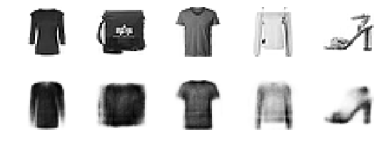

</div>
</div>
</div>


# Visualizing Fashion MNIST


<div markdown="1" class="cell code_cell">
<div class="input_area" markdown="1">
```python
np.random.seed(42)

from sklearn.manifold import TSNE

X_valid_compressed = stacked_encoder.predict(X_valid)
tsne = TSNE()
X_valid_2D = tsne.fit_transform(X_valid_compressed)
X_valid_2D = (X_valid_2D - X_valid_2D.min()) / (X_valid_2D.max() - X_valid_2D.min())

```
</div>

</div>


<div markdown="1" class="cell code_cell">
<div class="input_area" markdown="1">
```python
plt.scatter(X_valid_2D[:, 0], X_valid_2D[:, 1], c=y_valid, s=10, cmap="tab10")
plt.axis("off")
plt.show()

```
</div>

<div class="output_wrapper" markdown="1">
<div class="output_subarea" markdown="1">

{:.output_png}
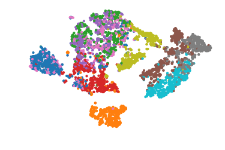

</div>
</div>
</div>


Let's make this diagram a bit prettier:


<div markdown="1" class="cell code_cell">
<div class="input_area" markdown="1">
```python
# adapted from https://scikit-learn.org/stable/auto_examples/manifold/plot_lle_digits.html
plt.figure(figsize=(10, 8))
cmap = plt.cm.tab10
plt.scatter(X_valid_2D[:, 0], X_valid_2D[:, 1], c=y_valid, s=10, cmap=cmap)
image_positions = np.array([[1., 1.]])
for index, position in enumerate(X_valid_2D):
    dist = np.sum((position - image_positions) ** 2, axis=1)
    if np.min(dist) > 0.02: # if far enough from other images
        image_positions = np.r_[image_positions, [position]]
        imagebox = mpl.offsetbox.AnnotationBbox(
            mpl.offsetbox.OffsetImage(X_valid[index], cmap="binary"),
            position, bboxprops={"edgecolor": cmap(y_valid[index]), "lw": 2})
        plt.gca().add_artist(imagebox)
plt.axis("off")
save_fig("fashion_mnist_visualization_plot")
plt.show()

```
</div>

<div class="output_wrapper" markdown="1">
<div class="output_subarea" markdown="1">
{:.output_stream}
```
Saving figure fashion_mnist_visualization_plot
```
</div>
</div>
<div class="output_wrapper" markdown="1">
<div class="output_subarea" markdown="1">

{:.output_png}


</div>
</div>
</div>


## Tying weights


It is common to tie the weights of the encoder and the decoder, by simply using the transpose of the encoder's weights as the decoder weights. For this, we need to use a custom layer.


<div markdown="1" class="cell code_cell">
<div class="input_area" markdown="1">
```python
class DenseTranspose(keras.layers.Layer):
    def __init__(self, dense, activation=None, **kwargs):
        self.dense = dense
        self.activation = keras.activations.get(activation)
        super().__init__(**kwargs)
    def build(self, batch_input_shape):
        self.biases = self.add_weight(name="bias",
                                      shape=[self.dense.input_shape[-1]],
                                      initializer="zeros")
        super().build(batch_input_shape)
    def call(self, inputs):
        z = tf.matmul(inputs, self.dense.weights[0], transpose_b=True)
        return self.activation(z + self.biases)

```
</div>

</div>


<div markdown="1" class="cell code_cell">
<div class="input_area" markdown="1">
```python
keras.backend.clear_session()
tf.random.set_seed(42)
np.random.seed(42)

dense_1 = keras.layers.Dense(100, activation="selu")
dense_2 = keras.layers.Dense(30, activation="selu")

tied_encoder = keras.models.Sequential([
    keras.layers.Flatten(input_shape=[28, 28]),
    dense_1,
    dense_2
])

tied_decoder = keras.models.Sequential([
    DenseTranspose(dense_2, activation="selu"),
    DenseTranspose(dense_1, activation="sigmoid"),
    keras.layers.Reshape([28, 28])
])

tied_ae = keras.models.Sequential([tied_encoder, tied_decoder])

tied_ae.compile(loss="binary_crossentropy",
                optimizer=keras.optimizers.SGD(lr=1.5), metrics=[rounded_accuracy])
history = tied_ae.fit(X_train, X_train, epochs=10,
                      validation_data=[X_valid, X_valid])

```
</div>

<div class="output_wrapper" markdown="1">
<div class="output_subarea" markdown="1">
{:.output_stream}
```
Train on 55000 samples, validate on 5000 samples
Epoch 1/10
55000/55000 [==============================] - 4s 80us/sample - loss: 0.3213 - rounded_accuracy: 0.8996 - val_loss: 0.3038 - val_rounded_accuracy: 0.9154
Epoch 2/10
55000/55000 [==============================] - 4s 74us/sample - loss: 0.2967 - rounded_accuracy: 0.9216 - val_loss: 0.2931 - val_rounded_accuracy: 0.9268
Epoch 3/10
55000/55000 [==============================] - 4s 70us/sample - loss: 0.2916 - rounded_accuracy: 0.9263 - val_loss: 0.2929 - val_rounded_accuracy: 0.9254
Epoch 4/10
55000/55000 [==============================] - 4s 64us/sample - loss: 0.2889 - rounded_accuracy: 0.9287 - val_loss: 0.2905 - val_rounded_accuracy: 0.9316
Epoch 5/10
55000/55000 [==============================] - 4s 70us/sample - loss: 0.2871 - rounded_accuracy: 0.9303 - val_loss: 0.2917 - val_rounded_accuracy: 0.9307
Epoch 6/10
55000/55000 [==============================] - 4s 68us/sample - loss: 0.2858 - rounded_accuracy: 0.9316 - val_loss: 0.2870 - val_rounded_accuracy: 0.9332
Epoch 7/10
55000/55000 [==============================] - 4s 68us/sample - loss: 0.2847 - rounded_accuracy: 0.9327 - val_loss: 0.2865 - val_rounded_accuracy: 0.9336
Epoch 8/10
55000/55000 [==============================] - 4s 71us/sample - loss: 0.2840 - rounded_accuracy: 0.9334 - val_loss: 0.2859 - val_rounded_accuracy: 0.9349
Epoch 9/10
55000/55000 [==============================] - 4s 70us/sample - loss: 0.2834 - rounded_accuracy: 0.9339 - val_loss: 0.2864 - val_rounded_accuracy: 0.9338
Epoch 10/10
55000/55000 [==============================] - 4s 72us/sample - loss: 0.2828 - rounded_accuracy: 0.9345 - val_loss: 0.2839 - val_rounded_accuracy: 0.9338
```
</div>
</div>
</div>


<div markdown="1" class="cell code_cell">
<div class="input_area" markdown="1">
```python
show_reconstructions(tied_ae)
plt.show()

```
</div>

<div class="output_wrapper" markdown="1">
<div class="output_subarea" markdown="1">

{:.output_png}


</div>
</div>
</div>


## Training one Autoencoder at a time


<div markdown="1" class="cell code_cell">
<div class="input_area" markdown="1">
```python
def train_autoencoder(n_neurons, X_train, X_valid, loss, optimizer,
                      n_epochs=10, output_activation=None, metrics=None):
    n_inputs = X_train.shape[-1]
    encoder = keras.models.Sequential([
        keras.layers.Dense(n_neurons, activation="selu", input_shape=[n_inputs])
    ])
    decoder = keras.models.Sequential([
        keras.layers.Dense(n_inputs, activation=output_activation),
    ])
    autoencoder = keras.models.Sequential([encoder, decoder])
    autoencoder.compile(optimizer, loss, metrics=metrics)
    autoencoder.fit(X_train, X_train, epochs=n_epochs,
                    validation_data=[X_valid, X_valid])
    return encoder, decoder, encoder(X_train), encoder(X_valid)

```
</div>

</div>


<div markdown="1" class="cell code_cell">
<div class="input_area" markdown="1">
```python
tf.random.set_seed(42)
np.random.seed(42)

K = keras.backend
X_train_flat = K.batch_flatten(X_train) # equivalent to .reshape(-1, 28 * 28)
X_valid_flat = K.batch_flatten(X_valid)
enc1, dec1, X_train_enc1, X_valid_enc1 = train_autoencoder(
    100, X_train_flat, X_valid_flat, "binary_crossentropy",
    keras.optimizers.SGD(lr=1.5), output_activation="sigmoid",
    metrics=[rounded_accuracy])
enc2, dec2, _, _ = train_autoencoder(
    30, X_train_enc1, X_valid_enc1, "mse", keras.optimizers.SGD(lr=0.05),
    output_activation="selu")

```
</div>

<div class="output_wrapper" markdown="1">
<div class="output_subarea" markdown="1">
{:.output_stream}
```
Train on 55000 samples, validate on 5000 samples
Epoch 1/10
55000/55000 [==============================] - 4s 73us/sample - loss: 0.3446 - rounded_accuracy: 0.8874 - val_loss: 0.3122 - val_rounded_accuracy: 0.9147
Epoch 2/10
55000/55000 [==============================] - 4s 68us/sample - loss: 0.3039 - rounded_accuracy: 0.9204 - val_loss: 0.3006 - val_rounded_accuracy: 0.9241
Epoch 3/10
55000/55000 [==============================] - 4s 69us/sample - loss: 0.2949 - rounded_accuracy: 0.9286 - val_loss: 0.2933 - val_rounded_accuracy: 0.9319
Epoch 4/10
55000/55000 [==============================] - 4s 68us/sample - loss: 0.2890 - rounded_accuracy: 0.9343 - val_loss: 0.2887 - val_rounded_accuracy: 0.9362
Epoch 5/10
55000/55000 [==============================] - 4s 72us/sample - loss: 0.2853 - rounded_accuracy: 0.9379 - val_loss: 0.2856 - val_rounded_accuracy: 0.9390
Epoch 6/10
55000/55000 [==============================] - 4s 67us/sample - loss: 0.2826 - rounded_accuracy: 0.9404 - val_loss: 0.2833 - val_rounded_accuracy: 0.9410
Epoch 7/10
55000/55000 [==============================] - 4s 69us/sample - loss: 0.2806 - rounded_accuracy: 0.9424 - val_loss: 0.2816 - val_rounded_accuracy: 0.9430
Epoch 8/10
55000/55000 [==============================] - 4s 68us/sample - loss: 0.2791 - rounded_accuracy: 0.9439 - val_loss: 0.2802 - val_rounded_accuracy: 0.9448
Epoch 9/10
55000/55000 [==============================] - 4s 68us/sample - loss: 0.2778 - rounded_accuracy: 0.9451 - val_loss: 0.2790 - val_rounded_accuracy: 0.9454
Epoch 10/10
55000/55000 [==============================] - 4s 65us/sample - loss: 0.2768 - rounded_accuracy: 0.9461 - val_loss: 0.2781 - val_rounded_accuracy: 0.9462
Train on 55000 samples, validate on 5000 samples
Epoch 1/10
55000/55000 [==============================] - 2s 35us/sample - loss: 0.5678 - val_loss: 0.2887
Epoch 2/10
55000/55000 [==============================] - 2s 30us/sample - loss: 0.2633 - val_loss: 0.2512
Epoch 3/10
55000/55000 [==============================] - 2s 33us/sample - loss: 0.2237 - val_loss: 0.2115
Epoch 4/10
55000/55000 [==============================] - 2s 33us/sample - loss: 0.2025 - val_loss: 0.1967
Epoch 5/10
55000/55000 [==============================] - 2s 31us/sample - loss: 0.1909 - val_loss: 0.1864
Epoch 6/10
55000/55000 [==============================] - 2s 29us/sample - loss: 0.1824 - val_loss: 0.1734
Epoch 7/10
55000/55000 [==============================] - 2s 31us/sample - loss: 0.1750 - val_loss: 0.1696
Epoch 8/10
55000/55000 [==============================] - 2s 31us/sample - loss: 0.1732 - val_loss: 0.1719
Epoch 9/10
55000/55000 [==============================] - 2s 30us/sample - loss: 0.1711 - val_loss: 0.1917
Epoch 10/10
55000/55000 [==============================] - 2s 29us/sample - loss: 0.1704 - val_loss: 0.1687
```
</div>
</div>
</div>


<div markdown="1" class="cell code_cell">
<div class="input_area" markdown="1">
```python
stacked_ae_1_by_1 = keras.models.Sequential([
    keras.layers.Flatten(input_shape=[28, 28]),
    enc1, enc2, dec2, dec1,
    keras.layers.Reshape([28, 28])
])

```
</div>

</div>


<div markdown="1" class="cell code_cell">
<div class="input_area" markdown="1">
```python
show_reconstructions(stacked_ae_1_by_1)
plt.show()

```
</div>

<div class="output_wrapper" markdown="1">
<div class="output_subarea" markdown="1">

{:.output_png}
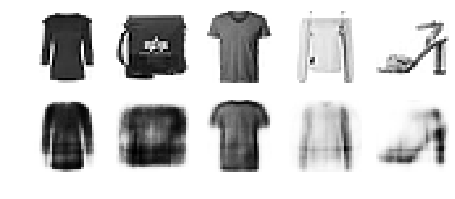

</div>
</div>
</div>


<div markdown="1" class="cell code_cell">
<div class="input_area" markdown="1">
```python
stacked_ae_1_by_1.compile(loss="binary_crossentropy",
                          optimizer=keras.optimizers.SGD(lr=0.1), metrics=[rounded_accuracy])
history = stacked_ae_1_by_1.fit(X_train, X_train, epochs=10,
                                validation_data=[X_valid, X_valid])

```
</div>

<div class="output_wrapper" markdown="1">
<div class="output_subarea" markdown="1">
{:.output_stream}
```
Train on 55000 samples, validate on 5000 samples
Epoch 1/10
55000/55000 [==============================] - 5s 83us/sample - loss: 0.2853 - rounded_accuracy: 0.9359 - val_loss: 0.2868 - val_rounded_accuracy: 0.9361
Epoch 2/10
55000/55000 [==============================] - 4s 70us/sample - loss: 0.2849 - rounded_accuracy: 0.9363 - val_loss: 0.2866 - val_rounded_accuracy: 0.9364
Epoch 3/10
55000/55000 [==============================] - 4s 66us/sample - loss: 0.2847 - rounded_accuracy: 0.9365 - val_loss: 0.2864 - val_rounded_accuracy: 0.9362
Epoch 4/10
55000/55000 [==============================] - 4s 76us/sample - loss: 0.2846 - rounded_accuracy: 0.9366 - val_loss: 0.2863 - val_rounded_accuracy: 0.9367
Epoch 5/10
55000/55000 [==============================] - 4s 74us/sample - loss: 0.2844 - rounded_accuracy: 0.9368 - val_loss: 0.2862 - val_rounded_accuracy: 0.9369
Epoch 6/10
55000/55000 [==============================] - 4s 66us/sample - loss: 0.2843 - rounded_accuracy: 0.9369 - val_loss: 0.2861 - val_rounded_accuracy: 0.9368
Epoch 7/10
55000/55000 [==============================] - 4s 67us/sample - loss: 0.2842 - rounded_accuracy: 0.9370 - val_loss: 0.2860 - val_rounded_accuracy: 0.9368
Epoch 8/10
55000/55000 [==============================] - 4s 66us/sample - loss: 0.2841 - rounded_accuracy: 0.9371 - val_loss: 0.2859 - val_rounded_accuracy: 0.9369
Epoch 9/10
55000/55000 [==============================] - 4s 67us/sample - loss: 0.2840 - rounded_accuracy: 0.9372 - val_loss: 0.2858 - val_rounded_accuracy: 0.9368
Epoch 10/10
55000/55000 [==============================] - 4s 66us/sample - loss: 0.2839 - rounded_accuracy: 0.9373 - val_loss: 0.2857 - val_rounded_accuracy: 0.9371
```
</div>
</div>
</div>


<div markdown="1" class="cell code_cell">
<div class="input_area" markdown="1">
```python
show_reconstructions(stacked_ae_1_by_1)
plt.show()

```
</div>

<div class="output_wrapper" markdown="1">
<div class="output_subarea" markdown="1">

{:.output_png}


</div>
</div>
</div>


## Using Convolutional Layers Instead of Dense Layers


Let's build a stacked Autoencoder with 3 hidden layers and 1 output layer (i.e., 2 stacked Autoencoders).


<div markdown="1" class="cell code_cell">
<div class="input_area" markdown="1">
```python
tf.random.set_seed(42)
np.random.seed(42)

conv_encoder = keras.models.Sequential([
    keras.layers.Reshape([28, 28, 1], input_shape=[28, 28]),
    keras.layers.Conv2D(16, kernel_size=3, padding="SAME", activation="selu"),
    keras.layers.MaxPool2D(pool_size=2),
    keras.layers.Conv2D(32, kernel_size=3, padding="SAME", activation="selu"),
    keras.layers.MaxPool2D(pool_size=2),
    keras.layers.Conv2D(64, kernel_size=3, padding="SAME", activation="selu"),
    keras.layers.MaxPool2D(pool_size=2)
])
conv_decoder = keras.models.Sequential([
    keras.layers.Conv2DTranspose(32, kernel_size=3, strides=2, padding="VALID", activation="selu",
                                 input_shape=[3, 3, 64]),
    keras.layers.Conv2DTranspose(16, kernel_size=3, strides=2, padding="SAME", activation="selu"),
    keras.layers.Conv2DTranspose(1, kernel_size=3, strides=2, padding="SAME", activation="sigmoid"),
    keras.layers.Reshape([28, 28])
])
conv_ae = keras.models.Sequential([conv_encoder, conv_decoder])

conv_ae.compile(loss="binary_crossentropy", optimizer=keras.optimizers.SGD(lr=1.0),
                metrics=[rounded_accuracy])
history = conv_ae.fit(X_train, X_train, epochs=5,
                      validation_data=[X_valid, X_valid])

```
</div>

<div class="output_wrapper" markdown="1">
<div class="output_subarea" markdown="1">
{:.output_stream}
```
Train on 55000 samples, validate on 5000 samples
Epoch 1/5
55000/55000 [==============================] - 40s 734us/sample - loss: 0.3017 - accuracy: 0.5064 - val_loss: 0.2842 - val_accuracy: 0.5058
Epoch 2/5
55000/55000 [==============================] - 39s 712us/sample - loss: 0.2756 - accuracy: 0.5088 - val_loss: 0.2739 - val_accuracy: 0.5058
Epoch 3/5
55000/55000 [==============================] - 39s 715us/sample - loss: 0.2709 - accuracy: 0.5092 - val_loss: 0.2720 - val_accuracy: 0.5059
Epoch 4/5
55000/55000 [==============================] - 39s 707us/sample - loss: 0.2682 - accuracy: 0.5094 - val_loss: 0.2685 - val_accuracy: 0.5063
Epoch 5/5
55000/55000 [==============================] - 39s 706us/sample - loss: 0.2665 - accuracy: 0.5095 - val_loss: 0.2671 - val_accuracy: 0.5066
```
</div>
</div>
</div>


<div markdown="1" class="cell code_cell">
<div class="input_area" markdown="1">
```python
conv_encoder.summary()
conv_decoder.summary()

```
</div>

<div class="output_wrapper" markdown="1">
<div class="output_subarea" markdown="1">
{:.output_stream}
```
Model: "sequential_16"
_________________________________________________________________
Layer (type)                 Output Shape              Param #   
=================================================================
reshape_3 (Reshape)          (None, 28, 28, 1)         0         
_________________________________________________________________
conv2d (Conv2D)              (None, 28, 28, 16)        160       
_________________________________________________________________
max_pooling2d (MaxPooling2D) (None, 14, 14, 16)        0         
_________________________________________________________________
conv2d_1 (Conv2D)            (None, 14, 14, 32)        4640      
_________________________________________________________________
max_pooling2d_1 (MaxPooling2 (None, 7, 7, 32)          0         
_________________________________________________________________
conv2d_2 (Conv2D)            (None, 7, 7, 64)          18496     
_________________________________________________________________
max_pooling2d_2 (MaxPooling2 (None, 3, 3, 64)          0         
=================================================================
Total params: 23,296
Trainable params: 23,296
Non-trainable params: 0
_________________________________________________________________
Model: "sequential_17"
_________________________________________________________________
Layer (type)                 Output Shape              Param #   
=================================================================
conv2d_transpose (Conv2DTran (None, 7, 7, 32)          18464     
_________________________________________________________________
conv2d_transpose_1 (Conv2DTr (None, 14, 14, 16)        4624      
_________________________________________________________________
conv2d_transpose_2 (Conv2DTr (None, 28, 28, 1)         145       
_________________________________________________________________
reshape_4 (Reshape)          (None, 28, 28)            0         
=================================================================
Total params: 23,233
Trainable params: 23,233
Non-trainable params: 0
_________________________________________________________________
```
</div>
</div>
</div>


<div markdown="1" class="cell code_cell">
<div class="input_area" markdown="1">
```python
show_reconstructions(conv_ae)
plt.show()

```
</div>

<div class="output_wrapper" markdown="1">
<div class="output_subarea" markdown="1">

{:.output_png}


</div>
</div>
</div>


# Recurrent Autoencoders


<div markdown="1" class="cell code_cell">
<div class="input_area" markdown="1">
```python
recurrent_encoder = keras.models.Sequential([
    keras.layers.LSTM(100, return_sequences=True, input_shape=[28, 28]),
    keras.layers.LSTM(30)
])
recurrent_decoder = keras.models.Sequential([
    keras.layers.RepeatVector(28, input_shape=[30]),
    keras.layers.LSTM(100, return_sequences=True),
    keras.layers.TimeDistributed(keras.layers.Dense(28, activation="sigmoid"))
])
recurrent_ae = keras.models.Sequential([recurrent_encoder, recurrent_decoder])
recurrent_ae.compile(loss="binary_crossentropy", optimizer=keras.optimizers.SGD(0.1),
                     metrics=[rounded_accuracy])

```
</div>

</div>


<div markdown="1" class="cell code_cell">
<div class="input_area" markdown="1">
```python
history = recurrent_ae.fit(X_train, X_train, epochs=10, validation_data=[X_valid, X_valid])

```
</div>

<div class="output_wrapper" markdown="1">
<div class="output_subarea" markdown="1">
{:.output_stream}
```
Train on 55000 samples, validate on 5000 samples
Epoch 1/10
55000/55000 [==============================] - 79s 1ms/sample - loss: 0.5165 - rounded_accuracy: 0.7363 - val_loss: 0.4489 - val_rounded_accuracy: 0.8137
Epoch 2/10
55000/55000 [==============================] - 78s 1ms/sample - loss: 0.4049 - rounded_accuracy: 0.8415 - val_loss: 0.3762 - val_rounded_accuracy: 0.8650
Epoch 3/10
55000/55000 [==============================] - 80s 1ms/sample - loss: 0.3662 - rounded_accuracy: 0.8703 - val_loss: 0.3626 - val_rounded_accuracy: 0.8730
Epoch 4/10
55000/55000 [==============================] - 80s 1ms/sample - loss: 0.3505 - rounded_accuracy: 0.8808 - val_loss: 0.3483 - val_rounded_accuracy: 0.8838
Epoch 5/10
55000/55000 [==============================] - 82s 1ms/sample - loss: 0.3398 - rounded_accuracy: 0.8881 - val_loss: 0.3345 - val_rounded_accuracy: 0.8941
Epoch 6/10
55000/55000 [==============================] - 93s 2ms/sample - loss: 0.3328 - rounded_accuracy: 0.8930 - val_loss: 0.3372 - val_rounded_accuracy: 0.8914
Epoch 7/10
55000/55000 [==============================] - 94s 2ms/sample - loss: 0.3280 - rounded_accuracy: 0.8962 - val_loss: 0.3261 - val_rounded_accuracy: 0.8980
Epoch 8/10
55000/55000 [==============================] - 95s 2ms/sample - loss: 0.3244 - rounded_accuracy: 0.8988 - val_loss: 0.3226 - val_rounded_accuracy: 0.9030
Epoch 9/10
55000/55000 [==============================] - 92s 2ms/sample - loss: 0.3215 - rounded_accuracy: 0.9010 - val_loss: 0.3239 - val_rounded_accuracy: 0.8958
Epoch 10/10
55000/55000 [==============================] - 90s 2ms/sample - loss: 0.3190 - rounded_accuracy: 0.9030 - val_loss: 0.3206 - val_rounded_accuracy: 0.9015
```
</div>
</div>
<div class="output_wrapper" markdown="1">
<div class="output_subarea" markdown="1">


{:.output_data_text}
```
<tensorflow.python.keras.callbacks.History at 0x1a5b98fa20>
```


</div>
</div>
</div>


<div markdown="1" class="cell code_cell">
<div class="input_area" markdown="1">
```python
show_reconstructions(recurrent_ae)
plt.show()

```
</div>

<div class="output_wrapper" markdown="1">
<div class="output_subarea" markdown="1">

{:.output_png}


</div>
</div>
</div>


# Stacked denoising Autoencoder


Using Gaussian noise:


<div markdown="1" class="cell code_cell">
<div class="input_area" markdown="1">
```python
tf.random.set_seed(42)
np.random.seed(42)

denoising_encoder = keras.models.Sequential([
    keras.layers.Flatten(input_shape=[28, 28]),
    keras.layers.GaussianNoise(0.2),
    keras.layers.Dense(100, activation="selu"),
    keras.layers.Dense(30, activation="selu")
])
denoising_decoder = keras.models.Sequential([
    keras.layers.Dense(100, activation="selu", input_shape=[30]),
    keras.layers.Dense(28 * 28, activation="sigmoid"),
    keras.layers.Reshape([28, 28])
])
denoising_ae = keras.models.Sequential([denoising_encoder, denoising_decoder])
denoising_ae.compile(loss="binary_crossentropy", optimizer=keras.optimizers.SGD(lr=1.0),
                     metrics=[rounded_accuracy])
history = denoising_ae.fit(X_train, X_train, epochs=10,
                           validation_data=[X_valid, X_valid])

```
</div>

<div class="output_wrapper" markdown="1">
<div class="output_subarea" markdown="1">
{:.output_stream}
```
Train on 55000 samples, validate on 5000 samples
Epoch 1/10
55000/55000 [==============================] - 5s 82us/sample - loss: 0.3508 - rounded_accuracy: 0.8768 - val_loss: 0.3231 - val_rounded_accuracy: 0.9065
Epoch 2/10
55000/55000 [==============================] - 4s 75us/sample - loss: 0.3125 - rounded_accuracy: 0.9093 - val_loss: 0.3077 - val_rounded_accuracy: 0.9153
Epoch 3/10
55000/55000 [==============================] - 4s 74us/sample - loss: 0.3061 - rounded_accuracy: 0.9149 - val_loss: 0.3034 - val_rounded_accuracy: 0.9190
Epoch 4/10
55000/55000 [==============================] - 4s 75us/sample - loss: 0.3025 - rounded_accuracy: 0.9181 - val_loss: 0.3007 - val_rounded_accuracy: 0.9195
Epoch 5/10
55000/55000 [==============================] - 4s 75us/sample - loss: 0.2998 - rounded_accuracy: 0.9203 - val_loss: 0.2980 - val_rounded_accuracy: 0.9230
Epoch 6/10
55000/55000 [==============================] - 4s 78us/sample - loss: 0.2979 - rounded_accuracy: 0.9220 - val_loss: 0.2987 - val_rounded_accuracy: 0.9193
Epoch 7/10
55000/55000 [==============================] - 4s 74us/sample - loss: 0.2965 - rounded_accuracy: 0.9233 - val_loss: 0.2945 - val_rounded_accuracy: 0.9269
Epoch 8/10
55000/55000 [==============================] - 4s 75us/sample - loss: 0.2953 - rounded_accuracy: 0.9243 - val_loss: 0.2946 - val_rounded_accuracy: 0.9286
Epoch 9/10
55000/55000 [==============================] - 4s 75us/sample - loss: 0.2943 - rounded_accuracy: 0.9251 - val_loss: 0.2927 - val_rounded_accuracy: 0.9283
Epoch 10/10
55000/55000 [==============================] - 4s 77us/sample - loss: 0.2935 - rounded_accuracy: 0.9258 - val_loss: 0.2920 - val_rounded_accuracy: 0.9291
```
</div>
</div>
</div>


<div markdown="1" class="cell code_cell">
<div class="input_area" markdown="1">
```python
tf.random.set_seed(42)
np.random.seed(42)

noise = keras.layers.GaussianNoise(0.2)
show_reconstructions(denoising_ae, noise(X_valid, training=True))
plt.show()

```
</div>

<div class="output_wrapper" markdown="1">
<div class="output_subarea" markdown="1">

{:.output_png}


</div>
</div>
</div>


Using dropout:


<div markdown="1" class="cell code_cell">
<div class="input_area" markdown="1">
```python
tf.random.set_seed(42)
np.random.seed(42)

dropout_encoder = keras.models.Sequential([
    keras.layers.Flatten(input_shape=[28, 28]),
    keras.layers.Dropout(0.5),
    keras.layers.Dense(100, activation="selu"),
    keras.layers.Dense(30, activation="selu")
])
dropout_decoder = keras.models.Sequential([
    keras.layers.Dense(100, activation="selu", input_shape=[30]),
    keras.layers.Dense(28 * 28, activation="sigmoid"),
    keras.layers.Reshape([28, 28])
])
dropout_ae = keras.models.Sequential([dropout_encoder, dropout_decoder])
dropout_ae.compile(loss="binary_crossentropy", optimizer=keras.optimizers.SGD(lr=1.0),
                   metrics=[rounded_accuracy])
history = dropout_ae.fit(X_train, X_train, epochs=10,
                         validation_data=[X_valid, X_valid])

```
</div>

<div class="output_wrapper" markdown="1">
<div class="output_subarea" markdown="1">
{:.output_stream}
```
Train on 55000 samples, validate on 5000 samples
Epoch 1/10
55000/55000 [==============================] - 5s 83us/sample - loss: 0.3564 - accuracy: 0.4969 - val_loss: 0.3206 - val_accuracy: 0.5011
Epoch 2/10
55000/55000 [==============================] - 4s 73us/sample - loss: 0.3182 - accuracy: 0.5034 - val_loss: 0.3113 - val_accuracy: 0.5014
Epoch 3/10
55000/55000 [==============================] - 4s 74us/sample - loss: 0.3130 - accuracy: 0.5042 - val_loss: 0.3079 - val_accuracy: 0.5012
Epoch 4/10
55000/55000 [==============================] - 4s 73us/sample - loss: 0.3091 - accuracy: 0.5048 - val_loss: 0.3037 - val_accuracy: 0.5026
Epoch 5/10
55000/55000 [==============================] - 4s 76us/sample - loss: 0.3066 - accuracy: 0.5052 - val_loss: 0.3032 - val_accuracy: 0.5016
Epoch 6/10
55000/55000 [==============================] - 4s 78us/sample - loss: 0.3047 - accuracy: 0.5054 - val_loss: 0.3001 - val_accuracy: 0.5032
Epoch 7/10
55000/55000 [==============================] - 4s 79us/sample - loss: 0.3033 - accuracy: 0.5056 - val_loss: 0.2987 - val_accuracy: 0.5033
Epoch 8/10
55000/55000 [==============================] - 4s 76us/sample - loss: 0.3021 - accuracy: 0.5057 - val_loss: 0.2976 - val_accuracy: 0.5033
Epoch 9/10
55000/55000 [==============================] - 4s 75us/sample - loss: 0.3012 - accuracy: 0.5058 - val_loss: 0.2976 - val_accuracy: 0.5033
Epoch 10/10
55000/55000 [==============================] - 4s 76us/sample - loss: 0.3004 - accuracy: 0.5059 - val_loss: 0.2958 - val_accuracy: 0.5033
```
</div>
</div>
</div>


<div markdown="1" class="cell code_cell">
<div class="input_area" markdown="1">
```python
tf.random.set_seed(42)
np.random.seed(42)

dropout = keras.layers.Dropout(0.5)
show_reconstructions(dropout_ae, dropout(X_valid, training=True))
save_fig("dropout_denoising_plot", tight_layout=False)

```
</div>

<div class="output_wrapper" markdown="1">
<div class="output_subarea" markdown="1">
{:.output_stream}
```
Saving figure dropout_denoising_plot
```
</div>
</div>
<div class="output_wrapper" markdown="1">
<div class="output_subarea" markdown="1">

{:.output_png}
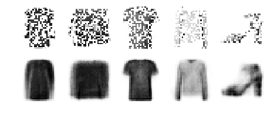

</div>
</div>
</div>


# Sparse Autoencoder


Let's build a simple stacked autoencoder, so we can compare it to the sparse autoencoders we will build. This time we will use the sigmoid activation function for the coding layer, to ensure that the coding values range from 0 to 1:


<div markdown="1" class="cell code_cell">
<div class="input_area" markdown="1">
```python
tf.random.set_seed(42)
np.random.seed(42)

simple_encoder = keras.models.Sequential([
    keras.layers.Flatten(input_shape=[28, 28]),
    keras.layers.Dense(100, activation="selu"),
    keras.layers.Dense(30, activation="sigmoid"),
])
simple_decoder = keras.models.Sequential([
    keras.layers.Dense(100, activation="selu", input_shape=[30]),
    keras.layers.Dense(28 * 28, activation="sigmoid"),
    keras.layers.Reshape([28, 28])
])
simple_ae = keras.models.Sequential([simple_encoder, simple_decoder])
simple_ae.compile(loss="binary_crossentropy", optimizer=keras.optimizers.SGD(lr=1.),
                  metrics=[rounded_accuracy])
history = simple_ae.fit(X_train, X_train, epochs=10,
                        validation_data=[X_valid, X_valid])

```
</div>

<div class="output_wrapper" markdown="1">
<div class="output_subarea" markdown="1">
{:.output_stream}
```
Train on 55000 samples, validate on 5000 samples
Epoch 1/10
55000/55000 [==============================] - 4s 78us/sample - loss: 0.4331 - accuracy: 0.4906 - val_loss: 0.3778 - val_accuracy: 0.4911
Epoch 2/10
55000/55000 [==============================] - 4s 67us/sample - loss: 0.3610 - accuracy: 0.4976 - val_loss: 0.3510 - val_accuracy: 0.4972
Epoch 3/10
55000/55000 [==============================] - 4s 68us/sample - loss: 0.3405 - accuracy: 0.5006 - val_loss: 0.3359 - val_accuracy: 0.4990
Epoch 4/10
55000/55000 [==============================] - 4s 68us/sample - loss: 0.3276 - accuracy: 0.5027 - val_loss: 0.3248 - val_accuracy: 0.5003
Epoch 5/10
55000/55000 [==============================] - 4s 72us/sample - loss: 0.3206 - accuracy: 0.5035 - val_loss: 0.3206 - val_accuracy: 0.5007
Epoch 6/10
55000/55000 [==============================] - 4s 68us/sample - loss: 0.3172 - accuracy: 0.5038 - val_loss: 0.3176 - val_accuracy: 0.5010
Epoch 7/10
55000/55000 [==============================] - 4s 68us/sample - loss: 0.3149 - accuracy: 0.5041 - val_loss: 0.3154 - val_accuracy: 0.5013
Epoch 8/10
55000/55000 [==============================] - 4s 69us/sample - loss: 0.3128 - accuracy: 0.5045 - val_loss: 0.3133 - val_accuracy: 0.5014
Epoch 9/10
55000/55000 [==============================] - 4s 68us/sample - loss: 0.3108 - accuracy: 0.5049 - val_loss: 0.3118 - val_accuracy: 0.5023
Epoch 10/10
55000/55000 [==============================] - 4s 71us/sample - loss: 0.3088 - accuracy: 0.5053 - val_loss: 0.3092 - val_accuracy: 0.5023
```
</div>
</div>
</div>


<div markdown="1" class="cell code_cell">
<div class="input_area" markdown="1">
```python
show_reconstructions(simple_ae)
plt.show()

```
</div>

<div class="output_wrapper" markdown="1">
<div class="output_subarea" markdown="1">

{:.output_png}


</div>
</div>
</div>


Let's create a couple functions to print nice activation histograms:


<div markdown="1" class="cell code_cell">
<div class="input_area" markdown="1">
```python
def plot_percent_hist(ax, data, bins):
    counts, _ = np.histogram(data, bins=bins)
    widths = bins[1:] - bins[:-1]
    x = bins[:-1] + widths / 2
    ax.bar(x, counts / len(data), width=widths*0.8)
    ax.xaxis.set_ticks(bins)
    ax.yaxis.set_major_formatter(mpl.ticker.FuncFormatter(
        lambda y, position: "{}%".format(int(np.round(100 * y)))))
    ax.grid(True)

```
</div>

</div>


<div markdown="1" class="cell code_cell">
<div class="input_area" markdown="1">
```python
def plot_activations_histogram(encoder, height=1, n_bins=10):
    X_valid_codings = encoder(X_valid).numpy()
    activation_means = X_valid_codings.mean(axis=0)
    mean = activation_means.mean()
    bins = np.linspace(0, 1, n_bins + 1)

    fig, [ax1, ax2] = plt.subplots(figsize=(10, 3), nrows=1, ncols=2, sharey=True)
    plot_percent_hist(ax1, X_valid_codings.ravel(), bins)
    ax1.plot([mean, mean], [0, height], "k--", label="Overall Mean = {:.2f}".format(mean))
    ax1.legend(loc="upper center", fontsize=14)
    ax1.set_xlabel("Activation")
    ax1.set_ylabel("% Activations")
    ax1.axis([0, 1, 0, height])
    plot_percent_hist(ax2, activation_means, bins)
    ax2.plot([mean, mean], [0, height], "k--")
    ax2.set_xlabel("Neuron Mean Activation")
    ax2.set_ylabel("% Neurons")
    ax2.axis([0, 1, 0, height])

```
</div>

</div>


Let's use these functions to plot histograms of the activations of the encoding layer. The histogram on the left shows the distribution of all the activations. You can see that values close to 0 or 1 are more frequent overall, which is consistent with the saturating nature of the sigmoid function. The histogram on the right shows the distribution of mean neuron activations: you can see that most neurons have a mean activation close to 0.5. Both histograms tell us that each neuron tends to either fire close to 0 or 1, with about 50% probability each. However, some neurons fire almost all the time (right side of the right histogram).


<div markdown="1" class="cell code_cell">
<div class="input_area" markdown="1">
```python
plot_activations_histogram(simple_encoder, height=0.35)
plt.show()

```
</div>

<div class="output_wrapper" markdown="1">
<div class="output_subarea" markdown="1">

{:.output_png}


</div>
</div>
</div>


Now let's add $\ell_1$ regularization to the coding layer:


<div markdown="1" class="cell code_cell">
<div class="input_area" markdown="1">
```python
tf.random.set_seed(42)
np.random.seed(42)

sparse_l1_encoder = keras.models.Sequential([
    keras.layers.Flatten(input_shape=[28, 28]),
    keras.layers.Dense(100, activation="selu"),
    keras.layers.Dense(300, activation="sigmoid"),
    keras.layers.ActivityRegularization(l1=1e-3)  # Alternatively, you could add
                                                  # activity_regularizer=keras.regularizers.l1(1e-3)
                                                  # to the previous layer.
])
sparse_l1_decoder = keras.models.Sequential([
    keras.layers.Dense(100, activation="selu", input_shape=[300]),
    keras.layers.Dense(28 * 28, activation="sigmoid"),
    keras.layers.Reshape([28, 28])
])
sparse_l1_ae = keras.models.Sequential([sparse_l1_encoder, sparse_l1_decoder])
sparse_l1_ae.compile(loss="binary_crossentropy", optimizer=keras.optimizers.SGD(lr=1.0),
                     metrics=[rounded_accuracy])
history = sparse_l1_ae.fit(X_train, X_train, epochs=10,
                           validation_data=[X_valid, X_valid])

```
</div>

<div class="output_wrapper" markdown="1">
<div class="output_subarea" markdown="1">
{:.output_stream}
```
Train on 55000 samples, validate on 5000 samples
Epoch 1/10
55000/55000 [==============================] - 5s 98us/sample - loss: 0.4306 - accuracy: 0.4947 - val_loss: 0.3819 - val_accuracy: 0.4897
Epoch 2/10
55000/55000 [==============================] - 4s 75us/sample - loss: 0.3689 - accuracy: 0.4971 - val_loss: 0.3639 - val_accuracy: 0.4940
Epoch 3/10
55000/55000 [==============================] - 5s 86us/sample - loss: 0.3553 - accuracy: 0.4987 - val_loss: 0.3513 - val_accuracy: 0.4970
Epoch 4/10
55000/55000 [==============================] - 4s 78us/sample - loss: 0.3443 - accuracy: 0.5003 - val_loss: 0.3428 - val_accuracy: 0.4964
Epoch 5/10
55000/55000 [==============================] - 4s 76us/sample - loss: 0.3379 - accuracy: 0.5009 - val_loss: 0.3372 - val_accuracy: 0.4979
Epoch 6/10
55000/55000 [==============================] - 4s 76us/sample - loss: 0.3332 - accuracy: 0.5015 - val_loss: 0.3329 - val_accuracy: 0.4980
Epoch 7/10
55000/55000 [==============================] - 4s 78us/sample - loss: 0.3286 - accuracy: 0.5025 - val_loss: 0.3306 - val_accuracy: 0.4981
Epoch 8/10
55000/55000 [==============================] - 4s 76us/sample - loss: 0.3249 - accuracy: 0.5032 - val_loss: 0.3254 - val_accuracy: 0.5000
Epoch 9/10
55000/55000 [==============================] - 4s 80us/sample - loss: 0.3223 - accuracy: 0.5036 - val_loss: 0.3244 - val_accuracy: 0.4995
Epoch 10/10
55000/55000 [==============================] - 4s 75us/sample - loss: 0.3205 - accuracy: 0.5039 - val_loss: 0.3212 - val_accuracy: 0.5014
```
</div>
</div>
</div>


<div markdown="1" class="cell code_cell">
<div class="input_area" markdown="1">
```python
show_reconstructions(sparse_l1_ae)

```
</div>

<div class="output_wrapper" markdown="1">
<div class="output_subarea" markdown="1">

{:.output_png}


</div>
</div>
</div>


<div markdown="1" class="cell code_cell">
<div class="input_area" markdown="1">
```python
plot_activations_histogram(sparse_l1_encoder, height=1.)
plt.show()

```
</div>

<div class="output_wrapper" markdown="1">
<div class="output_subarea" markdown="1">

{:.output_png}
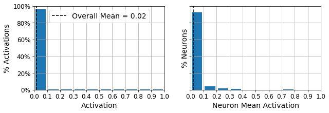

</div>
</div>
</div>


Let's use the KL Divergence loss instead to ensure sparsity, and target 10% sparsity rather than 0%:


<div markdown="1" class="cell code_cell">
<div class="input_area" markdown="1">
```python
p = 0.1
q = np.linspace(0.001, 0.999, 500)
kl_div = p * np.log(p / q) + (1 - p) * np.log((1 - p) / (1 - q))
mse = (p - q)**2
mae = np.abs(p - q)
plt.plot([p, p], [0, 0.3], "k:")
plt.text(0.05, 0.32, "Target\nsparsity", fontsize=14)
plt.plot(q, kl_div, "b-", label="KL divergence")
plt.plot(q, mae, "g--", label=r"MAE ($\ell_1$)")
plt.plot(q, mse, "r--", linewidth=1, label=r"MSE ($\ell_2$)")
plt.legend(loc="upper left", fontsize=14)
plt.xlabel("Actual sparsity")
plt.ylabel("Cost", rotation=0)
plt.axis([0, 1, 0, 0.95])
save_fig("sparsity_loss_plot")

```
</div>

<div class="output_wrapper" markdown="1">
<div class="output_subarea" markdown="1">
{:.output_stream}
```
Saving figure sparsity_loss_plot
```
</div>
</div>
<div class="output_wrapper" markdown="1">
<div class="output_subarea" markdown="1">

{:.output_png}
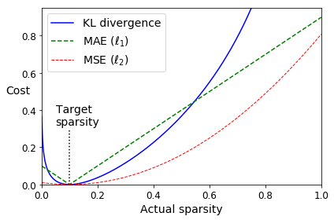

</div>
</div>
</div>


<div markdown="1" class="cell code_cell">
<div class="input_area" markdown="1">
```python
K = keras.backend
kl_divergence = keras.losses.kullback_leibler_divergence

class KLDivergenceRegularizer(keras.regularizers.Regularizer):
    def __init__(self, weight, target=0.1):
        self.weight = weight
        self.target = target
    def __call__(self, inputs):
        mean_activities = K.mean(inputs, axis=0)
        return self.weight * (
            kl_divergence(self.target, mean_activities) +
            kl_divergence(1. - self.target, 1. - mean_activities))

```
</div>

</div>


<div markdown="1" class="cell code_cell">
<div class="input_area" markdown="1">
```python
tf.random.set_seed(42)
np.random.seed(42)

kld_reg = KLDivergenceRegularizer(weight=0.05, target=0.1)
sparse_kl_encoder = keras.models.Sequential([
    keras.layers.Flatten(input_shape=[28, 28]),
    keras.layers.Dense(100, activation="selu"),
    keras.layers.Dense(300, activation="sigmoid", activity_regularizer=kld_reg)
])
sparse_kl_decoder = keras.models.Sequential([
    keras.layers.Dense(100, activation="selu", input_shape=[300]),
    keras.layers.Dense(28 * 28, activation="sigmoid"),
    keras.layers.Reshape([28, 28])
])
sparse_kl_ae = keras.models.Sequential([sparse_kl_encoder, sparse_kl_decoder])
sparse_kl_ae.compile(loss="binary_crossentropy", optimizer=keras.optimizers.SGD(lr=1.0),
              metrics=[rounded_accuracy])
history = sparse_kl_ae.fit(X_train, X_train, epochs=10,
                           validation_data=[X_valid, X_valid])

```
</div>

<div class="output_wrapper" markdown="1">
<div class="output_subarea" markdown="1">
{:.output_stream}
```
Train on 55000 samples, validate on 5000 samples
Epoch 1/10
55000/55000 [==============================] - 6s 103us/sample - loss: 0.4151 - rounded_accuracy: 0.8121 - val_loss: 0.3714 - val_rounded_accuracy: 0.8560
Epoch 2/10
55000/55000 [==============================] - 4s 81us/sample - loss: 0.3532 - rounded_accuracy: 0.8762 - val_loss: 0.3442 - val_rounded_accuracy: 0.8842
Epoch 3/10
55000/55000 [==============================] - 5s 83us/sample - loss: 0.3340 - rounded_accuracy: 0.8919 - val_loss: 0.3292 - val_rounded_accuracy: 0.8976
Epoch 4/10
55000/55000 [==============================] - 5s 84us/sample - loss: 0.3224 - rounded_accuracy: 0.9018 - val_loss: 0.3213 - val_rounded_accuracy: 0.9040
Epoch 5/10
55000/55000 [==============================] - 5s 85us/sample - loss: 0.3170 - rounded_accuracy: 0.9062 - val_loss: 0.3170 - val_rounded_accuracy: 0.9075
Epoch 6/10
55000/55000 [==============================] - 5s 82us/sample - loss: 0.3134 - rounded_accuracy: 0.9093 - val_loss: 0.3140 - val_rounded_accuracy: 0.9105
Epoch 7/10
55000/55000 [==============================] - 5s 85us/sample - loss: 0.3107 - rounded_accuracy: 0.9116 - val_loss: 0.3114 - val_rounded_accuracy: 0.9121
Epoch 8/10
55000/55000 [==============================] - 5s 83us/sample - loss: 0.3084 - rounded_accuracy: 0.9136 - val_loss: 0.3094 - val_rounded_accuracy: 0.9145
Epoch 9/10
55000/55000 [==============================] - 5s 83us/sample - loss: 0.3064 - rounded_accuracy: 0.9154 - val_loss: 0.3074 - val_rounded_accuracy: 0.9166
Epoch 10/10
55000/55000 [==============================] - 5s 84us/sample - loss: 0.3044 - rounded_accuracy: 0.9170 - val_loss: 0.3053 - val_rounded_accuracy: 0.9174
```
</div>
</div>
</div>


<div markdown="1" class="cell code_cell">
<div class="input_area" markdown="1">
```python
show_reconstructions(sparse_kl_ae)

```
</div>

<div class="output_wrapper" markdown="1">
<div class="output_subarea" markdown="1">

{:.output_png}
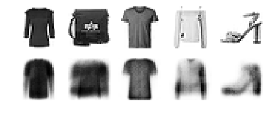

</div>
</div>
</div>


<div markdown="1" class="cell code_cell">
<div class="input_area" markdown="1">
```python
plot_activations_histogram(sparse_kl_encoder)
save_fig("sparse_autoencoder_plot")
plt.show()

```
</div>

<div class="output_wrapper" markdown="1">
<div class="output_subarea" markdown="1">
{:.output_stream}
```
Saving figure sparse_autoencoder_plot
```
</div>
</div>
<div class="output_wrapper" markdown="1">
<div class="output_subarea" markdown="1">

{:.output_png}
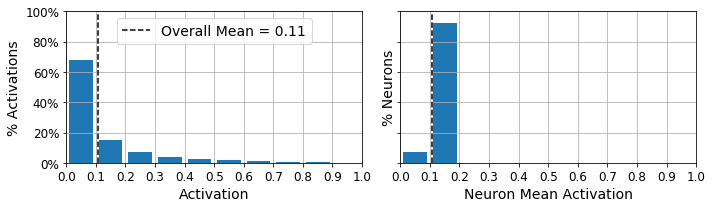

</div>
</div>
</div>


# Variational Autoencoder


<div markdown="1" class="cell code_cell">
<div class="input_area" markdown="1">
```python
class Sampling(keras.layers.Layer):
    def call(self, inputs):
        mean, log_var = inputs
        return K.random_normal(tf.shape(log_var)) * K.exp(log_var / 2) + mean 

```
</div>

</div>


<div markdown="1" class="cell code_cell">
<div class="input_area" markdown="1">
```python
tf.random.set_seed(42)
np.random.seed(42)

codings_size = 10

inputs = keras.layers.Input(shape=[28, 28])
z = keras.layers.Flatten()(inputs)
z = keras.layers.Dense(150, activation="selu")(z)
z = keras.layers.Dense(100, activation="selu")(z)
codings_mean = keras.layers.Dense(codings_size)(z)
codings_log_var = keras.layers.Dense(codings_size)(z)
codings = Sampling()([codings_mean, codings_log_var])
variational_encoder = keras.models.Model(
    inputs=[inputs], outputs=[codings_mean, codings_log_var, codings])

decoder_inputs = keras.layers.Input(shape=[codings_size])
x = keras.layers.Dense(100, activation="selu")(decoder_inputs)
x = keras.layers.Dense(150, activation="selu")(x)
x = keras.layers.Dense(28 * 28, activation="sigmoid")(x)
outputs = keras.layers.Reshape([28, 28])(x)
variational_decoder = keras.models.Model(inputs=[decoder_inputs], outputs=[outputs])

_, _, codings = variational_encoder(inputs)
reconstructions = variational_decoder(codings)
variational_ae = keras.models.Model(inputs=[inputs], outputs=[reconstructions])

latent_loss = -0.5 * K.sum(
    1 + codings_log_var - K.exp(codings_log_var) - K.square(codings_mean),
    axis=-1)
variational_ae.add_loss(K.mean(latent_loss) / 784.)
variational_ae.compile(loss="binary_crossentropy", optimizer="rmsprop", metrics=[rounded_accuracy])
history = variational_ae.fit(X_train, X_train, epochs=25, batch_size=128,
                             validation_data=[X_valid, X_valid])

```
</div>

<div class="output_wrapper" markdown="1">
<div class="output_subarea" markdown="1">
{:.output_stream}
```
Train on 55000 samples, validate on 5000 samples
Epoch 1/25
55000/55000 [==============================] - 5s 84us/sample - loss: 0.3889 - rounded_accuracy: 0.8608 - val_loss: 0.3592 - val_rounded_accuracy: 0.8840
Epoch 2/25
55000/55000 [==============================] - 3s 60us/sample - loss: 0.3429 - rounded_accuracy: 0.8974 - val_loss: 0.3369 - val_rounded_accuracy: 0.8982
Epoch 3/25
55000/55000 [==============================] - 3s 53us/sample - loss: 0.3329 - rounded_accuracy: 0.9050 - val_loss: 0.3356 - val_rounded_accuracy: 0.9022
Epoch 4/25
55000/55000 [==============================] - 3s 61us/sample - loss: 0.3275 - rounded_accuracy: 0.9092 - val_loss: 0.3255 - val_rounded_accuracy: 0.9105
Epoch 5/25
55000/55000 [==============================] - 3s 59us/sample - loss: 0.3243 - rounded_accuracy: 0.9119 - val_loss: 0.3232 - val_rounded_accuracy: 0.9169
Epoch 6/25
55000/55000 [==============================] - 3s 58us/sample - loss: 0.3219 - rounded_accuracy: 0.9138 - val_loss: 0.3236 - val_rounded_accuracy: 0.9149
Epoch 7/25
55000/55000 [==============================] - 3s 55us/sample - loss: 0.3204 - rounded_accuracy: 0.9150 - val_loss: 0.3194 - val_rounded_accuracy: 0.9176
Epoch 8/25
55000/55000 [==============================] - 3s 56us/sample - loss: 0.3190 - rounded_accuracy: 0.9162 - val_loss: 0.3195 - val_rounded_accuracy: 0.9146
Epoch 9/25
55000/55000 [==============================] - 3s 58us/sample - loss: 0.3180 - rounded_accuracy: 0.9169 - val_loss: 0.3197 - val_rounded_accuracy: 0.9151
Epoch 10/25
55000/55000 [==============================] - 3s 60us/sample - loss: 0.3172 - rounded_accuracy: 0.9178 - val_loss: 0.3169 - val_rounded_accuracy: 0.9192
Epoch 11/25
55000/55000 [==============================] - 3s 57us/sample - loss: 0.3165 - rounded_accuracy: 0.9183 - val_loss: 0.3197 - val_rounded_accuracy: 0.9177
Epoch 12/25
55000/55000 [==============================] - 3s 58us/sample - loss: 0.3159 - rounded_accuracy: 0.9188 - val_loss: 0.3168 - val_rounded_accuracy: 0.9185
Epoch 13/25
55000/55000 [==============================] - 3s 62us/sample - loss: 0.3154 - rounded_accuracy: 0.9193 - val_loss: 0.3175 - val_rounded_accuracy: 0.9178
Epoch 14/25
55000/55000 [==============================] - 4s 64us/sample - loss: 0.3150 - rounded_accuracy: 0.9197 - val_loss: 0.3170 - val_rounded_accuracy: 0.9201
Epoch 15/25
55000/55000 [==============================] - 3s 60us/sample - loss: 0.3145 - rounded_accuracy: 0.9199 - val_loss: 0.3177 - val_rounded_accuracy: 0.9202
Epoch 16/25
55000/55000 [==============================] - 3s 58us/sample - loss: 0.3141 - rounded_accuracy: 0.9202 - val_loss: 0.3161 - val_rounded_accuracy: 0.9206
Epoch 17/25
55000/55000 [==============================] - 3s 61us/sample - loss: 0.3138 - rounded_accuracy: 0.9206 - val_loss: 0.3164 - val_rounded_accuracy: 0.9173
Epoch 18/25
55000/55000 [==============================] - 3s 58us/sample - loss: 0.3135 - rounded_accuracy: 0.9209 - val_loss: 0.3160 - val_rounded_accuracy: 0.9174
Epoch 19/25
55000/55000 [==============================] - 3s 58us/sample - loss: 0.3132 - rounded_accuracy: 0.9211 - val_loss: 0.3160 - val_rounded_accuracy: 0.9216
Epoch 20/25
55000/55000 [==============================] - 3s 61us/sample - loss: 0.3129 - rounded_accuracy: 0.9213 - val_loss: 0.3155 - val_rounded_accuracy: 0.9212
Epoch 21/25
55000/55000 [==============================] - 3s 61us/sample - loss: 0.3127 - rounded_accuracy: 0.9215 - val_loss: 0.3163 - val_rounded_accuracy: 0.9174
Epoch 22/25
55000/55000 [==============================] - 3s 60us/sample - loss: 0.3125 - rounded_accuracy: 0.9217 - val_loss: 0.3145 - val_rounded_accuracy: 0.9215
Epoch 23/25
55000/55000 [==============================] - 3s 53us/sample - loss: 0.3122 - rounded_accuracy: 0.9219 - val_loss: 0.3158 - val_rounded_accuracy: 0.9201
Epoch 24/25
55000/55000 [==============================] - 3s 56us/sample - loss: 0.3121 - rounded_accuracy: 0.9222 - val_loss: 0.3136 - val_rounded_accuracy: 0.9211
Epoch 25/25
55000/55000 [==============================] - 3s 54us/sample - loss: 0.3118 - rounded_accuracy: 0.9223 - val_loss: 0.3133 - val_rounded_accuracy: 0.9228
```
</div>
</div>
</div>


<div markdown="1" class="cell code_cell">
<div class="input_area" markdown="1">
```python
show_reconstructions(variational_ae)
plt.show()

```
</div>

<div class="output_wrapper" markdown="1">
<div class="output_subarea" markdown="1">

{:.output_png}


</div>
</div>
</div>


## Generate Fashion Images


<div markdown="1" class="cell code_cell">
<div class="input_area" markdown="1">
```python
def plot_multiple_images(images, n_cols=None):
    n_cols = n_cols or len(images)
    n_rows = (len(images) - 1) // n_cols + 1
    if images.shape[-1] == 1:
        images = np.squeeze(images, axis=-1)
    plt.figure(figsize=(n_cols, n_rows))
    for index, image in enumerate(images):
        plt.subplot(n_rows, n_cols, index + 1)
        plt.imshow(image, cmap="binary")
        plt.axis("off")

```
</div>

</div>


Let's generate a few random codings, decode them and plot the resulting images:


<div markdown="1" class="cell code_cell">
<div class="input_area" markdown="1">
```python
tf.random.set_seed(42)

codings = tf.random.normal(shape=[12, codings_size])
images = variational_decoder(codings).numpy()
plot_multiple_images(images, 4)
save_fig("vae_generated_images_plot", tight_layout=False)

```
</div>

<div class="output_wrapper" markdown="1">
<div class="output_subarea" markdown="1">
{:.output_stream}
```
Saving figure vae_generated_images_plot
```
</div>
</div>
<div class="output_wrapper" markdown="1">
<div class="output_subarea" markdown="1">

{:.output_png}


</div>
</div>
</div>


Now let's perform semantic interpolation between these images:


<div markdown="1" class="cell code_cell">
<div class="input_area" markdown="1">
```python
tf.random.set_seed(42)
np.random.seed(42)

codings_grid = tf.reshape(codings, [1, 3, 4, codings_size])
larger_grid = tf.image.resize(codings_grid, size=[5, 7])
interpolated_codings = tf.reshape(larger_grid, [-1, codings_size])
images = variational_decoder(interpolated_codings).numpy()

plt.figure(figsize=(7, 5))
for index, image in enumerate(images):
    plt.subplot(5, 7, index + 1)
    if index%7%2==0 and index//7%2==0:
        plt.gca().get_xaxis().set_visible(False)
        plt.gca().get_yaxis().set_visible(False)
    else:
        plt.axis("off")
    plt.imshow(image, cmap="binary")
save_fig("semantic_interpolation_plot", tight_layout=False)

```
</div>

<div class="output_wrapper" markdown="1">
<div class="output_subarea" markdown="1">
{:.output_stream}
```
Saving figure semantic_interpolation_plot
```
</div>
</div>
<div class="output_wrapper" markdown="1">
<div class="output_subarea" markdown="1">

{:.output_png}
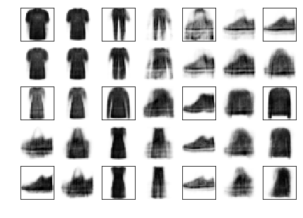

</div>
</div>
</div>


# Generative Adversarial Networks


<div markdown="1" class="cell code_cell">
<div class="input_area" markdown="1">
```python
np.random.seed(42)
tf.random.set_seed(42)

codings_size = 30

generator = keras.models.Sequential([
    keras.layers.Dense(100, activation="selu", input_shape=[codings_size]),
    keras.layers.Dense(150, activation="selu"),
    keras.layers.Dense(28 * 28, activation="sigmoid"),
    keras.layers.Reshape([28, 28])
])
discriminator = keras.models.Sequential([
    keras.layers.Flatten(input_shape=[28, 28]),
    keras.layers.Dense(150, activation="selu"),
    keras.layers.Dense(100, activation="selu"),
    keras.layers.Dense(1, activation="sigmoid")
])
gan = keras.models.Sequential([generator, discriminator])

```
</div>

</div>


<div markdown="1" class="cell code_cell">
<div class="input_area" markdown="1">
```python
discriminator.compile(loss="binary_crossentropy", optimizer="rmsprop")
discriminator.trainable = False
gan.compile(loss="binary_crossentropy", optimizer="rmsprop")

```
</div>

</div>


<div markdown="1" class="cell code_cell">
<div class="input_area" markdown="1">
```python
batch_size = 32
dataset = tf.data.Dataset.from_tensor_slices(X_train).shuffle(1000)
dataset = dataset.batch(batch_size, drop_remainder=True).prefetch(1)

```
</div>

</div>


<div markdown="1" class="cell code_cell">
<div class="input_area" markdown="1">
```python
def train_gan(gan, dataset, batch_size, codings_size, n_epochs=50):
    generator, discriminator = gan.layers
    for epoch in range(n_epochs):
        print("Epoch {}/{}".format(epoch + 1, n_epochs))              # not shown in the book
        for X_batch in dataset:
            # phase 1 - training the discriminator
            noise = tf.random.normal(shape=[batch_size, codings_size])
            generated_images = generator(noise)
            X_fake_and_real = tf.concat([generated_images, X_batch], axis=0)
            y1 = tf.constant([[0.]] * batch_size + [[1.]] * batch_size)
            discriminator.trainable = True
            discriminator.train_on_batch(X_fake_and_real, y1)
            # phase 2 - training the generator
            noise = tf.random.normal(shape=[batch_size, codings_size])
            y2 = tf.constant([[1.]] * batch_size)
            discriminator.trainable = False
            gan.train_on_batch(noise, y2)
        plot_multiple_images(generated_images, 8)                     # not shown
        plt.show()                                                    # not shown

```
</div>

</div>


<div markdown="1" class="cell code_cell">
<div class="input_area" markdown="1">
```python
train_gan(gan, dataset, batch_size, codings_size, n_epochs=1)

```
</div>

<div class="output_wrapper" markdown="1">
<div class="output_subarea" markdown="1">
{:.output_stream}
```
Epoch 1/1
```
</div>
</div>
<div class="output_wrapper" markdown="1">
<div class="output_subarea" markdown="1">

{:.output_png}
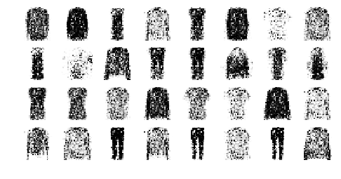

</div>
</div>
</div>


<div markdown="1" class="cell code_cell">
<div class="input_area" markdown="1">
```python
tf.random.set_seed(42)
np.random.seed(42)

noise = tf.random.normal(shape=[batch_size, codings_size])
generated_images = generator(noise)
plot_multiple_images(generated_images, 8)
save_fig("gan_generated_images_plot", tight_layout=False)

```
</div>

<div class="output_wrapper" markdown="1">
<div class="output_subarea" markdown="1">
{:.output_stream}
```
Saving figure gan_generated_images_plot
```
</div>
</div>
<div class="output_wrapper" markdown="1">
<div class="output_subarea" markdown="1">

{:.output_png}


</div>
</div>
</div>


<div markdown="1" class="cell code_cell">
<div class="input_area" markdown="1">
```python
train_gan(gan, dataset, batch_size, codings_size)

```
</div>

<div class="output_wrapper" markdown="1">
<div class="output_subarea" markdown="1">
{:.output_stream}
```
Epoch 1/50
```
</div>
</div>
<div class="output_wrapper" markdown="1">
<div class="output_subarea" markdown="1">

{:.output_png}
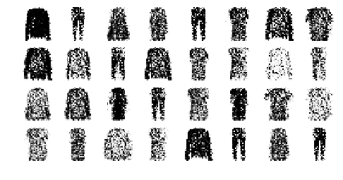

</div>
</div>
<div class="output_wrapper" markdown="1">
<div class="output_subarea" markdown="1">
{:.output_stream}
```
Epoch 2/50
```
</div>
</div>
<div class="output_wrapper" markdown="1">
<div class="output_subarea" markdown="1">

{:.output_png}


</div>
</div>
<div class="output_wrapper" markdown="1">
<div class="output_subarea" markdown="1">
{:.output_stream}
```
Epoch 3/50
```
</div>
</div>
<div class="output_wrapper" markdown="1">
<div class="output_subarea" markdown="1">

{:.output_png}


</div>
</div>
<div class="output_wrapper" markdown="1">
<div class="output_subarea" markdown="1">
{:.output_stream}
```
Epoch 4/50
```
</div>
</div>
<div class="output_wrapper" markdown="1">
<div class="output_subarea" markdown="1">

{:.output_png}


</div>
</div>
<div class="output_wrapper" markdown="1">
<div class="output_subarea" markdown="1">
{:.output_stream}
```
Epoch 5/50
```
</div>
</div>
<div class="output_wrapper" markdown="1">
<div class="output_subarea" markdown="1">

{:.output_png}
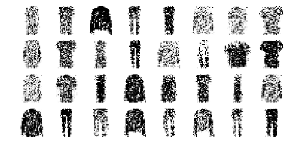

</div>
</div>
<div class="output_wrapper" markdown="1">
<div class="output_subarea" markdown="1">
{:.output_stream}
```
Epoch 6/50
```
</div>
</div>
<div class="output_wrapper" markdown="1">
<div class="output_subarea" markdown="1">

{:.output_png}
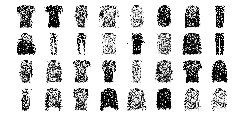

</div>
</div>
<div class="output_wrapper" markdown="1">
<div class="output_subarea" markdown="1">
{:.output_stream}
```
Epoch 7/50
```
</div>
</div>
<div class="output_wrapper" markdown="1">
<div class="output_subarea" markdown="1">

{:.output_png}
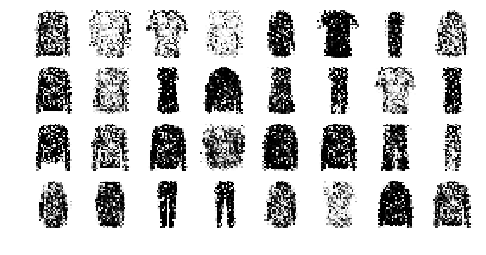

</div>
</div>
<div class="output_wrapper" markdown="1">
<div class="output_subarea" markdown="1">
{:.output_stream}
```
Epoch 8/50
```
</div>
</div>
<div class="output_wrapper" markdown="1">
<div class="output_subarea" markdown="1">

{:.output_png}


</div>
</div>
<div class="output_wrapper" markdown="1">
<div class="output_subarea" markdown="1">
{:.output_stream}
```
Epoch 9/50
```
</div>
</div>
<div class="output_wrapper" markdown="1">
<div class="output_subarea" markdown="1">

{:.output_png}


</div>
</div>
<div class="output_wrapper" markdown="1">
<div class="output_subarea" markdown="1">
{:.output_stream}
```
Epoch 10/50
```
</div>
</div>
<div class="output_wrapper" markdown="1">
<div class="output_subarea" markdown="1">

{:.output_png}
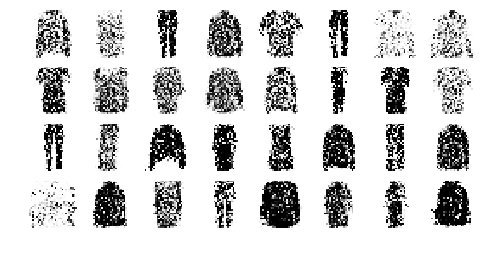

</div>
</div>
<div class="output_wrapper" markdown="1">
<div class="output_subarea" markdown="1">
{:.output_stream}
```
Epoch 11/50
```
</div>
</div>
<div class="output_wrapper" markdown="1">
<div class="output_subarea" markdown="1">

{:.output_png}
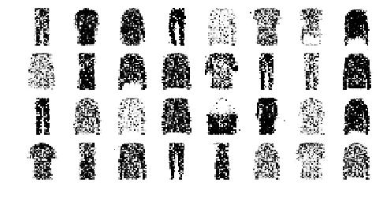

</div>
</div>
<div class="output_wrapper" markdown="1">
<div class="output_subarea" markdown="1">
{:.output_stream}
```
Epoch 12/50
```
</div>
</div>
<div class="output_wrapper" markdown="1">
<div class="output_subarea" markdown="1">

{:.output_png}


</div>
</div>
<div class="output_wrapper" markdown="1">
<div class="output_subarea" markdown="1">
{:.output_stream}
```
Epoch 13/50
```
</div>
</div>
<div class="output_wrapper" markdown="1">
<div class="output_subarea" markdown="1">

{:.output_png}


</div>
</div>
<div class="output_wrapper" markdown="1">
<div class="output_subarea" markdown="1">
{:.output_stream}
```
Epoch 14/50
```
</div>
</div>
<div class="output_wrapper" markdown="1">
<div class="output_subarea" markdown="1">

{:.output_png}


</div>
</div>
<div class="output_wrapper" markdown="1">
<div class="output_subarea" markdown="1">
{:.output_stream}
```
Epoch 15/50
```
</div>
</div>
<div class="output_wrapper" markdown="1">
<div class="output_subarea" markdown="1">

{:.output_png}
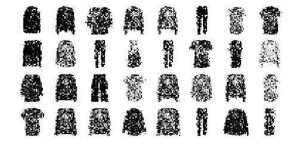

</div>
</div>
<div class="output_wrapper" markdown="1">
<div class="output_subarea" markdown="1">
{:.output_stream}
```
Epoch 16/50
```
</div>
</div>
<div class="output_wrapper" markdown="1">
<div class="output_subarea" markdown="1">

{:.output_png}
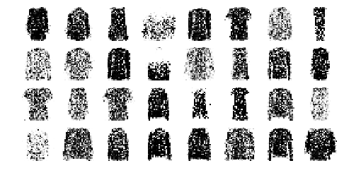

</div>
</div>
<div class="output_wrapper" markdown="1">
<div class="output_subarea" markdown="1">
{:.output_stream}
```
Epoch 17/50
```
</div>
</div>
<div class="output_wrapper" markdown="1">
<div class="output_subarea" markdown="1">

{:.output_png}


</div>
</div>
<div class="output_wrapper" markdown="1">
<div class="output_subarea" markdown="1">
{:.output_stream}
```
Epoch 18/50
```
</div>
</div>
<div class="output_wrapper" markdown="1">
<div class="output_subarea" markdown="1">

{:.output_png}


</div>
</div>
<div class="output_wrapper" markdown="1">
<div class="output_subarea" markdown="1">
{:.output_stream}
```
Epoch 19/50
```
</div>
</div>
<div class="output_wrapper" markdown="1">
<div class="output_subarea" markdown="1">

{:.output_png}


</div>
</div>
<div class="output_wrapper" markdown="1">
<div class="output_subarea" markdown="1">
{:.output_stream}
```
Epoch 20/50
```
</div>
</div>
<div class="output_wrapper" markdown="1">
<div class="output_subarea" markdown="1">

{:.output_png}
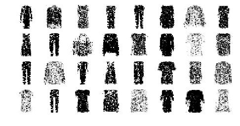

</div>
</div>
<div class="output_wrapper" markdown="1">
<div class="output_subarea" markdown="1">
{:.output_stream}
```
Epoch 21/50
```
</div>
</div>
<div class="output_wrapper" markdown="1">
<div class="output_subarea" markdown="1">

{:.output_png}
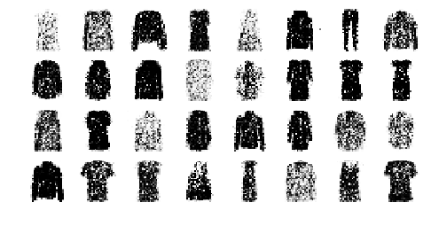

</div>
</div>
<div class="output_wrapper" markdown="1">
<div class="output_subarea" markdown="1">
{:.output_stream}
```
Epoch 22/50
```
</div>
</div>
<div class="output_wrapper" markdown="1">
<div class="output_subarea" markdown="1">

{:.output_png}


</div>
</div>
<div class="output_wrapper" markdown="1">
<div class="output_subarea" markdown="1">
{:.output_stream}
```
Epoch 23/50
```
</div>
</div>
<div class="output_wrapper" markdown="1">
<div class="output_subarea" markdown="1">

{:.output_png}


</div>
</div>
<div class="output_wrapper" markdown="1">
<div class="output_subarea" markdown="1">
{:.output_stream}
```
Epoch 24/50
```
</div>
</div>
<div class="output_wrapper" markdown="1">
<div class="output_subarea" markdown="1">

{:.output_png}


</div>
</div>
<div class="output_wrapper" markdown="1">
<div class="output_subarea" markdown="1">
{:.output_stream}
```
Epoch 25/50
```
</div>
</div>
<div class="output_wrapper" markdown="1">
<div class="output_subarea" markdown="1">

{:.output_png}


</div>
</div>
<div class="output_wrapper" markdown="1">
<div class="output_subarea" markdown="1">
{:.output_stream}
```
Epoch 26/50
```
</div>
</div>
<div class="output_wrapper" markdown="1">
<div class="output_subarea" markdown="1">

{:.output_png}


</div>
</div>
<div class="output_wrapper" markdown="1">
<div class="output_subarea" markdown="1">
{:.output_stream}
```
Epoch 27/50
```
</div>
</div>
<div class="output_wrapper" markdown="1">
<div class="output_subarea" markdown="1">

{:.output_png}


</div>
</div>
<div class="output_wrapper" markdown="1">
<div class="output_subarea" markdown="1">
{:.output_stream}
```
Epoch 28/50
```
</div>
</div>
<div class="output_wrapper" markdown="1">
<div class="output_subarea" markdown="1">

{:.output_png}
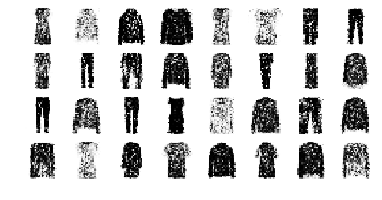

</div>
</div>
<div class="output_wrapper" markdown="1">
<div class="output_subarea" markdown="1">
{:.output_stream}
```
Epoch 29/50
```
</div>
</div>
<div class="output_wrapper" markdown="1">
<div class="output_subarea" markdown="1">

{:.output_png}


</div>
</div>
<div class="output_wrapper" markdown="1">
<div class="output_subarea" markdown="1">
{:.output_stream}
```
Epoch 30/50
```
</div>
</div>
<div class="output_wrapper" markdown="1">
<div class="output_subarea" markdown="1">

{:.output_png}


</div>
</div>
<div class="output_wrapper" markdown="1">
<div class="output_subarea" markdown="1">
{:.output_stream}
```
Epoch 31/50
```
</div>
</div>
<div class="output_wrapper" markdown="1">
<div class="output_subarea" markdown="1">

{:.output_png}


</div>
</div>
<div class="output_wrapper" markdown="1">
<div class="output_subarea" markdown="1">
{:.output_stream}
```
Epoch 32/50
```
</div>
</div>
<div class="output_wrapper" markdown="1">
<div class="output_subarea" markdown="1">

{:.output_png}


</div>
</div>
<div class="output_wrapper" markdown="1">
<div class="output_subarea" markdown="1">
{:.output_stream}
```
Epoch 33/50
```
</div>
</div>
<div class="output_wrapper" markdown="1">
<div class="output_subarea" markdown="1">

{:.output_png}


</div>
</div>
<div class="output_wrapper" markdown="1">
<div class="output_subarea" markdown="1">
{:.output_stream}
```
Epoch 34/50
```
</div>
</div>
<div class="output_wrapper" markdown="1">
<div class="output_subarea" markdown="1">

{:.output_png}


</div>
</div>
<div class="output_wrapper" markdown="1">
<div class="output_subarea" markdown="1">
{:.output_stream}
```
Epoch 35/50
```
</div>
</div>
<div class="output_wrapper" markdown="1">
<div class="output_subarea" markdown="1">

{:.output_png}


</div>
</div>
<div class="output_wrapper" markdown="1">
<div class="output_subarea" markdown="1">
{:.output_stream}
```
Epoch 36/50
```
</div>
</div>
<div class="output_wrapper" markdown="1">
<div class="output_subarea" markdown="1">

{:.output_png}
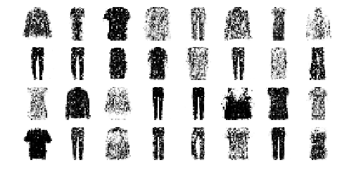

</div>
</div>
<div class="output_wrapper" markdown="1">
<div class="output_subarea" markdown="1">
{:.output_stream}
```
Epoch 37/50
```
</div>
</div>
<div class="output_wrapper" markdown="1">
<div class="output_subarea" markdown="1">

{:.output_png}


</div>
</div>
<div class="output_wrapper" markdown="1">
<div class="output_subarea" markdown="1">
{:.output_stream}
```
Epoch 38/50
```
</div>
</div>
<div class="output_wrapper" markdown="1">
<div class="output_subarea" markdown="1">

{:.output_png}


</div>
</div>
<div class="output_wrapper" markdown="1">
<div class="output_subarea" markdown="1">
{:.output_stream}
```
Epoch 39/50
```
</div>
</div>
<div class="output_wrapper" markdown="1">
<div class="output_subarea" markdown="1">

{:.output_png}


</div>
</div>
<div class="output_wrapper" markdown="1">
<div class="output_subarea" markdown="1">
{:.output_stream}
```
Epoch 40/50
```
</div>
</div>
<div class="output_wrapper" markdown="1">
<div class="output_subarea" markdown="1">

{:.output_png}
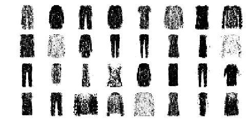

</div>
</div>
<div class="output_wrapper" markdown="1">
<div class="output_subarea" markdown="1">
{:.output_stream}
```
Epoch 41/50
```
</div>
</div>
<div class="output_wrapper" markdown="1">
<div class="output_subarea" markdown="1">

{:.output_png}


</div>
</div>
<div class="output_wrapper" markdown="1">
<div class="output_subarea" markdown="1">
{:.output_stream}
```
Epoch 42/50
```
</div>
</div>
<div class="output_wrapper" markdown="1">
<div class="output_subarea" markdown="1">

{:.output_png}
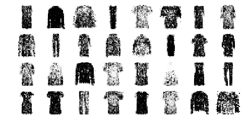

</div>
</div>
<div class="output_wrapper" markdown="1">
<div class="output_subarea" markdown="1">
{:.output_stream}
```
Epoch 43/50
```
</div>
</div>
<div class="output_wrapper" markdown="1">
<div class="output_subarea" markdown="1">

{:.output_png}
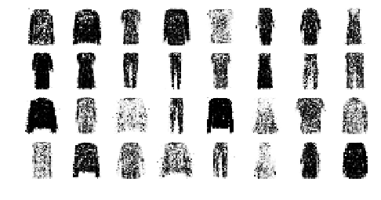

</div>
</div>
<div class="output_wrapper" markdown="1">
<div class="output_subarea" markdown="1">
{:.output_stream}
```
Epoch 44/50
```
</div>
</div>
<div class="output_wrapper" markdown="1">
<div class="output_subarea" markdown="1">

{:.output_png}
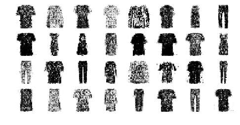

</div>
</div>
<div class="output_wrapper" markdown="1">
<div class="output_subarea" markdown="1">
{:.output_stream}
```
Epoch 45/50
```
</div>
</div>
<div class="output_wrapper" markdown="1">
<div class="output_subarea" markdown="1">

{:.output_png}


</div>
</div>
<div class="output_wrapper" markdown="1">
<div class="output_subarea" markdown="1">
{:.output_stream}
```
Epoch 46/50
```
</div>
</div>
<div class="output_wrapper" markdown="1">
<div class="output_subarea" markdown="1">

{:.output_png}


</div>
</div>
<div class="output_wrapper" markdown="1">
<div class="output_subarea" markdown="1">
{:.output_stream}
```
Epoch 47/50
```
</div>
</div>
<div class="output_wrapper" markdown="1">
<div class="output_subarea" markdown="1">

{:.output_png}
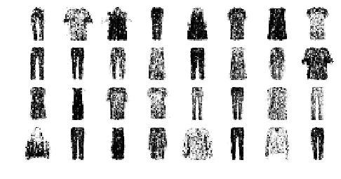

</div>
</div>
<div class="output_wrapper" markdown="1">
<div class="output_subarea" markdown="1">
{:.output_stream}
```
Epoch 48/50
```
</div>
</div>
<div class="output_wrapper" markdown="1">
<div class="output_subarea" markdown="1">

{:.output_png}


</div>
</div>
<div class="output_wrapper" markdown="1">
<div class="output_subarea" markdown="1">
{:.output_stream}
```
Epoch 49/50
```
</div>
</div>
<div class="output_wrapper" markdown="1">
<div class="output_subarea" markdown="1">

{:.output_png}


</div>
</div>
<div class="output_wrapper" markdown="1">
<div class="output_subarea" markdown="1">
{:.output_stream}
```
Epoch 50/50
```
</div>
</div>
<div class="output_wrapper" markdown="1">
<div class="output_subarea" markdown="1">

{:.output_png}


</div>
</div>
</div>


# Deep Convolutional GAN


<div markdown="1" class="cell code_cell">
<div class="input_area" markdown="1">
```python
tf.random.set_seed(42)
np.random.seed(42)

codings_size = 100

generator = keras.models.Sequential([
    keras.layers.Dense(7 * 7 * 128, input_shape=[codings_size]),
    keras.layers.Reshape([7, 7, 128]),
    keras.layers.BatchNormalization(),
    keras.layers.Conv2DTranspose(64, kernel_size=5, strides=2, padding="SAME",
                                 activation="selu"),
    keras.layers.BatchNormalization(),
    keras.layers.Conv2DTranspose(1, kernel_size=5, strides=2, padding="SAME",
                                 activation="tanh"),
])
discriminator = keras.models.Sequential([
    keras.layers.Conv2D(64, kernel_size=5, strides=2, padding="SAME",
                        activation=keras.layers.LeakyReLU(0.2),
                        input_shape=[28, 28, 1]),
    keras.layers.Dropout(0.4),
    keras.layers.Conv2D(128, kernel_size=5, strides=2, padding="SAME",
                        activation=keras.layers.LeakyReLU(0.2)),
    keras.layers.Dropout(0.4),
    keras.layers.Flatten(),
    keras.layers.Dense(1, activation="sigmoid")
])
gan = keras.models.Sequential([generator, discriminator])

```
</div>

</div>


<div markdown="1" class="cell code_cell">
<div class="input_area" markdown="1">
```python
discriminator.compile(loss="binary_crossentropy", optimizer="rmsprop")
discriminator.trainable = False
gan.compile(loss="binary_crossentropy", optimizer="rmsprop")

```
</div>

</div>


<div markdown="1" class="cell code_cell">
<div class="input_area" markdown="1">
```python
X_train_dcgan = X_train.reshape(-1, 28, 28, 1) * 2. - 1. # reshape and rescale

```
</div>

</div>


<div markdown="1" class="cell code_cell">
<div class="input_area" markdown="1">
```python
batch_size = 32
dataset = tf.data.Dataset.from_tensor_slices(X_train_dcgan)
dataset = dataset.shuffle(1000)
dataset = dataset.batch(batch_size, drop_remainder=True).prefetch(1)

```
</div>

</div>


<div markdown="1" class="cell code_cell">
<div class="input_area" markdown="1">
```python
train_gan(gan, dataset, batch_size, codings_size)

```
</div>

<div class="output_wrapper" markdown="1">
<div class="output_subarea" markdown="1">
{:.output_stream}
```
Epoch 1/50
Saving figure gan_generated_images_plot
```
</div>
</div>
<div class="output_wrapper" markdown="1">
<div class="output_subarea" markdown="1">

{:.output_png}


</div>
</div>
<div class="output_wrapper" markdown="1">
<div class="output_subarea" markdown="1">
{:.output_stream}
```
Epoch 2/50
```
</div>
</div>
<div class="output_wrapper" markdown="1">
<div class="output_subarea" markdown="1">

{:.output_png}
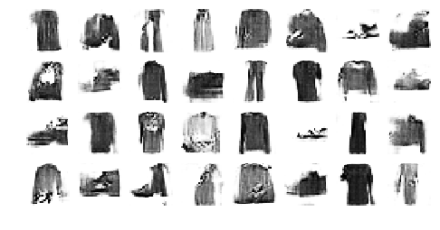

</div>
</div>
<div class="output_wrapper" markdown="1">
<div class="output_subarea" markdown="1">
{:.output_stream}
```
Epoch 3/50
```
</div>
</div>
<div class="output_wrapper" markdown="1">
<div class="output_subarea" markdown="1">

{:.output_png}


</div>
</div>
<div class="output_wrapper" markdown="1">
<div class="output_subarea" markdown="1">
{:.output_stream}
```
Epoch 4/50
```
</div>
</div>
<div class="output_wrapper" markdown="1">
<div class="output_subarea" markdown="1">

{:.output_png}


</div>
</div>
<div class="output_wrapper" markdown="1">
<div class="output_subarea" markdown="1">
{:.output_stream}
```
Epoch 5/50
```
</div>
</div>
<div class="output_wrapper" markdown="1">
<div class="output_subarea" markdown="1">

{:.output_png}
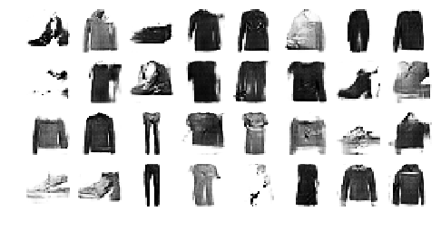

</div>
</div>
<div class="output_wrapper" markdown="1">
<div class="output_subarea" markdown="1">
{:.output_stream}
```
Epoch 6/50
```
</div>
</div>
<div class="output_wrapper" markdown="1">
<div class="output_subarea" markdown="1">

{:.output_png}


</div>
</div>
<div class="output_wrapper" markdown="1">
<div class="output_subarea" markdown="1">
{:.output_stream}
```
Epoch 7/50
```
</div>
</div>
<div class="output_wrapper" markdown="1">
<div class="output_subarea" markdown="1">

{:.output_png}


</div>
</div>
<div class="output_wrapper" markdown="1">
<div class="output_subarea" markdown="1">
{:.output_stream}
```
Epoch 8/50
```
</div>
</div>
<div class="output_wrapper" markdown="1">
<div class="output_subarea" markdown="1">

{:.output_png}
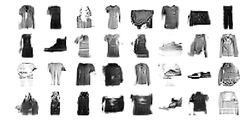

</div>
</div>
<div class="output_wrapper" markdown="1">
<div class="output_subarea" markdown="1">
{:.output_stream}
```
Epoch 9/50
```
</div>
</div>
<div class="output_wrapper" markdown="1">
<div class="output_subarea" markdown="1">

{:.output_png}


</div>
</div>
<div class="output_wrapper" markdown="1">
<div class="output_subarea" markdown="1">
{:.output_stream}
```
Epoch 10/50
```
</div>
</div>
<div class="output_wrapper" markdown="1">
<div class="output_subarea" markdown="1">

{:.output_png}


</div>
</div>
<div class="output_wrapper" markdown="1">
<div class="output_subarea" markdown="1">
{:.output_stream}
```
Epoch 11/50
```
</div>
</div>
<div class="output_wrapper" markdown="1">
<div class="output_subarea" markdown="1">

{:.output_png}


</div>
</div>
<div class="output_wrapper" markdown="1">
<div class="output_subarea" markdown="1">
{:.output_stream}
```
Epoch 12/50
```
</div>
</div>
<div class="output_wrapper" markdown="1">
<div class="output_subarea" markdown="1">

{:.output_png}
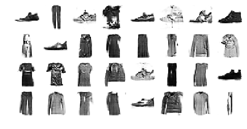

</div>
</div>
<div class="output_wrapper" markdown="1">
<div class="output_subarea" markdown="1">
{:.output_stream}
```
Epoch 13/50
```
</div>
</div>
<div class="output_wrapper" markdown="1">
<div class="output_subarea" markdown="1">

{:.output_png}


</div>
</div>
<div class="output_wrapper" markdown="1">
<div class="output_subarea" markdown="1">
{:.output_stream}
```
Epoch 14/50
```
</div>
</div>
<div class="output_wrapper" markdown="1">
<div class="output_subarea" markdown="1">

{:.output_png}
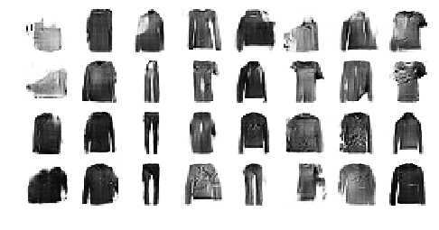

</div>
</div>
<div class="output_wrapper" markdown="1">
<div class="output_subarea" markdown="1">
{:.output_stream}
```
Epoch 15/50
```
</div>
</div>
<div class="output_wrapper" markdown="1">
<div class="output_subarea" markdown="1">

{:.output_png}


</div>
</div>
<div class="output_wrapper" markdown="1">
<div class="output_subarea" markdown="1">
{:.output_stream}
```
Epoch 16/50
```
</div>
</div>
<div class="output_wrapper" markdown="1">
<div class="output_subarea" markdown="1">

{:.output_png}


</div>
</div>
<div class="output_wrapper" markdown="1">
<div class="output_subarea" markdown="1">
{:.output_stream}
```
Epoch 17/50
```
</div>
</div>
<div class="output_wrapper" markdown="1">
<div class="output_subarea" markdown="1">

{:.output_png}


</div>
</div>
<div class="output_wrapper" markdown="1">
<div class="output_subarea" markdown="1">
{:.output_stream}
```
Epoch 18/50
```
</div>
</div>
<div class="output_wrapper" markdown="1">
<div class="output_subarea" markdown="1">

{:.output_png}


</div>
</div>
<div class="output_wrapper" markdown="1">
<div class="output_subarea" markdown="1">
{:.output_stream}
```
Epoch 19/50
```
</div>
</div>
<div class="output_wrapper" markdown="1">
<div class="output_subarea" markdown="1">

{:.output_png}


</div>
</div>
<div class="output_wrapper" markdown="1">
<div class="output_subarea" markdown="1">
{:.output_stream}
```
Epoch 20/50
```
</div>
</div>
<div class="output_wrapper" markdown="1">
<div class="output_subarea" markdown="1">

{:.output_png}
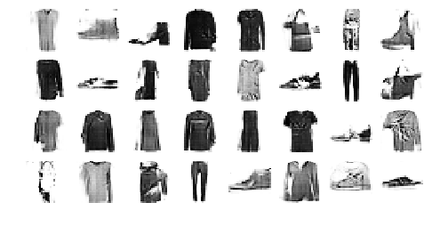

</div>
</div>
<div class="output_wrapper" markdown="1">
<div class="output_subarea" markdown="1">
{:.output_stream}
```
Epoch 21/50
```
</div>
</div>
<div class="output_wrapper" markdown="1">
<div class="output_subarea" markdown="1">

{:.output_png}
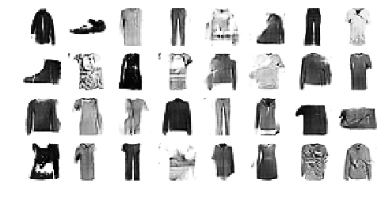

</div>
</div>
<div class="output_wrapper" markdown="1">
<div class="output_subarea" markdown="1">
{:.output_stream}
```
Epoch 22/50
```
</div>
</div>
<div class="output_wrapper" markdown="1">
<div class="output_subarea" markdown="1">

{:.output_png}


</div>
</div>
<div class="output_wrapper" markdown="1">
<div class="output_subarea" markdown="1">
{:.output_stream}
```
Epoch 23/50
```
</div>
</div>
<div class="output_wrapper" markdown="1">
<div class="output_subarea" markdown="1">

{:.output_png}


</div>
</div>
<div class="output_wrapper" markdown="1">
<div class="output_subarea" markdown="1">
{:.output_stream}
```
Epoch 24/50
```
</div>
</div>
<div class="output_wrapper" markdown="1">
<div class="output_subarea" markdown="1">

{:.output_png}


</div>
</div>
<div class="output_wrapper" markdown="1">
<div class="output_subarea" markdown="1">
{:.output_stream}
```
Epoch 25/50
```
</div>
</div>
<div class="output_wrapper" markdown="1">
<div class="output_subarea" markdown="1">

{:.output_png}


</div>
</div>
<div class="output_wrapper" markdown="1">
<div class="output_subarea" markdown="1">
{:.output_stream}
```
Epoch 26/50
```
</div>
</div>
<div class="output_wrapper" markdown="1">
<div class="output_subarea" markdown="1">

{:.output_png}


</div>
</div>
<div class="output_wrapper" markdown="1">
<div class="output_subarea" markdown="1">
{:.output_stream}
```
Epoch 27/50
```
</div>
</div>
<div class="output_wrapper" markdown="1">
<div class="output_subarea" markdown="1">

{:.output_png}
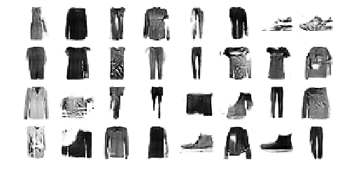

</div>
</div>
<div class="output_wrapper" markdown="1">
<div class="output_subarea" markdown="1">
{:.output_stream}
```
Epoch 28/50
```
</div>
</div>
<div class="output_wrapper" markdown="1">
<div class="output_subarea" markdown="1">

{:.output_png}


</div>
</div>
<div class="output_wrapper" markdown="1">
<div class="output_subarea" markdown="1">
{:.output_stream}
```
Epoch 29/50
```
</div>
</div>
<div class="output_wrapper" markdown="1">
<div class="output_subarea" markdown="1">

{:.output_png}


</div>
</div>
<div class="output_wrapper" markdown="1">
<div class="output_subarea" markdown="1">
{:.output_stream}
```
Epoch 30/50
```
</div>
</div>
<div class="output_wrapper" markdown="1">
<div class="output_subarea" markdown="1">

{:.output_png}


</div>
</div>
<div class="output_wrapper" markdown="1">
<div class="output_subarea" markdown="1">
{:.output_stream}
```
Epoch 31/50
```
</div>
</div>
<div class="output_wrapper" markdown="1">
<div class="output_subarea" markdown="1">

{:.output_png}
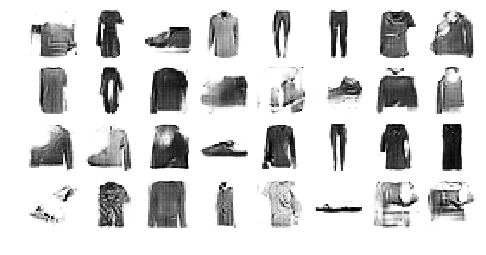

</div>
</div>
<div class="output_wrapper" markdown="1">
<div class="output_subarea" markdown="1">
{:.output_stream}
```
Epoch 32/50
```
</div>
</div>
<div class="output_wrapper" markdown="1">
<div class="output_subarea" markdown="1">

{:.output_png}


</div>
</div>
<div class="output_wrapper" markdown="1">
<div class="output_subarea" markdown="1">
{:.output_stream}
```
Epoch 33/50
```
</div>
</div>
<div class="output_wrapper" markdown="1">
<div class="output_subarea" markdown="1">

{:.output_png}


</div>
</div>
<div class="output_wrapper" markdown="1">
<div class="output_subarea" markdown="1">
{:.output_stream}
```
Epoch 34/50
```
</div>
</div>
<div class="output_wrapper" markdown="1">
<div class="output_subarea" markdown="1">

{:.output_png}


</div>
</div>
<div class="output_wrapper" markdown="1">
<div class="output_subarea" markdown="1">
{:.output_stream}
```
Epoch 35/50
```
</div>
</div>
<div class="output_wrapper" markdown="1">
<div class="output_subarea" markdown="1">

{:.output_png}


</div>
</div>
<div class="output_wrapper" markdown="1">
<div class="output_subarea" markdown="1">
{:.output_stream}
```
Epoch 36/50
```
</div>
</div>
<div class="output_wrapper" markdown="1">
<div class="output_subarea" markdown="1">

{:.output_png}


</div>
</div>
<div class="output_wrapper" markdown="1">
<div class="output_subarea" markdown="1">
{:.output_stream}
```
Epoch 37/50
```
</div>
</div>
<div class="output_wrapper" markdown="1">
<div class="output_subarea" markdown="1">

{:.output_png}


</div>
</div>
<div class="output_wrapper" markdown="1">
<div class="output_subarea" markdown="1">
{:.output_stream}
```
Epoch 38/50
```
</div>
</div>
<div class="output_wrapper" markdown="1">
<div class="output_subarea" markdown="1">

{:.output_png}
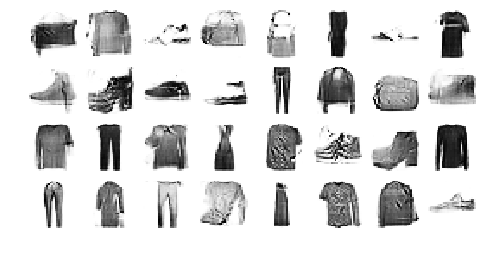

</div>
</div>
<div class="output_wrapper" markdown="1">
<div class="output_subarea" markdown="1">
{:.output_stream}
```
Epoch 39/50
```
</div>
</div>
<div class="output_wrapper" markdown="1">
<div class="output_subarea" markdown="1">

{:.output_png}


</div>
</div>
<div class="output_wrapper" markdown="1">
<div class="output_subarea" markdown="1">
{:.output_stream}
```
Epoch 40/50
```
</div>
</div>
<div class="output_wrapper" markdown="1">
<div class="output_subarea" markdown="1">

{:.output_png}
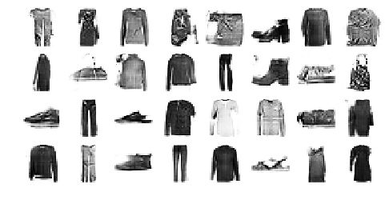

</div>
</div>
<div class="output_wrapper" markdown="1">
<div class="output_subarea" markdown="1">
{:.output_stream}
```
Epoch 41/50
```
</div>
</div>
<div class="output_wrapper" markdown="1">
<div class="output_subarea" markdown="1">

{:.output_png}


</div>
</div>
<div class="output_wrapper" markdown="1">
<div class="output_subarea" markdown="1">
{:.output_stream}
```
Epoch 42/50
```
</div>
</div>
<div class="output_wrapper" markdown="1">
<div class="output_subarea" markdown="1">

{:.output_png}


</div>
</div>
<div class="output_wrapper" markdown="1">
<div class="output_subarea" markdown="1">
{:.output_stream}
```
Epoch 43/50
```
</div>
</div>
<div class="output_wrapper" markdown="1">
<div class="output_subarea" markdown="1">

{:.output_png}


</div>
</div>
<div class="output_wrapper" markdown="1">
<div class="output_subarea" markdown="1">
{:.output_stream}
```
Epoch 44/50
```
</div>
</div>
<div class="output_wrapper" markdown="1">
<div class="output_subarea" markdown="1">

{:.output_png}


</div>
</div>
<div class="output_wrapper" markdown="1">
<div class="output_subarea" markdown="1">
{:.output_stream}
```
Epoch 45/50
```
</div>
</div>
<div class="output_wrapper" markdown="1">
<div class="output_subarea" markdown="1">

{:.output_png}


</div>
</div>
<div class="output_wrapper" markdown="1">
<div class="output_subarea" markdown="1">
{:.output_stream}
```
Epoch 46/50
```
</div>
</div>
<div class="output_wrapper" markdown="1">
<div class="output_subarea" markdown="1">

{:.output_png}


</div>
</div>
<div class="output_wrapper" markdown="1">
<div class="output_subarea" markdown="1">
{:.output_stream}
```
Epoch 47/50
```
</div>
</div>
<div class="output_wrapper" markdown="1">
<div class="output_subarea" markdown="1">

{:.output_png}


</div>
</div>
<div class="output_wrapper" markdown="1">
<div class="output_subarea" markdown="1">
{:.output_stream}
```
Epoch 48/50
```
</div>
</div>
<div class="output_wrapper" markdown="1">
<div class="output_subarea" markdown="1">

{:.output_png}


</div>
</div>
<div class="output_wrapper" markdown="1">
<div class="output_subarea" markdown="1">
{:.output_stream}
```
Epoch 49/50
```
</div>
</div>
<div class="output_wrapper" markdown="1">
<div class="output_subarea" markdown="1">

{:.output_png}


</div>
</div>
<div class="output_wrapper" markdown="1">
<div class="output_subarea" markdown="1">
{:.output_stream}
```
Epoch 50/50
```
</div>
</div>
<div class="output_wrapper" markdown="1">
<div class="output_subarea" markdown="1">

{:.output_png}


</div>
</div>
</div>


<div markdown="1" class="cell code_cell">
<div class="input_area" markdown="1">
```python
tf.random.set_seed(42)
np.random.seed(42)

noise = tf.random.normal(shape=[batch_size, codings_size])
generated_images = generator(noise)
plot_multiple_images(generated_images, 8)
save_fig("dcgan_generated_images_plot", tight_layout=False)

```
</div>

<div class="output_wrapper" markdown="1">
<div class="output_subarea" markdown="1">
{:.output_stream}
```
Saving figure dcgan_generated_images_plot
```
</div>
</div>
<div class="output_wrapper" markdown="1">
<div class="output_subarea" markdown="1">

{:.output_png}


</div>
</div>
</div>


# Exercise Solutions


## Unsupervised pretraining


Let's create a small neural network for MNIST classification:


<div markdown="1" class="cell code_cell">
<div class="input_area" markdown="1">
```python
tf.random.set_seed(42)
np.random.seed(42)

X_train_small = X_train[:500]
y_train_small = y_train[:500]

classifier = keras.models.Sequential([
    keras.layers.Reshape([28, 28, 1], input_shape=[28, 28]),
    keras.layers.Conv2D(16, kernel_size=3, padding="SAME", activation="selu"),
    keras.layers.MaxPool2D(pool_size=2),
    keras.layers.Conv2D(32, kernel_size=3, padding="SAME", activation="selu"),
    keras.layers.MaxPool2D(pool_size=2),
    keras.layers.Conv2D(64, kernel_size=3, padding="SAME", activation="selu"),
    keras.layers.MaxPool2D(pool_size=2),
    keras.layers.Flatten(),
    keras.layers.Dense(20, activation="selu"),
    keras.layers.Dense(10, activation="softmax")
])
classifier.compile(loss="sparse_categorical_crossentropy", optimizer=keras.optimizers.SGD(lr=0.02),
                   metrics=["accuracy"])
history = classifier.fit(X_train_small, y_train_small, epochs=20, validation_data=[X_valid, y_valid])

```
</div>

<div class="output_wrapper" markdown="1">
<div class="output_subarea" markdown="1">
{:.output_stream}
```
Train on 500 samples, validate on 5000 samples
Epoch 1/20
500/500 [==============================] - 1s 3ms/sample - loss: 2.1965 - accuracy: 0.2480 - val_loss: 2.0234 - val_accuracy: 0.3148
Epoch 2/20
500/500 [==============================] - 1s 2ms/sample - loss: 1.7927 - accuracy: 0.5180 - val_loss: 1.5677 - val_accuracy: 0.6280
Epoch 3/20
500/500 [==============================] - 1s 2ms/sample - loss: 1.3931 - accuracy: 0.6360 - val_loss: 1.2556 - val_accuracy: 0.5482
Epoch 4/20
500/500 [==============================] - 1s 2ms/sample - loss: 1.1168 - accuracy: 0.6620 - val_loss: 0.9990 - val_accuracy: 0.6892
Epoch 5/20
500/500 [==============================] - 1s 2ms/sample - loss: 0.9421 - accuracy: 0.7360 - val_loss: 1.1235 - val_accuracy: 0.6208
Epoch 6/20
500/500 [==============================] - 1s 2ms/sample - loss: 0.8392 - accuracy: 0.7240 - val_loss: 0.8985 - val_accuracy: 0.6778
Epoch 7/20
500/500 [==============================] - 1s 2ms/sample - loss: 0.7738 - accuracy: 0.7400 - val_loss: 0.7833 - val_accuracy: 0.7296
Epoch 8/20
500/500 [==============================] - 1s 2ms/sample - loss: 0.7472 - accuracy: 0.7380 - val_loss: 0.7364 - val_accuracy: 0.7396
Epoch 9/20
500/500 [==============================] - 1s 2ms/sample - loss: 0.6908 - accuracy: 0.7580 - val_loss: 0.8782 - val_accuracy: 0.6802
Epoch 10/20
500/500 [==============================] - 1s 2ms/sample - loss: 0.6740 - accuracy: 0.7640 - val_loss: 0.7064 - val_accuracy: 0.7454
Epoch 11/20
500/500 [==============================] - 1s 2ms/sample - loss: 0.6431 - accuracy: 0.7700 - val_loss: 0.8587 - val_accuracy: 0.6848
Epoch 12/20
500/500 [==============================] - 1s 2ms/sample - loss: 0.6301 - accuracy: 0.7740 - val_loss: 0.6704 - val_accuracy: 0.7584
Epoch 13/20
500/500 [==============================] - 1s 2ms/sample - loss: 0.5834 - accuracy: 0.8040 - val_loss: 0.7229 - val_accuracy: 0.7302
Epoch 14/20
500/500 [==============================] - 1s 2ms/sample - loss: 0.5612 - accuracy: 0.8220 - val_loss: 0.6370 - val_accuracy: 0.7734
Epoch 15/20
500/500 [==============================] - 1s 2ms/sample - loss: 0.5845 - accuracy: 0.7960 - val_loss: 0.6511 - val_accuracy: 0.7592
Epoch 16/20
500/500 [==============================] - 1s 2ms/sample - loss: 0.5488 - accuracy: 0.8080 - val_loss: 0.7779 - val_accuracy: 0.7014
Epoch 17/20
500/500 [==============================] - 1s 2ms/sample - loss: 0.5362 - accuracy: 0.8160 - val_loss: 0.6632 - val_accuracy: 0.7636
Epoch 18/20
500/500 [==============================] - 1s 2ms/sample - loss: 0.5064 - accuracy: 0.8180 - val_loss: 0.7703 - val_accuracy: 0.6954
Epoch 19/20
500/500 [==============================] - 1s 2ms/sample - loss: 0.5147 - accuracy: 0.8240 - val_loss: 0.6980 - val_accuracy: 0.7390
Epoch 20/20
500/500 [==============================] - 1s 2ms/sample - loss: 0.5151 - accuracy: 0.8160 - val_loss: 0.7014 - val_accuracy: 0.7374
```
</div>
</div>
</div>


<div markdown="1" class="cell code_cell">
<div class="input_area" markdown="1">
```python
import pandas as pd
pd.DataFrame(history.history).plot()
plt.show()

```
</div>

<div class="output_wrapper" markdown="1">
<div class="output_subarea" markdown="1">

{:.output_png}


</div>
</div>
</div>


<div markdown="1" class="cell code_cell">
<div class="input_area" markdown="1">
```python
tf.random.set_seed(42)
np.random.seed(42)

conv_encoder_clone = keras.models.clone_model(conv_encoder)

pretrained_clf = keras.models.Sequential([
    conv_encoder_clone,
    keras.layers.Flatten(),
    keras.layers.Dense(20, activation="selu"),
    keras.layers.Dense(10, activation="softmax")
])

```
</div>

</div>


<div markdown="1" class="cell code_cell">
<div class="input_area" markdown="1">
```python
conv_encoder_clone.trainable = False
pretrained_clf.compile(loss="sparse_categorical_crossentropy",
                       optimizer=keras.optimizers.SGD(lr=0.02),
                       metrics=["accuracy"])
history = pretrained_clf.fit(X_train_small, y_train_small, epochs=30,
                             validation_data=[X_valid, y_valid])

```
</div>

<div class="output_wrapper" markdown="1">
<div class="output_subarea" markdown="1">
{:.output_stream}
```
Train on 500 samples, validate on 5000 samples
Epoch 1/30
500/500 [==============================] - 1s 3ms/sample - loss: 2.3174 - accuracy: 0.1820 - val_loss: 2.2350 - val_accuracy: 0.2156
Epoch 2/30
500/500 [==============================] - 1s 2ms/sample - loss: 2.1829 - accuracy: 0.2760 - val_loss: 2.1267 - val_accuracy: 0.3650
Epoch 3/30
500/500 [==============================] - 1s 2ms/sample - loss: 2.0852 - accuracy: 0.3880 - val_loss: 2.0370 - val_accuracy: 0.4378
Epoch 4/30
500/500 [==============================] - 1s 2ms/sample - loss: 1.9953 - accuracy: 0.4500 - val_loss: 1.9513 - val_accuracy: 0.5028
Epoch 5/30
500/500 [==============================] - 1s 2ms/sample - loss: 1.9117 - accuracy: 0.5860 - val_loss: 1.8742 - val_accuracy: 0.5610
Epoch 6/30
500/500 [==============================] - 1s 1ms/sample - loss: 1.8310 - accuracy: 0.6180 - val_loss: 1.7963 - val_accuracy: 0.6242
Epoch 7/30
500/500 [==============================] - 1s 1ms/sample - loss: 1.7526 - accuracy: 0.6760 - val_loss: 1.7218 - val_accuracy: 0.6440
Epoch 8/30
500/500 [==============================] - 1s 1ms/sample - loss: 1.6823 - accuracy: 0.6760 - val_loss: 1.6525 - val_accuracy: 0.6682
Epoch 9/30
500/500 [==============================] - 1s 1ms/sample - loss: 1.6132 - accuracy: 0.7020 - val_loss: 1.5936 - val_accuracy: 0.6430
Epoch 10/30
500/500 [==============================] - 1s 1ms/sample - loss: 1.5521 - accuracy: 0.6960 - val_loss: 1.5257 - val_accuracy: 0.6844
Epoch 11/30
500/500 [==============================] - 1s 1ms/sample - loss: 1.4915 - accuracy: 0.7180 - val_loss: 1.4718 - val_accuracy: 0.6688
Epoch 12/30
500/500 [==============================] - 1s 1ms/sample - loss: 1.4381 - accuracy: 0.7200 - val_loss: 1.4196 - val_accuracy: 0.6832
Epoch 13/30
500/500 [==============================] - 1s 1ms/sample - loss: 1.3849 - accuracy: 0.7180 - val_loss: 1.3708 - val_accuracy: 0.6798
Epoch 14/30
500/500 [==============================] - 1s 1ms/sample - loss: 1.3376 - accuracy: 0.7180 - val_loss: 1.3270 - val_accuracy: 0.6852
Epoch 15/30
500/500 [==============================] - 1s 1ms/sample - loss: 1.2971 - accuracy: 0.7320 - val_loss: 1.2876 - val_accuracy: 0.6846
Epoch 16/30
500/500 [==============================] - 1s 1ms/sample - loss: 1.2556 - accuracy: 0.7380 - val_loss: 1.2488 - val_accuracy: 0.6976
Epoch 17/30
500/500 [==============================] - 1s 1ms/sample - loss: 1.2174 - accuracy: 0.7240 - val_loss: 1.2141 - val_accuracy: 0.6938
Epoch 18/30
500/500 [==============================] - 1s 1ms/sample - loss: 1.1855 - accuracy: 0.7300 - val_loss: 1.1859 - val_accuracy: 0.6938
Epoch 19/30
500/500 [==============================] - 1s 1ms/sample - loss: 1.1551 - accuracy: 0.7400 - val_loss: 1.1562 - val_accuracy: 0.6982
Epoch 20/30
500/500 [==============================] - 1s 1ms/sample - loss: 1.1256 - accuracy: 0.7300 - val_loss: 1.1256 - val_accuracy: 0.7016
Epoch 21/30
500/500 [==============================] - 1s 1ms/sample - loss: 1.0985 - accuracy: 0.7520 - val_loss: 1.0996 - val_accuracy: 0.7064
Epoch 22/30
500/500 [==============================] - 1s 1ms/sample - loss: 1.0735 - accuracy: 0.7400 - val_loss: 1.0756 - val_accuracy: 0.7142
Epoch 23/30
500/500 [==============================] - 1s 1ms/sample - loss: 1.0494 - accuracy: 0.7560 - val_loss: 1.0562 - val_accuracy: 0.7066
Epoch 24/30
500/500 [==============================] - 1s 1ms/sample - loss: 1.0259 - accuracy: 0.7480 - val_loss: 1.0377 - val_accuracy: 0.7034
Epoch 25/30
500/500 [==============================] - 1s 1ms/sample - loss: 1.0079 - accuracy: 0.7440 - val_loss: 1.0139 - val_accuracy: 0.7174
Epoch 26/30
500/500 [==============================] - 1s 1ms/sample - loss: 0.9860 - accuracy: 0.7420 - val_loss: 0.9959 - val_accuracy: 0.7224
Epoch 27/30
500/500 [==============================] - 1s 1ms/sample - loss: 0.9691 - accuracy: 0.7440 - val_loss: 0.9819 - val_accuracy: 0.7180
Epoch 28/30
500/500 [==============================] - 1s 1ms/sample - loss: 0.9526 - accuracy: 0.7600 - val_loss: 0.9638 - val_accuracy: 0.7238
Epoch 29/30
500/500 [==============================] - 1s 1ms/sample - loss: 0.9365 - accuracy: 0.7600 - val_loss: 0.9512 - val_accuracy: 0.7236
Epoch 30/30
500/500 [==============================] - 1s 1ms/sample - loss: 0.9203 - accuracy: 0.7600 - val_loss: 0.9364 - val_accuracy: 0.7244
```
</div>
</div>
</div>


<div markdown="1" class="cell code_cell">
<div class="input_area" markdown="1">
```python
conv_encoder_clone.trainable = True
pretrained_clf.compile(loss="sparse_categorical_crossentropy",
                       optimizer=keras.optimizers.SGD(lr=0.02),
                       metrics=["accuracy"])
history = pretrained_clf.fit(X_train_small, y_train_small, epochs=20,
                             validation_data=[X_valid, y_valid])

```
</div>

<div class="output_wrapper" markdown="1">
<div class="output_subarea" markdown="1">
{:.output_stream}
```
Train on 500 samples, validate on 5000 samples
Epoch 1/20
500/500 [==============================] - 1s 3ms/sample - loss: 0.8479 - accuracy: 0.7360 - val_loss: 0.8023 - val_accuracy: 0.7154
Epoch 2/20
500/500 [==============================] - 1s 2ms/sample - loss: 0.7508 - accuracy: 0.7480 - val_loss: 0.7908 - val_accuracy: 0.7062
Epoch 3/20
500/500 [==============================] - 1s 2ms/sample - loss: 0.6956 - accuracy: 0.7700 - val_loss: 0.8156 - val_accuracy: 0.7006
Epoch 4/20
500/500 [==============================] - 1s 2ms/sample - loss: 0.6806 - accuracy: 0.7700 - val_loss: 0.7408 - val_accuracy: 0.7244
Epoch 5/20
500/500 [==============================] - 1s 2ms/sample - loss: 0.6563 - accuracy: 0.7700 - val_loss: 0.6731 - val_accuracy: 0.7540
Epoch 6/20
500/500 [==============================] - 1s 2ms/sample - loss: 0.6262 - accuracy: 0.7920 - val_loss: 0.7332 - val_accuracy: 0.7316
Epoch 7/20
500/500 [==============================] - 1s 2ms/sample - loss: 0.6039 - accuracy: 0.7860 - val_loss: 0.6458 - val_accuracy: 0.7592
Epoch 8/20
500/500 [==============================] - 1s 2ms/sample - loss: 0.5875 - accuracy: 0.7800 - val_loss: 0.8370 - val_accuracy: 0.6970
Epoch 9/20
500/500 [==============================] - 1s 2ms/sample - loss: 0.5720 - accuracy: 0.8000 - val_loss: 0.6247 - val_accuracy: 0.7724
Epoch 10/20
500/500 [==============================] - 1s 2ms/sample - loss: 0.5601 - accuracy: 0.8140 - val_loss: 0.6436 - val_accuracy: 0.7524
Epoch 11/20
500/500 [==============================] - 1s 2ms/sample - loss: 0.5256 - accuracy: 0.8300 - val_loss: 0.6169 - val_accuracy: 0.7738
Epoch 12/20
500/500 [==============================] - 1s 2ms/sample - loss: 0.5029 - accuracy: 0.8260 - val_loss: 0.6318 - val_accuracy: 0.7672
Epoch 13/20
500/500 [==============================] - 1s 2ms/sample - loss: 0.4956 - accuracy: 0.8340 - val_loss: 0.6539 - val_accuracy: 0.7548
Epoch 14/20
500/500 [==============================] - 1s 2ms/sample - loss: 0.4754 - accuracy: 0.8360 - val_loss: 0.6640 - val_accuracy: 0.7598
Epoch 15/20
500/500 [==============================] - 1s 2ms/sample - loss: 0.5025 - accuracy: 0.8240 - val_loss: 0.6049 - val_accuracy: 0.7762
Epoch 16/20
500/500 [==============================] - 1s 2ms/sample - loss: 0.4462 - accuracy: 0.8440 - val_loss: 0.5851 - val_accuracy: 0.7882
Epoch 17/20
500/500 [==============================] - 1s 2ms/sample - loss: 0.4607 - accuracy: 0.8400 - val_loss: 0.6206 - val_accuracy: 0.7706
Epoch 18/20
500/500 [==============================] - 1s 2ms/sample - loss: 0.4216 - accuracy: 0.8580 - val_loss: 0.6025 - val_accuracy: 0.7800
Epoch 19/20
500/500 [==============================] - 1s 2ms/sample - loss: 0.4308 - accuracy: 0.8460 - val_loss: 0.6109 - val_accuracy: 0.7702
Epoch 20/20
500/500 [==============================] - 1s 2ms/sample - loss: 0.4044 - accuracy: 0.8580 - val_loss: 0.5820 - val_accuracy: 0.7902
```
</div>
</div>
</div>


## Hashing Using a Binary Autoencoder


<div markdown="1" class="cell code_cell">
<div class="input_area" markdown="1">
```python
tf.random.set_seed(42)
np.random.seed(42)

hashing_encoder = keras.models.Sequential([
    keras.layers.Flatten(input_shape=[28, 28]),
    keras.layers.Dense(100, activation="selu"),
    keras.layers.GaussianNoise(15.),
    keras.layers.Dense(16, activation="sigmoid"),
])
hashing_decoder = keras.models.Sequential([
    keras.layers.Dense(100, activation="selu", input_shape=[16]),
    keras.layers.Dense(28 * 28, activation="sigmoid"),
    keras.layers.Reshape([28, 28])
])
hashing_ae = keras.models.Sequential([hashing_encoder, hashing_decoder])
hashing_ae.compile(loss="binary_crossentropy", optimizer=keras.optimizers.SGD(lr=1.0),
                   metrics=[rounded_accuracy])
history = hashing_ae.fit(X_train, X_train, epochs=10,
                         validation_data=[X_valid, X_valid])

```
</div>

<div class="output_wrapper" markdown="1">
<div class="output_subarea" markdown="1">
{:.output_stream}
```
Train on 55000 samples, validate on 5000 samples
Epoch 1/10
55000/55000 [==============================] - 4s 77us/sample - loss: 0.4999 - accuracy: 0.4830 - val_loss: 0.4866 - val_accuracy: 0.4815
Epoch 2/10
55000/55000 [==============================] - 4s 69us/sample - loss: 0.4780 - accuracy: 0.4892 - val_loss: 0.4768 - val_accuracy: 0.4540
Epoch 3/10
55000/55000 [==============================] - 4s 69us/sample - loss: 0.4284 - accuracy: 0.4889 - val_loss: 0.4229 - val_accuracy: 0.4757
Epoch 4/10
55000/55000 [==============================] - 4s 70us/sample - loss: 0.4088 - accuracy: 0.4895 - val_loss: 0.4195 - val_accuracy: 0.4752
Epoch 5/10
55000/55000 [==============================] - 4s 70us/sample - loss: 0.4018 - accuracy: 0.4900 - val_loss: 0.4166 - val_accuracy: 0.4751
Epoch 6/10
55000/55000 [==============================] - 4s 69us/sample - loss: 0.3971 - accuracy: 0.4905 - val_loss: 0.4170 - val_accuracy: 0.4746
Epoch 7/10
55000/55000 [==============================] - 4s 69us/sample - loss: 0.3933 - accuracy: 0.4909 - val_loss: 0.4106 - val_accuracy: 0.4763
Epoch 8/10
55000/55000 [==============================] - 4s 71us/sample - loss: 0.3902 - accuracy: 0.4912 - val_loss: 0.4038 - val_accuracy: 0.4794
Epoch 9/10
55000/55000 [==============================] - 4s 65us/sample - loss: 0.3877 - accuracy: 0.4917 - val_loss: 0.4049 - val_accuracy: 0.4782
Epoch 10/10
55000/55000 [==============================] - 4s 66us/sample - loss: 0.3858 - accuracy: 0.4917 - val_loss: 0.4002 - val_accuracy: 0.4793
```
</div>
</div>
</div>


<div markdown="1" class="cell code_cell">
<div class="input_area" markdown="1">
```python
show_reconstructions(hashing_ae)
plt.show()

```
</div>

<div class="output_wrapper" markdown="1">
<div class="output_subarea" markdown="1">

{:.output_png}


</div>
</div>
</div>


<div markdown="1" class="cell code_cell">
<div class="input_area" markdown="1">
```python
plot_activations_histogram(hashing_encoder)
plt.show()

```
</div>

<div class="output_wrapper" markdown="1">
<div class="output_subarea" markdown="1">

{:.output_png}


</div>
</div>
</div>


<div markdown="1" class="cell code_cell">
<div class="input_area" markdown="1">
```python
hashes = np.round(hashing_encoder.predict(X_valid)).astype(np.int32)
hashes *= np.array([[2**bit for bit in range(16)]])
hashes = hashes.sum(axis=1)
for h in hashes[:5]:
    print("{:016b}".format(h))
print("...")

```
</div>

<div class="output_wrapper" markdown="1">
<div class="output_subarea" markdown="1">
{:.output_stream}
```
0000100100000001
0000100100000000
0000100100000001
0000100000000000
0000100000100000
...
```
</div>
</div>
</div>


<div markdown="1" class="cell code_cell">
<div class="input_area" markdown="1">
```python
n_bits = 4
n_images = 8
plt.figure(figsize=(n_images, n_bits))
for bit_index in range(n_bits):
    in_bucket = (hashes & 2**bit_index != 0)
    for index, image in zip(range(n_images), X_valid[in_bucket]):
        plt.subplot(n_bits, n_images, bit_index * n_images + index + 1)
        plt.imshow(image, cmap="binary")
        plt.axis("off")

```
</div>

<div class="output_wrapper" markdown="1">
<div class="output_subarea" markdown="1">

{:.output_png}


</div>
</div>
</div>

