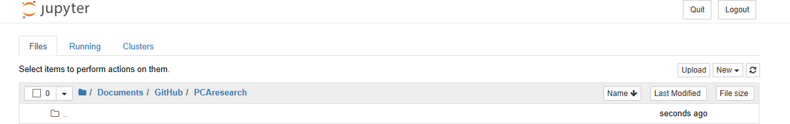
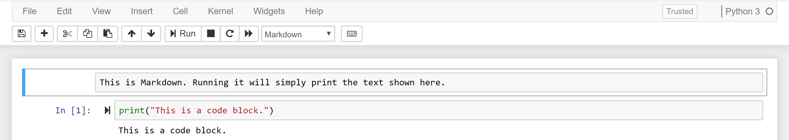

<h1 style="font-family: Verdana, Geneva, sans-serif; text-align:center;">GETTING STARTED</h1>

## Starting Up Jupyter Notebook
---

To use the Jupyter notebook, you have to run the following command (in either _Terminal_ for Mac or _Command Prompt_ for Windows) to see the application in your web broswer:

```
jupyter notebook
```

You can also launch it through the Anaconda Navigator startup page.

Once open you will be greeted with the **dashboard**:



* The "Files" tab is where all of your files are kept,
* The "Running" tab keeps track of all the processes and notebooks currently live, and
* The "Clusters" tab is provided by IPython Parallel, Python's parallel computing framework. 

## Creating a New Notebook
---

To open a new notebook, you can click on the "New" in the "Files" tab and choose the kernel you would like to use.

The main user interface for the notebook looks like this:


Note how the Markdown cell is within a blue frame. This means that the cell is in **command** mode, which lets you modify the notebook as a whole. If you double-click on the cell or hit `Enter` you will enter **edit** mode, which lets you edit the contents of the cell itself. Note that in command mode, the keyboard changes so letter keys correspond to shortcuts. In this case, however, you can add or format text in the Markdown to give better explanation for the code.

Common formatting syntax include:

* Bookending text with `*` will make it * *italic* *
* Bookending text with `**` will make it ** **bold** **
* Adding `#` in front of a line will make it a header (`##` will make a secondary header, `###` will make a tertiary header, etc.
* To apply LaTeX in your markdown, you can bookend your equation with _$_ `($...$)` like $c =\pi$

You can find more markdown code in this [markdown cheatsheet.](https://guides.github.com/features/mastering-markdown)

Additionally, for code cells you can use the following shortcuts:

* Add a new cell by looking under the the "Insert" tab or pressing `B` when in command mode
* Delete a new cell by using the "Edit" tab or by pressing `D, D` when in command mode
* Hit `shift + tab` after typing out a function to get a description of how it works
* After finishing a cell, hit `shift + enter` to run it

When running code, the number next to the cell signifies the order in which the code has been run. Thus, you can have situations where you can run a cell near the beginning of your notebook that will overwrite a variable you declared in a later cell. 

Once you're done with your notebook, you can export it to html to contribute it to the project using the following command:

```
jupyter nbconvert --to html --template basic [your notebook's title].ipynb
```

## Creating a Jupyter Book
---

If you have a collection of notebooks you want to share with students, you can create a Jupyter Book that organizes them all in a single hub and narrative structure. To do so, first install the Book CLI using the Anaconda command line. Specifically, run the following command:

```
pip install jupyter-book
```

Then create your book by navigating to the directory you would like to create your book in and using the following line (replacing "yourbookname" with whatever you would like to name the book):

```
jupyter-book build yourbookname
```

Once made, you will see that the book generates many different folders and files. The main components to be concerned about are the `content` folder and the files named `_config.yml` and `/_data/toc.yml`. `Content` is where you put all of notebooks you create, and then `toc.yml` is the table of contents, which needs to be updated once all of the desired content is in the folder. For example, the following table of contents is for a book chapter called "Features":

```
- title: Features
  url: /features/features
  not_numbered: true
  expand_sections: true
  sections:
  - title: Markdown files
    url: /features/markdown
    not_numbered: true
  - title: Jupyter notebooks
    url: /features/notebooks
    not_numbered: true
```

The file `_config.yml` is for customizing different aspects of your book, such as the title, logo, and interactive buttons. Lastly, since notebooks are built using different environments, you may want to specify the packages required to run your book. To do so, update the `requirements.txt` file in the main directory. For more details and customization options, visit the [Jupyter book guide.](https://jupyter.org/jupyter-book/guide/01_overview.html)

Once all of the content is in place and everything is configured, you can create the Markdown in your book by opening a command line, navigating to the directory above wherever your book is, and running the following command:

```
jupyter-book build yourbookname
```

This command will take the chapters you outlined in the `toc.yml` file and automatically organize the notebooks for you as .md files. From there, you can ultimately build the html for your book, which will prepare it for the web, through one of two ways:


### 1. Build your site on Github

To build your site using Github Pages, start by creating a repository and cloning it to your local machine. Then copy all of the files and folders in your `yourbookname` folder into the new repository and push it to Github. In Github, go to the Settings of your repository (found near the top right of the page) and scroll down to the Github Pages section. Then select the `master branch` under the Source dropdown. If your `_config.yml` file is configured correctly, then the URL provided should take you to your newly created website.

### 2. Build your site locally

This is helpful if you want to preview the results before pushing it online. Doing this, however, will require a third-party application (either a container like Docker or Singularity, or the Ruby programming language). For a guide on how to build your site locally, check out [this guide](https://jupyter.org/jupyter-book/guide/03_build.html#build-the-books-site-html-locally).
