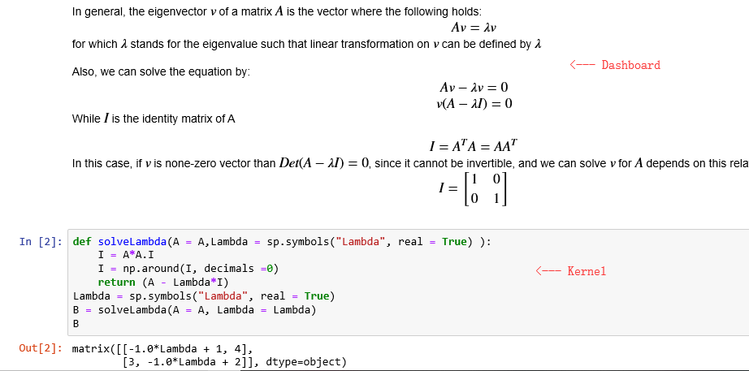
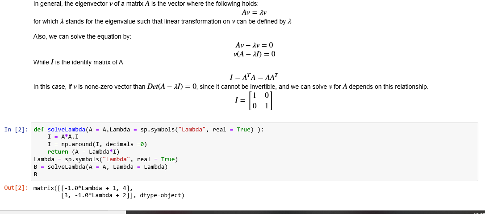
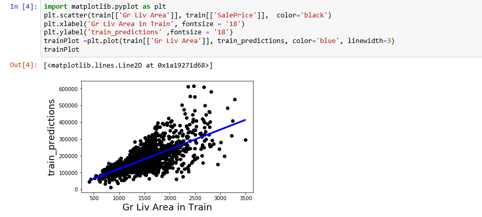
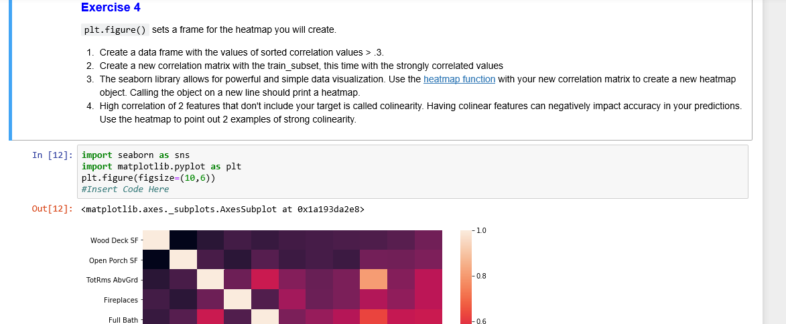

<h1 style="font-family: Verdana, Geneva, sans-serif; text-align:center;">NOTEBOOKS</h1>

## Overview 
---

A "Jupyter Notebook" is a document that contains both code and rich text elements such as paragraphs, figures, and equations. Because of the mixture of code and text elements, this type of document is the ideal place to bring together results and accompanying descriptions that help explain the data. Text elements, or **Markdown**, can be used to teach students certain concepts or help a colleague understand your thought process as you make changes to a collaborative project.

The code featured in a notebook is run by a preset **kernel**, or programming language. Initially, Jupyter supported Julia, Python, and R, hence the loose acronym "Ju-Pyt-R". Nowadays, the project also supports many other kernels, [a list of which can be found here.](https://github.com/jupyter/jupyter/wiki/Jupyter-kernels) Currently, Jupyter comes pre-installed with Python 3, but if you would like to create a notebook using R, for example, you can simply download the kernel for it (IRkernel) from the list above.

As a server-client application, the Jupyter Notebook allows you to edit and run your notebooks via a web browser. The application can also be installed and executed on a PC without internet access.

## Use Cases
---

<ol>
<li>
<i>Lectures.</i> By using the Jupyter Notebook, you can combine your markdown explanation with a function doing all the real math for you.
  

  
One advantage of it being a living document is that you can go through different examples just by changing the variables in the function. Students can also use the function as a self-check tool, or a calculator while they solve the problem. This means that your lesson plan can be on one document, eliminating the need to switch between PowerPoint and MATLAB every few minutes.
</li>

<li>
<i>Demos.</i> Additionally, Jupyter Notebook can provide you with a new way of making plots with the programming language you prefer.
  

  
In this example, we're trying to apply a list of datasets into the linear regression. As you can see, you can plot all of the data and label everything you want with just a few lines of code. In fact, in this notebook you can make all the plots you want like heatmap, dotplot, etc.
  
Tip: If you use Python for your notebooks, [matplotlib](https://matplotlib.org/tutorials/index) is a very useful class contain all those plots.
</li>

<li>
<i>Assignments.</i> In addition to lesson plans, instructors can also make assignment notebooks using Jupyter Notebook.

  
This way, students can test their own skills on making heatmaps (or any other topic) without the hassle of having every student download software. Also, our upcoming grading system can give you a more efficient grading experience; students can immediately get the feedback once the instructor is finished grading using markdowns. A dataset including all student's grades will be made as well so that you don't need to collect all of the data by yourself.
</li>

<li>
<i>Textbooks.</i> Lastly, a notebook can be used as a static narrative document containing a course's material. The advantage here is that the notebook can serve as an accessible repository for course information, whether students want to access it online or download it on their PC. Additionally, while a notebook could theoritically subsist on just static text, inline examples and code can be included such that students get practice visualizing certain concepts without having to change the original contents of the notebook. Sliders and call-outs for user input can also be included to enhance the interactive experience.
</li>
</ol>
