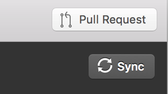

# Tech Setup

Often technical issues around computer configuration can be frustrating, but they are an important component of doing data science. You will need a number of different systems setup on your computer for this class.	

We will be testing this semester a online JupyterHub instance that should simplify a lot of the setup. However this is still in an alpha release and it would be good to get an alternate compute environment setup on your laptop.	

 In describing options, there are *cloud* and *laptop* based ways of doing the exercises.	

## Cloud
---	

A cloud based way of doing data science doesn't require you to install anything and you can be up and running in working with concepts asap.	

### Our Cloud: lab.analyticsdojo.com	

For the cloud instance at [lab.analyticsdojo.com](http://lab.analyticsdojo.com), there is some cool technology that is driving this. We are utilizing [Kubernetes](https://kubernetes.io) on the Google Cloud Platform to run Jupyterhub.  This is based on some amazing work by a talented community of open source developers.	

 When someone logs into the platform, the students obtain their own *container* to run on, giving them access to a compute environment that is much more flexible than a typical brower.	

## Laptop
---	

When running on your laptop, there are 2 different configuration options that that are possible.	

 For most users, managing the analytics environment with Anaconda seems to work quite well. Anaconda is a package manager with detailed instructions for Mac/Windows/Linux users.  In this clase	

 It is also possible to run Docker on your laptop, mirroring the same compute environment that you enjoyed on JupyterHub cloud environment. This has worked perfectly in the past for Mac users and not so well for Windows users, but I understand Docker for Windows has come a long way.	

## Step 1: Git and Github
---	

Git is a version control system use to track changes to code, and when combined with Github it is an extremely powerful way to collaborate.	

 1. Install the [git command line tool](https://git-scm.com/downloads). There are a lot of options but you should be able to just utilize the defaults.	

 2. Create an account on [github.com](https://github.com).	

 3. Install Github desktop if using OSX or Windows. [Click here for download instructions for Github Desktop](https://desktop.github.com/).	

 4. Once you are done installing Github desktop, open the program.  Sign in with your Github Credentials to link the desktop application with your Github account.	


 5. Clone the [class repository](https://github.com/jkuruzovich/techfundamentals-spring2018-materials) either from the desktop tool or from the command line.	
	From the Github tool:	
 		

 From the command line:	
```	
git clone https://github.com/jkuruzovich/techfundamentals-spring2018-materials	
```	

In the future when you want to update the repository, you can do so either from the command line or the GitHub Desktop tool.	

From the GitHub Desktop, press the sync button after selecting the repository:	
	


 From the command line:	
```	
git pull	
```	

## Step 2: Install and Configure Anaconda
---	

We will be using Anaconda to provide a Jupyter environment for both R and Python.	

Follow the following instructions to install Anaconda from [Continuum Analytics](https://www.continuum.io/).	

[OSX](#osx)	
[Windows](#windows)	
[Linux](#linux)	

 Once you have the Anaconda Distribution, follow below for [advanced configuration](#advanced-configuration).	

### OSX	

1. Follow the online instructions to [install the Anaconda Distribution with Python 3.6](https://docs.continuum.io/anaconda/install/mac-os)	
2. Follow below for [advanced configuration](#advanced-configuration).	

### Windows
	
Windows may often have issues associated with installation if you have had previous versions of Anaconda installed.  If it doesn't work, start by uninstalling everything	

1. Follow the online instructions to [install the Anaconda Distribution with Python 3.6](https://docs.continuum.io/anaconda/install/windows)	
2. Follow below for [advanced configuration](#advanced-configuration).	

### Linux	

If you are a Linux user, please help in supporting the class. You likely won't need my help. ;)	

1. Follow the online instructions to [install the Anaconda Distribution with Python 3.6](https://docs.continuum.io/anaconda/install/linux)	
2. Follow below for [advanced configuration](#advanced-configuration).	


### Advanced Configuration	

 * Windows users, open an 'Anaconda Prompt'.  Mac/Linux users open a standard terminal.	

 * Change directories to the `techfundamentals-spring2018-materials` folder you cloned earlier.	

 ```	
cd <insert full path >\techfundamentals-spring2018-materials	
```	
For the above, changing directories differs for Windows or Mac users. For example, on a Mac it might be:	
```	
cd /Users/jasonkuruzovich/githubdesktop/techfundamentals-spring2018-materials	
```	
On Windows, if you have a space somewhere in your path make sure that you include quotes:	

 ```	
cd "c:\Users\jasonkuruzovich\github\techfundamentals-spring2018-materials"	
```	

 * Install required packages.	
First install pip, which is a package manager similar to conda.	
```	
conda install -c anaconda pip	
```	

 Then, from the repository install all the packages in requirements.txt.	
```	
pip install -r requirements.txt	
```	


 (d.) Launch a Jupyter notebook with the command:	
```	
jupyter notebook	
```	
You will need to run c-d each time to launch Jupyter.	

 * There may be some other packages you still have to install.  You will know this is an issue if an `import` command fails.  You can install packages with:	
```	
conda install <packagename>	
```	
 or	
 ```	
pip install <packagename>	
```	
 For example, to install the R Kernal for Jupyter, install the r-essentials package:	
```	
conda install r-essentials	
```	
 Please feel free to post issues on the Slack channel.	
 Follow the instructions to install [git/GitHub Desktop](/setup/git/) and [Anaconda](/setup/anaconda).